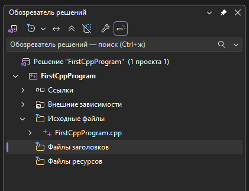
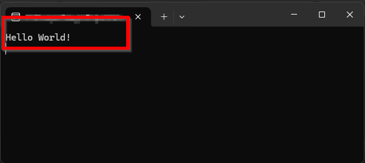
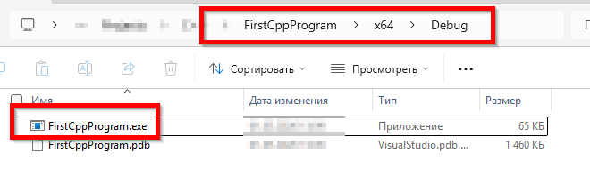
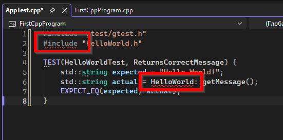
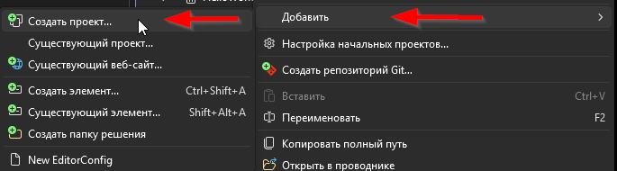
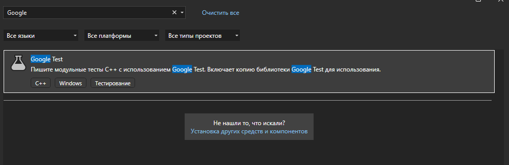
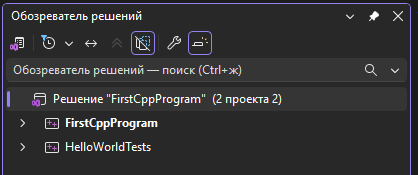
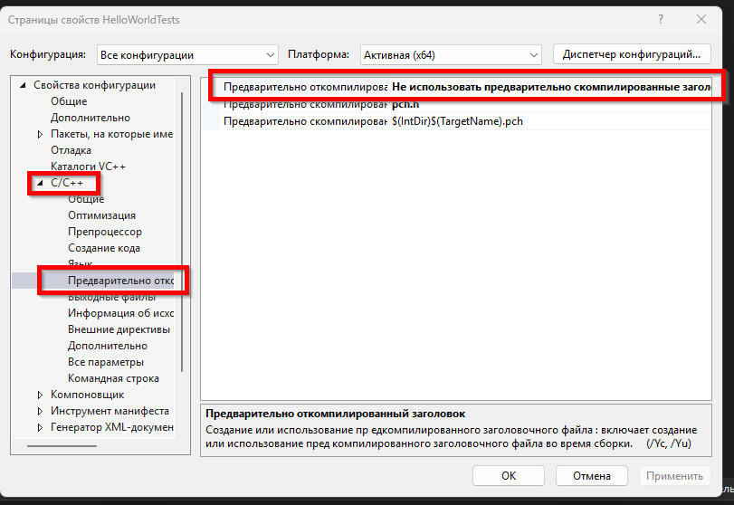
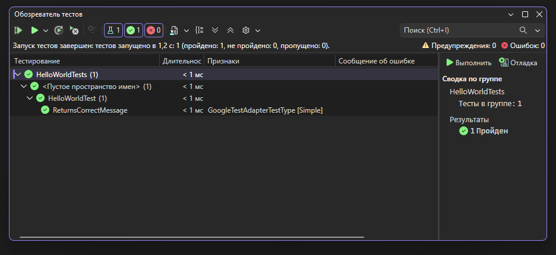

import FirstProgramPlay from '@site/src/components/FirstProgramPlay.jsx';

# Первая программа на C++

<div class="article-tags">
  <span class="tag tag-required">ОБЯЗАТЕЛЬНО</span>
  <span class="tag tag-beginner">ДЛЯ НОВИЧКОВ</span>
</div>

<span class="complexity-badge">Разработчику</span>
<span class="complexity-badge">Архитектору</span>

<FirstProgramPlay language="cpp" />

### Где применяют C++

**C++** расширяет **C** ООП, шаблонами и RAII: игры, движки, ОС, embedded, высоконагруженные сервисы. Сборка через MSVC/CMake; GUI — [Qt Widgets](./2731.md) или [Qt Quick](./2732.md).

Первая программа — `iostream`, `main`, компиляция в Visual Studio или `g++`.

---

Разработка программ на языке C++ требует понимания фундаментальных принципов компиляции, управления памятью и работы с системой сборки. В отличие от интерпретируемых языков, где код выполняется напрямую виртуальной машиной, C++ проходит процесс трансляции исходного текста в машинный код непосредственно для целевой архитектуры процессора. Этот процесс включает несколько этапов: препроцессинг, компиляцию, ассемблирование и линковку.

Давайте напишем простую консольную программу.

### Установка

Для начала работы с языком C++ потребуется среда разработки (IDE) или набор инструментов командной строки. В данном руководстве используется подход с использованием **Visual Studio Community Edition** как наиболее распространенная и удобная среда для разработчиков под Windows, а также альтернативный путь через консольные инструменты для понимания внутренних процессов.

#### Установка VS

Установите **Visual Studio Community** (или аналогичную IDE, например, CLion, Qt Creator, VS Code с расширениями). При установке выберите рабочую нагрузку «*Разработка приложений на C++*». Это действие установит компилятор MSVC (Microsoft Visual C++), необходимые библиотеки и заголовочные файлы.

#### Запуск VS и создание проекта

Запустите среду разработки. На главном экране выберите **«Создание нового проекта»** (Create a new project).

В списке шаблонов найдите и выберите **«Консольное приложение» (Console App)** для языка C++. 

> Не перепутайте консольное приложение C# и консольное приложение C++, так как VS работает сразу с несколькими языками.

Этот шаблон автоматически создает структуру папок, файл исходного кода и конфигурационный файл проекта.

Заполните сведения о проекте:
	- *Имя проекта* — задайте имя, отражающее суть приложения, например `FirstCppProgram`;
	- *Расположение* — укажите путь к папке, где будут храниться файлы проекта;
	- *Имя решения* — обычно совпадает с именем проекта, но может отличаться. Можно поставить галочку "Поместить решение и проект в одном каталоге".
	- *Платформа* — выберите x64 или x86 в зависимости от архитектуры вашего процессора и целей разработки;
	- *Версия платформы* — выберите актуальную версию Windows SDK.

Нажмите кнопку **«Создать»**. 

Среда разработки подготовит проект, создав следующие элементы:
	- Файл исходного кода (`FirstCppProgram.cpp`);
	- Файл заголовка (`FirstCppProgram.h`);
	- Файл проекта (`FirstCppProgram.vcxproj`);
	- Файл свойств проекта (`FirstCppProgram.vcxproj.filters`).

Если их нет, то значит, у вас более новая версия, и это нормально. Вот пример структуры:



В левой части окна отображается структура проекта в виде дерева файлов. Папка «Исходные файлы» содержит `.cpp` файлы, а папка «Заголовочные файлы» — `.h` файлы.

---

### Написание кода

В правой части окна редактора открывается файл исходного кода со стандартным шаблоном:

```cpp
#include <iostream>

int main()
{
    std::cout << "Hello World!\n";
    return 0;
}
```

Код может содержать комментарии, помеченные зеленым цветом после символов `//`. Их можно удалить.

В C++ `return 0` из `main` можно опустить — компилятор подставит успешное завершение. Явный `return` полезен для читаемости и привычки из других языков.

Этот код состоит из нескольких ключевых компонентов:
	- `#include <iostream>` — директива, подключающая стандартную библиотеку ввода-вывода, необходимую для работы с консолью;
	- `int main()` — точка входа в программу. Именно с этой функции начинается выполнение любой программы на C++;
	- `std::cout` — объект потока вывода стандарта C++, использующийся для печати данных в консоль;
	- `<<` — оператор вставки, передающий данные в поток вывода;
	- `"Hello World!\n"` — строковый литерал, выводимый на экран. Символ `\n` означает перевод строки;
	- `return 0;` — инструкция возврата значения операционной системе. Значение `0` указывает на успешное завершение программы.

---

### Запуск проекта 

Чтобы запустить проект, нужно нажать клавишу **F5** или кнопку **«Локальный отладчик Windows»** (Local Windows Debugger) на панели инструментов. 

Также можно использовать меню **«Отладка»** -> **«Запуск без отладки»** (Ctrl+F5), если не требуется отладка.

Если вы заметили, то комментарии в коде могут как раз пояснять вам запуск:
```cpp
// FirstCppProgram.cpp : Этот файл содержит функцию "main". Здесь начинается и заканчивается выполнение программы.
//

#include <iostream>

int main()
{
    std::cout << "Hello World!\n";
}

// Запуск программы: CTRL+F5 или меню "Отладка" > "Запуск без отладки"
// Отладка программы: F5 или меню "Отладка" > "Запустить отладку"

// Советы по началу работы 
//   1. В окне обозревателя решений можно добавлять файлы и управлять ими.
//   2. В окне Team Explorer можно подключиться к системе управления версиями.
//   3. В окне "Выходные данные" можно просматривать выходные данные сборки и другие сообщения.
//   4. В окне "Список ошибок" можно просматривать ошибки.
//   5. Последовательно выберите пункты меню "Проект" > "Добавить новый элемент", чтобы создать файлы кода, или "Проект" > "Добавить существующий элемент", чтобы добавить в проект существующие файлы кода.
//   6. Чтобы снова открыть этот проект позже, выберите пункты меню "Файл" > "Открыть" > "Проект" и выберите SLN-файл.
```

Собственно, это и есть основной способ запуска - при нажатии на запуск, программа запустит компиляцию, соберет файл и можно будет начать пользоваться.

Если всё успешно — откроется окно консоли с результатом выполнения программы. В нижней части окна среды разработки в панели **«Вывод»** (Output) будет отображаться информация о процессе сборки, включая статус компиляции и линковки. 

Наша программа выведет сообщение **«Hello World!»** в окне консоли.

---

### Программа сразу закрылась?

Но вот беда - программа сразу закрылась, не так ли? Чтобы программа не закрывалась сразу после вывода сообщения, нужно добавить в конец функции `main` оператор ожидания ввода от пользователя. Это позволит вам увидеть результат на экране перед закрытием окна консоли.

Самый простой и универсальный способ — использовать функцию `std::cin`. Она заставляет программу ждать, пока пользователь нажмет клавишу (обычно Enter).

Давайте добавим `std::cin.get();` и `return 0;`:

```cpp
#include <iostream>

int main()
{
    std::cout << "Hello World!\n";
    
    // Ожидание ввода от пользователя перед завершением
    std::cin.get(); 
    
    return 0;
}
```

Вуаля:



**Как это работает:**
- `std::cin.get()` считывает один символ из стандартного потока ввода (клавиатуры) и блокирует выполнение программы до тех пор, пока этот символ не будет введен.
- Когда вы нажимаете Enter, функция возвращает управление, и программа выполняет строку `return 0;`, после чего завершает работу корректно.

Если вы используете среду разработки Visual Studio и хотите именно паузу по нажатию любой клавиши (не обязательно Enter), на Windows можно вызвать `std::system("pause")` из `<cstdlib>`. Этот способ **не переносим** (зависит от `cmd.exe`) и в production-коде не используется.

```cpp
#include <iostream>
#include <cstdlib> // std::system

int main()
{
    std::cout << "Hello World!\n";

    std::system("pause"); // только Windows: ждёт клавишу в консоли

    return 0;
}
```

Но я рекомендую первый вариант.

---

### Если возникли ошибки

При изменении имени файла или структуры проекта без рефакторинга типичны ошибки **компиляции** и **линковки** (не путать с C#/Java — там бывает «не найден главный класс»).

| Сообщение (пример) | Что проверить |
|--------------------|---------------|
| `cannot open source file "HelloWorld.h"` | путь к заголовку, имя файла, файл в проекте |
| `unresolved external symbol` (LNK2019) | в сборку включён `.cpp` с реализацией функции |
| `more than one main` | в проекте один файл с `int main()` |
| несовместимость типов | объявление в `.h` совпадает с определением в `.cpp` |

Используйте «Найти все ссылки» в Visual Studio и проверьте `#include` и список исходников в `.vcxproj`.

---

### Сборка

Сборка проекта выполняется через меню **«Сборка»** -> **«Сборка решения»** (Build Solution) или горячую клавишу **Ctrl+Shift+B**. Можно также нажать правой кнопкой по решению и собрать его.

Успешная сборка показывает в панели вывода статус *«Сборка выполнена успешно»* (Build succeeded).
```
Сборка начата в 13:12...
========== Сборка: успешно выполнено — 0 , со сбоем — 0, в актуальном состоянии — 1, пропущено — 0 ==========
========== Сборка завершено в 13:12 и заняло 00,096 с ==========
```

Команда «Очистить решение» (Clean Solution) удаляет промежуточные файлы перед повторной сборкой.

Исполняемый файл создается после успешной сборки в папке **«Debug»** или **«Release»** внутри директории проекта. Самый простой способ перейти - правой кнопкой по проекту и нажать "Открыть в проводнике".

В директории `FirstCppProgram\x64\Debug` вы увидите собранный `FirstCppProgram.exe`. Его уже можно запускать:



Файл имеет расширение `.exe` и представляет собой полностью готовый к запуску бинарный файл, не требующий наличия IDE для исполнения.

#### Тот же Hello World через `g++` (Linux, macOS, WSL)

Если IDE не используется, сохраните код в `hello.cpp` и выполните:

```bash
g++ -std=c++17 -Wall -Wextra -pedantic hello.cpp -o hello
./hello
```

Флаги `-Wall -Wextra -pedantic` включают предупреждения компилятора — полезная привычка с первого дня. Кроссплатформенная сборка нескольких файлов — в [CMake](./1006.md).

---

### Добавление юнит-теста через NuGet

:::tip Необязательный шаг
Блок ниже — для тех, кто уже собрал Hello World и хочет подключить **Google Test** в Visual Studio. Можно пропустить и вернуться после [CMake](./1006.md) или [заданий](./1008.md).
:::

Усложним задачу – теперь добавим модульное тестирование к нашему проекту. Для этого используется фреймворк Google Test (gtest), который является стандартом де-факто для тестирования на C++. Использование менеджера пакетов NuGet позволяет автоматически загрузить все необходимые зависимости, библиотеки и настройки без ручного скачивания архивов и настройки путей.

Начинаем с подключения библиотеки через менеджер пакетов в среде Visual Studio. Это действие автоматически создаст папку `packages` в корне проекта, скачает актуальную версию Google Test и настроит ссылки в файле проекта `.vcxproj`.

#### Установка

Откройте меню **«Сервис»** -> **«Менеджер пакетов NuGet»** -> **«Диспетчер пакетов»**. В открывшемся окне поиска введите `GoogleTest`. 

Выберите пакет **Microsoft.googletest.v140.windesktop.msvcstl.static.rt-static** от автора *Microsoft*. Нажмите кнопку **«Установить»**.
	- Подтвердите установку, согласившись с лицензионным соглашением;
	- Дождитесь окончания процесса загрузки и установки;
	- Visual Studio автоматически обновит файл проекта, добавив необходимые пути к заголовкам и библиотекам.

Google Test 1.8.3 был написан в переходный период, когда C++11 уже появился, но многие компиляторы (включая Visual Studio) еще полностью его не поддерживали. Поэтому в коде обычного GTest есть фрагмент, который будет вызывать ошибку. GTest пытается положить C++11-шные `tuple`, `get` и другие шаблоны в устаревшее пространство имен `std::tr1` для обратной совместимости. В Visual Studio 2022 с C++20 это приводит к конфликту. Поэтому я рекомендую скачать и поставить именно специальную версию Google Test от Microsoft, уже настроенную для работы "из коробки". Microsoft сделали несколько вариантов пакетов под разные настройки RT. Если в названии есть `rt-static` - это статическая линковка, если `rt-dyn` - динамическая . Для начала лучше брать `rt-static`.

Альтернативный способ через консоль диспетчера пакетов:
1. Откройте меню **«Инструменты»** -> **«Консоль диспетчера пакетов»**.
2. Убедитесь, что в выпадающем списке «По умолчанию проект» выбран ваш проект (например, `FirstCppProgram`).
3. Введите команду:
```powershell
Install-Package Microsoft.googletest.v140.windesktop.msvcstl.static.rt-static
```

4. После успешной установки вы увидите сообщение о завершении операции. Что-то вроде такого:
```
"Microsoft.googletest.v140.windesktop.msvcstl.static.rt-static.1.8.1.8" успешно установлено в FirstCppProgram
Выполнение действий NuGet заняло 2,57 с
Прошло времени: 00:00:03.6248027
```

В структуре проекта появится новая папка `packages`, внутри которой будет находиться подпапка `GoogleTest.X.X.X` (где X.X.X — версия). Внутри неё будут лежать файлы заголовков (`include`) и бинарные библиотеки (`lib`).

---

#### Проверка

#### Создание файла теста

Создадим новый файл теста. ПКМ по папке «Исходные файлы» -> Добавить -> Новый элемент -> Файл исходного кода C++. Назовем его `AppTest.cpp`:
	- Содержимое файла:
```cpp
#include "gtest/gtest.h"
#include "HelloWorld.h"

TEST(HelloWorldTest, ReturnsCorrectMessage) {
    std::string expected = "Hello World!";
    std::string actual = HelloWorld::getMessage();
    EXPECT_EQ(expected, actual);
}
```

Что здесь произошло:
	- `#include "gtest/gtest.h"` — подключение заголовка фреймворка Google Test из папки, которую добавил NuGet;
	- `#include "HelloWorld.h"` — подключение заголовка тестируемого класса;
	- `TEST(GroupName, TestName)` — макрос для объявления теста. Первый аргумент — группа тестов, второй — имя конкретного теста;
	- `EXPECT_EQ(expected, actual)` — утверждение, проверяющее равенство ожидаемого и фактического значений. Тест считается пройденным, если условия истинны.

Вы, наверное, заметили, что определённые места подчёркнуты красным - это ошибки.



В списке ошибок вы увидите `не удается открыть источник файл "HelloWorld.h"`.

#### Адаптация кода под тест

Нам понадобится изменить и основной класс. 

Создадим класс `HelloWorld` с методом `getMessage()`. Добавьте новый файл `HelloWorld.h` в папку «Файлы заголовков»:
```cpp
#pragma once
#include <string>

class HelloWorld {
public:
    static std::string getMessage();
};
```

> `#pragma once` — нестандартное, но поддерживаемое всеми компиляторами расширение.

И файл `HelloWorld.cpp` в папку «Исходные файлы»:
```cpp
#include "HelloWorld.h"

std::string HelloWorld::getMessage() {
    return "Hello World!";
}
```

Здесь мы указываем, что метод `getMessage()` возвращает строковое значение. Статический метод доступен без создания экземпляра класса.

Изменим файл `FirstCppProgram.cpp`, чтобы вызвать метод из класса `HelloWorld`:
```cpp
#include <iostream>
#include "HelloWorld.h"

int main()
{
    std::cout << HelloWorld::getMessage() << "\n";

    std::cin.get();

    return 0;
}
```

#### Создание и настройка проекта для тестов

Нажмите правой кнопкой по решению и создайте новый проект `HelloWorldTests` - выберите `Google Test` при создании:





Таким образом, у нас должна быть структура решения, состоящая из двух проектов:
- проект 1 (консольное приложение) - FirstCppProgram;
- проект 2 (Google Test) - HelloWorldTests.



Visual Studio самостоятельно создаст пример теста и всё настроит. Но мы немного изменим.

1. Удалите из нового проекта `HelloWorldTests` файл `test.cpp` (который создался автоматически).
2. Нажмите правой кнопкой по проекту `HelloWorldTests` и выберите "Добавить" - "Существующий элемент" и добавьте таким образом файлы из нашего проекта `FirstCppProgram`:
- `AppTest.cpp`;
- `HelloWorld.cpp`;
- `HelloWorld.h`.
3. Нажмите правой кнопкой по проекту `HelloWorldTests` и выберите "Свойства", где перейдите в "C/C++" - ""Предварительно откомпилированный заголовок" - выберите "Не использовать предварительно скомпилированные заголовки":

4. Аналогично сделайте для проекта `FirstCppProgram`.

#### Запуск тестов

Нажмите правой кнопкой по решению, выберите "Очистить решение" и "Пересобрать решение".

После этого перейдите к вкладке "Тест" и нажмите "Запустить все тесты":


Результат покажет количество прошедших и проваленных тестов, а также детали ошибок, если они возникнут. Окно «Обозреватель тестов» предоставит детальную статистику выполнения каждого теста.

---

### О заголовках

Файлы с форматом `.h` - это как визитные карточки кода, которые содержат объявления функций и классов. Они называются **заголовочные файлы**.

```cpp
// HelloWorld.h - только объявление
class HelloWorld {
public:
    static std::string getMessage(); // "Я умею это делать"
};
```

В то время как `.cpp` файлы содержат реализацию:
```cpp
// HelloWorld.cpp - как именно делает
std::string HelloWorld::getMessage() {
    return "Hello World!"; // "А вот как именно"
}
```

Когда один файл хочет использовать функцию из другого (например, `AppTest.cpp` хочет вызвать `HelloWorld::getMessage()`), компилятору нужно знать её сигнатуру (имя, возвращаемый тип, параметры). Эту информацию и даёт заголовочный файл через `#include`.

Предкомпилированные заголовки используются для оптимизации скорости компиляции.

Когда мы компилируем `.cpp` файл, компилятор на каждое `#include` должен:
- Открыть заголовочный файл
- Разобрать его содержимое (парсинг)
- Обработать все макросы, шаблоны, вложенные `#include`

А если у нас 100+ `.cpp` файлов, и в каждом `#include <iostream>`, компилятор разбирает `<iostream>` 100+ раз. А он огромен и содержит тысячи строк кода. Это медленно.

Решение в том, что мы говорим компилятору: "Вот файл `pch.h`. Скомпилируй его один раз, сохрани результат (предкомпилированный заголовок в файл `.pch`), а во всех остальных файлах просто используй готовую версию.

```cpp
// pch.h - сюда кладут то, что не меняется и используется везде
#include <iostream>
#include <string>
#include <vector>
#include "gtest/gtest.h"
```

Шаблон проекта (`File → New → Google Test`) — это заранее подготовленная Microsoft заготовка. Microsoft решила, что тестовые проекты будут использовать PCH для ускорения, и положила в шаблон:
- `pch.h` — заголовочный файл
- `pch.cpp` — файл с `#include "pch.h`, который компилируется с флагом `/Yc` (Create PCH)
- Остальные `.cpp` файлы настроены на `/Yu` (Use PCH)

А когда мы добавляем вручную (Добавить - Существующий элемент), Visual Studio не знает, что мы хотим использовать PCH. По умолчанию настройки проекта говорят:
"Использовать предкомпилированный заголовок (`/Yu`), брать его из `pch.h`". Но самого файла нет, отсюда и будут ошибки. Поэтому мы отключили их. Условно "Давай без оптимизаций, компилируй каждый файл как есть".

---

### Частые ошибки

| Симптом | Причина |
|---------|---------|
| LNK2019 unresolved external | Не подключён `.cpp` с реализацией |
| `iostream` not found | Не выбрана workload C++ в Visual Studio |
| Окно консоли сразу закрывается | Нет `cin.get()` / запуск через Ctrl+F5 |
| Unicode в консоли | Настройте UTF-8 или используйте `std::cout` с локалью |

---

### Что попробовать

1. Тот же Hello в [CMake](./1006.md) — кроссплатформенная сборка.
2. Класс `Greeter` с методом вместо свободной функции.
3. GUI: [Qt Widgets](./2731.md).

---

### Частые ошибки

| Симптом | Причина |
|---------|---------|
| LNK2019 unresolved external | Не подключён `.cpp` с реализацией |
| `iostream` not found | Не выбрана workload C++ в Visual Studio |
| Окно консоли сразу закрывается | Нет `cin.get()` / запуск через Ctrl+F5 |
| Unicode в консоли | Настройте UTF-8 или используйте `std::cout` с локалью |

---

### Что попробовать

1. Тот же Hello в [CMake](./1006.md) — кроссплатформенная сборка.
2. Класс `Greeter` с методом вместо свободной функции.
3. GUI: [Qt Widgets](./2731.md).

---