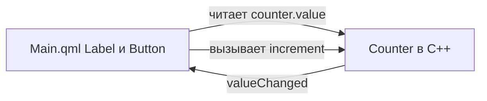

import ExternalCodeEmbed from '@site/src/components/ExternalCodeEmbed';


# Qt Quick — первая программа на QML

<div class="article-tags">
  <span class="tag tag-required">ОБЯЗАТЕЛЬНО</span>
  <span class="tag tag-beginner">ДЛЯ НОВИЧКОВ</span>
</div>

<span class="complexity-badge">Разработчику</span>

<div class="callout callout--tip">
  <div class="callout-title">О чём эта статья</div>

  <div class="callout-body">
  **Qt Quick** — интерфейс на **QML** (как разметка), логика на **C++**.

  Соберём счётчик: кнопка "+1", подпись обновляется **сама** при изменении поля в C++.

  Виджетный путь — [2731](./2731.md).

  CMake — [1006](./1006.md).
</div>
  </div>


---

## Где применяют Qt Quick

**Qt Quick** — UI для анимаций, touch-экранов, встраиваемых панелей и единого интерфейса на desktop и устройстве. Классические формы Windows чаще на **Qt Widgets** ([2731](./2731.md)).

| Термин | Простыми словами |
|--------|------------------|
| **QML** | язык описания интерфейса (объекты, привязки, анимации) |
| **Qt Quick** | модуль рантайма, который рисует QML-сцену |
| **Q_PROPERTY** | поле C++-объекта, видимое в QML |
| **Привязка** | выражение в QML пересчитывается при изменении данных |
| **moc** | генерирует метаданные для `Q_OBJECT` и свойств |

---

## Два слоя — QML и C++

В [2731](./2731.md) кнопки создавали в C++. Здесь:

- **QML** — "как выглядит" (`Button`, `Label`, отступы);
- **C++** — "что хранится и как считается" (`Counter`, `increment()`).

Число живёт **только** в C++. QML **читает** `counter.value` и **вызывает** `counter.increment()` — без дублирования состояния.

---

## Что мы строим

Окно: подпись "Значение: N", кнопка "+1". При клике N растёт, подпись обновляется **без** `setText` из C++.

---

## Установка

В инсталляторе Qt 6 отметьте **Qt Quick** / **Qt Declarative**. Без него `find_package(Qt6 COMPONENTS Quick)` завершится ошибкой.

---

## Структура проекта

```
qt-quick-hello/
├── CMakeLists.txt
├── main.cpp
├── counter.hpp
├── counter.cpp
└── qml/
    └── Main.qml
```

| Часть | Назначение |
|-------|------------|
| `Counter` | хранит `value`, сигнал `valueChanged`, метод `increment()` |
| `Main.qml` | разметка, привязки к `counter` |
| `main.cpp` | `QGuiApplication`, движок QML, `setContextProperty` |
| `qt_add_qml_module` | упаковка QML в модуль `HelloApp` |

---

## CMakeLists.txt


<ExternalCodeEmbed example="text/cpp-506-2732-001" title="CMakeLists.txt" minHeight={444} />


Разбор:
- CMake-конфиг настраивает сборку Qt Quick-приложения и подключает QML-модуль.
- `CMAKE_AUTOMOC ON` обязателен для классов с `Q_OBJECT` и метаинформацией свойств.
- `find_package(Qt6 ... Quick Qml)` подключает runtime для QML-интерфейса и нужные библиотеки.
- `qt_add_qml_module` регистрирует `Main.qml` в модуле `HelloApp`, чтобы загружать его по URI.
- `target_link_libraries(... Qt6::Quick)` связывает исполняемый файл с графическим стеком Qt Quick.

**`qt_add_qml_module`** — Qt 6: CMake знает URI `HelloApp` для `engine.loadFromModule("HelloApp", "Main")`.

```bash
cmake -S . -B build -DCMAKE_PREFIX_PATH="/path/to/Qt/6.x/gcc_64"
cmake --build build
```

---

## Модель на C++ — `Q_PROPERTY`


<ExternalCodeEmbed example="cpp/cpp-506-2732-002" title="Модель на C++ — `Q_PROPERTY`" minHeight={498} />


Разбор:
- Класс `Counter` наследует `QObject`, чтобы участвовать в метаобъектной системе Qt и быть видимым из QML.
- `Q_PROPERTY` объявляет свойство `value` с чтением, записью и сигналом изменения, на который подписывается интерфейс.
- `setValue` проверяет, изменилось ли значение, и только потом вызывает `emit valueChanged()`, чтобы избежать лишних перерисовок.
- `Q_INVOKABLE increment()` открывает метод для вызова из QML (`counter.increment()`).
- Поле `value_{0}` хранит состояние в C++-модели, а QML-слой только отображает и триггерит действия.

---

### Разбор строки `Q_PROPERTY`

```cpp
Q_PROPERTY(int value READ value WRITE setValue NOTIFY valueChanged)
```

Разбор:
- `Q_PROPERTY` связывает поле модели с QML и делает его частью рефлексии Qt.
- `READ value` и `WRITE setValue` определяют функции доступа к свойству с контролем инвариантов.
- `NOTIFY valueChanged` указывает сигнал, по которому QML понимает, что нужно обновить привязанные выражения.
- Без корректного `NOTIFY` интерфейс не будет автоматически отражать изменения данных.
- Это основной механизм реактивности Qt Quick на стороне C++-кода.

| Фрагмент | Смысл |
|----------|--------|
| `int value` | в QML свойство называется `value`, тип `int` |
| `READ value` | читать через метод `value()` |
| `WRITE setValue` | писать через `setValue(int)` (для двусторонних привязок) |
| `NOTIFY valueChanged` | при изменении **обязательно** `emit valueChanged()` — QML обновит экран |

**`Q_INVOKABLE void increment()`** — метод, вызываемый из QML как `counter.increment()`.

**`if (value_ == v) return`** — лишние сигналы не уходят в UI, меньше перерисовок.

`counter.cpp` может быть пустым, если вся логика в заголовке — для учебного примера нормально.

---

## main.cpp — движок и контекст


<ExternalCodeEmbed example="cpp/cpp-506-2732-003" title="main.cpp — движок и контекст" minHeight={390} />


Разбор:
- `main.cpp` связывает слой логики C++ и QML-слой интерфейса в единую программу.
- `QGuiApplication` инициализирует графическую среду без набора виджетов `Qt Widgets`.
- `engine.rootContext()->setContextProperty("counter", &counter)` публикует объект `counter` в пространство имён QML.
- `engine.loadFromModule("HelloApp", "Main")` загружает корневой QML-компонент из модуля, объявленного в CMake.
- Проверка `rootObjects().isEmpty()` быстро ловит ошибки загрузки QML до старта event loop.

| Строка | Смысл |
|--------|--------|
| `QGuiApplication` | GUI без набора Widgets — достаточно для Quick |
| `Counter counter` | объект на стеке, живёт всё время `main` |
| `setContextProperty("counter", &counter)` | в **любом** QML файле этого движка имя `counter` → наш объект |
| `loadFromModule("HelloApp", "Main")` | загрузить корневой `Main.qml` из модуля CMake |
| `rootObjects().isEmpty()` | проверка: QML загрузился (иначе смотреть вывод ошибок в консоль) |

В больших приложениях тип регистрируют через `qmlRegisterType<Counter>()` и создают `Counter { }` в QML. Для первого шага хватает контекста.

---

## Main.qml — разбор


<ExternalCodeEmbed example="text/cpp-506-2732-004" title="Main.qml — разбор" minHeight={498} />


Разбор:
- QML-файл декларативно описывает окно, вертикальный контейнер и два элемента управления.
- `Label.text` использует привязку к `counter.value`, поэтому текст пересчитывается автоматически при изменениях модели.
- `Button.onClicked` вызывает метод C++-объекта, опубликованного через контекст движка.
- `anchors.centerIn` и `spacing` отвечают за компоновку элементов без ручного расчёта координат.
- Такой шаблон чётко разделяет роли: QML отвечает за отображение, C++ — за состояние и бизнес-логику.

---

### Привязка в `text`

```qml
text: "Значение: " + counter.value
```

Это **привязка**, а не разовое присваивание:

1. QML подписывается на `valueChanged` (через метаданные `NOTIFY`).
2. При `increment()` → `setValue` → `emit valueChanged()` строка **пересчитывается**.
3. `Label` перерисовывается **без** вызова C++ API для текста.

---

### Обработчик `onClicked`

```qml
onClicked: counter.increment()
```

`onClicked` — обработчик сигнала кнопки. Внутри — вызов C++-метода.

---

## Как связаны C++ и QML



| Механизм | Когда использовать |
|----------|-------------------|
| `Q_PROPERTY` + `NOTIFY` | поля на экране |
| `Q_INVOKABLE` | действия по кнопке |
| `setContextProperty` | один глобальный объект в прототипе |
| `qmlRegisterType` | несколько экземпляров в QML |

---

## Qt Widgets или Qt Quick?

| | Qt Widgets | Qt Quick |
|---|------------|----------|
| Описание UI | C++ (+ `.ui`) | QML |
| Типичные задачи | офис, IDE, нативные диалоги | анимации, touch, HMI |
| Старт | [2731](./2731.md) | эта статья |

Гибрид: `QQuickWidget` внутри окна на виджетах.

---

## Частые ошибки

| Симптом | Вероятная причина |
|---------|-------------------|
| Белое окно | QML не загрузился — синтаксис, URI, `qt_add_qml_module` |
| `counter is undefined` | нет `setContextProperty` или опечатка в имени |
| Счётчик не обновляется | нет `NOTIFY` или забыли `emit valueChanged()` |
| Сборка без QML | не подключён `qt_add_qml_module` |

---

## Почему это масштабируется в реальных проектах

В небольшом примере есть та же архитектурная идея, что и в большом продукте:

- состояние живёт в модели (`Counter`);
- QML только отображает и отправляет команды;
- синхронизация между UI и данными идёт через сигналы изменений.

На этой основе строят формы, панели телеметрии, мультимедийные интерфейсы и HMI.

---

## Связанные статьи

- Виджеты и классический UI: [2731](./2731.md)
- Общий обзор Qt-экосистемы: [27](./27.md)
- CMake и настройка сборки: [1006](./1006.md)
- Тестирование и практические задания: [1007](./1007.md), [1008](./1008.md)

---

## Что попробовать

1. Кнопка "Сброс" и `Q_INVOKABLE void reset() { setValue(0); }`.
2. `qmlRegisterType<Counter>` и `Counter { id: c }` вместо контекста.
3. `NumberAnimation` на свойство в QML (чисто декларативно).

Тесты `Counter` без GUI — [1007](./1007.md). Практика — задание 4.2 в [1008](./1008.md).

---

## Дальше

- `windeployqt` для QML-зависимостей — [27.md](./27.md);
- Model/View для списков — там же;
- виджетный путь — [2731](./2731.md).

{/* sidebar-collections */}

---

## В подборках

Статья входит в [тематические подборки](/about/collections) и блок «С чего начать?» на [главной](/). Соседние шаги того же маршрута:

**Первые шаги** ([маршрут подборки](/about/collections/pervye-shagi)) — [Qt — первая программа](/encyclopedia/5-languages/5-06-cpp/2731), [Первая программа на Laravel](/encyclopedia/5-languages/5-07-php/1431), [CMake — первая программа](/encyclopedia/5-languages/5-06-cpp/1006), [Первая программа на Symfony](/encyclopedia/5-languages/5-07-php/1441), [Razor Pages — первая программа](/encyclopedia/5-languages/5-05-csharp/4514), [Ktor — первая программа](/encyclopedia/5-languages/5-09-kotlin/221).

{/* /sidebar-collections */}

---
