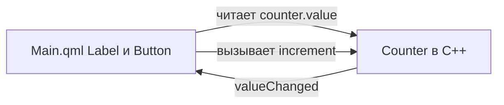

# Qt Quick — первая программа на QML

<div class="article-tags">
  <span class="tag tag-required">ОБЯЗАТЕЛЬНО</span>
  <span class="tag tag-beginner">ДЛЯ НОВИЧКОВ</span>
</div>

<span class="complexity-badge">Разработчику</span>

:::tip О чём эта статья
**Qt Quick** — интерфейс на **QML** (как разметка), логика на **C++**. Соберём счётчик: кнопка "+1", подпись обновляется **сама** при изменении поля в C++. Виджетный путь — [2731](./2731.md). CMake — [1006](./1006.md).
:::

---

## Где применяют Qt Quick

**Qt Quick** — UI для анимаций, touch-экранов, встраиваемых панелей и единого интерфейса на desktop и устройстве. Классические формы Windows чаще на **Qt Widgets** ([2731](./2731.md)).

| Термин | Простыми словами |
|--------|------------------|
| **QML** | язык описания интерфейса (объекты, привязки, анимации) |
| **Qt Quick** | модуль рантайма, который рисует QML-сцену |
| **Q_PROPERTY** | поле C++-объекта, видимое в QML |
| **Привязка** | выражение в QML пересчитывается при изменении данных |
| **moc** | генерирует метаданные для `Q_OBJECT` и свойств |

---

## Два слоя — QML и C++

В [2731](./2731.md) кнопки создавали в C++. Здесь:

- **QML** — "как выглядит" (`Button`, `Label`, отступы);
- **C++** — "что хранится и как считается" (`Counter`, `increment()`).

Число живёт **только** в C++. QML **читает** `counter.value` и **вызывает** `counter.increment()` — без дублирования состояния.

---

## Что мы строим

Окно: подпись "Значение: N", кнопка "+1". При клике N растёт, подпись обновляется **без** `setText` из C++.

---

## Установка

В инсталляторе Qt 6 отметьте **Qt Quick** / **Qt Declarative**. Без него `find_package(Qt6 COMPONENTS Quick)` завершится ошибкой.

---

## Структура проекта

```
qt-quick-hello/
├── CMakeLists.txt
├── main.cpp
├── counter.hpp
├── counter.cpp
└── qml/
    └── Main.qml
```

| Часть | Назначение |
|-------|------------|
| `Counter` | хранит `value`, сигнал `valueChanged`, метод `increment()` |
| `Main.qml` | разметка, привязки к `counter` |
| `main.cpp` | `QGuiApplication`, движок QML, `setContextProperty` |
| `qt_add_qml_module` | упаковка QML в модуль `HelloApp` |

---

## CMakeLists.txt

```cmake
cmake_minimum_required(VERSION 3.20)
project(qt_quick_hello LANGUAGES CXX)

set(CMAKE_CXX_STANDARD 17)
set(CMAKE_AUTOMOC ON)

find_package(Qt6 REQUIRED COMPONENTS Quick Qml)

qt_add_executable(quick_hello
    main.cpp
    counter.cpp
    counter.hpp
)

qt_add_qml_module(quick_hello
    URI HelloApp
    VERSION 1.0
    QML_FILES qml/Main.qml
)

target_link_libraries(quick_hello PRIVATE Qt6::Quick)
```

**`qt_add_qml_module`** — Qt 6: CMake знает URI `HelloApp` для `engine.loadFromModule("HelloApp", "Main")`.

```bash
cmake -S . -B build -DCMAKE_PREFIX_PATH="/path/to/Qt/6.x/gcc_64"
cmake --build build
```

---

## Модель на C++ — `Q_PROPERTY`

```cpp
#pragma once
#include <QObject>

class Counter : public QObject {
    Q_OBJECT
    Q_PROPERTY(int value READ value WRITE setValue NOTIFY valueChanged)
public:
    explicit Counter(QObject* parent = nullptr) : QObject(parent) {}

    int value() const { return value_; }
    void setValue(int v) {
        if (value_ == v) return;
        value_ = v;
        emit valueChanged();
    }

    Q_INVOKABLE void increment() { setValue(value_ + 1); }

signals:
    void valueChanged();

private:
    int value_{0};
};
```

---

### Разбор строки `Q_PROPERTY`

```cpp
Q_PROPERTY(int value READ value WRITE setValue NOTIFY valueChanged)
```

| Фрагмент | Смысл |
|----------|--------|
| `int value` | в QML свойство называется `value`, тип `int` |
| `READ value` | читать через метод `value()` |
| `WRITE setValue` | писать через `setValue(int)` (для двусторонних привязок) |
| `NOTIFY valueChanged` | при изменении **обязательно** `emit valueChanged()` — QML обновит экран |

**`Q_INVOKABLE void increment()`** — метод, вызываемый из QML как `counter.increment()`.

**`if (value_ == v) return`** — лишние сигналы не уходят в UI, меньше перерисовок.

`counter.cpp` может быть пустым, если вся логика в заголовке — для учебного примера нормально.

---

## main.cpp — движок и контекст

```cpp
#include <QGuiApplication>
#include <QQmlApplicationEngine>
#include "counter.hpp"

int main(int argc, char* argv[]) {
    QGuiApplication app(argc, argv);

    Counter counter;

    QQmlApplicationEngine engine;
    engine.rootContext()->setContextProperty("counter", &counter);
    engine.loadFromModule("HelloApp", "Main");

    if (engine.rootObjects().isEmpty())
        return -1;

    return app.exec();
}
```

| Строка | Смысл |
|--------|--------|
| `QGuiApplication` | GUI без набора Widgets — достаточно для Quick |
| `Counter counter` | объект на стеке, живёт всё время `main` |
| `setContextProperty("counter", &counter)` | в **любом** QML файле этого движка имя `counter` → наш объект |
| `loadFromModule("HelloApp", "Main")` | загрузить корневой `Main.qml` из модуля CMake |
| `rootObjects().isEmpty()` | проверка: QML загрузился (иначе смотреть вывод ошибок в консоль) |

В больших приложениях тип регистрируют через `qmlRegisterType<Counter>()` и создают `Counter { }` в QML. Для первого шага хватает контекста.

---

## Main.qml — разбор

```qml
import QtQuick
import QtQuick.Controls

ApplicationWindow {
    width: 360
    height: 200
    visible: true
    title: "Qt Quick Hello"

    Column {
        anchors.centerIn: parent
        spacing: 12

        Label {
            text: "Значение: " + counter.value
        }

        Button {
            text: "+1"
            onClicked: counter.increment()
        }
    }
}
```

---

### Привязка в `text`

```qml
text: "Значение: " + counter.value
```

Это **привязка**, а не разовое присваивание:

1. QML подписывается на `valueChanged` (через метаданные `NOTIFY`).
2. При `increment()` → `setValue` → `emit valueChanged()` строка **пересчитывается**.
3. `Label` перерисовывается **без** вызова C++ API для текста.

---

### Обработчик `onClicked`

```qml
onClicked: counter.increment()
```

`onClicked` — обработчик сигнала кнопки. Внутри — вызов C++-метода.

---

## Как связаны C++ и QML



| Механизм | Когда использовать |
|----------|-------------------|
| `Q_PROPERTY` + `NOTIFY` | поля на экране |
| `Q_INVOKABLE` | действия по кнопке |
| `setContextProperty` | один глобальный объект в прототипе |
| `qmlRegisterType` | несколько экземпляров в QML |

---

## Qt Widgets или Qt Quick?

| | Qt Widgets | Qt Quick |
|---|------------|----------|
| Описание UI | C++ (+ `.ui`) | QML |
| Типичные задачи | офис, IDE, нативные диалоги | анимации, touch, HMI |
| Старт | [2731](./2731.md) | эта статья |

Гибрид: `QQuickWidget` внутри окна на виджетах.

---

## Частые ошибки

| Симптом | Вероятная причина |
|---------|-------------------|
| Белое окно | QML не загрузился — синтаксис, URI, `qt_add_qml_module` |
| `counter is undefined` | нет `setContextProperty` или опечатка в имени |
| Счётчик не обновляется | нет `NOTIFY` или забыли `emit valueChanged()` |
| Сборка без QML | не подключён `qt_add_qml_module` |

---

## Что попробовать

1. Кнопка "Сброс" и `Q_INVOKABLE void reset() { setValue(0); }`.
2. `qmlRegisterType<Counter>` и `Counter { id: c }` вместо контекста.
3. `NumberAnimation` на свойство в QML (чисто декларативно).

Тесты `Counter` без GUI — [1007](./1007.md). Практика — задание 4.2 в [1008](./1008.md).

---

## Дальше

- `windeployqt` для QML-зависимостей — [27.md](./27.md);
- Model/View для списков — там же;
- виджетный путь — [2731](./2731.md).

---
