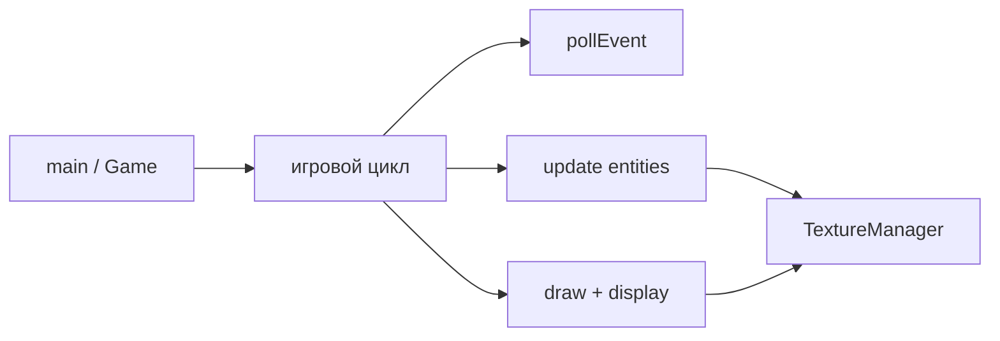

import ExternalCodeEmbed from '@site/src/components/ExternalCodeEmbed';


# SFML — 2D-графика и мультимедиа на C++

<span class="complexity-badge">Разработчику</span>
<span class="complexity-badge">Начальный уровень</span>

---

## Что такое SFML

**SFML** (Simple and Fast Multimedia Library) — кроссплатформенная библиотека с **объектно-ориентированным C++ API**. Она закрывает слой между вашим кодом и операционной системой: окно, ввод, 2D-рисование, звук и простая сеть.

**Фреймворк** в контексте игр — библиотека, которая даёт готовые блоки (окно, спрайты, звук), но **не навязывает** архитектуру игры. SFML не содержит редактора уровней, физического движка или системы частиц "из коробки" — вы сами решаете, как хранить объекты, считать коллизии и переключать сцены.

SFML удобен после базового C++ ([типы](./11.md), [функции](./17.md), [память](./19.md)): API выражен классами `sf::RenderWindow`, `sf::Sprite`, а не сотнями C-функций как в [SDL](./2742.md).

<div class="callout callout--info">
  <div class="callout-title">Место SFML в стеке</div>

  <div class="callout-body">
  SFML закрывает слой <strong>окно + 2D + ввод + звук</strong>. Для полноценного 3D с шейдерами переходите к <a href="./2745.md">OpenGL</a>, <a href="./29.md">Vulkan</a> или берите <a href="./2744.md">Raylib</a> / <a href="./2743.md">Siv3D</a>. Desktop-формы — <a href="./27.md">Qt</a>.
  </div>
</div>

Общий игровой контекст — [Разработка игр на C++](./22.md). Сборка — [CMake — первая программа](./1006.md).

---

## Ключевые понятия

| Термин | Определение |
|--------|-------------|
| **Игровой цикл** | Бесконечное повторение "ввод → обновление логики → отрисовка" до закрытия окна |
| **Спрайт** | Прямоугольник на экране с текстурой; позиция, масштаб, поворот |
| **Текстура** | Изображение в памяти GPU; загружается один раз, используется многими спрайтами |
| **View (камера)** | Область мировых координат, которую видит игрок; позволяет двигать "камеру" по большой карте |
| **Delta time** | Время между кадрами в секундах; движение привязывают к `dt`, а не к "пикселям за кадр" |
| **Событие** | Сообщение от ОС: закрытие окна, нажатие клавиши, движение мыши |

Теория игрового цикла без привязки к библиотеке — в [разработке игр](./22.md#мини-практика--каркас-игрового-цикла).

---

## SFML, SDL и Raylib — как выбрать

| Критерий | SFML | SDL2 | Raylib |
|----------|------|------|--------|
| API | C++ классы (`sf::Window`) | C (`SDL_Window*`) | C, стиль "одной функции" |
| 2D | Sprites, shapes, views | Renderer API / текстуры вручную | `DrawTexture`, примитивы |
| 3D | Нет из коробки | Через OpenGL/Vulkan | Да, упрощённо |
| Звук | `sf::Sound`, `sf::Music` | SDL_mixer (отдельно) | Встроен |
| Сеть | `sf::TcpSocket`, UDP | Отдельные библиотеки | Нет |
| Порог входа | Низкий для C++ | Ниже по документации, но C-стиль | Самый низкий |

**Правило выбора:**

- учите **C++ и ООП** на 2D-играх — **SFML**;
- нужен **C-API** под свой движок или мобильный порт — [SDL](./2742.md);
- важна **скорость прототипа** 2D/3D — [Raylib](./2744.md);
- один SDK для 2D, 3D и GUI на **C++20** — [Siv3D](./2743.md).

---

## Модули SFML

Библиотека разбита на модули — подключаете только нужные при линковке:

| Модуль | Назначение |
|--------|------------|
| **System** | Время (`sf::Clock`), строки (`sf::String`), потоки |
| **Window** | Окно, события, опционально контекст OpenGL |
| **Graphics** | Текстуры, спрайты, шрифты, примитивы, `sf::View` |
| **Audio** | Короткие эффекты и потоковая музыка |
| **Network** | TCP/UDP для учебных клиент-серверных прототипов ([сеть](./25.md)) |

SFML 2.x рисует 2D через **OpenGL**. В SFML 3 активная ветка переводит рендер на современный GPU backend, сохраняя похожий API.

---

## Установка и CMake

**Windows** — установщик с сайта SFML или `vcpkg install sfml`.  
**Linux** — `libsfml-dev` или сборка из исходников.  
**macOS** — `brew install sfml`.

Минимальный `CMakeLists.txt`:

```cmake
cmake_minimum_required(VERSION 3.16)
project(sfml_demo CXX)
set(CMAKE_CXX_STANDARD 17)

find_package(SFML 2.6 COMPONENTS system window graphics audio REQUIRED)

add_executable(game main.cpp)
target_link_libraries(game PRIVATE sfml-system sfml-window sfml-graphics sfml-audio)
```

**Разбор CMake:**

- `find_package(SFML 2.6 ...)` — ищет конфигурацию SFML; версию уточняйте под установленный пакет.
- `COMPONENTS` — только нужные модули; без `network` линковка легче.
- На Windows скопируйте DLL из `bin` SFML рядом с `.exe` или задайте `SFML_DIR`.

Подробнее о сборке C++ — [Конфигурация и сборка](./1004.md).

---

## Минимальное окно и игровой цикл


<ExternalCodeEmbed example="cpp/cpp-506-2741-001" title="Минимальное окно и игровой цикл" minHeight={426} />


### Разбор построчно

- `#include <SFML/Graphics.hpp>` — подтягивает Window и Graphics; для звука нужен отдельный заголовок `Audio.hpp`.
- `sf::RenderWindow` — **окно + поверхность отрисовки**; наследует `sf::Window`.
- `sf::VideoMode(800, 600)` — размер клиентской области в пикселях.
- `sf::CircleShape(50.f)` — примитив с радиусом 50; не требует текстуры.
- `while (window.isOpen())` — **игровой цикл**; `isOpen()` становится `false` после `close()`.
- Внутренний `while (pollEvent)` — **очередь событий** ОС; обрабатывают все накопившиеся за кадр сообщения.
- `Event::Closed` — пользователь нажал крестик; без обработки окно может "зависнуть" визуально, но процесс останется.
- `clear` — заливает фон; без него остаются следы прошлых кадров.
- `draw` — ставит объект в очередь отрисовки; на экран ещё не попало.
- `display` — **swap buffers**; показывает кадр. Забытый `display()` — частая причина чёрного экрана.

---

## Delta time и плавное движение

Движение "на 5 пикселей за кадр" на 144 Hz и 60 Hz даёт разную скорость. Правильнее умножать скорость на **время кадра**:

```cpp
sf::Clock clock;
while (window.isOpen()) {
    float dt = clock.restart().asSeconds();
    // ...
    shape.move({120.f * dt, 0.f});  // 120 px/s вправо
}
```

`sf::Clock::restart()` возвращает прошедшее время и сбрасывает счётчик — удобно в начале каждого кадра.

---

## Спрайты, текстуры и слои

**Текстура** — ресурс на GPU. **Спрайт** — "окно" в текстуру с позицией на экране. Одна текстура atlas может обслуживать десятки спрайтов (анимация героя).

Типичный пайплайн:

1. Загрузить `sf::Texture` из PNG/JPG.
2. Создать `sf::Sprite`, вызвать `setTexture(texture)`.
3. В `update` менять `setPosition`, `setRotation`.
4. В `draw` рисовать в порядке слоёв: фон → мир → герой → UI.

**View** — "камера". Мир может быть 4000×4000, а view — 800×600 вокруг игрока:

```cpp
sf::View view({0.f, 0.f, 800.f, 600.f});
window.setView(view);
// view.setCenter(playerPos); — следование за персонажем
```

Теория 2D-трансформаций — [компьютерная графика](/encyclopedia/9-spinoff/9-08-kompyuternaya-grafika/intro).

---

## Звук в SFML

```cpp
#include <SFML/Audio.hpp>

sf::SoundBuffer buffer;
if (!buffer.loadFromFile("hit.wav"))
    return 1;
sf::Sound sound(buffer);
sound.play();
```

- **`SoundBuffer` + `Sound`** — короткие эффекты; буфер в RAM.
- **`Music`** — длинные треки; читает файл потоково, экономит память.

Звук не блокирует игровой цикл — воспроизведение идёт в фоновом потоке SFML.

---

## Архитектура учебного проекта



Рекомендуемое разделение файлов:

- **Resources** — загрузка текстур и звуков один раз при старте уровня.
- **Game** — состояние: счёт, жизни, таймеры; без вызовов `draw`.
- **Render** — только отрисовка по текущему состоянию.

Паттерны ECS и RAII из [Идиомы современного C++](./30.md) хорошо ложатся на SFML, но для первой игры достаточно `struct Enemy` и `std::vector<Enemy>`.

---

## Когда SFML подходит

| Сценарий | SFML |
|----------|------|
| Учебная 2D-игра, аркада, платформер | Да |
| GUI desktop-приложение | Лучше [Qt](./27.md) |
| 3D с освещением и шейдерами | [OpenGL](./2745.md), [Vulkan](./29.md) |
| Коммерческий AAA | Unreal / свой движок |
| Только Windows + DirectX | [DirectX](./2746.md) |

---

## Частые ошибки

| Симптом | Причина | Решение |
|---------|---------|---------|
| Чёрный экран | забыли `display()` | вызывать после всех `draw` |
| Текстура "пропала" | `Sprite` без живой `Texture` | хранить текстуры в менеджере ресурсов |
| Рывки анимации | нет delta time | `sf::Clock` и `move(speed * dt)` |
| DLL not found (Windows) | SFML DLL не рядом с exe | скопировать из `bin` SFML |
| Размытый pixel art | линейная фильтрация | `texture.setSmooth(false)` |

---

## Что читать дальше

- [SDL — мультимедиа на C++](./2742.md) — C-API и SDL_image/mixer
- [Raylib — быстрые 2D/3D прототипы](./2744.md)
- [Siv3D — 2D/3D на C++](./2743.md)
- [OpenGL на C++](./2745.md) — переход к 3D
- [Практические задания](./1008.md) — блок "Графика"
- [OpenGL и шейдеры](/encyclopedia/9-spinoff/9-08-kompyuternaya-grafika/18) — теория конвейера GPU

---
