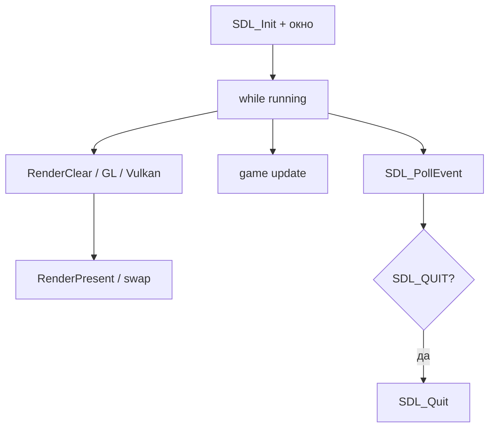

import ExternalCodeEmbed from '@site/src/components/ExternalCodeEmbed';


# SDL — мультимедиа и окна на C++

<span class="complexity-badge">Разработчику</span>
<span class="complexity-badge">Начальный уровень</span>

---

## Что такое SDL

**SDL** (Simple DirectMedia Layer), сейчас **SDL2** — библиотека на **C**, дающая единый доступ к окну, клавиатуре, мыши, геймпадам, аудио и таймерам на Windows, Linux, macOS, Android, iOS и других платформах.

**SDL — поставляет **примитивы** — создать окно, прочитать событие, вывести прямоугольник или передать управление **OpenGL** / **Vulkan**. Поверх SDL строят Godot (на части платформ), эмуляторы, indie-игры и обёртки вроде Pygame в Python ([игры на Python](/encyclopedia/5-languages/5-02-python/312)).

В C++ SDL вызывают напрямую; указатели `SDL_Window*` удобно оборачивать в RAII — см. [Управление памятью](./19.md) и [Идиомы](./30.md).

---

## Ключевые понятия

| Термин | Определение |
|--------|-------------|
| **Подсистема** | Часть SDL (video, audio, joystick), инициализируемая флагами `SDL_Init` |
| **SDL_Renderer** | 2D-API: clear, draw rect/texture, present — без ручного OpenGL |
| **Surface / Texture** | Surface — CPU-память; Texture — GPU для renderer |
| **Event loop** | Цикл `SDL_PollEvent`; каждое событие — структура `SDL_Event` |
| **Context** | OpenGL/Vulkan контекст, привязанный к окну SDL |

Сравнение с C++-обёрткой — [SFML](./2741.md). Быстрый монолит — [Raylib](./2744.md).

---

## SDL, SFML и Raylib

| Критерий | SDL2 | SFML | Raylib |
|----------|------|------|--------|
| Язык API | C | C++ | C |
| 2D renderer | `SDL_Renderer` | `sf::Sprite` | `DrawTexture` |
| 3D | OpenGL/Vulkan через контекст | Нет | Встроено |
| Звук | SDL_mixer / SDL3 audio | Встроен | Встроен |
| Гибкость | Максимальная | Средняя | Меньше, быстрее старт |
| Экосистема | image, ttf, mixer, net | Модули SFML | Монолит |

**Правило выбора:** SDL — **контроль**, мобильные порты, свой рендер на [OpenGL](./2745.md) или [Vulkan](./29.md). SFML — приятнее C++-стиль. Raylib — минимум настройки.

---

## Подсистемы и расширения SDL2

| Подсистема | Флаг `SDL_Init` | Назначение |
|------------|-----------------|------------|
| Video | `SDL_INIT_VIDEO` | Окно, события, renderer |
| Audio | `SDL_INIT_AUDIO` | Вывод звука |
| Joystick | `SDL_INIT_GAMECONTROLLER` | Геймпады |
| Timer | ядро SDL | `SDL_GetTicks`, callbacks |

Отдельные библиотеки (ставятся дополнительно):

- **SDL_image** — PNG, JPG, WebP;
- **SDL_mixer** — WAV, OGG, музыка;
- **SDL_ttf** — TrueType шрифты;
- **SDL_net** — TCP/UDP.

---

## CMake и vcpkg

```cmake
cmake_minimum_required(VERSION 3.16)
project(sdl_demo CXX)
set(CMAKE_CXX_STANDARD 17)

find_package(SDL2 CONFIG REQUIRED)
find_package(SDL2_image CONFIG REQUIRED)

add_executable(game main.cpp)
target_link_libraries(game PRIVATE SDL2::SDL2 SDL2_image::SDL2_image)
```

- `vcpkg install sdl2 sdl2-image sdl2-mixer` — типичный набор для игры.
- Linux: `sudo apt install libsdl2-dev libsdl2-image-dev`.

Сборка C++ — [Конфигурация и сборка в C++](./1004.md), [CMake — первая программа](./1006.md).

---

## Минимальный цикл на SDL_Renderer


<ExternalCodeEmbed example="cpp/cpp-506-2742-001" title="Минимальный цикл на SDL_Renderer" minHeight={678} />


### Разбор построчно

- `SDL_Init(SDL_INIT_VIDEO)` — поднимает video-подсистему; при ошибке возвращает `< 0`, нужен `SDL_GetError()`.
- `IMG_Init(IMG_INIT_PNG)` — регистрирует декодеры SDL_image; симметрично `IMG_Quit()`.
- `SDL_CreateWindow` — native-окно; координаты `CENTERED` — по центру экрана.
- `SDL_CreateRenderer(..., SDL_RENDERER_ACCELERATED)` — 2D backend на GPU, если доступен.
- `SDL_PollEvent` — **неблокирующий** опрос; `SDL_QUIT` — закрытие окна или Alt+F4.
- `RenderClear` + `RenderFillRect` + `RenderPresent` — аналог SFML `clear` / `draw` / `display`.
- `Destroy*` и `Quit` — освобождение ресурсов; в C++ лучше RAII-обёртки с custom deleter.

---

## SDL с OpenGL и Vulkan

Для 3D SDL создаёт **окно и surface**, рендер — ваш код:

```cpp
SDL_Window* window = SDL_CreateWindow(
    "3D", SDL_WINDOWPOS_UNDEFINED, SDL_WINDOWPOS_UNDEFINED,
    1280, 720, SDL_WINDOW_OPENGL | SDL_WINDOW_RESIZABLE);
SDL_GLContext glContext = SDL_GL_CreateContext(window);
// GLAD/GLEW — загрузка функций OpenGL 3.3+
```

Флаг `SDL_WINDOW_VULKAN` + `SDL_Vulkan_CreateSurface` — вход в [Vulkan](./29.md). SDL здесь не рисует треугольник — только **связь с ОС**.

Подробнее — [OpenGL на C++](./2745.md).

---

## Аудио через SDL_mixer

```cpp
#include <SDL_mixer.h>

Mix_OpenAudio(44100, MIX_DEFAULT_FORMAT, 2, 2048);
Mix_Chunk* hit = Mix_LoadWAV("hit.wav");
Mix_PlayChannel(-1, hit, 0);
Mix_FreeChunk(hit);
Mix_CloseAudio();
```

- **Chunk** — короткий эффект.
- **Music** — `Mix_LoadMUS` / `Mix_PlayMusic` для фона.

---

## Архитектура SDL-проекта



SDL хорошо сочетается с **ECS** (EnTT, Flecs): система ввода читает `SDL_Event`, система рендера — только draw. Игровой цикл — [Разработка игр с использованием C++](./22.md).

---

## Когда выбирать SDL

| Сценарий | SDL |
|----------|-----|
| Кроссплатформенный движок, эмулятор | Да |
| Мобильный порт (Android/iOS) | Да |
| Быстрая учебная 2D без CMake-магии | Часто проще [Raylib](./2744.md) |
| Desktop GUI | [Qt](./27.md) |
| Windows-only низкоуровневый GPU | [DirectX](./2746.md) |

---

## Частые ошибки

| Симптом | Причина | Решение |
|---------|---------|---------|
| `SDL_Init` failed | headless сервер / нет дисплея | Xvfb, локальный запуск |
| Утечки | `Create*` без `Destroy` | RAII |
| Размытые спрайты | некратный scale | integer scale, `SDL_ScaleModeNearest` |
| OpenGL 1.x only | нет loader | GLAD/GLEW после `CreateContext` |

---

## Что читать дальше

- [SFML — 2D на C++](./2741.md)
- [OpenGL на C++](./2745.md)
- [Vulkan и низкоуровневая графика](./29.md)
- [DirectX на Windows](./2746.md)
- [Разработка игр](./22.md)

---
