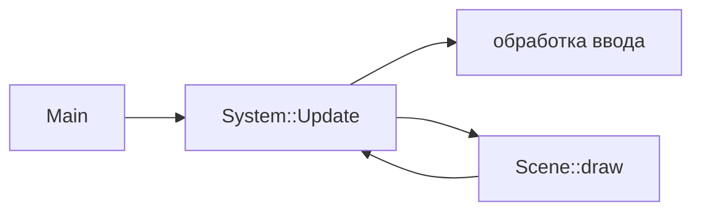

import ExternalCodeEmbed from '@site/src/components/ExternalCodeEmbed';


# Siv3D — 2D/3D и мультимедиа на C++

<span class="complexity-badge">Разработчику</span>
<span class="complexity-badge">Начальный уровень</span>

---

## Что такое Siv3D

**Siv3D** (OpenSiv3D) — open-source **C++20** фреймворк для игр, учебных симуляций и creative coding. В одном SDK собраны 2D и 3D, Unicode-шрифты, аудио, простой GUI, работа с файлами и математика — без отдельной связки SDL_image + GL loader + stb.

Проект зародился в Японии; используется в университетских курсах и game jam. Документация — на английском и японском.

По идее Siv3D близок к [Raylib](./2744.md) ("всё в одном"), но API строится вокруг **`Scene`**, **`Main()`** и типов вроде `String`, `Texture`, `Camera3D` — в духе современного C++ ([идиомы C++20](./30.md)).

---

## Ключевые понятия

| Термин | Определение |
|--------|-------------|
| **`Main()`** | Точка входа Siv3D вместо `main`; макрос SDK настраивает окно и цикл |
| **`Scene`** | Логический холст фиксированного размера; масштабируется под окно |
| **`System::Update()`** | Один кадр: события, таймер, `true` пока приложение живо |
| **`String` / `U"..."`** | Unicode-строки; литерал `U"Привет"` — тип `String` |
| **`Transformer3D`** | RAII-объект, задающий камеру и 3D-проекцию на время блока |

Для чистого 2D без 3D достаточно [SFML](./2741.md). Для минимального C-API — [Raylib](./2744.md).

---

## Siv3D, Raylib и SFML

| Критерий | Siv3D | Raylib | SFML |
|----------|-------|--------|------|
| 2D | Богатые примитивы | Да | Да |
| 3D | Меши, камера, свет | Упрощённо | Нет |
| Стандарт C++ | C++20 | C (+ обёртки) | C++17 |
| Стиль API | `Scene` + `Main()` | `InitWindow` / `Draw*` | `sf::RenderWindow` |
| GUI | Встроенные виджеты | rgui (опционально) | Нет |
| Платформы | Win, macOS, Linux | Широкий список | Win, Linux, macOS |

**Правило выбора:** один фреймворк для **2D + 3D + шрифты + GUI** на C++20 — Siv3D. Минимализм и C — Raylib. Только 2D и OOP — SFML.

---

## Структура приложения



Ключевые типы SDK:

| Тип | Назначение |
|-----|------------|
| `Scene` | Логический холст; координаты не "плывут" при resize окна |
| `Texture` / `Image` | Растр; `Image` — CPU, `Texture` — GPU |
| `Font` | Отрисовка Unicode-текста |
| `Audio` | WAV, MP3, синтез |
| `Random` | RNG для игровой логики |
| `Mesh` + `Camera3D` | Простые 3D-сцены без ручного Vulkan |

---

## Установка

1. Скачайте **OpenSiv3D SDK** с официального репозитория под вашу ОС.
2. Создайте проект через **OpenSiv3D Project Generator** или скопируйте шаблон CMake.
3. Компилятор: **MSVC 2022**, **Clang 14+**, **GCC 11+** с поддержкой **C++20** ([toolchain](./32.md)).

CMake (упрощённо):

```cmake
cmake_minimum_required(VERSION 3.16)
project(siv3d_game CXX)
set(CMAKE_CXX_STANDARD 20)

include("${SIV3D_ROOT}/cmake/Siv3D.cmake")
add_executable(Game Main.cpp)
target_link_siv3d(Game)
```

`SIV3D_ROOT` — путь к распакованному SDK. Детали меняются между релизами — сверяйтесь с README SDK.

---

## Минимальный 2D-пример


<ExternalCodeEmbed example="cpp/cpp-506-2743-001" title="Минимальный 2D-пример" minHeight={318} />


### Разбор построчно

- `# include <Siv3D.hpp>` — единый заголовок SDK (пробел после `#` — стиль Siv3D).
- `void Main()` — **точка входа**; SDK предоставляет `main`, который вызывает `Main()`.
- `Scene scene{800, 600}` — логическое поле 800×600; при изменении окна Siv3D **масштабирует** отрисовку, сохраняя пропорции.
- `System::Update()` — один кадр игрового цикла; возвращает `false` при закрытии.
- `scene.draw(ColorF{...})` — заливка фона; `ColorF` — RGBA в диапазоне 0..1.
- `scene.circle(...).draw(...)` — fluent-стиль: создали фигуру → нарисовали.
- `U"Hello, Siv3D!"` — **Unicode-литерал**; кириллица поддерживается без отдельной кодировки.
- `font(...).drawAt(x, y, color)` — текст с якорем в точке.

---

## 3D без ручного Vulkan

```cpp
const Mesh mesh = Mesh::LoadOBJ(U"model.obj");
while (System::Update()) {
    const Transformer3D t{
        Camera3D{Vec3{0, 2, 4}, Vec3{0, 0, 0}}};
    mesh.draw();
}
```

- **`Mesh`** — вершины и индексы на GPU.
- **`Transformer3D`** — на время жизни объекта активна 3D-камера; после блока — снова 2D `Scene`.
- Для **своих шейдеров**, compute и полного контроля — [OpenGL](./2745.md) или [Vulkan](./29.md).

---

## Модули OpenSiv3D

Помимо ядра в SDK есть подсистемы:

- **Script** — встроенный скриптовый слой;
- **Physics2D** — простая 2D-физика;
- **Network** — сокеты;
- **GUI** — кнопки, слайдеры;
- **Excel** — чтение таблиц для прототипов баланса.

Примеры (Samples) в SDK — главный учебный ресурс после первого окна.

---

## Когда Siv3D подходит

| Сценарий | Siv3D |
|----------|-------|
| Учебный курс, jam, визуализация | Да |
| Legacy только C++17 | Может не собраться |
| Коммерческий движок с редактором | Unreal / Unity |
| Минимальный embedded-бинарник | SDL + свой рендер |
| Windows GPU без абстракций | [DirectX](./2746.md) |

---

## Частые ошибки

| Симптом | Причина | Решение |
|---------|---------|---------|
| Ресурсы не найдены | неверный путь `resource/` | структура каталогов как в шаблоне SDK |
| Ошибка C++20 | старый компилятор | обновить [toolchain](./32.md) |
| Долгая сборка | header-heavy SDK | PCH / unity build из шаблона |
| 3D "плоское" освещение | нет нормалей в модели | экспорт из Blender с normals |

---

## Что читать дальше

- [Raylib](./2744.md) · [SFML](./2741.md) · [SDL](./2742.md)
- [OpenGL на C++](./2745.md) · [Vulkan](./29.md)
- [Разработка игр](./22.md)
- [Диапазоны и C++20](./31.md)

---
