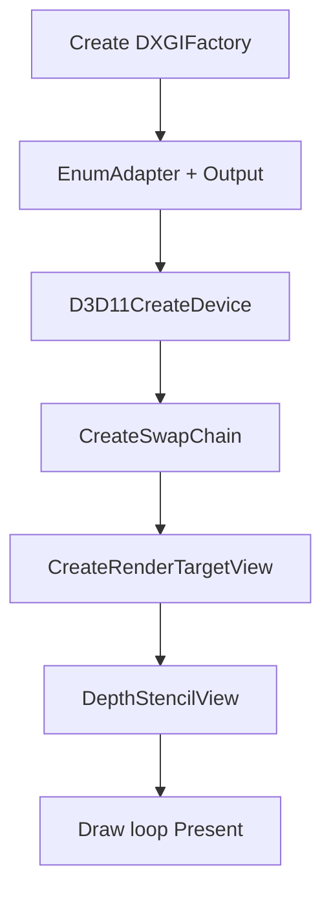

# DirectX — графика и мультимедиа на Windows

<div class="article-tags"><span class="tag tag-reference">УГЛУБЛЕНИЕ</span></div>

<span class="complexity-badge">Разработчику</span>
<span class="complexity-badge">Архитектору</span>

---

## Что такое DirectX

**DirectX** — семейство API Microsoft для **графики, вычислений, аудио и ввода** на **Windows** и **Xbox**. Для нативного C++ на PC DirectX — естественный путь к GPU: драйверы AMD/NVIDIA/Intel оптимизированы под **Direct3D**, индустрия исторически строится на DirectX, **Visual Studio** и **Windows SDK** дают заголовки, библиотеки и PIX.

DirectX — **не один API**, а набор компонентов:

| Компонент | Назначение |
|-----------|------------|
| **Direct3D 11 (D3D11)** | Зрелый 3D; проще вход, чем D3D12 |
| **Direct3D 12 (D3D12)** | Низкий CPU overhead; явная синхронизация |
| **DXGI** | Адаптеры, swap chain, fullscreen, форматы |
| **HLSL** | Язык шейдеров; компиляция в DXBC/DXIL |
| **Direct2D / DirectWrite** | 2D-векторная графика и текст |
| **XAudio2** | Игровой звук |
| **XInput / GameInput** | Геймпады |

Обзор desktop — [Desktop-приложения](/encyclopedia/4-code-dev/4-11-desktopnye-prilozheniya/intro). Toolchain — [Компиляторы и toolchain C++](./32.md). Кросс-платформа — [OpenGL](./2745.md) или [Vulkan](./29.md).

---

## Ключевые понятия

| Термин | Определение |
|--------|-------------|
| **Adapter** | Видеокарта или встроенный GPU в системе |
| **Swap chain** | Цепочка back buffer'ов; `Present` показывает кадр |
| **Render Target View (RTV)** | "Вид" на текстуру как на цветовой буфер |
| **Depth Stencil View (DSV)** | Буфер глубины для 3D |
| **HLSL** | High Level Shading Language — шейдеры DirectX |
| **COM** | Component Object Model; объекты D3D — `IUnknown`, нужен `Release()` |
| **PSO** | Pipeline State Object в D3D12 — тяжёлый immutable state |

Как GPU работает в целом — [как работает компьютер](/encyclopedia/1-basics/1-08-kak-rabotaet-kompyuter/4).

---

## DirectX, OpenGL и Vulkan

| Критерий | D3D11 | D3D12 | OpenGL | Vulkan |
|----------|-------|-------|--------|--------|
| ОС | Windows, Xbox | Windows, Xbox | Кросс-платформа | Кросс-платформа |
| Порог входа | Средний | Высокий | Средний | Высокий |
| Управление GPU | Частично неявное | Явное | Смешанное | Явное |
| Шейдеры | HLSL | HLSL | GLSL | SPIR-V |
| Отладка | PIX | PIX | RenderDoc | RenderDoc |

**Правило выбора:** Windows-only + старые GPU — **D3D11**. Свой движок — **D3D12** или [Vulkan](./29.md). Учебный 2D — [Raylib](./2744.md), [SFML](./2741.md).

---

## Инициализация Direct3D 11



Шаги:

1. Окно **Win32** (`HWND`) — DirectX не создаёт UI ([SFML](./2741.md) и [Qt](./27.md) создают).
2. `CreateDXGIFactory` → выбор адаптера.
3. `D3D11CreateDevice`, feature level `11_0` или выше.
4. `CreateSwapChainForHwnd`, формат `DXGI_FORMAT_R8G8B8A8_UNORM`.
5. Back buffer → `CreateRenderTargetView`; depth → `CreateDepthStencilView`.
6. Каждый кадр: bind RTV → clear → draw → `Present`.

Clear и present:

```cpp
const float clearColor[4] = {0.12f, 0.12f, 0.16f, 1.f};
context->ClearRenderTargetView(rtv.Get(), clearColor);
context->ClearDepthStencilView(dsv.Get(), D3D11_CLEAR_DEPTH, 1.f, 0);
swapChain->Present(1, 0);  // sync interval 1 ≈ VSync
```

### Разбор фрагмента

- **`ClearRenderTargetView`** — заливка color buffer; без clear — мусор прошлого кадра.
- **`ClearDepthStencilView`** — depth = 1.0 (дальняя плоскость); нужен для 3D.
- **`Present(1, 0)`** — первый аргумент `1` — ждать vertical blank (VSync); `0` — без ожидания.

Используйте **`ComPtr`** (WRL) — COM-объекты требуют `Release()`; RAII — [Идиомы](./30.md), [Память](./19.md).

---

## Шейдеры HLSL

Vertex shader (упрощённо):

```hlsl
struct VSIn { float3 pos : POSITION; };
struct VSOut { float4 pos : SV_Position; };
VSOut main(VSIn i) {
    VSOut o;
    o.pos = float4(i.pos, 1.0);
    return o;
}
```

Компиляция из C++:

```cpp
ComPtr<ID3DBlob> vsBlob;
D3DCompileFromFile(L"triangle.vs.hlsl", nullptr, nullptr, "main",
    "vs_5_0", 0, 0, &vsBlob, nullptr);
device->CreateVertexShader(vsBlob->GetBufferPointer(),
    vsBlob->GetBufferSize(), nullptr, &vertexShader);
```

- **`SV_Position`** — обязательный выход vertex shader (экранные координаты).
- **Input layout** связывает `POSITION` с vertex buffer.
- Константы (MVP) — **constant buffer** `register(b0)`.

Сравнение с GLSL — [OpenGL и шейдеры](/encyclopedia/9-spinoff/9-08-kompyuternaya-grafika/18).

---

## Direct3D 12 — отличия от D3D11

D3D12 переносит работу на приложение:

- **Descriptor heaps** и **root signature** вместо простых slots;
- **Command lists** на CPU → submit в **command queue**;
- **Fence** — синхронизация CPU/GPU;
- **PSO** — дорогой объект; кэшируют и переиспользуют.

Модель близка к [Vulkan](./29.md): "сложнее код — меньше driver overhead". Unreal Engine 5 на Windows использует D3D12.

---

## Direct2D и UI

Для 2D поверх 3D или без него:

- **Direct2D** — примитивы, градиенты, path;
- **DirectWrite** — ClearType-текст;
- **D2D + DXGI** — рисование в surface swap chain.

Полноценный desktop UI — [Qt](./27.md) или WinUI ([116](/encyclopedia/4-code-dev/4-11-desktopnye-prilozheniya/116)). WPF/WinUI тоже используют DirectX под капотом.

---

## Среда разработки

| Инструмент | Назначение |
|------------|------------|
| **Visual Studio 2022** | Workload "Разработка классических приложений на C++" |
| **Windows SDK** | `d3d11.h`, `dxgi.h`, `d3dcompiler.h` |
| **PIX** | Захват кадра, GPU timeline |
| **RenderDoc** | Отладка D3D11/12 |

**MSVC** — типичный компилятор; MinGW + DirectX возможен, но хуже поддерживается.

---

## DirectX и игровые движки

Unreal, Unity на Windows скрывают DirectX за **RHI**. "Голый" D3D изучают, если:

- пишете **свой рендер**;
- делаете **мод/плагин** с низкоуровневым доступом;
- отлаживаете **performance** на PC/Xbox.

Учебный 2D без Win32 — [Raylib](./2744.md) или [SFML](./2741.md). Контекст индустрии — [разработка игр](/encyclopedia/9-spinoff/9-04-razrabotka-igr/intro).

---

## Когда DirectX подходит

| Сценарий | DirectX |
|----------|---------|
| Windows/Xbox игра или симулятор | Да |
| Linux/macOS | OpenGL/Vulkan |
| Быстрый учебный 2D | SFML / Raylib |
| Корпоративный GUI | Qt / WinUI |

---

## Частые ошибки

| Симптом | Причина | Решение |
|---------|---------|---------|
| `DXGI_ERROR_DEVICE_REMOVED` | TDR / падение shader | PIX, упростить shader |
| Чёрный экран | RTV не bound | `OMSetRenderTargets` |
| HLSL error | неверный profile | `vs_5_0` vs feature level |
| Утечки | COM без Release | `ComPtr`, RAII |

---

## Что читать дальше

- [Vulkan и низкоуровневая графика](./29.md)
- [OpenGL на C++](./2745.md)
- [SDL + Vulkan surface](./2742.md)
- [Разработка игр](./22.md)
- [Оптимизация игр](/encyclopedia/9-spinoff/9-04-razrabotka-igr/123)

---
