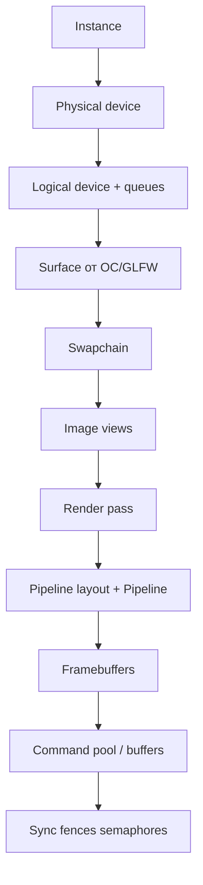

# Vulkan и низкоуровневая графика на C++

<div class="article-tags"><span class="tag tag-reference">УГЛУБЛЕНИЕ</span></div>

<span class="complexity-badge">Разработчику</span>
<span class="complexity-badge">Архитектору</span>

---

## Что такое Vulkan

**Vulkan** — кроссплатформенный **низкоуровневый API** к GPU от Khronos Group. Он описывает, *как* CPU ставит работу GPU в очередь: буферы, изображения, шейдеры, синхронизация, показ кадра в окне. Vulkan **не рисует треугольник одной функцией** — вы явно создаёте десятки объектов до первого кадра.

Для C++ Vulkan естественен: тонкий **C-интерфейс**, явное владение ресурсами, минимум скрытой логики в драйвере. Хорошо сочетается с **RAII** ([Идиомы](./30.md), [Память](./19.md)).

Обзор игрового контекста — [Разработка игр](./22.md). Vulkan в индустрии — [/encyclopedia/9-spinoff/9-04-razrabotka-igr/114](/encyclopedia/9-spinoff/9-04-razrabotka-igr/114).

---

## Карта 2D/3D-стека в разделе C++

| Уровень | Инструменты | Статьи |
|---------|-------------|--------|
| 2D, учебные игры | SFML, SDL, Raylib | [SFML — 2D-графика и мультимедиа на C++](./2741.md), [SDL — мультимедиа и окна на C++](./2742.md), [Raylib — быстрые 2D/3D прототипы на C++](./2744.md) |
| 2D/3D "из коробки" | Siv3D, Raylib | [Siv3D — 2D/3D и мультимедиа на C++](./2743.md), [Raylib — быстрые 2D/3D прототипы на C++](./2744.md) |
| 3D API | OpenGL, DirectX, Vulkan | [OpenGL — 3D-графика на C++](./2745.md), [DirectX — графика и мультимедиа на Windows](./2746.md), эта статья |
| Desktop UI | Qt | [Qt - кроссплатформенный фреймворк на C++](./27.md) |

**Vulkan** — нижний слой: окно даёт [SDL](./2742.md) или GLFW, рендер — ваш код и шейдеры **SPIR-V**.

---

## Ключевые понятия

| Термин | Определение |
|--------|-------------|
| **Instance** | Точка входа в Vulkan; версии API, validation layers |
| **Physical / Logical device** | Видеокарта и ваш "хэндл" к ней с очередями |
| **Queue** | Очередь команд GPU (graphics, compute, transfer) |
| **Swapchain** | Набор изображений для double/triple buffering |
| **Render pass** | Описание этапов рендера и layout вложений |
| **Pipeline** | Шейдеры + фиксированные настройки растеризации |
| **Command buffer** | Записанная последовательность команд GPU |
| **Semaphore / Fence** | Синхронизация GPU↔GPU и CPU↔GPU |
| **SPIR-V** | Бинарный формат шейдеров для Vulkan |

Сравнение с [OpenGL](./2745.md) (выше уровень абстракции) и [DirectX 12](./2746.md) (похожая философия на Windows).

---

## Первая цель на Vulkan

Опорная мысль: Vulkan — **явное описание работы GPU**, а не один вызов "нарисуй".

Минимум на старте:

1. Окно (GLFW/SDL) и **VkSurface**.
2. **Swapchain** и очистка экрана цветом.
3. Цикл кадров **без ошибок validation layers**.

После этого — вершины, индексы, uniform buffer с MVP ([OpenGL и шейдеры](/encyclopedia/9-spinoff/9-08-kompyuternaya-grafika/18) — та же математика).

Практика с критериями — [Практические задания](./1008.md), блок "Графика".

---

## Vulkan и OpenGL — зачем менять API

| Критерий | OpenGL | Vulkan |
|----------|--------|--------|
| Состояние GPU | Часто неявное; драйвер "догадывается" | Явное; задаёте вы |
| Потоки | Один контекст на поток — неудобно | Несколько очередей, параллельная запись команд |
| CPU overhead | Выше на типичных сценах | Ниже при правильной архитектуре |
| Первый треугольник | Быстрее | Дольше (больше объектов) |
| macOS | Deprecated → Metal | MoltenVK (Vulkan поверх Metal) |

Vulkan **не заменяет движок** (Unreal, Godot). Он нужен, когда вы пишете **свой рендер**, инструмент визуализации, эмулятор GPU или учебный проект "как устроен кадр изнутри".

Для 2D-игры достаточно [Raylib](./2744.md) или [SFML](./2741.md).

---

## Модель объектов Vulkan

Типичная инициализация — цепочка зависимостей:



### Разбор объектов

- **Instance** — глобальный контекст API; здесь включают **validation layers** для отладки.
- **Physical device** — конкретная видеокарта; у неё **семейства очередей** (graphics, present, transfer).
- **Logical device** — интерфейс приложения к GPU; из него берут `vkQueueSubmit`, `vkQueuePresent`.
- **Surface** — связь с HWND / Wayland / Android; без surface нет swapchain. Создают через **GLFW**, **SDL** ([SDL — мультимедиа и окна на C++](./2742.md)) или native API.
- **Swapchain** — 2–3 изображения; рисуете в один буфер, экран показывает другой (**double buffering**).
- **Render pass** — какие attachment (color, depth), какие **layout** памяти GPU между этапами.
- **Pipeline** — vertex/fragment shader + rasterization, blend, depth test. Смена pipeline **дорогая** — сортируют draw calls по state.
- **Command buffers** — записанные команды: `vkCmdBeginRenderPass` → draw → `vkCmdEndRenderPass`.

---

## Один кадр рендеринга

Упрощённый порядок каждой итерации игрового цикла:

1. Дождаться **fence** — GPU закончил прошлый кадр.
2. `acquireNextImage` — индекс следующего изображения swapchain.
3. Записать **command buffer** (или переиспользовать): clear, draw, **memory barriers**.
4. **Submit** в graphics queue с **semaphore**.
5. **Present** — показ на экран, согласование semaphores с present queue.

**Синхронизация** — отдельная дисциплина. Гонки CPU/GPU дают артефакты или ошибки validation. В debug всегда включайте **`VK_LAYER_KHRONOS_validation`** — слой объясняет забытые барьеры и layout.

Многопоточная запись command buffers — [Особенности языка / потоки](./26.md).

---

## Шейдеры и SPIR-V

Исходники — **GLSL** или **HLSL**; компилятор (glslang, DXC) → **SPIR-V** (`.spv`). В C++ загружают бинарник в `VkShaderModule`.

Роли:

- **Vertex shader** — позиции, UV, нормали;
- **Fragment shader** — цвет пикселя;
- **Descriptor sets** — uniform buffer (MVP), текстуры, samplers.

Дескрипторы типизированы через **descriptor set layout** — аналог "слота текстуры N" в старых API, но строже.

Теория шейдеров — [OpenGL и шейдеры](/encyclopedia/9-spinoff/9-08-kompyuternaya-grafika/18). HLSL в экосистеме Microsoft — [DirectX](./2746.md).

---

## Память на GPU

`VkBuffer` и `VkImage` живут в **device memory**. Типы:

- **host-visible** — CPU может `map` и писать (staging);
- **device-local** — быстрый доступ GPU (статическая геометрия).

Паттерны:

- статика — upload через staging buffer → `vkCmdCopyBuffer` → device-local;
- динамика — ring buffer в host-visible с аккуратными барьерами.

Утечки `vkDestroy*` и descriptor pools так же опасны, как `new` без `delete` — [Память](./19.md).

**VMA** (Vulkan Memory Allocator) упрощает аллокации в реальных проектах.

---

## C++ вокруг Vulkan

Официальный API — **C**. В C++ проектах:

- **Vulkan-Hpp** — типобезопасные хэндлы, optional, RAII-обёртки;
- **volk** — динамическая загрузка `vkGetInstanceProcAddr`;
- **VMA** — аллокатор памяти.

Минимальный стек: **CMake + GLFW + Vulkan SDK + validation layers**.

```cmake
cmake_minimum_required(VERSION 3.16)
project(vulkan_triangle CXX)
set(CMAKE_CXX_STANDARD 17)

find_package(Vulkan REQUIRED)
find_package(glfw3 REQUIRED)

add_executable(triangle main.cpp)
target_link_libraries(triangle PRIVATE Vulkan::Vulkan glfw)
```

- **`VULKAN_SDK`** — переменная окружения к установленному SDK (LunarG).
- **`find_package(Vulkan)`** — импорт target `Vulkan::Vulkan` в CMake 3.7+.

Сборка — [Конфигурация и сборка в C++](./1004.md), [CMake — первая программа](./1006.md).

---

## Когда Vulkan избыточен

- 2D-игра или UI — [SDL](./2742.md), [SFML](./2741.md), [Raylib](./2744.md), [Qt Quick](./2732.md);
- коммерческий 3D — Unreal / Unity;
- научная визуализация — иногда хватает [OpenGL](./2745.md).

Vulkan оправдан при жёстком **FPS**, **multithreaded** recording, custom deferred/hybrid pipeline или обучении архитектуре GPU.

---

## Частые ошибки новичка

| Симптом | Причина | Что сделать |
|---------|---------|-------------|
| Чёрный экран | пустой command buffer / неверный viewport | begin/end render pass, scissor |
| Артефакты | неверные barriers / layout | validation layers, править по одному |
| Зависания | fence/semaphore out of order | "1 кадр в полёте", потом масштабировать |
| Просадки FPS | пересоздание pipeline каждый кадр | кэш PSO, batching |

---

## Связь с другими темами C++

- RAII и дескрипторы — [Идиомы](./30.md)
- Сборка — [Конфигурация и сборка в C++](./1004.md), [CMake — первая программа](./1006.md)
- Потоки — [Особенности и расширения языка C++](./26.md)
- Практика — [Практические задания по C++](./1008.md)
- Соседние API — [OpenGL](./2745.md), [DirectX](./2746.md), [SDL + surface](./2742.md)
- 2D-стек — [SFML — 2D-графика и мультимедиа на C++](./2741.md), [Raylib — быстрые 2D/3D прототипы на C++](./2744.md), [Siv3D — 2D/3D и мультимедиа на C++](./2743.md)

---
