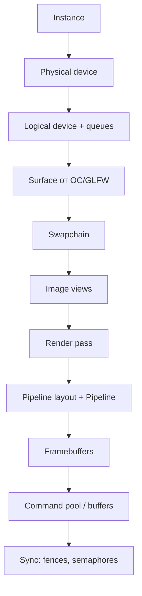

# Vulkan и низкоуровневая графика на C++

УГЛУБЛЕНИЕ

Разработчику
Архитектору

**Vulkan** — кроссплатформенный API для работы с GPU: рендеринг, вычисления, передача данных между CPU и видеокартой. Для C++ он особенно естественен: тонкий C-интерфейс, явное владение ресурсами, минимум скрытой магии. Обзор игрового контекста: [Разработка игр](./22.md). Детали API в индустрии: [/encyclopedia/9-spinoff/9-04-razrabotka-igr/114](/encyclopedia/9-spinoff/9-04-razrabotka-igr/114).

---

## Плавный старт: что важно понять в первые 2 часа

Чтобы не утонуть в терминах, держите опорную мысль: Vulkan — это "явное описание работы GPU". Вы не "просите нарисовать", а собираете набор объектов и явно синхронизируете шаги кадра.

Минимальная учебная цель:

1. Открыть окно.
2. Очистить экран одним цветом.
3. Получить валидный цикл кадров без ошибок validation layers.

Если это работает стабильно, переход к вершинам/индексам проходит намного проще.

---

## Зачем Vulkan, если есть OpenGL

| Критерий | OpenGL (legacy) | Vulkan |
|----------|-----------------|--------|
| Управление состоянием | Часто неявное, драйвер "догадывается" | Явное, разработчик задаёт всё |
| Потоки | Один контекст на поток — боль | Несколько очередей, параллельная запись команд |
| Накладные расходы CPU | Выше на типичных сценах | Ниже при правильной архитектуре |
| Порог входа | Ниже для первого треугольника | Выше: больше объектов до первого кадра |
| Платформы | Устаревает на macOS (Metal вместо него) | Windows, Linux, Android; на Apple — через MoltenVK |

Vulkan не заменяет **движок** (Unreal, Godot) — он нужен, когда вы пишете свой рендер, инструмент визуализации, эмулятор GPU или учебный проект "как устроен кадр изнутри".

---

## Модель объектов (что создаётся один раз)

Типичная инициализация строится как цепочка зависимостей:

**Instance** — точка входа в API: версии, слои валидации, расширения (например, для поверхности окна).

**Physical device** — видеокарта или встроенный GPU. У неё есть **семейства очередей** (queue families): графика, передача данных, compute. Нужно выбрать устройство, которое умеет и рисовать, и показывать картинку в окно.

**Logical device** — ваш "хэндл" к GPU: из него берут очереди (`vkQueueSubmit`, `vkQueuePresent`).

**Surface** — привязка к HWND, X11, Wayland, Android Surface. Без неё swapchain не создать. Обычно поверхность даёт **GLFW**, **SDL** или нативный код платформы.

**Swapchain** — набор изображений "задней буферизации": вы рисуете в один кадр, ОС показывает другой. Режим VSync, количество буферов (2–3) — параметры swapchain.

**Render pass** — описание этапов рендеринга: какие вложения (color, depth), какие переходы layout памяти GPU.

**Pipeline** — шейдеры + фиксированные настройки (растеризация, blending, depth test). Смена pipeline дорогая — проектируют батчи и сортировку по состоянию.

**Command buffers** — записанные команды: begin render pass → draw → end. Отправляются в очередь одним submit.

---

## Один кадр (цикл рендеринга)

Упрощённый порядок на каждой итерации игрового цикла:

1. Дождаться, что GPU освободил прошлый кадр (**fence**).
2. Получить индекс следующего изображения swapchain (`acquireNextImage`).
3. Записать или переиспользовать **command buffer**: очистка, отрисовка, барьеры памяти.
4. **Submit** в графическую очередь с **semaphore** "готово к показу".
5. **Present** — вывести изображение на экран, согласовав semaphores с очередью показа.

Синхронизация — отдельная дисциплина: гонки между CPU и GPU приводят к артефактам или валидационным ошибкам. Слой **Validation Layers** (в debug-сборке) обязателен на этапе обучения: он объясняет, какой барьер или layout забыли.

---

## Шейдеры и SPIR-V

Исходники пишут на **GLSL** или **HLSL**, компилируют в **SPIR-V** — промежуточное представление для Vulkan (и не только). В C++ загружают `.spv` как бинарный буфер и передают в `VkShaderModule`.

Разделение ролей:

- **Vertex shader** — позиции вершин, UV, нормали.
- **Fragment shader** — цвет пикселя.
- Для 3D добавляют **uniform buffers** / **descriptor sets** — матрицы камеры, текстуры, samplers.

Дескрипторы группируют в **layouts**; наборы обновляют при смене материала. Это аналог "привязать текстуру к слоту N" в старых API, но строго типизировано.

---

## Память на GPU

`VkBuffer` и `VkImage` живут в памяти устройства. Аллокаторы (`VkDeviceMemory`) выбирают тип: host-visible (маппинг с CPU), device-local (быстро для GPU). Типичный паттерн:

- статическая геометрия — upload staging buffer → copy → device-local;
- динамика — ring buffer в host-visible с осторожной синхронизацией.

Здесь же пересекается тема [управления памятью](./19.md): утечки дескрипторов и неосвобождённые `vkDestroy*` так же опасны, как `new` без `delete`.

---

## C++ вокруг Vulkan

Официальный API — C. В C++ проектах обычно:

- обёртки вроде **Vulkan-Hpp** (типобезопасные хэндлы, optional, RAII-варианты);
- **volk** / загрузчик для динамического `vkGetInstanceProcAddr`;
- **VMA** (Vulkan Memory Allocator) для упрощения аллокаций.

Идиома RAII хорошо ложится на владение `VkDevice`, буферами и пулами команд — см. [Идиомы современного C++](./30.md).

Минимальный учебный стек: CMake + GLFW + Vulkan SDK + validation layers. Сборка: [CMake — первая программа](./1006.md), [Конфигурация и сборка](./1004.md).

---

## Когда Vulkan избыточен

- 2D-игра или UI — **SDL/SFML/raylib** или Qt Quick;
- коммерческий 3D — движок;
- научная визуализация — иногда достаточно OpenGL через проверенные библиотеки.

Vulkan оправдан при жёстких требованиях к FPS, многопоточной записи команд, кастомном рендер-пайплайне (deferred, mesh shaders в новых расширениях) или обучении архитектуре GPU.

---

## Практика

Задания с критериями приёмки: [Практические задания по C++](./1008.md) (блок "Графика"). Первый шаг — треугольник в окне с validation layers и одним render pass; второй — индексный буфер и uniform buffer с матрицей камеры.

---

## Частые ошибки новичка в Vulkan

| Симптом | Причина | Что сделать |
|---------|---------|-------------|
| Чёрный экран | не записались команды в command buffer или не тот pipeline state | проверить begin/end render pass, viewport/scissor |
| Случайные артефакты | неверные барьеры и layout-переходы | включить validation layers и исправлять предупреждения по одному |
| Периодические зависания | fence/semaphore используются в неправильном порядке | упростить до "кадр в полёте = 1", затем масштабировать |
| Резкие просадки FPS | частое пересоздание pipeline/descriptor set | кэшировать pipeline и батчить draw calls |

---

## Как связать Vulkan с остальными темами C++

- RAII и владение дескрипторами: [30](./30.md)
- Сборка и конфигурация toolchain: [1004](./1004.md), [1006](./1006.md)
- Многопоточность для записи команд: [26](./26.md)
- Практическая траектория по C++: [1008](./1008.md)

---
