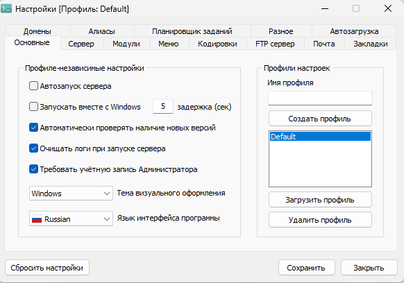
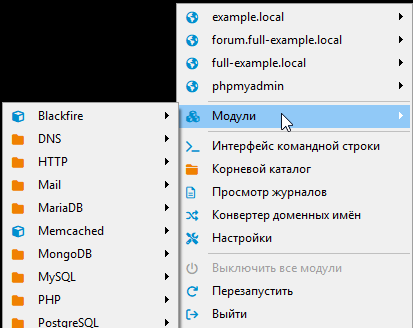
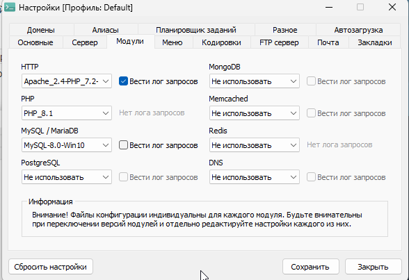
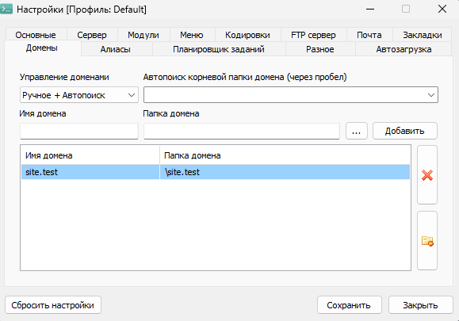
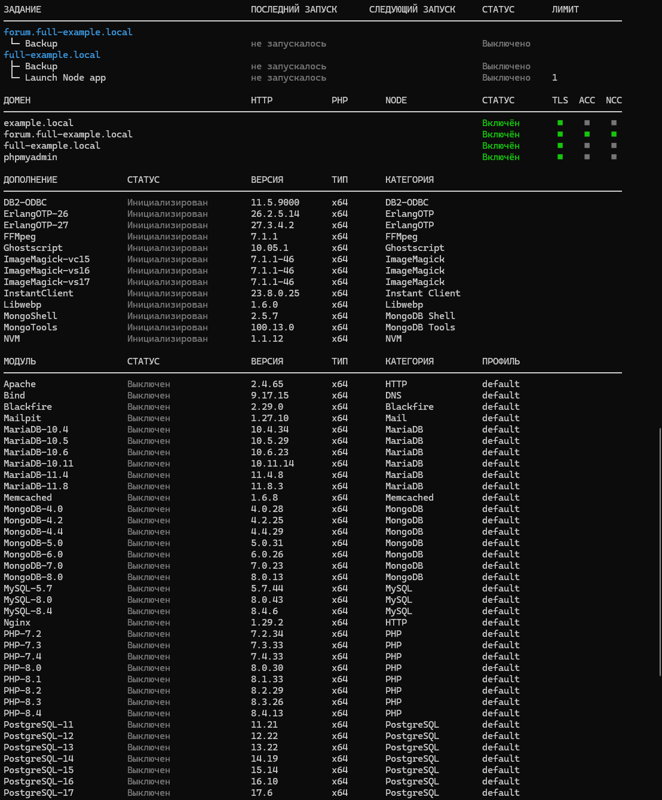
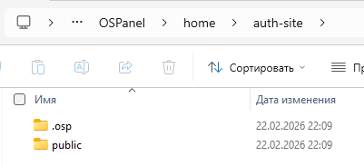
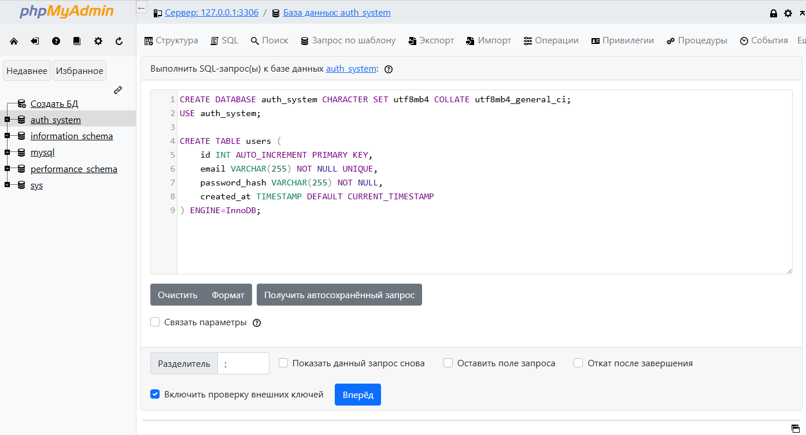
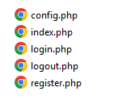

# Локальная среда разработки на PHP

<div class="article-tags">
  <span class="tag tag-required">ОБЯЗАТЕЛЬНО</span>
  <span class="tag tag-beginner">ДЛЯ НОВИЧКОВ</span>
</div>

<span class="complexity-badge">Разработчику</span>
<span class="complexity-badge">Архитектору</span>

---

## Локальная среда разработки

### Что такое локальная среда разработки?

**Локальная среда разработки** — это набор программных компонентов, установленных на персональном компьютере разработчика и предназначенный для создания, отладки и тестирования веб-приложений без подключения к удалённому хостингу или серверу. В такой среде разработчик полностью контролирует конфигурацию, версии используемых технологий и поведение приложения до его публикации в интернете.

---

### Компоненты локальной среды

#### Язык программирования PHP

PHP используется для написания серверной логики веб-приложений. Скрипты на PHP обрабатывают HTTP-запросы, взаимодействуют с базами данных, формируют HTML-страницы и реализуют функционал авторизации, загрузки файлов, API и других возможностей динамического сайта. Для локальной разработки может использоваться любая из поддерживаемых версий PHP, включая устаревшие (для поддержки легаси-проектов) и актуальные (для новых решений).

---

#### Системы управления реляционными базами данных

Реляционные СУБД, такие как **MySQL** и **PostgreSQL**, хранят структурированные данные приложения: пользователей, заказы, товары, статьи и другую информацию. Они обеспечивают целостность данных через транзакции, внешние ключи и ограничения, а также предоставляют мощный язык запросов SQL для выборки, фильтрации и агрегации информации.

---

#### In-memory хранилища для кэширования

Системы вроде **Redis** и **Memcached** работают в оперативной памяти и используются для временного хранения часто запрашиваемых данных: сессий пользователей, результатов сложных запросов, фрагментов страниц. Это снижает нагрузку на основную базу данных и ускоряет отклик приложения.

---

#### Веб-сервер

Веб-сервер принимает HTTP- и HTTPS-запросы от браузера и направляет их на обработку скриптам (например, PHP). Он отдаёт статические файлы (изображения, CSS, JavaScript), управляет заголовками, обеспечивает маршрутизацию URL и может выступать в роли reverse proxy перед другими сервисами. Наиболее распространённые веб-серверы — **Apache** и **Nginx**.

---

#### Дополнительные инструменты

В зависимости от задач проекта могут подключаться:
- **RabbitMQ** — для организации асинхронной передачи сообщений между микросервисами;
- **Mailpit** или **SMTP4dev** — для перехвата и анализа исходящей почты без отправки реальным получателям;
- **Vault** — для безопасного хранения секретов: паролей, токенов, ключей шифрования;
- **PocketBase** — как лёгкий бэкенд с встроенной базой данных и REST API;
- **Blackfire** — для профилирования производительности PHP-кода.

---

### Файл hosts и его роль

Файл `hosts` — это текстовый файл операционной системы, в котором задаются статические соответствия между доменными именами и IP-адресами. Он используется до обращения к DNS-серверам и позволяет переопределять разрешение имён локально.

Путь к файлу:
- Windows: `C:\Windows\System32\drivers\etc\hosts`
- Linux/macOS: `/etc/hosts`

Синтаксис прост: каждая строка содержит IP-адрес, один или несколько доменных имён, разделённых пробелами или табуляцией. Комментарии начинаются с символа `#`.

Пример содержимого:

```text
127.0.0.1 localhost
127.0.0.1 mysite.loc
127.0.0.1 shop.test api.shop.test
# 192.168.1.10 old-server.local
```

Разбор:
- `127.0.0.1` указывает на loopback-адрес текущего компьютера, поэтому домены направляются в локальную среду.
- В одной строке можно перечислить несколько имён (`shop.test api.shop.test`) для одного IP.
- `localhost` обычно оставляют как базовую системную запись.
- Строка с `#` считается комментарием и не участвует в разрешении имён.

В контексте локальной разработки записи вида `127.0.0.1 project.loc` позволяют обращаться к локальному веб-серверу по удобочитаемому имени вместо `localhost` или IP-адреса. Это особенно важно при работе с несколькими проектами одновременно, так как каждый может иметь свой уникальный домен.

Записи в файл `hosts` добавляются либо вручную (требуются права администратора), либо автоматически средствами локальной среды разработки. После изменения `hosts` может потребоваться сброс DNS-кэша:

```cmd
ipconfig /flushdns
```

Разбор:
- Команда очищает DNS-кэш Windows после изменения `hosts` или локального DNS.
- Система начинает заново резолвить домены и подхватывает обновлённые записи.
- Полезно выполнять, если браузер продолжает открывать старый адрес.
- Запускать следует из консоли с правами администратора.

```bash
sudo dscacheutil -flushcache
```

Разбор:
- Команда сбрасывает локальный кэш DNS на macOS.
- Префикс `sudo` нужен для выполнения с повышенными правами.
- После сброса система заново запросит DNS-ответы для доменов.
- Это типичный шаг после редактирования `/etc/hosts`.

---

### Работа локального веб-сервера

Локальный веб-сервер запускается на машине разработчика и прослушивает стандартные порты: **80** для HTTP и **443** для HTTPS (или другие, если основные заняты). При получении запроса к домену, например `http://shop.loc`, сервер:
1. Сопоставляет домен с настроенным **виртуальным хостом**;
2. Определяет корневую директорию проекта;
3. Если запрошен статический файл — отдаёт его напрямую;
4. Если запрошен PHP-скрипт — передаёт его интерпретатору PHP через CGI, FastCGI или модуль;
5. Возвращает сформированный ответ браузеру.

Такой подход даёт возможность:
- Тестировать маршрутизацию и правила `.htaccess`;
- Проверять работу сессий, кук и заголовков;
- Имитировать production-поведение приложения;
- Отлаживать ошибки без влияния на живой сайт.

---

### Работа локального DNS-сервера

Локальный DNS-сервер (например, **Bind** или **Unbound**) расширяет возможности, предоставляемые файлом `hosts`. Вместо ручного добавления каждой записи можно настроить **DNS-зону**, например `.test` или `.loc`, и все домены в этой зоне автоматически будут разрешаться в указанный IP-адрес (обычно `127.0.0.1`).

Принцип работы:
1. Система настраивается на использование `127.0.0.1` как основного DNS-резолвера;
2. При запросе `anyname.loc` система обращается к локальному DNS-серверу;
3. Сервер проверяет, принадлежит ли домен настроенной зоне;
4. Если да — возвращает `127.0.0.1`; если нет — перенаправляет запрос к публичным DNS (например, `8.8.8.8`).

Преимущества локального DNS-сервера:
- Не нужно редактировать файл `hosts` при создании нового проекта;
- Поддержка wildcard-доменов: `*.project.loc` → `127.0.0.1`;
- Возможность настройки DNSSEC, кэширования и логирования;
- Изоляция локальных доменов от глобального DNS-пространства.

Это особенно удобно при разработке сложных систем с множеством поддоменов (например, `admin.app.loc`, `api.app.loc`, `docs.app.loc`) — достаточно один раз настроить зону, и все поддомены заработают автоматически.

---

### Виды локальных сред

**XAMPP** — один из самых старых и известных наборов для локальной веб-разработки. Он включает Apache, MySQL, PHP и Perl. Отсюда название: 
- **X** — кроссплатформенность, 
- **A**pache, 
- **M**ySQL, 
- **P**HP, 
- **P**erl.

Работу с XAMPP мы разбираем в отдельной главе, так что здесь останавливаться не будем. Простая установка, запуск, минимальные требования к знаниям, доступна на любых платформах, а встроенный phpMyAdmin упрощает работу с БД. Разве что недостаток - привязка к Apache и MySQL — нет поддержки Nginx, PostgreSQL или других СУБД из коробки.

XAMPP подходит для:
- обучения основам PHP и MySQL;
- быстрого запуска простого проекта без сложной инфраструктуры;
- случаев, когда нужен только стек LAMP (Linux/Apache/MySQL/PHP), даже на Windows.

**Laragon** — современная альтернатива XAMPP, ориентированная на разработчиков PHP, но с расширенной поддержкой Node.js, Python, Go и других технологий.

Автоматическая настройка виртуальных хостов, поддержка нескольких веб-серверов (Apache и Nginx), управление версиями PHP, Node.js, Python и других языков через GUI. Интеграция с Composer, npm, Git и другими инструментами.

Но лучше всего, пожалуй, **Docker** - платформа для контейнеризации приложений. Она позволяет упаковать приложение и все его зависимости в изолированные контейнеры. Здесь полный контроль над окружением, ведь каждое приложение работает в своём контейнере с точной версией ОС, языка, СУБД и зависимостей. Поддержка любых технологий, работает одинаково на Windows, macOS и Linux. Только вот высокий порог входа: требуется понимание концепций контейнеризации, сетей, томов, `Dockerfile` и `docker-compose.yml`.

Docker мы разбираем в отдельной главе в разделе с инфраструктурой. Он не касается PHP, это больше DevOps-тема.

Docker подходит для:
- командной разработки, где важна воспроизводимость окружения;
- микросервисных архитектур;
- проектов, требующих нестандартных зависимостей или специфических версий ПО;
- подготовки к развёртыванию в облаке или на серверах с контейнерной инфраструктурой.

Но новичков также учат часто на **Open Server Panel**. Поскольку XAMPP уже уделено достаточно внимания, давайте разберём с работу OSP на практике.

---

## Open Server Panel

### Что такое Open Server Panel?

**Open Server Panel** — портативная программная среда для локальной веб-разработки под операционные системы Windows. 

Программа объединяет в едином интерфейсе набор серверных компонентов: веб-серверы, системы управления базами данных, интерпретаторы языков программирования и вспомогательные инструменты. 

Среда предназначена для разработки, отладки и тестирования веб-приложений без подключения к удалённым хостингам.

Сразу стоит отметить, что существует два варианта работы с Open Server Panel:
- до версии 6+;
- версия 6 и новее.

В версии 6 сильно изменили подход, и конфигурация сильно отличается. Если изначально был простой алгоритм - добавить модуль, включить его, закинуть в папку и запускать, то сейчас требуется конфигурация.

Лично у меня так и не удавалось полноценно "завести" сервер на Windows 11, и так у многих. 

На старых версиях, к примеру, 5-й, директории проекта создаются в папке `/domains`, тогда как в новых версиях используется `/home`. 

Пользователь запускает приложение без установки в системе. Все компоненты размещаются в одной директории на диске, и даже при переносе этой директории на другой компьютер или после переустановки операционной системы, среда будет сохранять свою работоспособность. И не приджётся повторно настраивать окружение разработки.

Архитектура Open Server Panel построена вокруг **центрального управляющего приложения**, написанного на языке Delphi. 

Приложение выполняет функции **оркестратора**: запускает процессы модулей, управляет их взаимодействием, отслеживает состояние компонентов. 

Каждый модуль — отдельный исполняемый файл или набор файлов с собственной конфигурацией. Модули не интегрируются в ядро приложения, а работают как независимые процессы под управлением панели.

Конфигурация среды хранится в текстовых файлах формата **INI** и **JSON** внутри директории программы. Эти файлы определяют версии модулей, пути к исполняемым файлам, параметры сетевого взаимодействия, правила маршрутизации доменов. Пользователь редактирует конфигурацию через графический интерфейс панели или напрямую в текстовых редакторах. При изменении настроек панель автоматически перезаписывает конфигурационные файлы соответствующих модулей.

Сетевое взаимодействие организовано через **виртуальные домены**. 

Панель модифицирует системный файл **hosts** и при необходимости запускает локальный DNS-сервер (Bind или Unbound). 

Запрос к домену `example.loc` направляется на `127.0.0.1`, где его принимает веб-сервер. Для каждого домена задаётся отдельный корневой каталог, версия PHP, настройки сервера. Такая изоляция позволяет одновременно работать с несколькими проектами, требующими разных версий интерпретаторов или конфигураций.

Портативность достигается отказом от записи данных в системные реестры и глобальные переменные среды. 

Все пути внутри конфигурации задаются относительно корневой директории панели с помощью макросов вида `%OpenServer%`. При перемещении директории панель автоматически пересчитывает пути при следующем запуске. 

Для работы требуется только файловая система NTFS и установленные системные библиотеки Microsoft Visual C++ Redistributable, поставляемые в комплекте.

Панель предоставляет возможность одновременного запуска нескольких веб-серверов. Пользователь включает **Apache** и **Nginx** **параллельно**, назначая каждому собственный сетевой порт. Такая конфигурация полезна при тестировании поведения приложения под разными серверами или при организации цепочки **reverse proxy**.

Система профилей позволяет сохранять и переключать между различными конфигурациями среды. Профиль включает выбранные версии модулей, настройки доменов, параметры баз данных. 

Разработчик создаёт профиль **Учебный** с PHP 8.1 и MySQL, профиль **Производственный** с PHP 8.4 и PostgreSQL. Переключение занимает несколько секунд без перезапуска приложения.

Консольная интеграция реализована через утилиту **osconsole.exe**. Эта программа запускает командную строку Windows с предустановленными переменными среды, указывающими на текущие версии модулей.

Веб-серверы представлены тремя реализациями:
- **Apache** поставляется с тринадцатью дополнительными модулями, включая `mod_rewrite` и `mod_ssl`. 
- **Nginx** включает девятнадцать модулей, среди которых поддержка stream-проксирования и модуль для работы с изображениями. 
- **Caddy** отличается автоматической генерацией конфигурации и встроенной поддержкой 144 расширений.

**Системы управления базами данных** охватывают реляционные и документоориентированные решения:
- **MySQL** и **MariaDB** предоставляют совместимые SQL-интерфейсы с различными оптимизациями движков хранения. 
- **PostgreSQL** реализует расширенную типизацию данных и процедурные языки.
- **MongoDB** хранит документы в формате BSON с поддержкой индексации вложенных полей. 
- **Redis** и **Memcached** работают как in-memory хранилища для кэширования и временного хранения сессий.

**Интерпретатор PHP** поставляется в восьми версиях от 7.2 до 8.5. Каждая версия включает сто пятнадцать расширений: от стандартных `pdo_mysql` и `curl` до специализированных `xdebug` и `blackfire`. Пользователь переключает версии глобально или назначает разные версии для отдельных доменов.

**Вспомогательные компоненты** расширяют возможности среды:
- **RabbitMQ** обеспечивает обмен сообщениями между микросервисами через очереди.
- **Vault** управляет секретами: паролями, ключами шифрования, токенами API.
- **Mailpit** и **SMTP4dev** перехватывают исходящую почту приложений для анализа содержимого без отправки реальным получателям. 
- **PocketBase** предоставляет бэкенд-функциональность в виде единого исполняемого файла с встроенной базой данных.

---

### Apache

> **Справочник:** [Apache HTTP Server](/encyclopedia/8-infra-security/8-04-devops-ci-cd/3125).

**Apache HTTP Server** — веб-сервер с открытым исходным кодом, обрабатывающий HTTP- и HTTPS-запросы клиентов. 

Сервер принимает запросы от браузеров, интерпретирует их согласно конфигурации виртуальных хостов и передаёт обработку динамическому контенту (PHP, Python) или возвращает статические файлы. 

В составе Open Server Panel поставляется с тринадцатью дополнительными модулями: `mod_rewrite` для преобразования URL, `mod_ssl` для шифрования, `mod_deflate` для сжатия ответов, `mod_headers` для управления заголовками HTTP.

Веб-сервер необходим для локальной отладки сайтов перед развёртыванием на хостинге. 

Apache поддерживает `.htaccess`-файлы, что критично для работы многих CMS (WordPress, Joomla, Bitrix). 

Сервер корректно обрабатывает правила маршрутизации фреймворков на базе PHP. Разработчик проверяет поведение приложения в условиях, максимально приближенных к продакшен среде хостинг-провайдеров, где Apache остаётся распространённым решением.

Настройка начинается с выбора версии в меню **Модули** → **Веб-сервер**. Панель предоставляет несколько сборок Apache с разными наборами модулей. Для изменения конфигурации нажмите правой кнопкой мыши на иконке панели в трее, выберите **Конфигурации** → **Apache**. 

Откроется файл `httpd.conf` в системном редакторе. 

Основные параметры:
- Порт прослушивания: директива `Listen 8080` меняет стандартный порт 80
- Корневой каталог: `DocumentRoot "C:/OpenServer/domains/example.loc"`
- Виртуальные хосты: секции `<VirtualHost *:80>` в файле `extra/httpd-vhosts.conf`

Для каждого домена в разделе **Домены** панели задаётся отдельный путь к проекту. Панель автоматически генерирует конфигурацию виртуального хоста при добавлении домена через интерфейс.

Активируйте Apache через главное окно панели: вкладка **Модули** → переключатель напротив нужной версии. 

Сервер запускается вместе с панелью при старте системы, если в настройках включена опция автозагрузки. Состояние отображается цветовым индикатором: зелёный — работает, серый — остановлен. 

Перезапуск Apache из консоли панели:

```bash
ospanel restart apache
```

Разбор:
- Команда перезапускает модуль Apache внутри Open Server Panel.
- Полезна после правок `httpd.conf` и `vhosts`, чтобы применить изменения.
- Перезапуск проходит быстрее полного выключения/включения всей панели.
- Если конфигурация содержит ошибку, модуль может не подняться до исправления.

---

### Bind

**Bind (Berkeley Internet Name Domain)** — DNS-сервер, преобразующий доменные имена в IP-адреса. 

В локальной среде Bind перехватывает запросы к доменам вида `*.loc`, `*.test` и направляет их на `127.0.0.1`. 

Сервер обрабатывает рекурсивные запросы к публичным доменам через настроенные резолверы.

Bind включается в разделе **Модули** → **DNS-сервер**. После активации панель автоматически настраивает сетевые адаптеры Windows для использования 127.0.0.1 как основного DNS-резолвера. 

Расширенная настройка доступна через файл конфигурации `userdata/config/bind/named.conf`. Здесь указываются:
- Зоны для локальных доменов: `zone "loc" { type master; file "loc.zone"; }`
- Форвардинг запросов к публичным доменам: `forwarders { 8.8.8.8; 1.1.1.1; }`

Для добавления кастомной зоны создайте файл зоны в директории `userdata/config/bind/zones/` и пропишите его в конфигурации.

Запуск происходит автоматически при активации модуля в интерфейсе панели. Состояние процесса отображается в трее рядом с иконкой панели. При первом запуске панель запросит права администратора для изменения сетевых настроек системы. 

Если возникает конфликт с другими службами (например, dnsmasq в WSL2), измените порт Bind в конфигурации на 5353 и настройте форвардинг с основного порта 53 через утилиту `netsh`.

---

### Blackfire

**Blackfire** — инструмент профилирования производительности PHP-приложений. Собирает данные о времени выполнения функций, количестве вызовов, потреблении памяти и взаимодействии с базами данных. 

Результаты визуализируются в виде графов и временных диаграмм в веб-интерфейсе.

Активируйте модуль в разделе **Модули** → **Blackfire**. 

Панель автоматически устанавливает PHP-расширение `blackfire.so` для всех версий PHP. 

Для аутентификации требуется аккаунт на сайте `blackfire.io`. Получите идентификатор клиента и токен сервера в личном кабинете. Пропишите их в файле `userdata/config/blackfire/blackfire.ini`:

```ini
client-id=ваш_client_id
client-token=ваш_client_token
server-id=ваш_server_id
server-token=ваш_server_token
```

Разбор:
- `client-id` и `client-token` идентифицируют клиентскую часть Blackfire.
- `server-id` и `server-token` привязывают серверный агент к вашему аккаунту.
- Значения выдаются в кабинете Blackfire и используются для авторизации профилей.
- Файл хранит чувствительные данные, поэтому его не публикуют в репозитории.

Для профилирования конкретного запроса установите браузерное расширение Blackfire и активируйте запись перед открытием страницы проекта.

Blackfire запускается автоматически при активации модуля. Расширение PHP подключается динамически при выборе версии PHP в панели. 

Проверка Blackfire:

```bash
blackfire --version
```

Разбор:
- Команда проверяет, доступен ли CLI Blackfire в текущем окружении.
- В ответе выводится версия установленного инструмента.
- Если команда не найдена, нужно проверить установку и переменную `PATH`.
- Быстрый smoke-test перед профилированием реальных запросов.

Профилирование начинается после нажатия кнопки записи в браузерном расширении. 

Результаты доступны в веб-интерфейсе `blackfire.io/dashboard`.

---

### Caddy

**Caddy** — веб-сервер, написанный на языке Go. Отличается автоматической генерацией и обновлением SSL-сертификатов Let's Encrypt, минималистичной конфигурацией и встроенной поддержкой HTTP/3. В составе Open Server Panel поставляется с 144 модулями, включая поддержку reverse proxy, gzip-сжатия и обработки статики.

Выберите версию Caddy в разделе **Модули** → **Веб-сервер**. Конфигурация хранится в файле `userdata/config/caddy/Caddyfile`. Пример минимальной конфигурации для домена:

```caddyfile
example.loc:80 {
    root * C:/OpenServer/domains/example.loc
    file_server
    php_fastcgi 127.0.0.1:9000
}
```

Для включения HTTPS добавьте директиву `tls internal` — Caddy сгенерирует самоподписанный сертификат. Панель автоматически настраивает взаимодействие с PHP через FastCGI на порту 9000. Для кастомных модулей скопируйте их в директорию `modules/caddy/` и перезапустите сервер.

Активируйте Caddy переключателем в интерфейсе панели. 

Сервер запускается на порту 2015 по умолчанию, но панель автоматически перенаправляет запросы с порта 80 через внутренний прокси. Состояние процесса отображается в трее. 

Для проверки работоспособности откройте в браузере `http://localhost:2015`. Логи записываются в `userdata/logs/caddy/`.

---

### Mailpit

**Mailpit** — локальный SMTP-сервер для перехвата исходящей почты веб-приложений. Принимает сообщения по протоколу SMTP, сохраняет их в памяти и предоставляет веб-интерфейс для просмотра содержимого, заголовков и вложений без отправки реальным получателям.

Это нужно для тестирования функционала отправки писем (регистрация, восстановление пароля, уведомления) без риска спама реальных пользователей. Разработчик проверяет корректность шаблонов, кодировок, вложений и заголовков. Mailpit заменяет настройки почтового сервера в конфигурации приложения на локальный адрес 127.0.0.1:1025.

Включите модуль в разделе "Модули" → "Почтовый сервер". Mailpit автоматически запускает SMTP-сервер на порту 1025 и веб-интерфейс на порту 8025. Для интеграции с PHP укажите в `php.ini`:

```ini
[mail function]
SMTP = 127.0.0.1
smtp_port = 1025
```

Для фреймворков настройте драйвер почты на использование SMTP с хостом `127.0.0.1` и портом `1025`. 

Веб-интерфейс доступен по адресу `http://127.0.0.1:8025`.

Активируйте модуль переключателем в панели. Сервер запускается мгновенно без дополнительных зависимостей. 

Для проверки отправьте тестовое письмо из приложения — оно появится в веб-интерфейсе Mailpit в реальном времени. Сообщения хранятся до перезапуска панели. Очистка выполняется кнопкой **Delete all** в интерфейсе.

---

### MariaDB

**MariaDB** — реляционная система управления базами данных, ответвление от MySQL с открытым исходным кодом. Хранит структурированные данные в таблицах, обеспечивает целостность через транзакции ACID, поддерживает сложные запросы с использованием языка SQL. Включает движки хранения InnoDB (транзакционный) и Aria (для временных таблиц).

Выберите версию MariaDB в разделе **Модули** → **Базы данных**. Панель создаёт каталог данных в `userdata/Данные/MariaDB/`. 

Основной конфигурационный файл `my.ini` расположен в `userdata/config/MariaDB/`. 

Ключевые параметры:

- Порт: `port = 3306`
- Кодировка: `character-set-server = utf8mb4`
- Память: `innodb_buffer_pool_size = 256M`

Для изменения порта отредактируйте параметр `port` в конфигурации и перезапустите сервер. Панель автоматически создаёт пользователя `root` без пароля для локального доступа.

Активируйте MariaDB переключателем в интерфейсе. Сервер запускается в фоновом режиме. 

Для доступа используйте встроенную утилиту phpMyAdmin (доступна по адресу `http://phpmyadmin.loc`; см. [раздел phpMyAdmin](/encyclopedia/5-languages/5-07-php/phpmyadmin/intro)) или внешние клиенты (DBeaver, HeidiSQL) с параметрами: хост `127.0.0.1`, порт `3306`, пользователь `root`, пароль пустой. Логи записываются в `userdata/logs/MariaDB/`.

---

### Memcached

**Memcached** — распределённая система кэширования данных в оперативной памяти. Хранит пары ключ-значение с ограниченным временем жизни. Работает по протоколу TCP, обеспечивает низкую задержку доступа к данным — микросекунды на операцию.

Включите модуль в разделе **Модули** → **Кэширование**. Memcached запускается с параметрами по умолчанию: порт 11211, объём кэша 64 МБ. Для изменения объёма памяти отредактируйте файл запуска `modules/memcached/memcached.exe.config`:

```xml
<add key="memory" value="256" />
```

Значение указывается в мегабайтах. Для доступа из PHP требуется расширение memcached, включённое по умолчанию во всех версиях PHP панели.

Активируйте модуль переключателем. Сервер запускается мгновенно. Проверка в консоли панели:

```bash
telnet 127.0.0.1 11211
stats
```

Для интеграции с приложением используйте клиентскую библиотеку (например, `Memcached` в PHP) с параметрами хост `127.0.0.1`, порт `11211`.

---

### MongoDB

**MongoDB** — документоориентированная база данных, хранящая данные в формате BSON (бинарный JSON). Организует документы в коллекции без строгой схемы. Поддерживает индексацию вложенных полей, агрегационные запросы и горизонтальное масштабирование через шардинг.

Активируйте модуль в разделе **Модули** → **Базы данных**. Каталог данных создаётся в `userdata/Данные/MongoDB/`. Конфигурация хранится в `userdata/config/MongoDB/mongod.cfg`. Основные параметры:

- Порт: `net.port: 27017`
- Каталог данных: `storage.dbPath: C:/OpenServer/userdata/Данные/MongoDB/`
- Журналирование: `systemLog.destination: file`

Для изменения порта отредактируйте параметр `net.port` и перезапустите сервер. Аутентификация отключена по умолчанию для локальной разработки.

Включите MongoDB переключателем в панели. Сервер запускается в фоновом режиме. 

Консольный клиент MongoDB в панели:

```bash
mongosh
```

Подключение: `mongodb://127.0.0.1:27017`. Альтернатива — MongoDB Compass (отдельная установка).

---

### MySQL

**MySQL** — реляционная система управления базами данных с открытым исходным кодом. Организует данные в таблицы со строгой схемой, обеспечивает целостность через внешние ключи и транзакции. Поддерживает процедурные расширения (хранимые процедуры, триггеры) и репликацию.

Выберите версию MySQL в разделе **Модули** → **Базы данных**. Каталог данных формируется в `userdata/Данные/MySQL/`. 

Конфигурационный файл `my.ini` расположен в `userdata/config/MySQL/`. Важные параметры:

- Порт: `port = 3306`
- Кодировка: `character-set-server = utf8mb4`
- Временная зона: `default-time-zone = '+03:00'`

Для смены порта измените значение `port` в конфигурации. Панель создаёт пользователя `root` без пароля для локального подключения.

Активируйте модуль переключателем. Сервер запускается автоматически. 

Доступ осуществляется через phpMyAdmin (`http://phpmyadmin.loc`; [раздел phpMyAdmin](/encyclopedia/5-languages/5-07-php/phpmyadmin/intro)) или внешние клиенты с параметрами: хост `127.0.0.1`, порт `3306`, пользователь `root`, пароль отсутствует. Логи записываются в `userdata/logs/MySQL/`.

---

### Nginx

> **Справочник:** [Nginx](/encyclopedia/8-infra-security/8-04-devops-ci-cd/3112), [Apache HTTP Server](/encyclopedia/8-infra-security/8-04-devops-ci-cd/3125).

**Nginx** — веб-сервер и reverse proxy с асинхронной архитектурой обработки соединений. Эффективно обслуживает статический контент и распределяет запросы к бэкенд-приложениям. Включает девятнадцать модулей: обработка gzip, кэширование прокси, балансировка нагрузки, ограничение скорости.

Используется для высокопроизводительной отдачи статики (изображений, CSS, JS) и организации обратного проксирования для PHP-FPM, Node.js или других бэкендов. Nginx часто используется как фронтенд перед Apache для обработки медленных клиентов и защиты от DDoS-атак.

Выберите версию Nginx в разделе **Модули** → **Веб-сервер**. 

Основной конфигурационный файл `nginx.conf` находится в `userdata/config/nginx/`. 

Для каждого домена панель генерирует файл в `userdata/config/nginx/domains/`. Пример конфигурации:

```nginx
server {
    listen 80;
    server_name example.loc;
    root "C:/OpenServer/domains/example.loc";
    index index.php;
    
    location / {
        try_files $uri $uri/ /index.php?$args;
    }
    
    location ~ \.php$ {
        fastcgi_pass 127.0.0.1:9000;
        include fastcgi_params;
        fastcgi_param SCRIPT_FILENAME $document_root$fastcgi_script_name;
    }
}
```

Панель автоматически настраивает взаимодействие с PHP через FastCGI на порту 9000.

Активируйте Nginx переключателем в интерфейсе. Сервер запускается на порту 80. Состояние отображается цветовым индикатором в трее. 

Проверка синтаксиса и перезапуск Nginx:

```bash
nginx -t
ospanel restart nginx
```

---

### PHP

PHP в таком решении используется для создания динамических веб-приложений: CMS, интернет-магазины, корпоративные порталы. PHP обеспечивает логику обработки форм, авторизации, генерации страниц. Расширения добавляют функциональность: работа с изображениями (GD), кэширование (Redis), отладка (Xdebug).

В составе панели поставляется восемь версий от 7.2 до 8.5, каждая со 115 расширениями.

Выберите версию PHP в разделе **Модули** → **Языки программирования**. Глобальная конфигурация хранится в `userdata/config/PHP/X.X/php.ini`. Для каждого домена можно задать отдельную версию и кастомный `php.ini` в настройках домена (правой кнопкой на домене → **Настройки**).

Ключевые параметры в `php.ini`:

- Ограничение памяти: `memory_limit = 256M`
- Максимальный размер загрузки: `upload_max_filesize = 64M`
- Отображение ошибок: `display_errors = On` (для разработки)

Для включения расширения раскомментируйте строку `;extension=redis` → `extension=redis`.

PHP работает в режиме FastCGI под управлением веб-сервера (Apache или Nginx). 

При активации версии в панели запускается процесс PHP-FPM на порту 9000. Для проверки создайте файл `info.php` с содержимым `<?php phpinfo(); ?>` в корне домена и откройте его в браузере. 

Консоль панели и проверка PHP:

```cmd
osconsole
```

```bash
php -v
```

---

### PocketBase

**PocketBase** — бэкенд-платформа в виде единого исполняемого файла на языке Go. Включает встроенный веб-сервер, базу данных SQLite, систему аутентификации и REST API. Предоставляет админ-панель для управления данными и пользователями.

Активируйте модуль в разделе **Модули** → **Базы данных**. PocketBase создаёт каталог данных в `userdata/Данные/PocketBase/`. 

Конфигурация управляется через переменные окружения или файл `pocketbase.json` в каталоге данных. 

Основные параметры:

- Порт: `--http=127.0.0.1:8090`
- Каталог данных: `--dir=./pb_data`

Для изменения порта отредактируйте файл запуска `modules/pocketbase/start.bat`, добавив параметр `--http=127.0.0.1:8091`.

Включите модуль переключателем. Сервер запускается на порту 8090. 

Админ-панель доступна по адресу `http://127.0.0.1:8090/_/`. Первый запуск требует создания администратора — следуйте инструкциям в интерфейсе. API вызовы выполняются на эндпоинты вида `http://127.0.0.1:8090/api/collections/posts/records`.

---

<span id="postgresql"></span>

### PostgreSQL

**PostgreSQL** — объектно-реляционная система управления базами данных с расширенной типизацией. Поддерживает пользовательские типы данных, полнотекстовый поиск, геоданные (через расширение PostGIS), JSONB для хранения документов. Обеспечивает строгую целостность через многоверсионный контроль параллелизма (MVCC).

Активируйте модуль в разделе **Модули** → **Базы данных**. Каталог данных создаётся в `userdata/Данные/PostgreSQL/`. 

Основной конфигурационный файл `postgresql.conf` расположен в `userdata/config/PostgreSQL/`. 

Важные параметры:

- Порт: `port = 5432`
- Кодировка: `encoding = UTF8`
- Локаль: `lc_collate = Russian_Russia.1251`

Для изменения порта отредактируйте параметр `port` и перезапустите сервер. Панель создаёт суперпользователя `postgres` без пароля.

Включите PostgreSQL переключателем. Сервер запускается в фоновом режиме. 

Для доступа используйте **pgAdmin** (отдельная установка), веб-клиент **[phpPgAdmin](/encyclopedia/5-languages/5-07-php/phppgadmin/intro)** (ставится вручную) или консольный клиент `psql` в панели: `psql -U postgres`.

```bash
psql -U postgres
```

Подключение: хост `127.0.0.1`, порт `5432`, пользователь `postgres`. Логи записываются в `userdata/logs/PostgreSQL/`.

---

### RabbitMQ

**RabbitMQ** — брокер сообщений, реализующий протокол AMQP. Организует асинхронный обмен данными между компонентами системы через очереди. Поддерживает маршрутизацию сообщений, подтверждение доставки, персистентность и кластеризацию.

Включите модуль в разделе **Модули** → **Очереди**. RabbitMQ требует предварительной установки **Erlang** — панель проверяет наличие среды при первом запуске и предложит скачать дистрибутив. 

Конфигурация хранится в `userdata/config/RabbitMQ/rabbitmq.conf`. 

Основные параметры:

- Порт AMQP: `listeners.tcp.default = 5672`
- Порт управления: `management.listener.port = 15672`

Для изменения портов отредактируйте соответствующие директивы. Панель создаёт пользователя `guest` с паролем `guest` для доступа к веб-интерфейсу.

Активируйте модуль переключателем. Сервер запускается после проверки наличия Erlang. 

Веб-интерфейс управления доступен по адресу `http://127.0.0.1:15672` с учётными данными `guest`/`guest`. 

Для подключения приложения используйте клиентскую библиотеку (например, `pika` для Python) с параметрами: хост `127.0.0.1`, порт `5672`, виртуальный хост `/`.

---

### Redis

**Redis** — система хранения данных в оперативной памяти с поддержкой различных структур: строки, хэши, списки, множества, сортированные множества. Обеспечивает операции атомарного обновления, публикации/подписки и персистентность через снапшоты или журнал транзакций.

Активируйте модуль в разделе **Модули** → **Кэширование**. 

Конфигурационный файл `redis.conf` расположен в `userdata/config/Redis/`. Ключевые параметры:

- Порт: `port 6379`
- Объём памяти: `maxmemory 256mb`
- Политика вытеснения: `maxmemory-policy allkeys-lru`

Для ограничения памяти установите значение `maxmemory` и выберите политику вытеснения. Аутентификация отключена по умолчанию для локальной разработки.

Включите Redis переключателем. Сервер запускается мгновенно. 

Для проверки подключитесь через консоль панели: `redis-cli ping` — ответ `PONG` подтверждает работоспособность.

```bash
redis-cli ping
```

Для интеграции с приложением используйте клиентскую библиотеку (например, `phpredis` для PHP) с параметрами: хост `127.0.0.1`, порт `6379`. Данные сохраняются на диск автоматически согласно настройкам `save` в конфигурации.

---

### SFTPGo

**SFTPGo** — сервер передачи файлов, поддерживающий протоколы SFTP, FTP/S и WebDAV. Обеспечивает аутентификацию пользователей, управление квотами дискового пространства, виртуальные файловые системы и логирование операций.

Активируйте модуль в разделе "Модули" → "Сеть". Конфигурация хранится в файле `userdata/config/SFTPGo/sftpgo.json`. Основные параметры:

- Порт SFTP: `"sftpd": { "bindings": [{ "port": 2022 }] }`
- Каталог пользователей: `"data_provider": { "users_base_dir": "C:/OpenServer/domains" }`

Для добавления пользователя используйте веб-интерфейс администрирования на порту 8085 или консольную утилиту `sftpgo-cli`. 

Панель создаёт администратора с логином `admin` и паролем `admin`.

Активируйте модуль в разделе **Модули** → **Сеть**. Конфигурация хранится в файле `userdata/config/SFTPGo/sftpgo.json`. Основные параметры:

- Порт SFTP: `"sftpd": { "bindings": [{ "port": 2022 }] }`
- Каталог пользователей: `"data_provider": { "users_base_dir": "C:/OpenServer/domains" }`

Для добавления пользователя используйте веб-интерфейс администрирования на порту 8085 или консольную утилиту `sftpgo-cli`. Панель создаёт администратора с логином `admin` и паролем `admin`.

Включите модуль переключателем. Сервер запускается на порту 2022 для SFTP и 8085 для веб-интерфейса. 

Веб-админка доступна по адресу `http://127.0.0.1:8085`. Для подключения клиента используйте параметры: хост `127.0.0.1`, порт `2022`, протокол SFTP, учётные данные созданного пользователя. Файлы сохраняются в указанном базовом каталоге с изоляцией по пользователям.

---

### SMTP4dev

**SMTP4dev** — локальный SMTP-сервер для перехвата и просмотра исходящей почты. Принимает сообщения по SMTP, сохраняет их в базе данных SQLite и предоставляет веб-интерфейс с возможностью просмотра HTML-версии, исходного кода и вложений.

Включите модуль в разделе **Модули** → **Почтовый сервер**. SMTP4dev запускает SMTP-сервер на порту 25 и веб-интерфейс на порту 5000. Для интеграции с PHP укажите в `php.ini`:

```ini
[mail function]
SMTP = 127.0.0.1
smtp_port = 25
```

Для фреймворков настройте драйвер почты на использование SMTP с хостом `127.0.0.1` и портом `25`. Веб-интерфейс доступен по адресу `http://127.0.0.1:5000`.

Активируйте модуль переключателем. Сервер запускается мгновенно. 

Отправьте тестовое письмо из приложения — оно появится в веб-интерфейсе. Сообщения сохраняются между перезапусками панели в файле `userdata/Данные/SMTP4dev/smtp4dev.db`. Очистка выполняется кнопкой **Delete all** в интерфейсе.

---

### Unbound

**Unbound** — рекурсивный DNS-резолвер с фокусом на безопасности и производительности. Проверяет подлинность ответов через DNSSEC, кэширует результаты запросов, поддерживает IPv6 и разделение зон.

Активируйте модуль в разделе **Модули** → **DNS-сервер**. После включения панель настраивает сетевые адаптеры на использование 127.0.0.1 как основного резолвера. 

Конфигурация хранится в `userdata/config/Unbound/unbound.conf`. Основные параметры:

- Порт: `port: 53`
- Кэш: `msg-cache-size: 64m`
- DNSSEC: `val-permissive-mode: no`

Для добавления форвардинга запросов к публичным резолверам используйте секцию `forward-zone`:

```yaml
forward-zone:
  name: "."
  forward-addr: 8.8.8.8
  forward-addr: 1.1.1.1
```

Включите Unbound переключателем. Сервер запускается с запросом прав администратора для изменения сетевых настроек. Состояние отображается в трее. 

Проверка DNS:

```cmd
nslookup example.loc 127.0.0.1
```

Ответ должен содержать адрес 127.0.0.1.

---

### Vault

**Vault** — система управления секретами от компании HashiCorp. Хранит пароли, токены API, ключи шифрования и сертификаты в зашифрованном виде. Обеспечивает аудит доступа, динамическую генерацию учётных данных и временное предоставление прав.

Активируйте модуль в разделе **Модули** → **Безопасность**. Vault запускается в режиме dev с предварительно разблокированным хранилищем. 

Конфигурация хранится в `userdata/config/Vault/config.hcl`. Основные параметры:

- Порт API: `listener "tcp" { address = "127.0.0.1:8200" }`
- Каталог данных: `storage "file" { path = "C:/OpenServer/userdata/Данные/Vault" }`

Для постоянного режима работы (без автоматической разблокировки) отключите параметр `dev_mode` и настройте ключи разблокировки.

Включите модуль переключателем. Vault запускается на порту 8200. Для доступа через CLI в консоли панели:

```cmd
set VAULT_ADDR=http://127.0.0.1:8200
vault status
```

В режиме разработки хранилище уже разблокировано, токен доступа `root` действителен. 

Веб-интерфейс: `http://127.0.0.1:8200/ui`. Сохранение секрета:

```bash
vault kv put secret/db password=supersecret
```

---

### Утилита командной строки

`osp` — консольная утилита Open Server Panel для управления компонентами без графического окна. Запуск среды:

```cmd
osconsole
```

---

#### Среда модулей

`osp use` — среда указанного модуля в текущей сессии:

```bash
osp use PHP-8.2
php -v
```

`osp add` добавляет среду модуля без полной замены:

```bash
osp add Node-20.11
osp add Composer-2.7
```

`osp project` — настройки домена и переход в корень проекта:

```bash
osp project example.loc
```

После выполнения текущая директория становится `C:\OSPanel\domains\example.loc`, а переменные среды настраиваются согласно параметрам домена (версия PHP, настройки базы данных).

---

#### Управление модулями

`osp on`, `osp off`, `osp restart`:

```bash
osp on Apache-2.4
osp restart MySQL-8.0
osp off Nginx-1.25
```

Статус и перечитывание конфигурации без перезапуска:

```bash
osp status
osp init PHP-8.3
```

`osp init` пересоздаёт временные конфигурационные файлы на основе текущих настроек панели.

---

#### Логи

`osp log` фильтрует лог-файлы (регулярное выражение в первом аргументе):

```bash
osp log php-8\.2
osp log domains\\example_loc_access
osp log . 100
```

Последняя команда выводит последние 100 строк из всех доступных логов (по умолчанию — 50).

Консольная среда включает набор современных утилит для работы с файлами, сетью и данными:

- `bat` — замена стандартной команды `type` с подсветкой синтаксиса и нумерацией строк
- `fd` — быстрый поиск файлов с поддержкой регулярных выражений
- `sd` — инструмент поиска и замены текста с синтаксисом, похожим на Perl
- `jq` — обработка JSON-данных в конвейере команд
- `xh` — отправка HTTP-запросов с форматированным выводом ответа
- `oha` — нагрузочное тестирование веб-сервисов с выводом статистики
- `sqlite3` — работа с локальными базами данных SQLite без установки дополнительного ПО

Эти утилиты доступны сразу после запуска консоли панели (см. блоки выше), не требуют отдельной установки и совместимы с командной строкой Windows.

Разработчик запускает консоль через ярлык "Консоль" в директории панели или из терминала:

```cmd
osconsole
```

Типичная последовательность в консоли панели:

```bash
osp project shop.loc
composer install
npm install
php artisan migrate
```

Все команды используют версии инструментов, настроенные для домена `shop.loc` в графическом интерфейсе панели. При необходимости сменить версию PHP для текущей сессии:

```bash
osp use PHP-8.4
php artisan test
```

После завершения работы:

```bash
osp reset
exit
```

---

## Создание сайта с авторизацией на PHP и MySQL

### Подготовка среды в Open Server Panel

Установите Open Server Panel в корень диска, например `C:\OSPanel`. Такой путь упрощает работу с длинными путями к файлам конфигурации. При установке выберите компоненты, которые потребуются для ваших проектов: версии PHP, базы данных, веб-серверы.

После завершения установки запустите **инструмент подготовки системы** из каталога установки (ярлык в меню "Пуск" или мастер установки). Этот шаг обязателен: инструмент настраивает сетевые параметры Windows и файл `hosts`.

Основные проблемы, кстати, как раз из-за файла hosts, если не будет возможности их менять, то будет много сложностей с настройкой системы.

Open Server Panel работает как фоновое приложение с управлением через системный трей. 

Основное окно **не появляется автоматически при запуске**.

Для запуска потребуются права администратора. К примеру, в версии 5+ следует указать соответствующую галочку и перезапустить:



Ключевая особенность


При запуске, найдите иконку в трее, и можете увидеть основные элементы:



Сначала нужно будет активировать компоненты:
- Веб-сервер: Apache 2.4 или Nginx 1.25
- Язык программирования: PHP 8.2 или новее
- База данных: MySQL 8.0 или MariaDB 10.6

На старых версиях включаются модули прямо в окне настроек:



Создайте директорию для проекта (старые версии OSP):

```text
C:\OSPanel\domains\auth.loc
```

Разбор:
- Это путь к корню локального домена в старых версиях Open Server Panel.
- Имя папки `auth.loc` обычно совпадает с доменным именем проекта для удобной навигации.
- Внутри этой директории размещаются файлы сайта, которые будет отдавать веб-сервер.
- При добавлении домена в панель путь привязывается к виртуальному хосту.

Добавьте домен в панель управления. Укажите имя `auth.loc` и путь к созданной директории. Панель автоматически добавит запись в файл hosts и настроит виртуальный хост.

В старой версии есть ручное подключение доменов:



Под **доменом** подразумевается локальный сайт, как раз проект, который планируется использовать.

Консоль Open Server (контекстное меню иконки в трее) — активация модулей и проверка:

```bash
osp on PHP-8.2
osp on MySQL-8.0
osp status
```

Разбор:
- `osp on PHP-8.2` запускает выбранный модуль PHP в локальной среде.
- `osp on MySQL-8.0` поднимает сервер базы данных нужной версии.
- `osp status` показывает текущее состояние модулей и помогает быстро проверить запуск.
- Набор команд даёт минимально необходимую готовность для учебного проекта с авторизацией.

Зелёный индикатор напротив модуля означает успешный запуск.



Сгенерируйте корневой SSL-сертификат в консоли панели:

```bash
osp cacert init
```

Разбор:
- Команда создаёт локальный корневой сертификат для HTTPS в среде Open Server.
- После генерации сертификат можно доверить в системе и тестировать защищённые домены.
- Шаг особенно полезен, если приложение использует secure-cookie и редиректы на HTTPS.
- Обычно выполняется один раз на рабочей машине.

Перезагрузите компьютер после завершения подготовки системы. Это обеспечивает применение всех сетевых настроек.

---

### Создание структуры проекта

Перейдите в папку `home` внутри каталога установки. Создайте директорию для проекта, например `auth.loc` или `auth-site`. Имя проекта используйте латиницей, цифрами и дефисами.

Перейдите в каталог `C:\OSPanel\home` и создайте структуру проекта:

```cmd
mkdir auth-site
cd auth-site
mkdir .osp
mkdir public
```

Разбор:
- `mkdir auth-site` создаёт корневой каталог проекта.
- `cd auth-site` переводит терминал в папку проекта для дальнейших команд.
- `mkdir .osp` создаёт служебную директорию под конфигурацию домена.
- `mkdir public` формирует публичный web-root, который будет обслуживать сервер.



Каталог `.osp` (с точкой в начале имени) содержит конфигурацию проекта. Каталог `public` будет корневой директорией веб-сервера.

---

### Конфигурация домена

Создайте файл `C:\OSPanel\home\auth-site\.osp\project.ini` с содержимым:

```ini
domain = auth.loc
php = PHP-8.2
public_dir = public
```

Разбор:
- `domain` задаёт локальное доменное имя, по которому открывается проект в браузере.
- `php` фиксирует версию интерпретатора для этого проекта.
- `public_dir` определяет каталог, который веб-сервер отдаёт как корень сайта.
- Такой файл позволяет хранить настройки проекта рядом с кодом.

Параметр `public_dir` указывает каталог для размещения файлов сайта. Если файлы проекта находятся в корне директории, этот параметр можно опустить.

Перезапуск панели из консоли:

```cmd
osp exit & ospanel
```

Разбор:
- Команда завершает текущий процесс панели и сразу запускает её заново.
- Перезапуск нужен, чтобы применить изменения в `project.ini` и доменных настройках.
- Оператор `&` выполняет команды последовательно в одной строке.
- После рестарта проверьте доступность домена в браузере.

После перезапуска домен `auth.loc` разрешается в 127.0.0.1 и доступен по адресу `http://auth.loc`. Альтернатива — контекстное меню иконки в трее → **Перезапустить**.

---

### Настройка базы данных

По умолчанию, MySQL управляется через phpmyadmin.

Для авторизации перейдите по ссылке `http://127.0.0.1/openserver/phpmyadmin/` или `http://127.0.0.1/phpmyadmin` (см. [phpMyAdmin — подключение](/encyclopedia/5-languages/5-07-php/phpmyadmin/2)).

Если MySQL ещё не запущен — см. блок **`osp on MySQL-8.0`** выше в разделе подготовки среды.

Для подключения к базе данных из PHP-скрипта используйте IP-адрес `127.0.0.1` как хост:

```php
$host = '127.0.0.1';
$port = 3306;
$dbname = 'auth_system';
$username = 'root';
$password = '';
```

Разбор:
- Переменные описывают базовые параметры подключения к локальной MySQL.
- `127.0.0.1` явно указывает TCP-подключение к локальному серверу.
- `3306` — стандартный порт MySQL по умолчанию.
- `auth_system` — имя целевой БД, с которой будет работать приложение.
- В учебной среде используется `root` и пустой пароль; в production так не делают.

Создайте базу данных через phpMyAdmin ([DDL и DML в интерфейсе](/encyclopedia/5-languages/5-07-php/phpmyadmin/3)). 



Выполните SQL-запросы:

```sql
CREATE DATABASE auth_system CHARACTER SET utf8mb4 COLLATE utf8mb4_general_ci;
USE auth_system;

CREATE TABLE users (
    id INT AUTO_INCREMENT PRIMARY KEY,
    email VARCHAR(255) NOT NULL UNIQUE,
    password_hash VARCHAR(255) NOT NULL,
    created_at TIMESTAMP DEFAULT CURRENT_TIMESTAMP
) ENGINE=InnoDB;
```

Разбор:
- `CREATE DATABASE ... utf8mb4` создаёт базу с кодировкой, корректной для Unicode и emoji.
- `USE auth_system` переключает контекст на только что созданную БД.
- Таблица `users` получает автоинкрементный `id` как первичный ключ.
- Поле `email` помечено `UNIQUE`, поэтому система не допустит дубликаты.
- `created_at TIMESTAMP DEFAULT CURRENT_TIMESTAMP` автоматически фиксирует время регистрации.

---

### Простой сайт с авторизацией

Нам нужно создать файлы php:
- `config` для параметров подключения;
- `index` для главной страницы;
- `login` для входа;
- `logout` для выхода;
- `register` для регистрации.

Создайте файл `home/auth.loc/public/config.php`:

```php
<?php
session_start();

define('DB_HOST', '127.0.0.1');
define('DB_NAME', 'auth_system');
define('DB_USER', 'root');
define('DB_PASS', '');

try {
    $pdo = new PDO(
        "mysql:host=" . DB_HOST . ";dbname=" . DB_NAME . ";charset=utf8mb4",
        DB_USER,
        DB_PASS,
        [
            PDO::ATTR_ERRMODE => PDO::ERRMODE_EXCEPTION,
            PDO::ATTR_DEFAULT_FETCH_MODE => PDO::FETCH_ASSOC
        ]
    );
} catch (PDOException $e) {
    die('Ошибка подключения к базе данных');
}
```

`session_start()` инициализирует сессию PHP. Это необходимо для хранения данных между запросами (например, идентификатор авторизованного пользователя в `$_SESSION['user_id']`).

Константы подключения определяют параметры подключения к СУБД:

- `DB_HOST = '127.0.0.1'` — локальный TCP/IP-адрес MySQL-сервера. Корректно для Open Server.
- `DB_NAME = 'auth_system'` — имя существующей базы данных.
- `DB_USER = 'root'` — учётная запись суперпользователя MySQL (по умолчанию в Open Server).
- `DB_PASS = ''` — пустой пароль, что соответствует настройкам Open Server по умолчанию.

Эти значения допустимы для локальной разработки. В production-среде использование `root` без пароля недопустимо.

`$pdo = new PDO` создаёт подключение через PDO. Это строка подключения:
- `mysql:` — драйвер PDO для MySQL.
- `host=127.0.0.1` — адрес сервера.
- `dbname=auth_system` — целевая база данных.
- `charset=utf8mb4` — задаёт кодировку соединения.

Имя пользователя и пароль передаются отдельными аргументами — стандартная практика.

`PDO::ATTR_ERRMODE => PDO::ERRMODE_EXCEPTION` гарантирует, что ошибки SQL будут выбрасываться как исключения (`PDOException`), а не молча игнорироваться.

`PDO::ATTR_DEFAULT_FETCH_MODE => PDO::FETCH_ASSOC` - по умолчанию все выборки (fetch, fetchAll) возвращают ассоциативные массивы (ключи — имена столбцов), а не смешанные или индексированные.

`catch...die...` это обработка ошибок. При возникновении ошибки (например, неверный пароль, отсутствующая БД, недоступный сервер) выполнение прерывается с выводом обобщённого сообщения.

Для диагностики можно временно выводить `$e->getMessage()`:

```php
die('Ошибка БД: ' . $e->getMessage());
```

---


Создайте файл `home/auth.loc/public/register.php`:

```php
<?php
require_once 'config.php';

if ($_SERVER['REQUEST_METHOD'] === 'POST') {
    $email = trim($_POST['email'] ?? '');
    $password = $_POST['password'] ?? '';
    $password_confirm = $_POST['password_confirm'] ?? '';

    if (!filter_var($email, FILTER_VALIDATE_EMAIL)) {
        $error = 'Некорректный формат email';
    } elseif (strlen($password) < 8) {
        $error = 'Пароль должен содержать не менее 8 символов';
    } elseif ($password !== $password_confirm) {
        $error = 'Пароли не совпадают';
    } else {
        $stmt = $pdo->prepare("SELECT id FROM users WHERE email = ?");
        $stmt->execute([$email]);
        
        if ($stmt->fetch()) {
            $error = 'Пользователь с таким email уже существует';
        } else {
            $password_hash = password_hash($password, PASSWORD_DEFAULT);
            $stmt = $pdo->prepare("INSERT INTO users (email, password_hash) VALUES (?, ?)");
            $stmt->execute([$email, $password_hash]);
            
            $_SESSION['user_id'] = $pdo->lastInsertId();
            header('Location: index.php');
            exit;
        }
    }
}
?>
<!DOCTYPE html>
<html lang="ru">
<head>
    <meta charset="utf-8">
    <title>Регистрация</title>
    <style>
        body { font-family: Arial, sans-serif; max-width: 400px; margin: 50px auto; padding: 20px; }
        .form-group { margin-bottom: 15px; }
        label { display: block; margin-bottom: 5px; }
        input { width: 100%; padding: 8px; box-sizing: border-box; }
        button { width: 100%; padding: 10px; background: #007bff; color: white; border: none; cursor: pointer; }
        .error { color: #dc3545; margin-bottom: 15px; }
    </style>
</head>
<body>
    <h1>Регистрация</h1>
    
    <?php if (isset($error)): ?>
        <div class="error"><?php echo htmlspecialchars($error); ?></div>
    <?php endif; ?>
    
    <form method="post">
        <div class="form-group">
            <label for="email">Email</label>
            <input type="email" id="email" name="email" required>
        </div>
        <div class="form-group">
            <label for="password">Пароль</label>
            <input type="password" id="password" name="password" required>
        </div>
        <div class="form-group">
            <label for="password_confirm">Подтверждение пароля</label>
            <input type="password" id="password_confirm" name="password_confirm" required>
        </div>
        <button type="submit">Зарегистрироваться</button>
    </form>
    
    <a href="login.php" style="display: block; text-align: center; margin-top: 20px; color: #007bff; text-decoration: none;">
        Уже есть аккаунт? Войти
    </a>
</body>
</html>
```

`register.php` включает в себя логику обработки запроса, безопасность, взаимодействие с БД и вывод HTML.

`require_once 'config.php';` - это подключение конфигурации. Подключает файл с настройками подключения к БД и запуском сессии. Гарантирует наличие переменной `$pdo` и активной сессии (`$_SESSION`).

`if ($_SERVER['REQUEST_METHOD'] === 'POST')` - это обработка POST-запроса. Блок выполняется только при отправке формы (метод `POST`). Это стандартная практика разделения логики и представления.

Далее — извлечение данных:

```php
$email = trim($_POST['email'] ?? '');
$password = $_POST['password'] ?? '';
$password_confirm = $_POST['password_confirm'] ?? '';
```

Оператор нулевого слияния (`??`) предотвращает `Notice` при отсутствии ключа. `trim()` удаляет пробелы по краям `email` — важно для корректной валидации.

`if (!filter_var($email, FILTER_VALIDATE_EMAIL))` отвечает за валидацию входных данных. Здесь используется встроенная функция PHP для проверки соответствия email RFC-стандарту.

`elseif (strlen($password) < 8)` отвечает за проверку длины пароля. Минимальная длина — 8 символов. Это базовое требование безопасности.

`elseif ($password !== $password_confirm)` является проверкой точного совпадения паролей, с учётом регистра и пробелов.

Блок проверки уникальности email:

```php
$stmt = $pdo->prepare("SELECT id FROM users WHERE email = ?");
$stmt->execute([$email]);

if ($stmt->fetch()) {
    $error = 'Пользователь с таким email уже существует';
}
```

Используется подготовленный запрос — защищает от SQL-инъекций. `fetch()` возвращает первую строку или false. Достаточно для проверки существования. Можно использовать SELECT 1 вместо SELECT id, но разница минимальна.

Регистрация нового пользователя:

```php
$password_hash = password_hash($password, PASSWORD_DEFAULT);
$stmt = $pdo->prepare("INSERT INTO users (email, password_hash) VALUES (?, ?)");
$stmt->execute([$email, $password_hash]);

$_SESSION['user_id'] = $pdo->lastInsertId();
header('Location: index.php');
exit;
```

Здесь выполняется SQL-запрос INSERT, вставляет данные в БД. `lastInsertId()` возвращает id новой записи. Устанавливается сессионный идентификатор и выполняется редирект на `index.php` с немедленным завершением скрипта (`exit`) — предотвращает повторную отправку формы.

Затем - HTML-форма. 

---

Создайте файл `home/auth.loc/public/login.php`:

```php
<?php
require_once 'config.php';

if (isset($_SESSION['user_id'])) {
    header('Location: index.php');
    exit;
}

if ($_SERVER['REQUEST_METHOD'] === 'POST') {
    $email = trim($_POST['email'] ?? '');
    $password = $_POST['password'] ?? '';

    $stmt = $pdo->prepare("SELECT id, password_hash FROM users WHERE email = ?");
    $stmt->execute([$email]);
    $user = $stmt->fetch();

    if ($user && password_verify($password, $user['password_hash'])) {
        $_SESSION['user_id'] = $user['id'];
        header('Location: index.php');
        exit;
    } else {
        $error = 'Неверный email или пароль';
    }
}
?>
<!DOCTYPE html>
<html lang="ru">
<head>
    <meta charset="utf-8">
    <title>Вход</title>
    <style>
        body { font-family: Arial, sans-serif; max-width: 400px; margin: 50px auto; padding: 20px; }
        .form-group { margin-bottom: 15px; }
        label { display: block; margin-bottom: 5px; }
        input { width: 100%; padding: 8px; box-sizing: border-box; }
        button { width: 100%; padding: 10px; background: #28a745; color: white; border: none; cursor: pointer; }
        .error { color: #dc3545; margin-bottom: 15px; }
    </style>
</head>
<body>
    <h1>Вход в систему</h1>
    
    <?php if (isset($error)): ?>
        <div class="error"><?php echo htmlspecialchars($error); ?></div>
    <?php endif; ?>
    
    <form method="post">
        <div class="form-group">
            <label for="email">Email</label>
            <input type="email" id="email" name="email" required>
        </div>
        <div class="form-group">
            <label for="password">Пароль</label>
            <input type="password" id="password" name="password" required>
        </div>
        <button type="submit">Войти</button>
    </form>
    
    <a href="register.php" style="display: block; text-align: center; margin-top: 20px; color: #007bff; text-decoration: none;">
        Нет аккаунта? Регистрация
    </a>
</body>
</html>
```

`require_once 'config.php';` подключает файл с настройками подключения к БД (`$pdo`) и запуском сессии (`session_start()`).

Если пользователь уже вошёл — редирект на главную:

```php
if (isset($_SESSION['user_id'])) {
    header('Location: index.php');
    exit;
}
```

При отправке формы — поиск пользователя и проверка пароля:

```php
$stmt = $pdo->prepare("SELECT id, password_hash FROM users WHERE email = ?");
$stmt->execute([$email]);
$user = $stmt->fetch();

if ($user && password_verify($password, $user['password_hash'])) {
    $_SESSION['user_id'] = $user['id'];
    header('Location: index.php');
    exit;
}
```

Сообщение "Неверный email или пароль" одинаково для несуществующего email и неверного пароля — это снижает риск перечисления учётных записей.

---


Создайте файл `home/auth.loc/public/index.php`:

```php
<?php
require_once 'config.php';

if (!isset($_SESSION['user_id'])) {
    header('Location: login.php');
    exit;
}

$stmt = $pdo->prepare("SELECT email, created_at FROM users WHERE id = ?");
$stmt->execute([$_SESSION['user_id']]);
$user = $stmt->fetch();
?>
<!DOCTYPE html>
<html lang="ru">
<head>
    <meta charset="utf-8">
    <title>Личный кабинет</title>
    <style>
        body { font-family: Arial, sans-serif; max-width: 600px; margin: 50px auto; padding: 20px; }
        .user-info { background: #f8f9fa; padding: 20px; border-radius: 5px; margin-bottom: 20px; }
    </style>
</head>
<body>
    <h1>Личный кабинет</h1>
    
    <div class="user-info">
        <p><strong>Email:</strong> <?php echo htmlspecialchars($user['email']); ?></p>
        <p><strong>Дата регистрации:</strong> <?php echo htmlspecialchars($user['created_at']); ?></p>
    </div>
    
    <form action="logout.php" method="post">
        <button type="submit" style="background: #dc3545; color: white; border: none; padding: 10px 20px; cursor: pointer;">
            Выйти из системы
        </button>
    </form>
</body>
</html>
```

`require_once 'config.php';` подключает файл с настройками подключения к БД.

Защита приватной страницы — редирект неавторизованных пользователей:

```php
if (!isset($_SESSION['user_id'])) {
    header('Location: login.php');
    exit;
}
```

Далее — подготовка данных пользователя и безопасный вывод в HTML (см. полный файл выше).

---

Создайте файл `home/auth.loc/public/logout.php`:

```php
<?php
require_once 'config.php';

$_SESSION = [];
session_destroy();
header('Location: login.php');
exit;
```

Здесь выполняется очистка сессионных данных, когда глобальному массиву `$_SESSION` присваивается пустой массив. Это немедленно удаляет все сессионные переменные на стороне сервера в текущем запросе. Это рекомендуемая практика перед вызовом `session_destroy()`, так как гарантирует, что данные недоступны даже в рамках текущего скрипта после этой строки.

Ну и собственно `session_destroy();` уничтожает сессию. Удаляет файл сессии на сервере, связанный с текущим идентификатором сессии (обычно хранится в файловой системе или в памяти). После этого старый session ID становится недействительным, и при следующем запросе без явного восстановления сессии будет создана новая.

`header('Location: ...')` отправляет HTTP-заголовок перенаправления на страницу входа.

`exit` немедленно завершает выполнение скрипта — обязательно, чтобы предотвратить дальнейшую обработку (например, вывод HTML или логику после logout).

Путь `login.php` — относительный. Работает корректно, если файлы находятся в одной директории.



Откройте в браузере адрес `http://auth.loc/register.php` для регистрации нового пользователя. После входа система перенаправит на главную страницу с отображением данных аккаунта.

Будьте внимательны - название папки в доменах будет началом ссылки. К примеру, если назвали `site.test`, то и ссылка будет `http://site.test/register.php`.

---

### Типичные проблемы и решения

Ошибок может быть много. Здесь я постарался объединить две вариации, и объяснить как можно подробнее, но тем не менее, развернуть сервер может быть совсем не просто.

**Домен не открывается в браузере**

Проверьте статус модулей и версию PHP:

```bash
osp status
```

Очистите кэш DNS в Windows:

```cmd
ipconfig /flushdns
```

**Ошибка подключения к базе данных**

Используйте имя модуля как хост: `MySQL-8.0`, а не `localhost`. Проверьте, что модуль БД включён:

```bash
osp status
```

**Проблемы с русским текстом**

Убедитесь, что файлы проекта сохранены в кодировке UTF-8 без BOM. В консоли — шрифт Consolas и кодовая страница UTF-8:

```cmd
chcp 65001
```

**Конфликт с другими программами**

Если панель не запускается, проверьте, не заняты ли порты 80 и 443 другими приложениями. Отключите службу "Веб-публикации" в компонентах Windows. Закройте другие локальные серверы (XAMPP, WAMP).

---

### Советы для повседневной работы

Храните проекты внутри папки `home`. Такая структура позволяет панели автоматически обнаруживать проекты и управлять их конфигурацией.

Используйте разные версии PHP для разных проектов. Укажите версию в файле `project.ini` каждого проекта. Панель запускает несколько версий PHP одновременно без конфликтов.

Для работы с базами данных рекомендуется использовать DBeaver. Программа поддерживает все распространённые СУБД, включённые в состав панели: MySQL, MariaDB, PostgreSQL, SQLite.

Резервные копии баз данных хранятся в папке `Данные` каталога установки. Для переноса проекта на другой компьютер достаточно скопировать папку проекта из `home` и соответствующие данные из `Данные`.

---

{/* http-basics-link  */}
<div class="callout callout--tip">
  <div class="callout-title">Основа по протоколу</div>

  <div class="callout-body">
  Базовый разбор HTTP и HTTPS находится в отдельной статье — [HTTP как основа веб-интеграций](/encyclopedia/2-system-network/2-09-osnovy-integratsionnogo-vzaimodeystviya/118).
</div>
  </div>


