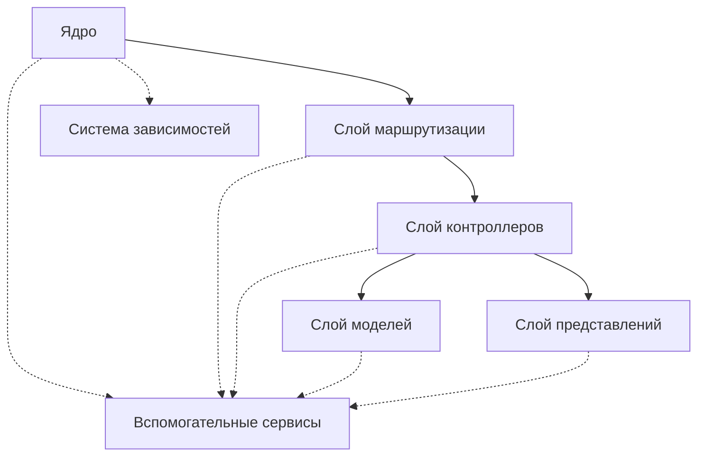
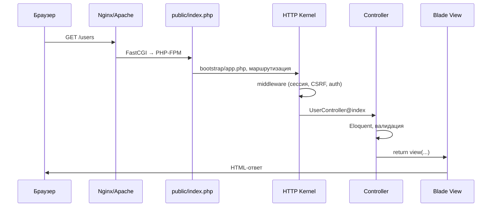

# Фреймворки и библиотеки PHP

<div class="article-tags">
  <span class="tag tag-required">ОБЯЗАТЕЛЬНО</span>
  <span class="tag tag-beginner">ДЛЯ НОВИЧКОВ</span>
</div>

<span class="complexity-badge">Разработчику</span>
<span class="complexity-badge">Архитектору</span>

## Фреймворки

### Общее о фреймворках в PHP

**Фреймворк** представляет собой **программную платформу для создания веб-приложений**. Он предоставляет разработчику готовую структуру, набор инструментов и библиотек, которые ускоряют процесс разработки и стандартизируют подход к созданию программного обеспечения.

Фреймворк организован как набор взаимосвязанных **компонентов**, которые работают вместе по определенным правилам. Основная идея заключается в том, что разработчик сосредотачивается на бизнес-логике приложения, а фреймворк берет на себя рутинные задачи: маршрутизацию запросов, работу с базой данных, обработку форм, управление сессиями и другие повторяющиеся операции.

Фреймворк состоит из нескольких ключевых **слоев**. 



В основе лежит **ядро**, которое управляет жизненным циклом приложения и координирует работу всех компонентов. Ядро запускается при каждом входящем запросе, анализирует его и передает управление соответствующему обработчику.

**Слой маршрутизации** отвечает за сопоставление входящих запросов с контроллерами. Он анализирует путь запроса, метод и другие параметры, чтобы определить, какой код должен выполниться. Маршрутизатор использует правила, заданные разработчиком, для принятия этого решения.

**Слой контроллеров** содержит бизнес-логику приложения. Контроллеры принимают запросы от маршрутизатора, взаимодействуют с моделями для получения или изменения данных, и возвращают результат в виде ответа. Каждый контроллер обычно отвечает за определенную область функциональности.

**Слой моделей** работает с данными. Модели представляют сущности предметной области и содержат логику для работы с базой данных. Они инкапсулируют правила валидации, связи между сущностями и операции с данными.

**Слой представлений** отвечает за формирование пользовательского интерфейса. Представления содержат шаблоны, которые объединяют данные от контроллеров с HTML-разметкой для создания конечной страницы, отправляемой пользователю.

**Система зависимостей** управляет подключением внешних библиотек и компонентов. Она обеспечивает автоматическую загрузку классов, разрешение зависимостей и интеграцию стороннего кода в приложение.

**Вспомогательные сервисы** предоставляют дополнительные возможности: кэширование, логирование, отправку почты, работу с файлами и другие часто используемые функции.

--

### PHP-FIG

**PHP-FIG** представляет собой группу разработчиков фреймворков и библиотек, которая создает стандарты для языка PHP. Эта организация возникла с целью улучшить совместимость между различными проектами и упростить интеграцию компонентов от разных авторов.

**Рекомендация PHP-FIG** — это официальное предложение или стандарт, разработанный этой группой. Рекомендации охватывают различные аспекты разработки на PHP: стили кода, интерфейсы, автозагрузку классов, обработку ошибок и другие технические вопросы.

PHP-FIG организована как сообщество независимых разработчиков, представляющих различные фреймворки и библиотеки. Участники группы включают авторов таких проектов, как Symfony, Laravel, Zend Framework, Drupal и многих других.

FIG — это Framework Interop Group, то самое сообщество. Группа функционирует на основе открытого сотрудничества. 

Процесс создания рекомендаций следует формальной процедуре. Предложение начинается с обсуждения проблемы или потребности в сообществе. Затем автор составляет документ с описанием проблемы и предлагаемого решения. Документ проходит несколько этапов обсуждения и голосования среди участников группы.

Голосование требует достижения консенсуса. Для принятия рекомендации необходимо получить поддержку большинства участников. После утверждения рекомендация получает статус PSR и становится официальным стандартом.

Рабочие группы занимаются специализированными областями. Некоторые участники фокусируются на вопросах код стайла, другие — на архитектурных вопросах, третьи — на безопасности. Эта специализация позволяет глубоко прорабатывать каждую тему.

Документация рекомендаций публикуется открыто и доступна всем разработчикам. Каждый стандарт сопровождается подробным описанием, примерами реализации и пояснениями по применению.

Современные PHP-фреймворки строго следуют рекомендациям PHP-FIG (Framework Interop Group), в частности PSR-стандартам (PSR-4 — автозагрузка, PSR-7 — HTTP-сообщения, PSR-11 — контейнер зависимостей, PSR-15 — обработчики промежуточного ПО и др.), что обеспечивает высокую степень совместимости компонентов как внутри одного фреймворка, так и между разными реализациями. Эта стандартизация способствовала формированию экосистемы, в которой фреймворки перестали быть «монолитными замками» и стали скорее конструкторами: разработчик может заменить маршрутизатор, ORM или шаблонизатор на альтернативный, не нарушая целостности приложения.

---

### PSR-стандарты

PSR-стандарты организованы по категориям в зависимости от решаемых задач. Каждый стандарт имеет уникальный номер и название, которое отражает его назначение. Стандарты проходят несколько этапов разработки: от черновика до утвержденного документа.

#### Стандарты код стайла

PSR-1 устанавливает базовые правила оформления кода. Он определяет требования к именованию классов, методов, констант и файлов. Стандарт требует использования пространств имен, определения одного класса в одном файле и соблюдения определенных соглашений по именованию.

PSR-2 расширяет базовые правила и добавляет требования к форматированию. Он определяет отступы, пробелы вокруг операторов, расположение фигурных скобок и другие детали оформления кода. Этот стандарт обеспечивает единообразный внешний вид кода в разных проектах.

PSR-12 представляет собой обновленную версию стандарта код стайла. Он включает все требования предыдущих стандартов и добавляет новые правила для современных возможностей языка PHP. Стандарт учитывает особенности PHP 7 и выше.

#### Стандарты автозагрузки

PSR-0 определяет стандарт автозагрузки классов для старых версий PHP. Он устанавливает правила сопоставления имен классов с путями к файлам. Стандарт требует использования определенной структуры каталогов и соглашений по именованию.

PSR-4 представляет собой современный стандарт автозагрузки. Он более гибкий и позволяет настраивать соответствие между пространствами имен и каталогами. PSR-4 поддерживает вложенность пространств имен и упрощает организацию кода в крупных проектах.

#### Стандарты контейнеров и зависимостей

PSR-11 определяет общий интерфейс для контейнеров внедрения зависимостей. Он устанавливает методы для получения объектов из контейнера и проверки их существования. Стандарт позволяет использовать разные реализации контейнеров в одном приложении.

#### Стандарты обработки запросов и ответов

PSR-7 описывает стандартные интерфейсы для работы с HTTP-сообщениями. Он определяет интерфейсы для запросов, ответов, заголовков, потоков и файлов. Стандарт обеспечивает совместимость между различными библиотеками обработки HTTP.

PSR-15 устанавливает стандарт для обработчиков запросов. Он определяет интерфейсы для мидлваров и делегатов, которые позволяют строить конвейеры обработки запросов. Стандарт поддерживает композицию обработчиков и переиспользование кода.

PSR-17 описывает фабрики для создания объектов запросов и ответов. Он определяет интерфейсы для создания различных компонентов HTTP-сообщений. Стандарт упрощает создание объектов и обеспечивает гибкость в выборе реализаций.

PSR-18 определяет стандартный интерфейс для клиентов отправки HTTP-запросов. Он устанавливает методы для выполнения запросов и обработки ответов. Стандарт позволяет легко заменять реализации клиентов без изменения кода приложения.

#### Стандарты кэширования

PSR-6 устанавливает стандартный интерфейс для кэширования. Он определяет интерфейсы для пулов кэша, элементов кэша и тегов. Стандарт поддерживает различные стратегии кэширования и позволяет легко интегрировать разные системы кэширования.

PSR-16 представляет собой простой интерфейс для кэширования. Он предлагает более легковесное решение по сравнению с PSR-6. Стандарт подходит для базовых сценариев кэширования и легок в реализации.

#### Стандарты логирования

PSR-3 определяет стандартный интерфейс для логирования. Он устанавливает методы для записи сообщений с различными уровнями важности. Стандарт поддерживает интерполяцию контекста и позволяет легко заменять реализации логгеров.

#### Стандарты событий

PSR-14 описывает стандарт для системы событий. Он определяет интерфейсы для диспетчеров событий, слушателей и самих событий. Стандарт обеспечивает слабую связанность между компонентами и поддерживает расширяемость приложений.

#### Стандарты гипермедиа

PSR-13 устанавливает интерфейсы для ссылок и гипермедиа (Hypermedia Links). Он определяет работу с ссылками и их атрибутами в RESTful API. Очереди и фоновые задачи в PHP-экосистеме решаются средствами фреймворков (Laravel Queue, Symfony Messenger), а не отдельным PSR с тем же номером.

Каждый PSR-стандарт сопровождается подробной документацией, которая включает описание интерфейсов, примеры использования и рекомендации по реализации. Стандарты постоянно обновляются для поддержки новых возможностей языка PHP и потребностей сообщества разработчиков.

---

### Компоненты фреймворка

**Компоненты фреймворка** — это отдельные модули, которые выполняют специфические задачи в рамках приложения. Каждый компонент отвечает за определенную функциональность и может использоваться независимо от других частей фреймворка.

Компоненты организованы по принципу разделения ответственности. Каждый модуль решает одну задачу и решает её хорошо. Компоненты взаимодействуют между собой через чётко определенные интерфейсы.

**Система маршрутизации** принимает входящие запросы и определяет, какой контроллер должен обработать запрос. Она анализирует путь, метод и параметры запроса, сопоставляя их с заданными правилами.

**Контроллеры** содержат логику обработки запросов. Они получают данные от маршрутизатора, взаимодействуют с моделями для получения информации, и формируют ответ. Контроллеры координируют работу между различными частями приложения.

**Модели** работают с данными приложения. Они инкапсулируют бизнес-логику, правила валидации и операции с базой данных. Модели обеспечивают доступ к данным и их изменение.

**Система представлений** формирует пользовательский интерфейс. Она использует шаблоны для объединения данных с разметкой. Представления отвечают за внешний вид приложения и формат вывода.

**Компоненты базы данных** обеспечивают соединение с хранилищем данных. Они управляют подключениями, выполняют запросы и обрабатывают результаты. Эти компоненты абстрагируют работу с конкретной СУБД.

**Система аутентификации и авторизации** управляет доступом пользователей. Она проверяет учётные данные, определяет права доступа и контролирует действия пользователей в приложении.

**Компоненты кэширования** хранят часто используемые данные в быстрой памяти. Они уменьшают нагрузку на базу данных и ускоряют отклик приложения. Кэш может работать на разных уровнях: данные, запросы, страницы.

**Система логирования** записывает события приложения. Она сохраняет информацию о запросах, ошибках и действиях пользователей. Логи помогают отслеживать работу приложения и диагностировать проблемы.

**Компоненты валидации** проверяют корректность входных данных. Они применяют правила к полям формы, проверяют форматы и ограничения. Валидация защищает приложение от некорректных данных.

**Система отправки почты** формирует и доставляет электронные сообщения. Она поддерживает шаблоны писем, вложения и различные транспорты доставки.

---

### Промежуточное ПО

**Промежуточное ПО** — это слой программного обеспечения, который обрабатывает запросы и ответы между клиентом и сервером. Оно выполняет дополнительные действия до передачи запроса основному обработчику или после формирования ответа.

Промежуточное ПО организовано в виде **конвейера обработки**. Каждый слой принимает запрос, выполняет свою задачу, и передаёт запрос следующему слою. После обработки основным кодом ответ проходит обратный путь через те же слои в обратном порядке.

**Аутентификационное ПО** проверяет учётные данные пользователя. Оно анализирует заголовки запроса, куки или токены, и определяет, имеет ли пользователь доступ к запрашиваемому ресурсу. При успешной проверке оно добавляет информацию о пользователе в контекст запроса.

**ПО авторизации** контролирует права доступа. Оно проверяет, разрешено ли пользователю выполнять запрашиваемое действие. Авторизация работает на основе ролей, разрешений или политик доступа.

**ПО валидации** проверяет корректность входных данных. Оно анализирует параметры запроса, тело сообщения и заголовки на соответствие заданным правилам. При обнаружении ошибок оно формирует ответ с описанием проблем.

**ПО логирования** записывает информацию о запросах. Оно сохраняет данные о времени, методе, пути, статусе ответа и других метриках. Логи используются для мониторинга, анализа и отладки.

**ПО обработки ошибок** перехватывает исключения и формирует структурированные ответы. Оно преобразует внутренние ошибки в понятные сообщения для клиента. Обработчик ошибок может выполнять дополнительные действия: запись в лог, отправку уведомлений.

**ПО кэширования** сохраняет результаты обработки запросов. Оно проверяет, есть ли в кэше ответ на текущий запрос, и при наличии возвращает его без выполнения основной логики. Кэширование ускоряет отклик приложения.

**ПО сжатия** уменьшает размер передаваемых данных. Оно применяет алгоритмы сжатия к телу ответа, что снижает объём трафика и ускоряет передачу. Сжатие работает прозрачно для клиента и сервера.

**ПО заголовков** добавляет или изменяет заголовки запросов и ответов. Оно может устанавливать кросс-доменные заголовки, политики безопасности, кэширования и другие метаданные.

**ПО ограничения скорости** контролирует частоту запросов. Оно отслеживает количество обращений от клиента и блокирует запросы, превышающие установленный лимит. Ограничение скорости защищает сервер от перегрузки.

---

### Зависимости

**Зависимость** — это объект или сервис, который требуется другому объекту для выполнения его функций. 

**Контейнер** — это система, которая управляет созданием и внедрением зависимостей в объекты приложения.

**Контейнер внедрения зависимостей** строится на принципе инверсии управления. Вместо того чтобы объекты создавали свои зависимости самостоятельно, контейнер предоставляет их извне. Это упрощает тестирование и изменение поведения компонентов. 

**Реестр сервисов** хранит определения всех доступных зависимостей. Он содержит информацию о типах, способах создания и жизненном цикле каждого сервиса. Реестр позволяет находить сервисы по их интерфейсам или именам.

**Фабрика создания объектов** отвечает за инстанцирование зависимостей. Она анализирует определения сервисов и создаёт экземпляры с необходимыми параметрами. Фабрика может использовать различные стратегии создания: конструкторы, статические методы, делегаты.

**Резолвер зависимостей** определяет, какие зависимости требуются для создания объекта. Он анализирует конструкторы, свойства и методы, чтобы собрать полный граф зависимостей. Резолвер рекурсивно разрешает вложенные зависимости.

**Система жизненного цикла** управляет временем жизни созданных объектов. Она поддерживает различные режимы: одиночка, временный, ограниченный по области видимости. Жизненный цикл определяет, когда объект создаётся, используется и уничтожается.

**Конфигурация контейнера** задаёт правила регистрации сервисов. Она определяет соответствие между интерфейсами и реализациями, параметры создания и зависимости. Конфигурация может задаваться программно или через файлы.

**Автоматическое связывание** определяет зависимости на основе анализа типов. Контейнер может автоматически находить подходящие реализации для интерфейсов без явной регистрации. Связывание упрощает настройку контейнера.

**Кэш одиночек** хранит экземпляры сервисов с жизненным циклом "один на приложение". Он возвращает один и тот же объект при каждом запросе, что экономит ресурсы и обеспечивает согласованность состояния.

**Система проверки зависимостей** анализирует граф зависимостей на наличие циклов и отсутствующих сервисов. Она проверяет корректность конфигурации до начала работы приложения. Проверка помогает обнаружить ошибки на раннем этапе.

**Автозагрузчик классов** находит и подключает файлы с определениями классов. Он сопоставляет имена классов с путями к файлам и загружает их по требованию. Автозагрузчик упрощает управление большим количеством классов.

---

## Symfony

Краткий обзор в [Экосистема PHP-приложений](./10.md). Учебный трек: [Symfony](./144.md) · [Первая программа на Symfony](./1441.md) · [Справочник](./1442.md).

## WordPress и тестирование

- [WordPress](./146.md) · [Первая тема](./1461.md)
- [PHPUnit и тестирование PHP](./145.md)

---

## Laravel

### О фреймворке

**Laravel**, представленный Тейлором Отвеллом в 2011 году, стал переломным моментом в восприятии PHP как языка для создания сложных, элегантных и поддерживаемых приложений. 

До появления Laravel многие разработчики ассоциировали PHP с «спагетти-кодом», отсутствием структуры и низким качеством инженерных решений. Laravel же продемонстрировал, что PHP способен быть основой для приложений, построенных по принципам, характерным для более «молодых» экосистем — таких как Ruby on Rails или Django.

Архитектурно Laravel следует классическому **MVC (Model–View–Controller)**, но расширяет его за счёт глубокой интеграции сервис-контейнера, middleware-стека и event-driven подхода. 

Ядро фреймворка построено на компонентах **Symfony** (HttpFoundation, HttpKernel, Console, Translation и др.), что обеспечивает стабильность и совместимость с широким спектром инструментов, но при этом оформляет их в единую, логически связанную систему с собственным API и конфигурационной моделью.

### Жизненный цикл HTTP-запроса

Упрощённая цепочка для типичного Laravel-приложения:



1. Веб-сервер отдаёт только каталог **`public/`** — единственная точка входа для HTTP.
2. **`public/index.php`** подключает автозагрузчик Composer и приложение из **`bootstrap/app.php`** (в Laravel 11+ конфигурация маршрутов, middleware и исключений часто задаётся прямо здесь).
3. **HTTP Kernel** прогоняет цепочку **middleware**, затем вызывает **контроллер** или замыкание маршрута.
4. Контроллер работает с **Eloquent**, сервисами из **контейнера** и возвращает **Response** (HTML через Blade, JSON для API, редирект).
5. Ответ уходит клиенту; процесс PHP-FPM завершается (классическая модель «один запрос — один процесс»), если не используется Octane/RoadRunner.

---

### Пример структуры (Laravel 11+)

Скелет приложения стал компактнее: меньше «обязательных» файлов в `app/`, больше настроек в `bootstrap/app.php` и `routes/`.

```
project-root/
├── app/
│   ├── Http/
│   │   └── Controllers/
│   ├── Models/
│   └── Providers/          # при необходимости
├── bootstrap/
│   ├── app.php             # создание Application, маршруты, middleware
│   └── providers.php
├── config/
├── database/
│   ├── factories/
│   ├── migrations/
│   └── seeders/
├── public/
│   └── index.php           # единственная публичная точка входа
├── resources/
│   ├── css/
│   ├── js/
│   └── views/              # шаблоны Blade
├── routes/
│   ├── web.php
│   ├── api.php
│   └── console.php
├── storage/                # логи, кэш, загрузки (не в git)
├── tests/
├── vendor/
├── .env
├── artisan
├── composer.json
├── package.json
└── vite.config.js          # сборка фронтенда (по умолчанию Vite)
```

| Каталог / файл | Назначение |
|----------------|------------|
| **app/** | Бизнес-логика: контроллеры, модели, сервисы, Form Request, политики |
| **bootstrap/** | Сборка приложения при старте |
| **routes/** | URL → обработчик; разделение web / api / console |
| **resources/views** | Blade-шаблоны |
| **database/migrations** | Версионирование схемы БД в коде |
| **storage/** | Writable-данные runtime (кэш представлений, сессии в file-драйвере) |
| **vendor/** | Зависимости Composer (не редактируют вручную) |

---

### Маршруты, контроллер и валидация

Маршруты в **`routes/web.php`** (или в `bootstrap/app.php`) связывают URL с кодом:

```php
use App\Http\Controllers\ProfileController;
use Illuminate\Support\Facades\Route;

Route::get('/profile', [ProfileController::class, 'show'])->middleware('auth');
Route::put('/profile', [ProfileController::class, 'update'])->middleware('auth');
```

Контроллер остаётся тонким — принимает уже проверенный ввод:

```php
namespace App\Http\Controllers;

use App\Http\Requests\UpdateProfileRequest;
use Illuminate\Http\RedirectResponse;

class ProfileController extends Controller
{
    public function update(UpdateProfileRequest $request): RedirectResponse
    {
        $request->user()->update($request->validated());
        return redirect()->route('profile.show')->with('status', 'Сохранено');
    }
}
```

**Form Request** (`app/Http/Requests/UpdateProfileRequest.php`) инкапсулирует правила валидации и авторизацию действия — вместо ручной проверки `$_POST` в одном файле:

```php
public function rules(): array
{
    return [
        'name' => ['required', 'string', 'max:255'],
        'email' => ['required', 'email', 'max:255'],
    ];
}
```

Для API тот же контроллер может возвращать **API Resource** или `JsonResponse`; маршруты обычно лежат в **`routes/api.php`** с префиксом `/api` и middleware `auth:sanctum` или Passport.

---

### Eloquent, миграции и фабрики

**Миграция** описывает изменение схемы:

```php
Schema::create('posts', function (Blueprint $table) {
    $table->id();
    $table->foreignId('user_id')->constrained()->cascadeOnDelete();
    $table->string('title');
    $table->text('body');
    $table->timestamps();
});
```

**Модель** и связь «один ко многим»:

```php
class User extends Model
{
    public function posts(): HasMany
    {
        return $this->hasMany(Post::class);
    }
}

// Жадная загрузка — без N+1 запросов
$users = User::with('posts')->paginate(15);
```

Миграции и сиды:

```bash
php artisan migrate
php artisan db:seed
```

**Factories** и **Seeders** генерируют тестовые данные для локальной разработки и PHPUnit.

---

### Blade, Vite и фронтенд

Blade компилируется в PHP и кэшируется в `storage/framework/views`. Вывод `{{ $title }}` экранируется по умолчанию; сырой HTML — только через `{!! !!}` и только для доверенного контента.

Фронтенд подключают через **Vite** (`@vite(['resources/css/app.css', 'resources/js/app.js'])` в layout). Старый **Laravel Mix** (Webpack) в новых проектах не используют.

---

### Artisan, очереди и планировщик

**Artisan** — CLI поверх Symfony Console:

```bash
php artisan make:model Post -mfs   # модель + миграция + factory + seeder
php artisan queue:work             # воркер очереди
php artisan schedule:run           # вызывается из cron раз в минуту
```

| Задача | Механизм |
|--------|----------|
| Фоновая отправка писем | Job + `ShouldQueue`, драйвер Redis/database |
| Кэш, сессии | `config/cache.php`, Redis или file |
| Повторяющиеся задачи | `routes/console.php` или `app/Console/Kernel.php` (в старых версиях) + cron → `schedule:run` |

**Horizon** (Redis) даёт UI для мониторинга очередей; **Telescope** — отладка запросов, SQL, mail (только dev/staging).

---

### Аутентификация в двух словах

| Сценарий | Пакет |
|----------|--------|
| SPA + same-site cookie, мобильное API «свой фронт» | **Laravel Sanctum** |
| OAuth2-сервер, сторонние клиенты | **Laravel Passport** |
| Breeze / Jetstream | Готовые UI + регистрация, 2FA (Jetstream) |

Пароли хранят через встроенный хеш (`Hash::make` / cast `hashed` на поле модели), не MD5 и не SHA без соли.

---

### Когда выбирать Laravel

Подходит, если нужны быстрый старт, единые соглашения, богатая экосистема пакетов (Spatie, Livewire, Filament) и предсказуемые релизы (мажор раз в год, LTS-подобная поддержка предыдущей версии). Менее уместен для минимального micro-API «в три файла» — там чаще **Slim** или чистые Symfony-компоненты; для жёсткого enterprise-DDD с тяжёлой конфигурацией иногда предпочитают **Symfony** напрямую.

---

### Установка и распространение Laravel

Laravel распространяется как:
- **Open-source проект** под лицензией MIT
- **Composer package** через репозиторий Packagist
- **GitHub репозиторий** (исходный код доступен для изучения и внесения изменений)

Соответственно, и установить его можно одним из трёх способов.

**Через Composer (рекомендуемый способ):**

```bash
composer create-project laravel/laravel project-name
```

**Через Laravel Installer:**

```bash
composer global require laravel/installer
laravel new project-name
```

**Через Git:**

```bash
git clone https://github.com/laravel/laravel.git project-name
cd project-name
composer install
```

**Требования к окружению** (уточняйте на [laravel.com/docs](https://laravel.com/docs) для вашей версии)

- PHP **8.2+** (Laravel 11), **8.3+** (Laravel 12)
- Composer 2.x
- Расширения: BCMath, Ctype, Fileinfo, JSON, Mbstring, OpenSSL, PDO, Tokenizer, XML
- Для очередей и кэша: **Redis** (рекомендуется), PCNTL для `queue:work`
- Node.js — для сборки ассетов через Vite (`npm run dev` / `npm run build`)

---

### Компоненты Laravel

**Ядро фреймворка:**

- **Service Container** - система управления зависимостями и внедрения зависимостей
- **Service Providers** - загрузка компонентов приложения
- **Facades** - статический интерфейс к классам в контейнере
- **Contracts** - интерфейсы для основных компонентов

**Работа с базами данных:**

- **Eloquent ORM** - объектно-реляционное отображение
- **Query Builder** - построитель запросов
- **Migrations** - управление схемой базы данных
- **Seeders** - заполнение базы тестовыми данными
- **Factories** - генерация тестовых данных
- **Database Transactions** - управление транзакциями

**Маршрутизация и обработка запросов:**

- **Router** - определение маршрутов
- **Middleware** - фильтрация запросов
- **Request Validation** - валидация входных данных
- **Response Handling** - формирование ответов
- **Session Management** - управление сессиями

**Представления и шаблонизация:**

- **Blade Templating Engine** - система шаблонов
- **View Components** - переиспользуемые компоненты представлений
- **Layouts & Sections** - наследование шаблонов
- **Localization** - интернационализация

**Аутентификация и авторизация:**

- **Authentication** - система аутентификации пользователей
- **Authorization** - политики и права доступа
- **Password Reset** - восстановление пароля
- **Email Verification** - подтверждение почты

**Очереди и фоновые задачи:**

- **Queue System** - управление очередями задач
- **Job Classes** - классы фоновых задач
- **Failed Jobs** - обработка неудачных задач
- **Scheduler** - планировщик задач

**Кэширование:**

- **Cache System** - многоуровневое кэширование
- **Cache Drivers** - поддержка различных драйверов (Redis, Memcached, файлы)

**Почта и уведомления:**

- **Mail System** - отправка электронной почты
- **Notifications** - система уведомлений (почта, SMS, Slack)
- **Mailable Classes** - классы для формирования писем

**Файловая система:**

- **File Storage** - абстракция файловой системы
- **File Uploads** - загрузка файлов
- **Storage Drivers** - поддержка локального хранилища, S3, FTP

**API и интеграции:**

- **API Resources** - преобразование данных для API
- **Rate Limiting** - ограничение количества запросов
- **CORS Support** - поддержка CORS
- **Passport** - OAuth2 сервер (опционально)
- **Sanctum** - легковесная аутентификация API

**Тестирование:**

- **PHPUnit Integration** - интеграция с PHPUnit
- **HTTP testing** - тестирование HTTP-запросов
- **Browser testing** - тестирование в браузере (Laravel Dusk)
- **Mocking** - создание моков

**Разработка и отладка:**

- **Artisan CLI** - консольные команды
- **Tinker** - интерактивная консоль
- **Log System** - система логирования
- **Debugging Tools** - инструменты отладки
- **Telescope** - инструмент отладки (опционально)

**Вспомогательные компоненты:**

- **Events & Listeners** - система событий
- **Broadcasting** - широковещательные события
- **Helpers** - вспомогательные функции
- **Collections** - расширенные коллекции данных
- **String & Array Helpers** - работа со строками и массивами

Одним из центральных элементов Laravel является **Eloquent ORM** — реализация паттерна *Active Record*, сочетающая простоту использования с мощными возможностями: ленивая и жадная загрузка связей, мутаторы и аксессоры, события жизненного цикла модели, глобальные scope’ы, поддержка полиморфных отношений и многое другое. Eloquent позволяет работать с базой данных на уровне объектов, не жертвуя при этом возможностью выполнения «сырых» SQL-запросов в случаях, когда требуется максимальная производительность или сложная логика агрегации.

Маршрутизация в Laravel реализована декларативно: маршруты описываются в виде вызовов методов (например, `Route::get('/users', [UserController::class, 'index'])`), могут группироваться по префиксам, middleware, доменам, версиям API. Встроенный механизм middleware обеспечивает чёткое разделение кросс-функциональных задач — аутентификации, логирования, проверки CSRF-токенов, ограничения частоты запросов (rate limiting) — от основной логики обработчика.

Шаблонизация осуществляется через **Blade** — компилируемый шаблонизатор, расширяющий стандартный HTML директивами (`@if`, `@foreach`, `@include`, `@yield`). Blade поддерживает наследование шаблонов, компоненты (в том числе с атрибутами и слотами), автоматическое экранирование вывода по умолчанию — что значительно снижает риски XSS-уязвимостей.

Особое внимание в Laravel уделено developer experience (DX). Среди ключевых инструментов:
- **Artisan** — CLI-интерфейс для генерации кода (контроллеры, модели, миграции, тесты), запуска миграций, сброса кэша, управления очередями и выполнения пользовательских команд.
- **Migrations и Seeders** — механизм управления схемой базы данных в виде кода (infrastructure as code), позволяющий отслеживать изменения структуры во времени и воспроизводить окружение на разных машинах.
- **Тестирование** — встроенная поддержка PHPUnit с удобными хелперами для HTTP-тестирования, тестирования базы данных, имитации событий и очередей.
- **Queue и Horizon** — система фоновой обработки задач с поддержкой различных драйверов (Redis, Beanstalkd, SQS) и веб-интерфейсом для мониторинга.
- **Vite** — сборка CSS/JS по умолчанию в новых приложениях.
- **Laravel Sanctum / Passport** — аутентификация API и SPA.
- **Laravel Octane** — долгоживущие воркеры (Swoole/RoadRunner) для высокой нагрузки.

Мажорные версии выходят примерно раз в год: Laravel 10 — улучшенная типизация в стабах, Laravel 11 — упрощённый скелет и `bootstrap/app.php`, Laravel 12 — актуальный LTS-цикл совместимости с новыми версиями PHP. Перед апгрейдом смотрите официальный **upgrade guide** для каждого мажорного релиза.

Фреймворк особенно популярен в стартап-среде, при создании SaaS-продуктов, внутренних корпоративных систем и API-сервисов. Его экосистема включает такие проекты, как **Laravel Nova** (админ-панель «из коробки»), **Laravel Vapor** (серверлесс-хостинг на AWS), **Pest** (альтернативный фреймворк для тестирования) и множество пакетов сообщества (Spatie, Laravel-Collective и др.).

---

## Symfony

### Основы Symfony

**Symfony** — это набор переиспользуемых PHP-компонентов и полнофункциональный веб-фреймворк для создания веб-приложений, микросервисов, консольных приложений и API. Фреймворк следует принципам инверсии зависимостей, слабой связанности компонентов и соответствует стандартам разработки (PSR).

Symfony существует в двух основных формах:
- **Компоненты Symfony** — независимые библиотеки, которые можно использовать по отдельности в любых проектах
- **Фреймворк Symfony** — полноценное приложение, построенное на базе этих компонентов

### Компоненты фреймворка Symfony

**Ядро и инфраструктура:**

- **HttpFoundation** — объектно-ориентированное представление запросов и ответов
- **HttpKernel** — преобразование запроса в ответ, обработка исключений
- **DependencyInjection** — контейнер внедрения зависимостей
- **EventDispatcher** — система событий и слушателей
- **Console** — создание консольных команд
- **Config** — обработка конфигурационных файлов
- **Dotenv** — загрузка переменных окружения из .env файлов

**Работа с базами данных:**

- **Doctrine DBAL** — абстрактный уровень доступа к базам данных
- **Doctrine ORM** — объектно-реляционное отображение
- **Migrations** — управление миграциями базы данных
- **Cache** — система кэширования с поддержкой различных адаптеров

**Маршрутизация и контроллеры:**

- **Routing** — определение маршрутов и генерация URL
- **FrameworkBundle** — основная функциональность фреймворка
- **Controller** — базовые классы контроллеров

**Шаблонизация и представления:**

- **Twig** — шаблонизатор (интегрируется через отдельный компонент)
- **Asset** — управление статическими ресурсами
- **WebProfilerBundle** — панель отладки

**Безопасность:**

- **Безопасность** — аутентификация и авторизация
- **PasswordHasher** — хеширование паролей
- **Guard** — гибкая система аутентификации

**Валидация и сериализация:**

- **Validator** — система валидации данных
- **Serializer** — сериализация и десериализация объектов
- **PropertyAccess** — доступ к свойствам объектов через строки

**Формы и пользовательский ввод:**

- **Form** — создание и обработка форм
- **OptionsResolver** — управление опциями конфигурации

**Файловая система и ресурсы:**

- **Filesystem** — операции с файловой системой
- **Finder** — поиск файлов и директорий
- **Mime** — определение типов файлов

**Сетевые компоненты:**

- **HttpClient** — HTTP-клиент для выполнения запросов
- **Mailer** — отправка электронной почты
- **Notifier** — система уведомлений (почта, SMS, Slack)
- **Messenger** — система обмена сообщениями и очередей

**Утилиты и вспомогательные компоненты:**

- **Process** — выполнение внешних процессов
- **VarDumper** — расширенный дамп переменных
- **Debug** — инструменты отладки
- **Translation** — интернационализация и локализация
- **Uid** — генерация уникальных идентификаторов (UUID, ULID)
- **String** — работа со строками
- **DomCrawler** — парсинг HTML и XML

---

### Установка Symfony

**Требования к окружению:**

- PHP `>=` 8.1 (рекомендуется 8.2+)
- Composer
- Расширения: ctype, iconv, json, pcre, session, tokenizer, xml, mbstring

#### Методы установки

**Через Symfony CLI (рекомендуемый способ):**

```bash
# Установка Symfony CLI
curl -sS https://get.symfony.com/cli/installer | bash

# Создание нового проекта
symfony new project-name --version="6.4.*"
symfony new project-name --webapp  # с полным стеком
```

**Через Composer:**

```bash
# Создание проекта с минимальным набором
composer create-project symfony/skeleton project-name

# Создание проекта с полным стеком
composer create-project symfony/website-skeleton project-name
```

---

### Структура проекта

```
project-root/
├── bin/
│   └── console
├── config/
│   ├── packages/
│   ├── routes/
│   ├── bundles.php
│   └── services.yaml
├── public/
│   └── index.php
├── src/
│   ├── Controller/
│   ├── Entity/
│   ├── Repository/
│   └── Kernel.php
├── templates/
├── translations/
├── var/
│   ├── cache/
│   └── log/
├── vendor/
├── .env
├── composer.json
└── symfony.lock
```

---

### Запуск приложения

**Через Symfony CLI:**

```bash
cd project-name
symfony server:start
```

**Через встроенный сервер PHP** (для быстрой проверки без Symfony CLI):

```bash
php -S localhost:8000 -t public/
```

### Распространение

Symfony распространяется как:
- **Open-source проект** под лицензией MIT
- **Composer packages** через репозиторий Packagist
- **GitHub репозитории** для каждого компонента и основного фреймворка

Каждый компонент может быть установлен отдельно через Composer, что позволяет использовать только необходимые части в проектах.

---

### Влияние и особенности Symfony

Его влияние выходит далеко за рамки одноимённого full-stack решения: значительная часть современных PHP-инструментов — включая Laravel, Drupal 8+, API Platform, Magento 2 и даже часть компонентов WordPress (через внешние интеграции) — опирается на **Symfony Components**, набор независимых, переиспользуемых библиотек, соответствующих PSR-стандартам и спроектированных по принципу «разделяй и властвуй».

Изначально Symfony позиционировался как альтернатива «хаотичному» подходу, господствовавшему в PHP-разработке середины 2000-х. Его архитектура была вдохновлена Java- и .NET-мировыми практиками — строгая типизация (до появления скалярных типов в PHP 7 это достигалось через DocBlock и инструменты вроде PHPStan), внедрение зависимостей на уровне контейнера, конфигурация через YAML/XML/PHP, многоуровневая система кэширования, поддержка internationalization и localization «из коробки». Это сделало Symfony предпочтительным выбором для государственных проектов, банковских систем, крупных e-Торговля-платформ и других решений, где критичны предсказуемость, аудируемость и долгосрочная поддержка.

В отличие от Laravel, где многое «работает из коробки», Symfony по умолчанию даёт *минимальный каркас*, требующий явной настройки. Это сознательный дизайн-решение: разработчик получает полный контроль над тем, какие компоненты включены и как они взаимодействуют. Такой подход позволяет избежать «мёртвого веса» — загрузки ненужных сервисов в runtime, что особенно ценно при создании высоконагруженных API или микросервисов.

Ядро Symfony — **HttpKernel** — реализует паттерн *front controller* и управляет жизненным циклом запроса через цепочку событий (EventDispatcher). Каждый этап обработки (получение запроса, маршрутизация, вызов контроллера, обработка ответа, отправка клиенту) может быть перехвачен и модифицирован с помощью подписчиков событий. Это обеспечивает гибкость, недостижимую при жёстко зашитой последовательности вызовов.

Маршрутизация в Symfony декларативна и может задаваться как в аннотациях (через `#[Route]`), так и в отдельных файлах конфигурации (YAML, XML, PHP). Маршруты поддерживают параметры с ограничениями (requirements), условия (host, метод, заголовки), локализацию и генерацию URL по имени. Механизм *route enhancers* позволяет динамически модифицировать маршрут перед передачей контроллеру.

Контроллеры в Symfony — это обычные PHP-классы, методы которых возвращают объект `Response`. Внедрение зависимостей осуществляется через конструктор или параметры метода (autowiring), при этом контейнер сервисов (на базе `symfony/dependency-injection`) строится во время компиляции, что минимизирует накладные расходы в runtime. Сервисы по умолчанию приватны и синглтонны, но могут быть настроены как публичные, прототипы или с ограниченным временем жизни.

ORM в экосистеме Symfony — **Doctrine ORM** — является реализацией паттерна *Data Mapper*, в отличие от *Active Record*, применённого в Eloquent. Это означает, что сущности (entities) не содержат логики доступа к базе данных: вместо этого отдельный менеджер объектов (EntityManager) отслеживает изменения, строит запросы и управляет транзакциями. Doctrine поддерживает сложные сценарии: наследование сущностей, отложенная загрузка связей (proxy-объекты), события жизненного цикла, DQL (Domain Query Language), миграции через `doctrine/migrations`. Такой подход обеспечивает более высокую степень разделения ответственности и удобен при работе с большими, сложными доменными моделями, но требует более глубокого понимания и больше шаблонного кода.

Symfony предоставляет развитую систему форм (`symfony/form`), включающую валидацию (на базе `symfony/validator` с поддержкой constraint-аннотаций), CSRF-защиту, преобразование данных, вложенные формы и интеграцию с Doctrine. Это особенно полезно при создании административных панелей или сложных пользовательских интерфейсов с множеством полей и правил ввода.

Ключевое преимущество Symfony — **стабильность и предсказуемость жизненного цикла**. Major-версии выходят раз в два года (например, Symfony 6.0 — ноябрь 2021, Symfony 7.0 — ноябрь 2023), каждая поддерживается три года (два года основной поддержки + один год Безопасность fixes). Это позволяет планировать долгосрочные проекты без риска резкого устаревания зависимостей. Кроме того, Symfony строго следует семантическому версионированию: обратная совместимость гарантирована в пределах одного major-релиза, а изменения, ломающие совместимость, вносятся только в новых major-версиях — и всегда с подробной миграционной документацией.

Современный Symfony развивается в двух направлениях:
1. **Full-stack framework** — для создания монолитных приложений с полным стеком (контроллеры, шаблоны, формы, сессии).
2. **Microkernel / API-first подход** — через `symfony/flex` и `symfony/runtime`, позволяющие собрать минимальное приложение из отдельных компонентов (например, только `http-kernel`, `routing`, `serializer`, `validator`) без необходимости подключать весь фреймворк.

Таким образом, Symfony остаётся *архитектурным фундаментом* PHP-мира: даже если разработчик не использует «Symfony приложение» напрямую, он, скорее всего, взаимодействует с его компонентами — через Laravel, через Composer-зависимости или через инструменты командной строки (например, `symfony/console` лежит в основе почти всех CLI-утилит в PHP).

---

## Другие фреймворки

### CodeIgniter

CodeIgniter — один из старейших активно поддерживаемых PHP-фреймворков (первый релиз — 2006 год), изначально созданный для разработчиков, которым требовалась простая, быстрая и понятная альтернатива «тяжёлым» решениям вроде Zend Framework 1 или Symfony 1. Его философия выражена в трёх принципах: **малый размер**, **быстрая скорость работы**, **простота освоения**.

В отличие от Laravel и Symfony, CodeIgniter не навязывает строгой архитектуры MVC — он *поддерживает* её, но позволяет свободно отступать: контроллеры могут напрямую работать с базой данных, модели не обязательны, шаблонизация может быть реализована как вручную, так и через встроенный (очень лёгкий) парсер. Это делает фреймворк особенно привлекательным для:
- небольших сайтов и лендингов,
- прототипирования и MVP,
- поддержки legacy-проектов, где требуется минимальная модернизация,
- разработчиков с ограниченным опытом, которым важна предсказуемость и отсутствие «магии».

Архитектура CodeIgniter 4 (текущая стабильная версия, полностью переписанная по сравнению с CodeIgniter 3) основана на namespace’ах, PSR-4 автозагрузке, строгой типизации (где возможно) и современном PHP (требуется 8.1+). Однако даже в четвёртой версии сохранён ключевой принцип: **фреймворк не скрывает PHP**, а дополняет его. Нет сложных контейнеров зависимостей (встроенный DI-контейнер присутствует, но используется сдержанно), нет глубокой интеграции ORM (вместо этого — Query Builder и простой ActiveRecord-подобный класс `Model`), нет слоя абстракции над сессиями или куками — всё работает через нативные механизмы с минимальной обёрткой.

Маршрутизация в CodeIgniter 4 реализована через файл `Routes.php`, где определяются пути и соответствующие контроллеры/методы. Поддерживаются REST-конвенции, параметры, регулярные выражения, группы маршрутов и фильтры (аналог middleware). Фильтры могут применяться до или после выполнения контроллера и используются для аутентификации, CORS, логирования и т.п.

Работа с базой данных осуществляется через **Query Builder** — fluent-интерфейс для построения SQL-запросов без риска инъекций (все значения автоматически экранируются). Для простых сценариев можно использовать класс `Model`, наследуемый от `CodeIgniter\Model`, который предоставляет методы `find()`, `save()`, `delete()` и поддерживает базовые отношения (has-one, has-many). ORM в привычном понимании отсутствует — и это сознательный выбор: авторы считают, что для большинства задач, решаемых с помощью CodeIgniter, полноценный ORM избыточен и замедляет разработку.

Кэширование, сессии, отправка почты, работа с файлами, валидация — все эти функции реализованы через **библиотеки (libraries)** и **хелперы (helpers)**. Библиотеки — это классы, инстанцируемые по требованию (например, `Email`, `Session`, `CURLRequest`). Хелперы — это наборы глобальных функций (например, `url_helper`, `form_helper`), которые подключаются явно и не засоряют глобальное пространство имён по умолчанию. Такой подход снижает порог входа: разработчик может использовать только то, что ему нужно, без изучения сложных концепций.

Производительность CodeIgniter остаётся одним из его главных достоинств. Минимальный оверхед, отсутствие компиляции шаблонов (если не используется `view()` с переменными), простой автозагрузчик — всё это позволяет фреймворку демонстрировать время ответа, близкое к «чистому» PHP-скрипту. Это особенно ценно на хостингах с ограничениями по памяти и CPU, а также в условиях высокой конкуренции за ресурсы (shared hosting).

CodeIgniter не претендует на лидерство в enterprise-сегменте, но сохраняет устойчивую нишу там, где важны скорость старта, низкая сложность и стабильность. Его сообщество, хотя и меньше, чем у Laravel, активно поддерживает документацию, пишет расширения и участвует в развитии ядра. Фреймворк особенно популярен в Юго-Восточной Азии, Латинской Америке и среди фрилансеров, работающих на международном рынке.

---

### Yii / Yii2

Yii (произносится как *«йи»*, от *Yes It Is!*) — фреймворк, созданный в 2008 году Цяньминь Цяном и с самого начала ориентированный на **высокую производительность**, **безопасность по умолчанию** и **максимальную автоматизацию рутинных задач**. Его вторая версия, Yii2 (выпущена в 2014 году), стала значительным шагом вперёд: полная переработка кодовой базы, переход на namespace’ы, поддержка Composer, строгая типизация (в пределах возможностей PHP 5.4–7.x), интеграция с Bootstrap и соответствие PSR-стандартам.

Архитектурно Yii2 следует классическому MVC, но с рядом особенностей, отражающих его инженерную направленность. Ядро построено вокруг понятия **компонента (component)** — класса, реализующего `yii\base\Component`, что позволяет ему поддерживать свойства, события и поведения (behaviors). Поведения — это механизм горизонтального расширения функциональности объектов без наследования: например, к модели можно «прикрепить» поведение `TimestampBehavior`, чтобы автоматически заполнять поля `created_at` и `updated_at` при сохранении. Это снижает дублирование кода и облегчает повторное использование логики.

Один из наиболее заметных инструментов Yii2 — **Gii**, генератор кода с веб-интерфейсом. Gii способен создавать:
- контроллеры и действия по шаблонам (CRUD, REST),
- модели на основе таблиц базы данных (с учётом типов, ограничений, связей),
- модули, виджеты, миграции,
- даже расширенные формы с валидацией и JavaScript-поддержкой.

Генерация не ограничивается «заготовками»: Gii анализирует структуру БД (через Doctrine DBAL или нативные драйверы), извлекает комментарии к столбцам, учитывает внешние ключи, и на основе этого строит полноценные классы с аннотациями, валидационными правилами и метаданными. При этом сгенерированный код остаётся человекочитаемым и легко модифицируемым — в отличие от «чёрных ящиков», которые невозможно изменить без потери совместимости с генератором. Это делает Yii2 особенно эффективным при работе с legacy-базами данных или при быстрой разработке внутренних инструментов (админки, отчёты, dashboards).

ORM в Yii2 — **Active Record**, но реализованный глубже и гибче, чем в Laravel. Модель не просто инкапсулирует строку таблицы: она поддерживает сложные отношения (через `hasOne()`, `hasMany()`, `via()`, `link()`), ленивую и жадную загрузку, сценарии валидации, события (`beforeSave`, `afterFind` и др.), транзакции на уровне модели. Запросы строятся через fluent-интерфейс (`User::find()->where(['status' => 1])->orderBy('name')->all()`), который компилируется в оптимизированный SQL. Важно, что ActiveRecord в Yii2 не прячет SQL полностью: при необходимости можно легко перейти к Query Builder или выполнить «сырой» запрос через `createCommand()`.

Безопасность в Yii2 интегрирована на уровне фреймворка:
- CSRF-токены включены по умолчанию для всех POST-запросов,
- автоматическое экранирование в шаблонах (через `Html::encode()`),
- валидация данных с поддержкой кастомных валидаторов и условных правил,
- role-based access control (RBAC) с иерархическими ролями и правилами,
- защита от SQL-инъекций, XSS, XSRF, clickjacking и других уязвимостей на уровне компонентов (например, `yii\web\Request` фильтрует входные данные).

Маршрутизация в Yii2 гибка: поддерживается как *path*-стиль (`/user/view/123`), так и *query*-стиль (`?r=user/view&id=123`), возможна настройка правил через регулярные выражения, параметры могут передаваться в контроллер как аргументы метода. RESTful API создаётся почти «из коробки» с помощью `yii\rest\ActiveController` — одного класса достаточно для реализации полного CRUD с пагинацией, сортировкой и фильтрацией.

Yii2 предлагает два основных набора шаблонов:
- **Basic Application Template** — для небольших проектов и быстрого старта,
- **Advanced Application Template** — для enterprise-сценариев, разделяющий frontend, backend и common-часть (модели, компоненты), что облегчает поддержку многоуровневых приложений (например, публичный сайт + админка + API).

Производительность Yii2 остаётся одной из лучших среди full-stack фреймворков. Минимизация вызовов, кэширование метаданных классов, оптимизированный автозагрузчик, отсутствие «тяжёлых» абстракций в критических путях — всё это позволяет Yii2 эффективно работать даже на серверах с ограниченными ресурсами. Фреймворк часто выбирают для высоконагруженных проектов в Азии (Китай, Индонезия), где требования к скорости отклика и стоимости инфраструктуры особенно высоки.

Yii3 находится в стадии разработки и знаменует переход к компонентной архитектуре, ближе к подходу Symfony: ядро будет состоять из независимых пакетов (`yiisoft/router`, `yiisoft/db`, `yiisoft/web`), что упростит использование отдельных частей вне full-stack приложения и повысит совместимость с PSR. Однако Yii2 остаётся стабильной, поддерживаемой и широко применяемой платформой.

---

### Zend Framework / Laminas Project

Zend Framework (с 2019 года — **Laminas Project**) представляет собой уникальный случай в истории PHP: фреймворк, созданный коммерческой компанией **Zend Technologies** (ныне часть Perforce), разработчиком официального PHP-движка Zend Engine. Это наложило отпечаток на всю философию проекта: **формальная спецификация**, **строгое соответствие стандартам**, **документированность каждого решения**, **предпочтение явного поведения неявному**.

Первая версия Zend Framework (2006) появилась в ответ на хаос «фреймворк-бума» середины 2000-х. Её целью было создать *промышленный инструмент* для разработки mission-critical систем — банковских платформ, телекоммуникационных шлюзов, правительственных порталов, где ошибки недопустимы, а аудит кода — обязательная процедура. Отсюда такие черты, как:
- отказ от «магии» (нет автоматического внедрения зависимостей по умолчанию, нет скрытых глобальных состояний),
- многоуровневая конфигурация (через массивы, XML, INI),
- строгая типизация (через DocBlock и позже — скалярные типы),
- полное покрытие unit-тестами и continuous integration «из коробки».

Zend Framework 2 (2012) стал революционным: переход от монолитной архитектуры к **модульному ядру на основе сервис-менеджера**, введение event manager’а, поддержка PSR-0/PSR-4, использование Composer. Это позволило использовать фреймворк как единое целое,  и как набор независимых компонентов — например, `zend-http` для работы с HTTP, `zend-validator` для проверки данных, `zend-db` для доступа к БД.

В 2019 году, после передачи прав на проект от Rogue Wave Software (владельца Zend) некоммерческой организации **Linux Foundation**, Zend Framework был переименован в **Laminas Project**. Название «Zend» осталось собственностью Perforce. Проект перешёл под управление сообщества, но сохранил техническую преемственность. Сегодня Laminas существует в трёх формах:
1. **Laminas MVC** — полный фреймворк для создания традиционных веб-приложений (аналог ZF2/ZF3),
2. **Mezzio** (бывший Expressive) — microframework для построения middleware-стеков и API (аналог Slim или Laravel Lumen, но с акцентом на PSR-15),
3. **Laminas Components** — более 80 независимых пакетов, каждый из которых можно использовать отдельно.

Ключевые отличия Laminas от других фреймворков:
- **Конфигурация через код и файлы** — вместо аннотаций или магических методов предпочтение отдаётся явному описанию сервисов, маршрутов, валидаторов в PHP-массивах или конфигурационных классах. Это увеличивает объём кода, но делает поведение приложения прозрачным и поддающимся статическому анализу.
- **ServiceManager** — контейнер зависимостей, требующий явной регистрации сервисов. Поддерживает lazy loading, shared/unshared инстансы, abstract factories, initializers. В отличие от Laravel’s IoC или Symfony’s autowiring, здесь всё прописано вручную — что замедляет старт, но даёт полный контроль.
- **Middleware-ориентированность (в Mezzio)** — приложение строится как цепочка PSR-15 middleware, каждый из которых отвечает за одну задачу (аутентификация, маршрутизация, обработка исключений). Это соответствует современным практикам и упрощает тестирование.
- **Поддержка enterprise-требований** — встроенные механизмы для аудита, логирования (с поддержкой PSR-3), мониторинга, интеграции с LDAP, SAML, OAuth2 (через `laminas-authentication`, `laminas-authorization`, `laminas-servicemanager`).

Laminas не стремится к массовому распространению. Его аудитория — инженеры, работающие в регулируемых отраслях (финансы, здравоохранение, госсектор), где важны соответствие стандартам (ISO, NIST, PCI DSS), возможность сертификации кода и долгосрочная поддержка. Проект не обновляется ежеквартально: новые версии выходят редко, но каждая тщательно протестирована и сопровождается подробным changelog’ом и migration guide’ом.

Стоит отметить, что Laminas остаётся *фундаментом* для ряда коммерческих продуктов: например, **Magento 1** был построен на Zend Framework 1, а **Apigility** (платформа для создания API) — на Zend Framework 2. Даже сегодня многие enterprise-системы используют компоненты Laminas без полного фреймворка — например, `laminas-inputfilter` для валидации, `laminas-diactoros` для PSR-7 сообщений.

---
