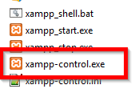
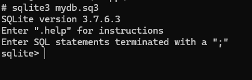
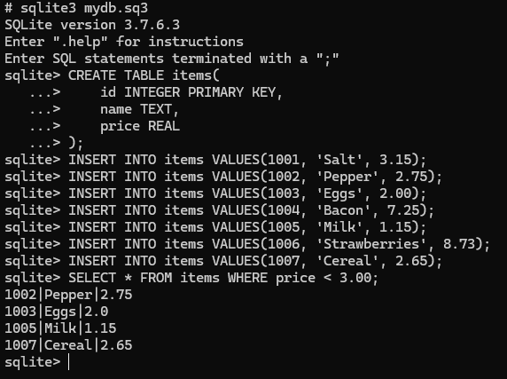
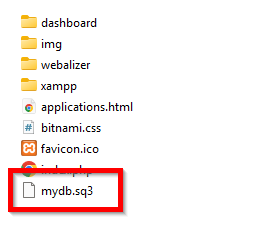

# Первая программа на PHP

<div class="article-tags">
  <span class="tag tag-required">ОБЯЗАТЕЛЬНО</span>
  <span class="tag tag-beginner">ДЛЯ НОВИЧКОВ</span>
</div>

<span class="complexity-badge">Разработчику</span>
<span class="complexity-badge">Архитектору</span>

## Первая программа на PHP

### Установка

А теперь давайте немного попрактикуемся и посмотрим, как выглядит работа с PHP. Пройдитесь и выполните все действия по алгоритму, но на каждом шаге старайтесь исследовать то, что на экране, чтобы понимать.

Можно использовать:
	- XAMPP (рекомендуется) – пакет, содержащий Apache, MySQL, PHP и прочие полезные инструменты. Это, кстати, отличный вариант для изучения множества инструментов в комплекте.
	- PHP как отдельный пакет через официальный сайт php.net.

---

## XAMPP

### Установка и запуск сервера

Рассмотрим XAMPP. 

После завершения установки можно запустить XAMPP Control Panel, который предоставит интерфейс управления серверами.



Панель управления даёт нам перечень инструментов, и около каждого из перечисленных есть Start (запуск), Admin, Config и Logs. Общие настройки в меню справа.


Нас интересует Apache – нажмём Start рядом с Apache, чтобы запустить веб-сервер, который будет выполнять PHP-скрипты. 

После успешного запуска будет указано, какие порты использует сервер, а в нижней части окна будет логирование информации.

---

### Структура и файлы

Все PHP-файлы, как правило, размещаются в каталоге htdocs, который находится внутри папки, куда мы установили XAMPP – по умолчанию, `C:\xampp\htdocs\`. 

В этой папке мы создадим новую папку – `myfirstphp`, будет корнем нашего проекта.

```
xampp\htdocs\          - основная директория для веб-проектов
xampp\htdocs\index.php - главная страница по умолчанию
```

К папке можно перейти через панель управления XAMPP - кнопка Explorer - папка `htdocs`.

Создадим файл `index.php` внутри папки `myfirstphp`, откроем его в любом текстовом редакторе и добавим туда код:

```php
<?php
echo "Hello World!";
?>
```
В PHP всё начинается с тега `<?php`. Команда `echo` выводит текст на экран.

---

### Запуск программы

Чтобы запустить скрипт, убедимся, что Apache запущен, откроем браузер и перейдём по адресу: 

`http://localhost/myfirstphp`

Мы должны увидеть `Hello World` в браузере. 

Вот и всё.

---

## Командная строка

Альтернативный способ: CLI (командная строка), но сохраним тот же код в другом файле, `hello.php` и перейдём к нему в командной строке. 

Пример:
```bash
cd C:\xampp\htdocs\myfirstphp
```
Затем выполним:
```bash
php hello.php
```

Результат будет в консоли:


Если через командную строку не удалось запустить, значит нужно проверить работу PHP на компьютере. Нужно добавить PATH к системным переменным. 

```
Система – Дополнительные параметры системы – Переменные среды – Path – изменить – указать туда путь к нашему PHP.
```

Если мы установили XAMPP, то PHP будет по пути: `C:\xampp\php`

Если же PHP установлен отдельно – то нужно будет указать путь установки.

Можем попробовать усложнить скрипт. 

Попробуйте изменить код нашего `index.php` на следующий:
```php
<?php
$name = "Имя";
echo "Привет, $name!<br>";
echo "Сегодня: " . date("d.m.Y");
?>
```

Тогда мы получим переменную `$name`, которая будет выводиться, функцию `date()` для вывода текущей даты и конкатенацию строк с помощью точки.

---

## Работа с базой данных

### Основные моменты

XAMPP является учебным. Лучше не разворачивать ценные сервера веб-приложений через него. В реальности лучше полноценно управлять средой через специализированные инструменты.

Важные моменты:
- Директория htdocs — это `document root Apache`. 
- Все файлы должны иметь расширение `.php` для обработки интерпретатором.
- Доступ к файлам осуществляется через виртуальный хост `localhost`.
- Реальные пути к файлам недоступны напрямую — только через веб-интерфейс.

---

### Создание базы данных

Если нажать на кнопку Shell в панели управления XAMPP, то откроется терминал. Давайте создадим базу данных.

**Перейдите в директорию htdocs:**

```bash
cd C:\xampp\htdocs
```

**Создайте базу данных.**
```bash
sqlite3 mydb.sq3
```

После выполнения команды откроется интерактивная оболочка SQLite с приглашением `sqlite>`.



**Создайте таблицу.** 

Для этого просто вставьте скрипт в терминал:

```sql
CREATE TABLE items(
    id INTEGER PRIMARY KEY,
    name TEXT,
    price REAL
);
```

Таблица items содержит три поля:
- id — уникальный идентификатор (целое число, первичный ключ)
- name — название товара (текст)
- price — цена (число с плавающей точкой)

**Добавьте тестовые данные:**

```sql
INSERT INTO items VALUES(1001, 'Salt', 3.15);
INSERT INTO items VALUES(1002, 'Pepper', 2.75);
INSERT INTO items VALUES(1003, 'Eggs', 2.00);
INSERT INTO items VALUES(1004, 'Bacon', 7.25);
INSERT INTO items VALUES(1005, 'Milk', 1.15);
INSERT INTO items VALUES(1006, 'Strawberries', 8.73);
INSERT INTO items VALUES(1007, 'Cereal', 2.65);
```

**Проверьте данные:**

```sql
SELECT * FROM items WHERE price < 3.00;
```

Команда вернет все товары стоимостью менее 3.00.



**Завершите работу с базой**

```
.quit
```

Файл базы данных mydb.sq3 содержит все таблицы и данные. Рекомендуется регулярно создавать резервные копии.



---

### Настройка расширения

**Откройте файл конфигурации PHP и включите расширение для работы с базой данных**. 

Через панель управления XAMPP: нажмите кнопку Config напротив Apache, выберите PHP (php.ini), или откройте напрямую: `C:\xampp\php\php.ini`.

Найдите и раскомментируйте строку:

```
;extension=sqlite3
```

Раскомментировать означает "убрать комментарий". Для этого нужно удалить точку с запятой в начале:

```
extension=sqlite3
```

**Перезапустите Apache**. В панели управления XAMPP остановите и снова запустите модуль Apache. Так работает перезапуск сервера.

**Проверьте доступность расширения**. Создайте файл `info.php` в htdocs со следующим содержимым:

```php
<?php phpinfo(); ?>
```

Откройте в браузере http://localhost/info.php и найдите раздел `sqlite3`. Если раздел присутствует — расширение активировано.

---

### Создание скрипта

**Создайте файл sqlite.php:**

```php
<?php
// Подключение к базе данных SQLite
$db = new SQLite3('mydb.sq3');

// SQL-запрос: выборка товаров дешевле 3.00
$sql = "SELECT * FROM items WHERE price < 3.00";
$result = $db->query($sql);

// Вывод результатов
while ($row = $result->fetchArray(SQLITE3_ASSOC)) {
    echo $row['name'] . ': $' . $row['price'] . '<br/>';
}

// Освобождение ресурсов
unset($db);
?>
```

---

### Запуск скрипта

**Откройте браузер и перейдите по адресу:** `http://localhost/sqlite.php`.

Результат выполнения:

```
Pepper: $2.75
Eggs: $2.00
Milk: $1.15
Cereal: $2.65
```

---

### Разбор кода

Теперь давайте разберём код.

Подключение к базе данных:
```
$db = new SQLite3('mydb.sq3');
```

Здесь создается объект `SQLite3`, который открывает файл базы данных `mydb.sq3` в текущей директории.

Выполнение запроса:

```
$result = $db->query($sql);
```

Метод `query()` выполняет SQL-запрос и возвращает объект результата.

Получение данных:

```
$row = $result->fetchArray(SQLITE3_ASSOC)
```

Метод `fetchArray()` извлекает следующую строку результата. Параметр `SQLITE3_ASSOC` указывает, что данные должны возвращаться в виде ассоциативного массива, где ключами являются названия столбцов.

Цикл обработки:

```
while ($row = $result->fetchArray(SQLITE3_ASSOC)) {
    // обработка строки
}
```

Цикл продолжает извлекать строки, пока не достигнет конца результата.

---

### SQLite3

**SQLite3** — это расширение PHP, предоставляющее объектно-ориентированный интерфейс для работы с базами данных SQLite версии 3. Расширение реализует класс SQLite3, экземпляры которого представляют соединение с файлом базы данных.

Это расширение, как можно понять из названия, имеет прямую привязку к СУБД SQLite, и работает исключительно с этим движком. Используется при этом объектная модель, где каждый экземпляр класса SQLite3 управляет отдельным соединением. Все данные хранятся в локальном файле.

Как мы запомнили, оно требует явной активации в конфигурации PHP (`extension=sqlite3 в php.ini`). В некоторых сборках XAMPP для Windows расширение отключено по умолчанию.

---

### PDO

Для более универсального кода можно использовать расширение PDO. Оно не требует изменения `php.ini`.

**PDO** — это абстрактный слой доступа к базам данных, встроенный в ядро PHP начиная с версии 5.1. Представляет унифицированный интерфейс для взаимодействия с различными СУБД через драйверы.

У него есть единый API для разных СУБД: один и тот же код работает с MySQL, PostgreSQL, SQLite, Oracle и другими (при наличии соответствующего драйвера), а смена СУБД требует изменения только строки подключения.


```
<?php
try {
    // Подключение через PDO
    $pdo = new PDO('sqlite:mydb.sq3');
    $pdo->setAttribute(PDO::ATTR_ERRMODE, PDO::ERRMODE_EXCEPTION);
    
    // Подготовленный запрос
    $stmt = $pdo->prepare("SELECT * FROM items WHERE price < :price");
    $stmt->execute(['price' => 3.00]);
    
    // Вывод результатов
    while ($row = $stmt->fetch(PDO::FETCH_ASSOC)) {
        echo $row['name'] . ': $' . $row['price'] . '<br/>';
    }
    
} catch (PDOException $e) {
    echo 'Ошибка подключения: ' . $e->getMessage();
}
?>
```

С PDO снижается зависимость от конкретной СУБД, имеется единообразная обработка ошибок, а режим этот активирован по умолчанию.

---

## Более сложный пример

### Пример кода

А теперь попробуйте создать новый файл test.php и добавить туда следующий код:

```php
<?php
// Демонстрация переменных
$siteTitle = "Демонстрация возможностей PHP";
$version = "8.2";
$currentYear = date("Y");
$features = [
    "Переменные и типы данных",
    "Операторы и выражения", 
    "Циклы и условия",
    "Функции",
    "Классы и объекты",
    "Работа с массивами"
];

// Демонстрация операторов
$calculationResult = (10 + 5) * 2;
$comparison = 15 > 10;
$logical = true && false;

// Демонстрация функций
function calculateDiscount($price, $discount = 0.1) {
    return $price * (1 - $discount);
}

function formatCurrency($amount) {
    return number_format($amount, 2, ',', ' ') . " ₽";
}

// Демонстрация классов и объектов
class Product {
    private string $name;
    private float $price;
    private int $stock;
    
    public function __construct(string $name, float $price, int $stock = 0) {
        $this->name = $name;
        $this->price = $price;
        $this->stock = $stock;
    }
    
    public function getName(): string {
        return $this->name;
    }
    
    public function getPrice(): float {
        return $this->price;
    }
    
    public function getStock(): int {
        return $this->stock;
    }
    
    public function isAvailable(): bool {
        return $this->stock > 0;
    }
    
    public function getDiscountedPrice(float $discount = 0.1): float {
        return $this->price * (1 - $discount);
    }
}

class ProductCatalog {
    private array $products = [];
    
    public function addProduct(Product $product): void {
        $this->products[] = $product;
    }
    
    public function getProducts(): array {
        return $this->products;
    }
    
    public function getProductCount(): int {
        return count($this->products);
    }
}

// Создание каталога продуктов
$catalog = new ProductCatalog();
$catalog->addProduct(new Product("Ноутбук", 59999.00, 5));
$catalog->addProduct(new Product("Смартфон", 29999.00, 10));
$catalog->addProduct(new Product("Наушники", 5999.00, 15));
$catalog->addProduct(new Product("Монитор", 19999.00, 8));

// Демонстрация работы с массивами
$prices = array_map(fn($product) => $product->getPrice(), $catalog->getProducts());
$averagePrice = array_sum($prices) / count($prices);
$minPrice = min($prices);
$maxPrice = max($prices);

// Демонстрация циклов
$productsHtml = "";
foreach ($catalog->getProducts() as $product) {
    $productsHtml .= "
        <div class='product-card'>
            <h3>{$product->getName()}</h3>
            <p class='price'>Цена: " . formatCurrency($product->getPrice()) . "</p>
            <p class='stock'>Наличие: " . ($product->isAvailable() ? "В наличии ({$product->getStock()})" : "Нет в наличии") . "</p>
            <p class='discount'>Со скидкой: " . formatCurrency($product->getDiscountedPrice()) . "</p>
        </div>";
}

// Демонстрация условий
$statusMessage = $catalog->getProductCount() > 0 
    ? "Каталог содержит {$catalog->getProductCount()} товаров"
    : "Каталог пуст";
?>
<!DOCTYPE html>
<html lang="ru">
<head>
    <meta charset="UTF-8">
    <meta name="viewport" content="width=device-width, initial-scale=1.0">
    <title><?php echo $siteTitle; ?> - PHP <?php echo $version; ?></title>
    <style>
        * {
            margin: 0;
            padding: 0;
            box-sizing: border-box;
        }
        
        body {
            font-family: 'Segoe UI', Tahoma, Geneva, Verdana, sans-serif;
            line-height: 1.6;
            color: #333;
            background: linear-gradient(135deg, #667eea 0%, #764ba2 100%);
            padding: 20px;
        }
        
        .container {
            max-width: 1200px;
            margin: 0 auto;
            background: white;
            border-radius: 10px;
            box-shadow: 0 10px 30px rgba(0,0,0,0.3);
            overflow: hidden;
        }
        
        header {
            background: linear-gradient(135deg, #667eea 0%, #764ba2 100%);
            color: white;
            padding: 60px 40px;
            text-align: center;
        }
        
        h1 {
            font-size: 2.5em;
            margin-bottom: 20px;
        }
        
        .subtitle {
            font-size: 1.2em;
            opacity: 0.9;
        }
        
        .content {
            padding: 40px;
        }
        
        section {
            margin-bottom: 40px;
        }
        
        h2 {
            color: #667eea;
            margin-bottom: 20px;
            padding-bottom: 10px;
            border-bottom: 3px solid #667eea;
        }
        
        .feature-grid {
            display: grid;
            grid-template-columns: repeat(auto-fit, minmax(250px, 1fr));
            gap: 20px;
            margin-top: 20px;
        }
        
        .feature-item {
            background: #f8f9fa;
            padding: 20px;
            border-radius: 8px;
            border-left: 4px solid #667eea;
        }
        
        .demo-box {
            background: #f8f9fa;
            padding: 20px;
            border-radius: 8px;
            margin-top: 20px;
        }
        
        .demo-box h3 {
            color: #764ba2;
            margin-bottom: 15px;
        }
        
        .demo-box p {
            margin: 10px 0;
        }
        
        .products-grid {
            display: grid;
            grid-template-columns: repeat(auto-fit, minmax(280px, 1fr));
            gap: 20px;
            margin-top: 20px;
        }
        
        .product-card {
            background: #f8f9fa;
            padding: 25px;
            border-radius: 8px;
            border: 2px solid #e9ecef;
        }
        
        .product-card h3 {
            color: #333;
            margin-bottom: 15px;
        }
        
        .price {
            font-weight: bold;
            color: #28a745;
            font-size: 1.2em;
        }
        
        .stock {
            color: #667eea;
            margin: 10px 0;
        }
        
        .discount {
            color: #dc3545;
            font-weight: bold;
        }
        
        .stats-grid {
            display: grid;
            grid-template-columns: repeat(auto-fit, minmax(200px, 1fr));
            gap: 20px;
            margin-top: 20px;
        }
        
        .stat-item {
            background: linear-gradient(135deg, #667eea 0%, #764ba2 100%);
            color: white;
            padding: 20px;
            border-radius: 8px;
            text-align: center;
        }
        
        .stat-value {
            font-size: 2em;
            font-weight: bold;
            margin: 10px 0;
        }
        
        footer {
            background: #333;
            color: white;
            text-align: center;
            padding: 20px;
            font-size: 0.9em;
        }
    </style>
</head>
<body>
    <div class="container">
        <header>
            <h1><?php echo $siteTitle; ?></h1>
            <p class="subtitle">Интерактивная демонстрация основных возможностей языка программирования PHP <?php echo $version; ?></p>
        </header>
        
        <div class="content">
            <section>
                <h2>Основные возможности</h2>
                <div class="feature-grid">
                    <?php foreach ($features as $feature): ?>
                        <div class="feature-item">
                            <h3><?php echo $feature; ?></h3>
                        </div>
                    <?php endforeach; ?>
                </div>
            </section>
            
            <section>
                <h2>Демонстрация синтаксиса</h2>
                <div class="demo-box">
                    <h3>Переменные и операторы</h3>
                    <p>Результат вычисления (10 + 5) × 2 = <strong><?php echo $calculationResult; ?></strong></p>
                    <p>Сравнение 15 > 10: <strong><?php echo $comparison ? "true" : "false"; ?></strong></p>
                    <p>Логическое выражение true && false: <strong><?php echo $logical ? "true" : "false"; ?></strong></p>
                </div>
                
                <div class="demo-box">
                    <h3>Функции</h3>
                    <p>Пример функции скидки: исходная цена 10000 ₽, скидка 10%</p>
                    <p>Итоговая цена: <strong><?php echo formatCurrency(calculateDiscount(10000)); ?></strong></p>
                </div>
            </section>
            
            <section>
                <h2>Каталог продуктов</h2>
                <p><?php echo $statusMessage; ?></p>
                <div class="products-grid">
                    <?php echo $productsHtml; ?>
                </div>
                
                <div class="stats-grid">
                    <div class="stat-item">
                        <div>Средняя цена</div>
                        <div class="stat-value"><?php echo formatCurrency($averagePrice); ?></div>
                    </div>
                    <div class="stat-item">
                        <div>Минимальная цена</div>
                        <div class="stat-value"><?php echo formatCurrency($minPrice); ?></div>
                    </div>
                    <div class="stat-item">
                        <div>Максимальная цена</div>
                        <div class="stat-value"><?php echo formatCurrency($maxPrice); ?></div>
                    </div>
                </div>
            </section>
            
            <section>
                <h2>Статистика</h2>
                <div class="demo-box">
                    <p>Всего товаров в каталоге: <strong><?php echo $catalog->getProductCount(); ?></strong></p>
                    <p>Текущий год: <strong><?php echo $currentYear; ?></strong></p>
                    <p>Версия демонстрации: <strong><?php echo $version; ?></strong></p>
                </div>
            </section>
        </div>
        
        <footer>
            <p>© <?php echo $currentYear; ?> Демонстрация возможностей PHP. Создано с использованием современных возможностей языка.</p>
        </footer>
    </div>
</body>
</html>
```

---

### Структура документа

Код разделён на две логические части:

1. **Бизнес-логика (до `<!DOCTYPE html>`)** — объявление переменных, функций, классов и подготовка данных
2. **Представление (HTML + встроенный PHP)** — вывод данных в пользовательский интерфейс

Такой подход демонстрирует разделение ответственности: вычисления выполняются до формирования разметки, что улучшает читаемость и производительность.

---

### Переменные и типизация

```php
$siteTitle = "Демонстрация возможностей PHP";  // string
$version = "8.2";                              // string
$currentYear = date("Y");                      // string (результат функции)
$features = [ ... ];                           // array
```

Особенности:
- PHP использует динамическую типизацию, но поддерживает строгую типизацию в сигнатурах методов
- Переменные начинаются со знака `$`
- Имена переменных чувствительны к регистру (`$price` ≠ `$Price`)
- Тип выводится автоматически при присваивании

---

### Массивы

```php
$features = [
    "Переменные и типы данных",
    "Операторы и выражения",
    // ...
];
```

Используется современный синтаксис массивов (начиная с PHP 5.4). Массивы в PHP:
- Реализованы как хэш-таблицы
- Поддерживают как числовые, так и строковые ключи
- Динамически расширяются при добавлении элементов

---

### Операторы

```php
$calculationResult = (10 + 5) * 2;  // Арифметические: +, -, *, /, %
$comparison = 15 > 10;              // Сравнения: >, <, >=, <=, ==, ===
$logical = true && false;           // Логические: &&, ||, !, and, or
```

Особенности:
- Приоритет операторов соответствует математическим правилам (скобки изменяют порядок)
- `==` сравнивает значения с приведением типов, `===` — строгое сравнение (значение `+` тип)
- Логические операторы возвращают булевы значения `true`/`false`

---

### Условные выражения

```php
$statusMessage = $catalog->getProductCount() > 0 
    ? "Каталог содержит {$catalog->getProductCount()} товаров"
    : "Каталог пуст";
```

Используется тернарный оператор `условие ? значение_если_истина : значение_если_ложь`. Преимущества:
- Компактная запись простых условий
- Возвращает значение, которое можно присвоить переменной
- Поддерживает вложенность (хотя это снижает читаемость)

---

### Циклы

```php
foreach ($catalog->getProducts() as $product) {
    $productsHtml .= " ... ";
}
```

`foreach` — основной цикл для перебора массивов и итерируемых объектов:
- Автоматически извлекает ключ/значение на каждой итерации
- Не требует ручного управления счётчиком
- Работает с любыми итерируемыми структурами данных

В шаблоне также используется альтернативный синтаксис цикла для встраивания в HTML:

```php
<?php foreach ($features as $feature): ?>
    <div>...</div>
<?php endforeach; ?>
```

---

### Функции

```php
function calculateDiscount($price, $discount = 0.1) {
    return $price * (1 - $discount);
}
```

Характеристики:
- Параметры по умолчанию (`$discount = 0.1`) позволяют вызывать функцию с разным количеством аргументов
- Область видимости переменных ограничена телом функции
- Возврат значения через `return`
- Функции могут вызываться до их объявления (из-за особенностей парсинга PHP)

---

### Объектно-ориентированное программирование

#### Классы и свойства

```php
class Product {
    private string $name;   // Строгая типизация свойств (PHP 7.4+)
    private float $price;
    private int $stock;
```

Особенности:
- Модификаторы доступа: `private`, `protected`, `public`
- Строгая типизация свойств доступна с PHP 7.4
- Инкапсуляция: прямой доступ к приватным свойствам запрещён

#### Конструктор

```php
public function __construct(string $name, float $price, int $stock = 0) {
    $this->name = $name;
    $this->price = $price;
    $this->stock = $stock;
}
```

- Метод `__construct()` вызывается автоматически при создании объекта через `new`
- Параметры с типизацией обеспечивают валидацию входных данных
- Параметр `$stock` имеет значение по умолчанию

#### Методы с типизацией возврата

```php
public function getName(): string {
    return $this->name;
}
```

- Синтаксис `: тип` после имени метода указывает ожидаемый тип возвращаемого значения
- Типизация повышает надёжность кода и упрощает статический анализ

#### Композиция объектов

```php
class ProductCatalog {
    private array $products = [];
    
    public function addProduct(Product $product): void {
        $this->products[] = $product;
    }
}
```

- Класс `ProductCatalog` содержит коллекцию объектов `Product`
- Типизация параметра `$product` гарантирует, что метод принимает только экземпляры `Product`
- Метод `getProducts()` возвращает массив объектов для дальнейшей обработки

---

### Работа с массивами и функциональное программирование

```php
$prices = array_map(fn($product) => $product->getPrice(), $catalog->getProducts());
$averagePrice = array_sum($prices) / count($prices);
```

Используются:
- `array_map()` — применяет функцию к каждому элементу массива
- Стрелочная функция `fn()` — краткая запись анонимной функции (PHP 7.4+)
- `array_sum()` — суммирует элементы числового массива
- `count()` — возвращает количество элементов

---

### Встраивание PHP в HTML

```php
<title><?php echo $siteTitle; ?> - PHP <?php echo $version; ?></title>
```

Механизмы вывода:
- `<?php ... ?>` — стандартные теги для выполнения PHP-кода
- `<?php echo $var; ?>` — вывод значения переменной в поток вывода
- Альтернативный синтаксис `<?= $var ?>` эквивалентен `<?php echo $var; ?>`

Важно: весь код между открывающим и закрывающим тегами выполняется на сервере до отправки ответа клиенту.

---

### Работа со строками

```php
$productsHtml .= "<div class='product-card'>Цена: {$product->getPrice()}</div>";
```

Особенности:
- Конкатенация через оператор `.`, присваивание с конкатенацией — `.=` 
- Двойные кавычки позволяют интерполировать переменные: `"{$var}"`
- Одинарные кавычки интерпретируются дословно, без интерполяции
- Для экранирования кавычек внутри строки используется обратный слеш `\`

---

### Современные возможности языка

Код демонстрирует возможности PHP 7.4–8.2:
- Строгая типизация свойств классов
- Стрелочные функции (`fn()`)
- Типизация параметров и возвращаемых значений
- Объявление типов в свойствах без инициализации в конструкторе
- Использование скалярных типов (`string`, `int`, `float`, `bool`)

---

### Безопасность вывода

В демонстрационном коде используется прямой вывод переменных через `echo`. В production-коде необходимо применять экранирование для защиты от XSS:

```php
<?php echo htmlspecialchars($userInput, ENT_QUOTES, 'UTF-8'); ?>
```

Для демонстрации синтаксиса экранирование опущено, так как все данные контролируются разработчиком.

---