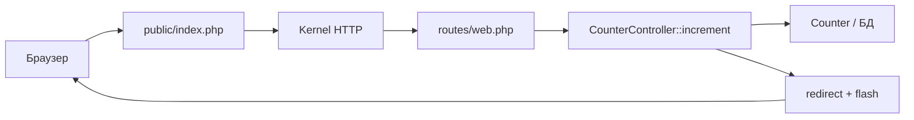

import ExternalCodeEmbed from '@site/src/components/ExternalCodeEmbed';


import ExternalPlayEmbed from '@site/src/components/ExternalPlayEmbed';


# Первая программа на Laravel

<div class="article-tags">
  <span class="tag tag-required">ОБЯЗАТЕЛЬНО</span>
  <span class="tag tag-beginner">ДЛЯ НОВИЧКОВ</span>
</div>

<span class="complexity-badge">Разработчику</span>
<span class="complexity-badge">Архитектору</span>

<ExternalPlayEmbed example="lab/first-program-play" title="Первая программа" minHeight={420} playProps={{ language: 'laravel' }} />

---

## Первая программа на Laravel

**Laravel** — популярный PHP-фреймворк для веба — маршруты, **Eloquent** ORM, Blade, миграции, Artisan CLI. После [первой программы на PHP](./13.md) он даёт быстрый путь к сайту с формами и SQLite без ручной настройки Apache. Загрузка файлов и правила **`mimes` / `extensions`** — [Загрузка файлов и валидация в PHP](./162.md).

В материале — приложение **"Счётчик"** (MVC) — значение в БД, кнопки +/-, Blade. Альтернатива: [Symfony](./1441.md).

---

### Что получится

Страница со счётчиком, кнопками и сохранением в таблице `counters` через Eloquent.

---

## Термины, которые встретятся в статье

| Термин | Простыми словами |
|--------|------------------|
| **MVC** | Model (данные), View (HTML), Controller (связь запроса с моделью и видом) |
| **Маршрут (route)** | Правило "URL `/increment` → метод `increment`" |
| **Eloquent** | ORM: таблица ↔ класс `Counter` |
| **Миграция** | Скрипт создания/изменения таблиц |
| **Artisan** | CLI: `migrate`, `make:model` |
| **Blade** | Шаблоны: `{{ }}`, `@csrf` |
| **CSRF** | Токен в форме — защита от поддельного POST |

---

## Как Laravel обрабатывает один запрос

Для `POST /increment`:



Document root — каталог `public/`. Ошибки: 404 — маршрут; 419 — CSRF; `SQLSTATE` — миграции или `$fillable`.

---

## Создание проекта

Для начала работы требуется среда выполнения PHP версии 8.1 или выше. Необходим также инструмент командной строки Composer для управления зависимостями проекта.

Процесс инициализации нового проекта выполняется командой в терминале. Система автоматически создаст структуру папок, установит необходимые библиотеки Laravel и настроит конфигурационные файлы.

```bash
# Установка Laravel через Composer
composer create-project laravel/laravel my-first-laravel-app

# Переход в директорию проекта
cd my-first-laravel-app

# Запуск локального сервера разработки
php artisan serve
```

Разбор:
- `composer create-project ...` скачивает шаблон Laravel и устанавливает все зависимости проекта.
- `cd my-first-laravel-app` переводит терминал в корень созданного приложения.
- `php artisan serve` поднимает встроенный dev-сервер (обычно на `http://127.0.0.1:8000`).
- Этот набор команд дает рабочую среду без дополнительной настройки веб-сервера.

Блок выше (`composer create-project`, `cd`, `php artisan serve`) скачивает шаблон, создаёт каталог `my-first-laravel-app` и поднимает встроенный сервер на `http://localhost:8000`.

Внутри проекта находятся ключевые директории — `app` содержит основной код (контроллеры, модели), `routes` определяет URL-маршруты, `resources/views` хранит шаблоны отображения, а `database` отвечает за миграции и базу данных.

---

## Определение модели данных

Модель представляет собой класс, который описывает структуру данных и взаимодействует с базой данных. В Laravel используется библиотека Eloquent ORM, позволяющая работать с таблицами как с объектами.

Создадим модель `Counter`, которая будет хранить значение счетчика. Для этого используется команда Artisan (встроенный инструмент Laravel).

```bash
php artisan make:model Counter -m
```

Разбор:
- Команда создает модель `Counter` в `app/Models` и миграцию таблицы в `database/migrations`.
- Флаг `-m` помогает сразу связать бизнес-сущность и структуру БД.
- Такой подход уменьшает расхождение между кодом модели и схемой хранения данных.

Флаг `-m` указывает на необходимость создания миграции — файла, описывающего структуру таблицы в базе данных.

Файл модели находится в `app/Models/Counter.php`:


<ExternalCodeEmbed example="php/php-507-1431-001" title="Определение модели данных" minHeight={372} />


Разбор:
- `class Counter extends Model` подключает модель к Eloquent ORM и всем его базовым операциям.
- `$table = 'counters'` явно задает имя таблицы (полезно при нестандартном нейминге).
- `$fillable = ['value']` разрешает массовое присваивание только безопасного поля `value`.
- `$hidden = []` оставляет все поля видимыми при сериализации (можно расширить при необходимости).
- В этом классе описывается контракт работы с данными счетчика на уровне приложения.

Класс наследуется от `Model`, предоставляемого фреймворком. Свойство `$fillable` определяет список полей, которые разрешено изменять через массовое присваивание. Это мера безопасности, предотвращающая непреднамеренное изменение защищенных полей.

Файл миграции находится в `database/migrations/xxxx_xx_xx_create_counters_table.php`:


<ExternalCodeEmbed example="php/php-507-1431-002" title="Определение модели данных" minHeight={462} />


Разбор:
- Метод `up()` описывает, как создать таблицу `counters`.
- `$table->id()` добавляет первичный ключ с автоинкрементом.
- `$table->integer('value')->default(0)` хранит значение счетчика и задает корректное начальное значение.
- `$table->timestamps()` добавляет поля `created_at` и `updated_at` для аудита изменений.
- Метод `down()` удаляет таблицу и используется при откате миграции.

Система создает таблицу `counters` с полем `value` и автоматическими метками времени. Примените миграции:

```bash
php artisan migrate
```

Разбор:
- Выполняет все непримененные миграции и приводит БД к актуальному состоянию схемы.
- После запуска таблица `counters` становится доступной для модели `Counter`.
- Это обязательный шаг перед первым обращением к данным из контроллера.

Эта команда исполняет скрипты миграций и создает необходимые таблицы в файле базы данных SQLite, который используется по умолчанию.

---

## Создание контроллера

Контроллер обрабатывает входящие запросы, взаимодействует с моделями и возвращает ответы. В Laravel контроллеры содержат методы, соответствующие действиям пользователя.

Создадим контроллер `CounterController` с помощью команды:

```bash
php artisan make:controller CounterController
```

Разбор:
- Создает контроллер, который будет принимать HTTP-запросы и координировать работу модели/представления.
- Внутри класса далее размещаются методы `index`, `increment`, `decrement`, `reset`.
- Это точка входа для бизнес-сценариев пользователя в MVC-цепочке.

Файл контроллера находится в `app/Http/Controllers/CounterController.php`:


<ExternalCodeEmbed example="php/php-507-1431-003" title="Создание контроллера" minHeight={720} />


Разбор:
- `index()` получает текущий счетчик (или создает начальную запись) и передает данные в view.
- `increment()` и `decrement()` изменяют значение через методы Eloquent и возвращают редирект.
- `reset()` сбрасывает значение на `0`, сохраняя единый сценарий через POST-действие.
- `with('success', ...)` кладет flash-сообщение в сессию для отображения в интерфейсе.
- `Counter::latest()->first()` выбирает последнюю запись и делает пример максимально простым для обучения.

Метод `index` загружает данные из базы данных и передает их в представление. Методы `increment`, `decrement` и `reset` изменяют состояние объекта и перенаправляют пользователя обратно на страницу с уведомлением об успехе. Использование цепочки вызовов `->latest()->first()` обеспечивает получение последнего созданного экземпляра.

---

## Настройка маршрутизации

Маршруты определяют связь между URL-адресами и методами контроллера. Файл маршрутов находится в `routes/web.php`.

```php
<?php

use Illuminate\Support\Facades\Route;
use App\Http\Controllers\CounterController;

Route::get('/', [CounterController::class, 'index'])->name('counter.index');
Route::post('/increment', [CounterController::class, 'increment'])->name('counter.increment');
Route::post('/decrement', [CounterController::class, 'decrement'])->name('counter.decrement');
Route::post('/reset', [CounterController::class, 'reset'])->name('counter.reset');
```

Разбор:
- `Route::get('/', ...)` описывает экран чтения данных (страница счетчика).
- `Route::post('/increment'|'/decrement'|'/reset', ...)` описывают изменяющие операции через POST.
- `[CounterController::class, 'method']` связывает URL с конкретным методом контроллера.
- `->name(...)` задает стабильные имена маршрутов для генерации URL в Blade через `route(...)`.
- Такая схема делает навигацию и рефакторинг безопаснее, чем жестко прописанные пути.

Каждая строка определяет маршрут. Метод `Route::get` обрабатывает GET-запросы, а `Route::post` — POST-запросы. Аргумент `[CounterController::class, 'methodName']` указывает на конкретный метод контроллера. Имя маршрута (`->name(...)`) позволяет ссылаться на него в коде и представлениях без жёстко заданных URL.

---

### Разбор одной строки маршрута

```php
Route::post('/increment', [CounterController::class, 'increment'])->name('counter.increment');
```

| Часть | Смысл |
|-------|--------|
| `Route::post` | Только HTTP POST |
| `'/increment'` | Путь |
| `[CounterController::class, 'increment']` | Класс и метод |
| `->name('counter.increment')` | Псевдоним для `route('counter.increment')` в Blade |

---

## Создание представления

Представление отвечает за внешний вид страницы. В Laravel используются шаблоны Blade, которые расширяют синтаксис HTML дополнительными возможностями.

Создайте файл `resources/views/counter/index.blade.php`:


<ExternalCodeEmbed example="html/php-507-1431-004" title="Создание представления" minHeight={720} />


Разбор:
- `{{ $counter->value }}` выводит текущее значение, полученное из контроллера.
- Три формы отправляют POST-запросы на маршруты увеличения, уменьшения и сброса.
- `@csrf` добавляет защитный токен и предотвращает поддельные межсайтовые запросы.
- `@if(session('success'))` показывает flash-сообщение после действия пользователя.
- CSS в блоке `<style>` оформляет базовый UI, но не влияет на бизнес-логику.

Шаблоны Blade используют фигурные скобки `{{ }}` для вывода переменных. Директива `@csrf` добавляет токен безопасности для защиты от подделки межсайтовых запросов (CSRF). Блок `@if` проверяет наличие сообщения в сессии и выводит его. Форма отправляет данные методом POST на соответствующий маршрут контроллера.

---

## Работа с формами и безопасность

Laravel автоматически защищает формы от CSRF-атак. Токен генерируется на стороне сервера и проверяется при отправке данных. Пропуск токена приведет к ошибке 419 (Page Expired).

Для работы с данными используется механизм валидации. Контроллер может проверять входные данные перед сохранением. Общая шкала проверок — [Проверка и валидация](/encyclopedia/4-code-dev/4-14-razrabotka-i-otladka/118).

```php
public function store(Request $request)
{
    $validated = $request->validate([
        'value' => 'required|integer|min:0',
    ]);

    Counter::create($validated);
    
    return redirect()->back();
}
```

Разбор:
- `$request->validate([...])` применяет правила к входным данным до записи в БД.
- Правило `required|integer|min:0` требует обязательное неотрицательное целое значение.
- При ошибке Laravel автоматически вернет пользователя назад с сообщениями валидации.
- `Counter::create($validated)` создает запись только из проверенных данных.
- `redirect()->back()` возвращает пользователя на предыдущую страницу после успешного действия.

Метод `validate` проверяет соответствие данных правилам. Если проверка не проходит, система автоматически возвращает ошибку пользователю.

---

## Расширение функционала

Полученное приложение служит базой для дальнейших экспериментов. Разработчики могут добавлять новые функции, изучая механизмы работы с данными и интерфейсом.

Добавление истории изменений предполагает создание новой модели `History`, связанной с моделью `Counter` отношением "один ко многим". Каждое изменение значения записывается в отдельную таблицу.

Реализация пользовательской системы требует настройки аутентификации. Laravel предоставляет готовые пакеты для регистрации, входа и выхода пользователей.

Интеграция с внешними API позволяет получать данные из сторонних сервисов и отображать их в приложении. Используются методы `Http::get()` и `Http::post()` для выполнения запросов.

---

## Пошаговый запуск

Для успешного запуска приложения необходимо выполнить последовательность действий.

1. Установите PHP 8.1+ и Composer.
2. Создайте проект, настройте модели/контроллеры/маршруты в коде.
3. Запуск:

```bash
composer create-project laravel/laravel my-first-laravel-app
cd my-first-laravel-app
php artisan make:model Counter -m
php artisan migrate
php artisan make:controller CounterController
php artisan serve
```

Разбор:
- Это полный минимальный сценарий запуска проекта с нуля.
- Последовательность важна — сначала создание проекта, затем генерация модели/контроллера, потом миграции и запуск сервера.
- После этих шагов приложение уже можно открыть в браузере и проверить end-to-end.

Браузер откроет страницу приложения. Любые изменения в коде требуют перезапуска сервера или обновления страницы.

---

### Частые ошибки

| Симптом | Причина |
|---------|---------|
| `SQLSTATE` / table not found | Не выполнен `php artisan migrate` |
| 419 Page Expired | POST без `@csrf` в Blade |
| Маршрут 404 | Опечатка в `routes/web.php` или `php artisan route:clear` |
| Счётчик не сохраняется | Поле вне `$fillable` |

---

### Что попробовать

1. `php artisan route:list` — имена маршрутов.
2. JSON API: `routes/api.php` + Resource.
3. `php artisan make:seeder` — начальное значение счётчика.

---

### Дальше

- [Livewire](./1434.md)
- [Filament](./1435.md)
- [API с Sanctum](./1433.md)
- [Очереди и политики](./1432.md)
- [Symfony](./1441.md)
- [WordPress-тема](./1461.md)

---

## Как улучшить учебный счетчик до мини-проекта

Текущий пример уже годится как база для расширений. Следующий шаг добавляет архитектурную глубину и лучше показывает практику Laravel.

---

### Вариант расширения 1 — история изменений

Создайте таблицу `counter_events` и сохраняйте каждое действие — `increment`, `decrement`, `reset`, значение до и после.

```bash
php artisan make:model CounterEvent -m
```

Разбор:
- Команда подготавливает новую сущность `CounterEvent` для хранения истории изменений счетчика.
- Флаг `-m` сразу добавляет миграцию и ускоряет реализацию аудита.
- Это хороший следующий шаг к более "проектной" архитектуре и аналитике действий пользователя.

Так вы получите материал для аналитики и увидите связь `hasMany` в рабочем сценарии.

---

### Вариант расширения 2 — API слой

Поверх страницы добавьте `routes/api.php` и отдавайте текущее значение в JSON. Хорошее продолжение описано в [Laravel API с Sanctum](./1433.md).

---

### Вариант расширения 3 — фоновая обработка

После изменения значения отправляйте job в очередь: например, запись аудита или уведомление. Подробный разбор есть в [Laravel — очереди и политики](./1432.md).

---

## Что проверять в код-ревью этого примера

- В формах всегда есть `@csrf`.
- Изменяемые поля указаны в `$fillable`.
- В контроллере сохраняется только координация запроса, тяжелая логика вынесена в сервис.
- Маршруты имеют имена и читаемые URL.
- Ошибки пользователя возвращаются с понятным сообщением и статусом.

Такой чек-лист делает даже учебный проект ближе к стандарту production-кода.

---

{/* http-basics-link  */}
<div class="callout callout--tip">
  <div class="callout-title">Основа по протоколу</div>

  <div class="callout-body">
  Базовый разбор HTTP и HTTPS находится в отдельной статье — [HTTP как основа веб-интеграций](/encyclopedia/2-system-network/2-09-osnovy-integratsionnogo-vzaimodeystviya/118).
</div>
  </div>

{/* sidebar-collections */}

---

## В подборках

Статья входит в [тематические подборки](/about/collections) и блок "С чего начать?" на [главной](/). Соседние шаги того же маршрута:

**Первые шаги** ([маршрут подборки](/about/collections/pervye-shagi)) — [Qt Quick — первая программа на QML](/encyclopedia/5-languages/5-06-cpp/2732), [Первая программа на Symfony](/encyclopedia/5-languages/5-07-php/1441), [Qt — первая программа](/encyclopedia/5-languages/5-06-cpp/2731), [Ktor — первая программа](/encyclopedia/5-languages/5-09-kotlin/221), [CMake — первая программа](/encyclopedia/5-languages/5-06-cpp/1006), [Compose Multiplatform — первая программа](/encyclopedia/5-languages/5-09-kotlin/224).

{/* /sidebar-collections */}

---
