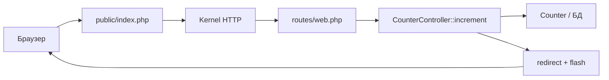

import FirstProgramPlay from '@site/src/components/FirstProgramPlay.jsx';

# Первая программа на Laravel

<div class="article-tags">
  <span class="tag tag-required">ОБЯЗАТЕЛЬНО</span>
  <span class="tag tag-beginner">ДЛЯ НОВИЧКОВ</span>
</div>

<span class="complexity-badge">Разработчику</span>
<span class="complexity-badge">Архитектору</span>

<FirstProgramPlay language="laravel" />

## Первая программа на Laravel

**Laravel** — популярный PHP-фреймворк для веба: маршруты, **Eloquent** ORM, Blade, миграции, Artisan CLI. После [первой программы на PHP](./13.md) он даёт быстрый путь к сайту с формами и SQLite без ручной настройки Apache.

В материале — приложение **"Счётчик"** (MVC): значение в БД, кнопки +/-, Blade. Альтернатива: [Symfony](./1441.md).

---

### Что получится

Страница со счётчиком, кнопками и сохранением в таблице `counters` через Eloquent.

---

## Термины, которые встретятся в статье

| Термин | Простыми словами |
|--------|------------------|
| **MVC** | Model (данные), View (HTML), Controller (связь запроса с моделью и видом) |
| **Маршрут (route)** | Правило "URL `/increment` → метод `increment`" |
| **Eloquent** | ORM: таблица ↔ класс `Counter` |
| **Миграция** | Скрипт создания/изменения таблиц |
| **Artisan** | CLI: `migrate`, `make:model` |
| **Blade** | Шаблоны: `{{ }}`, `@csrf` |
| **CSRF** | Токен в форме — защита от поддельного POST |

---

## Как Laravel обрабатывает один запрос

Для `POST /increment`:



Document root — каталог `public/`. Ошибки: 404 — маршрут; 419 — CSRF; `SQLSTATE` — миграции или `$fillable`.

---

## Создание проекта

Для начала работы требуется среда выполнения PHP версии 8.1 или выше. Необходим также инструмент командной строки Composer для управления зависимостями проекта.

Процесс инициализации нового проекта выполняется командой в терминале. Система автоматически создаст структуру папок, установит необходимые библиотеки Laravel и настроит конфигурационные файлы.

```bash
# Установка Laravel через Composer
composer create-project laravel/laravel my-first-laravel-app

# Переход в директорию проекта
cd my-first-laravel-app

# Запуск локального сервера разработки
php artisan serve
```

Блок выше (`composer create-project`, `cd`, `php artisan serve`) скачивает шаблон, создаёт каталог `my-first-laravel-app` и поднимает встроенный сервер на `http://localhost:8000`.

Внутри проекта находятся ключевые директории: `app` содержит основной код (контроллеры, модели), `routes` определяет URL-маршруты, `resources/views` хранит шаблоны отображения, а `database` отвечает за миграции и базу данных.

---

## Определение модели данных

Модель представляет собой класс, который описывает структуру данных и взаимодействует с базой данных. В Laravel используется библиотека Eloquent ORM, позволяющая работать с таблицами как с объектами.

Создадим модель `Counter`, которая будет хранить значение счетчика. Для этого используется команда Artisan (встроенный инструмент Laravel).

```bash
php artisan make:model Counter -m
```

Флаг `-m` указывает на необходимость создания миграции — файла, описывающего структуру таблицы в базе данных.

Файл модели находится в `app/Models/Counter.php`:

```php
<?php

namespace App\Models;

use Illuminate\Database\Eloquent\Model;

class Counter extends Model
{
    // Имя таблицы в базе данных (по умолчанию используется множественное число от имени класса)
    protected $table = 'counters';

    // Поля, которые можно заполнять массово
    protected $fillable = ['value'];

    // Поля, которые нужно скрыть при сериализации (опционально)
    protected $hidden = [];
}
```

Класс наследуется от `Model`, предоставляемого фреймворком. Свойство `$fillable` определяет список полей, которые разрешено изменять через массовое присваивание. Это мера безопасности, предотвращающая непреднамеренное изменение защищенных полей.

Файл миграции находится в `database/migrations/xxxx_xx_xx_create_counters_table.php`:

```php
<?php

use Illuminate\Database\Migrations\Migration;
use Illuminate\Database\Schema\Blueprint;
use Illuminate\Support\Facades\Schema;

return new class extends Migration
{
    public function up(): void
    {
        Schema::create('counters', function (Blueprint $table) {
            $table->id(); // Автоинкрементный первичный ключ
            $table->integer('value')->default(0); // Целочисленное поле со значением по умолчанию 0
            $table->timestamps(); // Поля created_at и updated_at
        });
    }

    public function down(): void
    {
        Schema::dropIfExists('counters');
    }
};
```

Система создает таблицу `counters` с полем `value` и автоматическими метками времени. Примените миграции:

```bash
php artisan migrate
```

Эта команда исполняет скрипты миграций и создает необходимые таблицы в файле базы данных SQLite, который используется по умолчанию.

---

## Создание контроллера

Контроллер обрабатывает входящие запросы, взаимодействует с моделями и возвращает ответы. В Laravel контроллеры содержат методы, соответствующие действиям пользователя.

Создадим контроллер `CounterController` с помощью команды:

```bash
php artisan make:controller CounterController
```

Файл контроллера находится в `app/Http/Controllers/CounterController.php`:

```php
<?php

namespace App\Http\Controllers;

use App\Models\Counter;
use Illuminate\Http\Request;

class CounterController extends Controller
{
    /**
     * Отображение начальной страницы
     */
    public function index()
    {
        // Получаем последний созданный счетчик или создаем новый
        $counter = Counter::latest()->first();
        
        if (!$counter) {
            $counter = Counter::create(['value' => 0]);
        }

        return view('counter.index', compact('counter'));
    }

    /**
     * Увеличение значения счетчика
     */
    public function increment(Request $request)
    {
        $counter = Counter::latest()->first();
        
        if ($counter) {
            $counter->increment('value');
        } else {
            $counter = Counter::create(['value' => 1]);
        }

        return redirect()->route('counter.index')
            ->with('success', 'Значение увеличено');
    }

    /**
     * Уменьшение значения счетчика
     */
    public function decrement(Request $request)
    {
        $counter = Counter::latest()->first();
        
        if ($counter && $counter->value > 0) {
            $counter->decrement('value');
        }

        return redirect()->route('counter.index')
            ->with('success', 'Значение уменьшено');
    }

    /**
     * Сброс счетчика
     */
    public function reset(Request $request)
    {
        $counter = Counter::latest()->first();
        
        if ($counter) {
            $counter->update(['value' => 0]);
        }

        return redirect()->route('counter.index')
            ->with('success', 'Счетчик сброшен');
    }
}
```

Метод `index` загружает данные из базы данных и передает их в представление. Методы `increment`, `decrement` и `reset` изменяют состояние объекта и перенаправляют пользователя обратно на страницу с уведомлением об успехе. Использование цепочки вызовов `->latest()->first()` обеспечивает получение последнего созданного экземпляра.

---

## Настройка маршрутизации

Маршруты определяют связь между URL-адресами и методами контроллера. Файл маршрутов находится в `routes/web.php`.

```php
<?php

use Illuminate\Support\Facades\Route;
use App\Http\Controllers\CounterController;

Route::get('/', [CounterController::class, 'index'])->name('counter.index');
Route::post('/increment', [CounterController::class, 'increment'])->name('counter.increment');
Route::post('/decrement', [CounterController::class, 'decrement'])->name('counter.decrement');
Route::post('/reset', [CounterController::class, 'reset'])->name('counter.reset');
```

Каждая строка определяет маршрут. Метод `Route::get` обрабатывает GET-запросы, а `Route::post` — POST-запросы. Аргумент `[CounterController::class, 'methodName']` указывает на конкретный метод контроллера. Имя маршрута (`->name(...)`) позволяет ссылаться на него в коде и представлениях без жёстко заданных URL.

### Разбор одной строки маршрута

```php
Route::post('/increment', [CounterController::class, 'increment'])->name('counter.increment');
```

| Часть | Смысл |
|-------|--------|
| `Route::post` | Только HTTP POST |
| `'/increment'` | Путь |
| `[CounterController::class, 'increment']` | Класс и метод |
| `->name('counter.increment')` | Псевдоним для `route('counter.increment')` в Blade |

---

## Создание представления

Представление отвечает за внешний вид страницы. В Laravel используются шаблоны Blade, которые расширяют синтаксис HTML дополнительными возможностями.

Создайте файл `resources/views/counter/index.blade.php`:

```html
<!DOCTYPE html>
<html lang="ru">
<head>
    <meta charset="UTF-8">
    <title>Первая программа на Laravel</title>
    <style>
        body {
            font-family: Arial, sans-serif;
            background-color: #f4f4f4;
            padding: 20px;
            display: flex;
            justify-content: center;
            align-items: center;
            min-height: 100vh;
            margin: 0;
        }
        .container {
            background: white;
            padding: 40px;
            border-radius: 10px;
            box-shadow: 0 4px 6px rgba(0,0,0,0.1);
            text-align: center;
            width: 300px;
        }
        h1 {
            color: #ff4d4d; /* Фирменный красный цвет Laravel */
            margin-bottom: 30px;
        }
        .counter-box {
            background: #fff0f0;
            padding: 20px;
            border-radius: 8px;
            margin-bottom: 20px;
        }
        .value {
            font-size: 48px;
            font-weight: bold;
            color: #333;
            margin: 10px 0;
        }
        .buttons {
            display: flex;
            justify-content: space-around;
            gap: 10px;
        }
        button {
            padding: 10px 20px;
            font-size: 16px;
            border: none;
            border-radius: 5px;
            cursor: pointer;
            transition: transform 0.2s;
            background: #ff4d4d;
            color: white;
        }
        button:hover {
            background: #e60000;
            transform: scale(1.05);
        }
        button:active {
            transform: scale(0.95);
        }
        .message {
            color: green;
            margin-top: 15px;
            font-size: 14px;
        }
    </style>
</head>
<body>
    <div class="container">
        <h1>Счетчик Laravel</h1>
        
        <div class="counter-box">
            <p>Текущее значение:</p>
            <div class="value">{{ $counter->value }}</div>
        </div>

        <form action="{{ route('counter.increment') }}" method="POST" style="display:inline;">
            @csrf
            <button type="submit">+</button>
        </form>

        <form action="{{ route('counter.reset') }}" method="POST" style="display:inline;">
            @csrf
            <button type="submit">Сброс</button>
        </form>

        <form action="{{ route('counter.decrement') }}" method="POST" style="display:inline;">
            @csrf
            <button type="submit">-</button>
        </form>

        @if(session('success'))
            <div class="message">{{ session('success') }}</div>
        @endif
    </div>
</body>
</html>
```

Шаблоны Blade используют фигурные скобки `{{ }}` для вывода переменных. Директива `@csrf` добавляет токен безопасности для защиты от подделки межсайтовых запросов (CSRF). Блок `@if` проверяет наличие сообщения в сессии и выводит его. Форма отправляет данные методом POST на соответствующий маршрут контроллера.

---

## Работа с формами и безопасность

Laravel автоматически защищает формы от CSRF-атак. Токен генерируется на стороне сервера и проверяется при отправке данных. Пропуск токена приведет к ошибке 419 (Page Expired).

Для работы с данными используется механизм валидации. Контроллер может проверять входные данные перед сохранением.

```php
public function store(Request $request)
{
    $validated = $request->validate([
        'value' => 'required|integer|min:0',
    ]);

    Counter::create($validated);
    
    return redirect()->back();
}
```

Метод `validate` проверяет соответствие данных правилам. Если проверка не проходит, система автоматически возвращает ошибку пользователю.

---

## Расширение функционала

Полученное приложение служит базой для дальнейших экспериментов. Разработчики могут добавлять новые функции, изучая механизмы работы с данными и интерфейсом.

Добавление истории изменений предполагает создание новой модели `History`, связанной с моделью `Counter` отношением "один ко многим". Каждое изменение значения записывается в отдельную таблицу.

Реализация пользовательской системы требует настройки аутентификации. Laravel предоставляет готовые пакеты для регистрации, входа и выхода пользователей.

Интеграция с внешними API позволяет получать данные из сторонних сервисов и отображать их в приложении. Используются методы `Http::get()` и `Http::post()` для выполнения запросов.

---

## Пошаговый запуск

Для успешного запуска приложения необходимо выполнить последовательность действий.

1. Установите PHP 8.1+ и Composer.
2. Создайте проект, настройте модели/контроллеры/маршруты в коде.
3. Запуск:

```bash
composer create-project laravel/laravel my-first-laravel-app
cd my-first-laravel-app
php artisan make:model Counter -m
php artisan migrate
php artisan make:controller CounterController
php artisan serve
```

Браузер откроет страницу приложения. Любые изменения в коде требуют перезапуска сервера или обновления страницы.

---

### Частые ошибки

| Симптом | Причина |
|---------|---------|
| `SQLSTATE` / table not found | Не выполнен `php artisan migrate` |
| 419 Page Expired | POST без `@csrf` в Blade |
| Маршрут 404 | Опечатка в `routes/web.php` или `php artisan route:clear` |
| Счётчик не сохраняется | Поле вне `$fillable` |

---

### Что попробовать

1. `php artisan route:list` — имена маршрутов.
2. JSON API: `routes/api.php` + Resource.
3. `php artisan make:seeder` — начальное значение счётчика.

---

### Дальше

- [Livewire](./1434.md)
- [Filament](./1435.md)
- [API с Sanctum](./1433.md)
- [Очереди и политики](./1432.md)
- [Symfony](./1441.md)
- [WordPress-тема](./1461.md)

---
