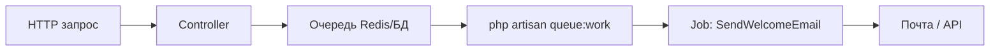

# Laravel — очереди и политики

<div class="article-tags">
  <span class="tag tag-required">ОБЯЗАТЕЛЬНО</span>
  <span class="tag tag-beginner">ДЛЯ НОВИЧКОВ</span>
</div>

<span class="complexity-badge">Разработчику</span>
<span class="complexity-badge">Архитектору</span>

---

## Laravel — очереди и политики

В этой статье две темы для реального [Laravel](./143.md)-проекта:

1. **Очереди (Queue)** — отложить тяжёлую работу, чтобы пользователь быстро получил ответ в браузере.
2. **Политики (Policies) и Gates** — явно описать, **кто** может создавать, редактировать или удалять конкретную запись.

Старт: [Первая программа на Laravel](./1431.md). Тесты: [PHPUnit](./145.md).

---

## Laravel Queue - фоновые задачи

После регистрации нужно сохранить пользователя и отправить письмо. Если всё в одном HTTP-запросе, пользователь ждёт SMTP. При сбое почты форма может упасть с ошибкой, хотя аккаунт уже создан.

**Очередь**: запрос быстро сохраняет пользователя и **кладёт задачу** "отправить письмо". Процесс **worker** выполняет её в фоне.



| Термин | Простыми словами |
|--------|------------------|
| **Job** | Класс с `handle()` — одна фоновая задача |
| **Dispatch** | Поставить job в очередь |
| **Worker** | `queue:work` — выполняет jobs |
| **Драйвер** | Где хранится список: `database`, `redis` |

---

## Job

```bash
php artisan make:job SendWelcomeEmail
```

`app/Jobs/SendWelcomeEmail.php`:

```php
<?php

namespace App\Jobs;

use App\Models\User;
use Illuminate\Contracts\Queue\ShouldQueue;
use Illuminate\Foundation\Queue\Queueable;
use Illuminate\Support\Facades\Mail;

class SendWelcomeEmail implements ShouldQueue
{
    use Queueable;

    public function __construct(public User $user) {}

    public function handle(): void
    {
        Mail::raw(
            "Добро пожаловать, {$this->user->name}",
            fn ($m) => $m->to($this->user->email)->subject('Регистрация')
        );
    }
}
```

| Элемент | Смысл |
|---------|--------|
| `ShouldQueue` | Выполнение через очередь |
| `Queueable` | `delay`, `onQueue` |
| `handle()` | Код worker |

```php
SendWelcomeEmail::dispatch($user);
SendWelcomeEmail::dispatch($user)->delay(now()->addMinutes(5));
```

---

## Драйвер и worker

```env
QUEUE_CONNECTION=database
```

```bash
php artisan queue:table
php artisan migrate
php artisan queue:work
```

На production часто **Redis** + [Horizon](https://laravel.com/docs/horizon).

---

### Тест

```php
Queue::fake();
// ... действие
Queue::assertPushed(SendWelcomeEmail::class);
```

---

## Policy

"Редактировать пост может только автор".

```bash
php artisan make:policy PostPolicy --model=Post
```

```php
public function update(User $user, Post $post): bool
{
    return $user->id === $post->user_id;
}
```

```php
$this->authorize('update', $post);
```

```blade
@can('update', $post)
  <a href="{{ route('posts.edit', $post) }}">Редактировать</a>
@endcan
```

---

## Gate

```php
Gate::define('admin-panel', fn ($user) => $user->is_admin);
```

| Механизм | Когда |
|----------|--------|
| **Policy** | CRUD вокруг модели |
| **Gate** | Глобальные права |

---

## Middleware и Policy

| | Middleware | Policy |
|---|------------|--------|
| Вопрос | Залогинен? | Может трогать **этот** объект? |
| Пример | `auth` | `update`, `delete` |

---

## Частые ошибки

| Симптом | Причина |
|---------|---------|
| Письма не приходят | Worker не запущен |
| 403 на своём посте | Policy не зарегистрирована |
| URL открывается без кнопки | Нет `authorize` в контроллере |

---

## Связанные материалы

- [Laravel](./143.md)
- [Laravel API с Sanctum](./1433.md)
- [PHPUnit](./145.md)
- [Symfony Messenger](./144.md)

---
---

{/* http-basics-link  */}
<div class="callout callout--tip">
  <div class="callout-title">Основа по протоколу</div>
  Базовый разбор HTTP и HTTPS находится в отдельной статье — [HTTP как основа веб-интеграций](/encyclopedia/2-system-network/2-09-osnovy-integratsionnogo-vzaimodeystviya/118).
</div>

