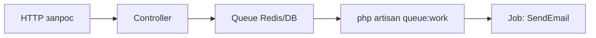

# Laravel — очереди и политики

<div class="article-tags">
  <span class="tag tag-required">ОБЯЗАТЕЛЬНО</span>
  <span class="tag tag-beginner">ДЛЯ НОВИЧКОВ</span>
</div>

<span class="complexity-badge">Разработчику</span>
<span class="complexity-badge">Архитектору</span>

## Laravel — очереди и политики

Две темы, без которых production-приложение на [Laravel](./143.md) редко обходится: **очереди** (долгие задачи вне HTTP-запроса) и **политики** (кто может что делать с моделью).

Старт проекта: [Первая программа на Laravel](./1431.md). Тесты очередей: [PHPUnit](./145.md).

---

## Зачем очереди

Отправка письма, генерация PDF, вызов внешнего API не должны блокировать ответ пользователю. Job кладётся в очередь; **worker** обрабатывает её в фоне.



---

## Job

```bash
php artisan make:job SendWelcomeEmail
```

`app/Jobs/SendWelcomeEmail.php`:

```php
<?php

namespace App\Jobs;

use App\Models\User;
use Illuminate\Contracts\Queue\ShouldQueue;
use Illuminate\Foundation\Queue\Queueable;
use Illuminate\Support\Facades\Mail;

class SendWelcomeEmail implements ShouldQueue
{
    use Queueable;

    public function __construct(public User $user) {}

    public function handle(): void
    {
        Mail::raw(
            "Добро пожаловать, {$this->user->name}",
            fn ($m) => $m->to($this->user->email)->subject('Регистрация')
        );
    }
}
```

Постановка в очередь:

```php
SendWelcomeEmail::dispatch($user);
// или с задержкой:
SendWelcomeEmail::dispatch($user)->delay(now()->addMinutes(5));
```

---

## Драйвер и worker

`.env` для разработки:

```env
QUEUE_CONNECTION=database
```

```bash
php artisan queue:table
php artisan migrate
php artisan queue:work
```

Для production часто **Redis** + [Laravel Horizon](https://laravel.com/docs/horizon) (дашборд и балансировка workers).

### Тест

```php
use App\Jobs\SendWelcomeEmail;
use Illuminate\Support\Facades\Queue;

Queue::fake();
// ... действие, которое диспатчит job
Queue::assertPushed(SendWelcomeEmail::class);
```

---

## Политики (Policies)

Правила доступа к модели, например «редактировать пост может только автор».

```bash
php artisan make:policy PostPolicy --model=Post
```

`app/Policies/PostPolicy.php`:

```php
<?php

namespace App\Policies;

use App\Models\Post;
use App\Models\User;

class PostPolicy
{
    public function update(User $user, Post $post): bool
    {
        return $user->id === $post->user_id;
    }

    public function delete(User $user, Post $post): bool
    {
        return $user->id === $post->user_id || $user->is_admin;
    }
}
```

Контроллер:

```php
public function update(Request $request, Post $post)
{
    $this->authorize('update', $post);
    $post->update($request->validated());
    return redirect()->route('posts.show', $post);
}
```

Blade:

```blade
@can('update', $post)
  <a href="{{ route('posts.edit', $post) }}">Редактировать</a>
@endcan
```

---

## Gates (разовые проверки)

`app/Providers/AppServiceProvider.php`:

```php
use Illuminate\Support\Facades\Gate;

public function boot(): void
{
    Gate::define('admin-panel', fn ($user) => $user->is_admin);
}
```

```php
if (Gate::allows('admin-panel')) { /* ... */ }
```

Policies предпочтительнее для CRUD вокруг модели; Gates — для глобальных флагов.

---

## Middleware vs Policy

| | Middleware | Policy |
|---|------------|--------|
| Уровень | Маршрут («залогинен?») | Действие над объектом («это его пост?») |
| Пример | `auth`, `verified` | `update`, `delete` |

---

## Связанные материалы

- [Laravel](./143.md)
- [Symfony Messenger](./144.md) — аналог очередей в Symfony
- [Экосистема PHP](./10.md)

---
