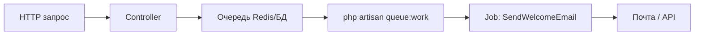

import ExternalCodeEmbed from '@site/src/components/ExternalCodeEmbed';


# Laravel — очереди и политики

<div class="article-tags">
  <span class="tag tag-required">ОБЯЗАТЕЛЬНО</span>
  <span class="tag tag-beginner">ДЛЯ НОВИЧКОВ</span>
</div>

<span class="complexity-badge">Разработчику</span>
<span class="complexity-badge">Архитектору</span>

---

## Laravel — очереди и политики

В этой статье две темы для реального [Laravel](./143.md)-проекта:

1. **Очереди (Queue)** — отложить тяжёлую работу, чтобы пользователь быстро получил ответ в браузере.
2. **Политики (Policies) и Gates** — явно описать, **кто** может создавать, редактировать или удалять конкретную запись.

Старт: [Первая программа на Laravel](./1431.md). Тесты: [PHPUnit](./145.md).

---

## Laravel Queue - фоновые задачи

После регистрации нужно сохранить пользователя и отправить письмо. Если всё в одном HTTP-запросе, пользователь ждёт SMTP. При сбое почты форма может упасть с ошибкой, хотя аккаунт уже создан.

**Очередь**: запрос быстро сохраняет пользователя и **кладёт задачу** "отправить письмо". Процесс **worker** выполняет её в фоне.



| Термин | Простыми словами |
|--------|------------------|
| **Job** | Класс с `handle()` — одна фоновая задача |
| **Dispatch** | Поставить job в очередь |
| **Worker** | `queue:work` — выполняет jobs |
| **Драйвер** | Где хранится список: `database`, `redis` |

---

## Job

```bash
php artisan make:job SendWelcomeEmail
```

Разбор:
- Команда `make:job` создает отдельный класс задачи в `app/Jobs`, чтобы вынести тяжелую операцию из HTTP-обработчика.
- Имя `SendWelcomeEmail` сразу фиксирует назначение job и упрощает поддержку.
- После генерации код задачи исполняется воркером, а не в момент ответа пользователю.

`app/Jobs/SendWelcomeEmail.php`:


<ExternalCodeEmbed example="php/php-507-1432-001" title="Job" minHeight={480} />


| Элемент | Смысл |
|---------|--------|
| `ShouldQueue` | Выполнение через очередь |
| `Queueable` | `delay`, `onQueue` |
| `handle()` | Код worker |

```php
SendWelcomeEmail::dispatch($user);
SendWelcomeEmail::dispatch($user)->delay(now()->addMinutes(5));
```

Разбор:
- `dispatch($user)` ставит задачу в очередь с нужным контекстом (пользователь для письма).
- `delay(...)` откладывает выполнение и полезен для сценариев "отправить позже".
- `now()->addMinutes(5)` делает временное поведение явным и читаемым.

---

## Драйвер и worker

```env
QUEUE_CONNECTION=database
```

Разбор:
- Переменная `QUEUE_CONNECTION` выбирает драйвер очереди.
- Значение `database` хранит задачи в таблице БД и подходит для учебного/простого продакшен-старта.
- В крупных системах часто переходят на `redis` для более высокой пропускной способности.

```bash
php artisan queue:table
php artisan migrate
php artisan queue:work
```

Разбор:
- `queue:table` генерирует миграцию служебной таблицы `jobs`.
- `migrate` создает таблицу в БД, после чего туда можно писать задачи.
- `queue:work` запускает воркер-процесс, который постоянно забирает и исполняет job.
- Без запущенного воркера задачи будут накапливаться, но не выполняться.

На production часто **Redis** + [Horizon](https://laravel.com/docs/horizon).

---

### Тест

```php
Queue::fake();
// ... действие
Queue::assertPushed(SendWelcomeEmail::class);
```

Разбор:
- `Queue::fake()` отключает реальную отправку задач и переводит очередь в тестовый режим.
- После действия тест проверяет факт постановки job через `assertPushed(...)`.
- Такой тест быстрый и стабильный: не требует SMTP, Redis и реального воркера.

---

## Policy

"Редактировать пост может только автор".

```bash
php artisan make:policy PostPolicy --model=Post
```

Разбор:
- Команда создает `PostPolicy` и сразу привязывает ее к модели `Post`.
- В политике удобно централизованно хранить все правила доступа к постам.
- Это снижает риск дублирования и расхождения логики авторизации по проекту.

```php
public function update(User $user, Post $post): bool
{
    return $user->id === $post->user_id;
}
```

Разбор:
- Метод `update` получает текущего пользователя и конкретный пост.
- Сравнение `id` реализует правило владения: редактировать может только автор.
- Возврат `bool` делает решение доступа однозначным для Laravel authorization layer.

```php
$this->authorize('update', $post);
```

Разбор:
- `authorize(...)` запускает policy-проверку на серверной стороне.
- При запрете Laravel автоматически вернет `403 Forbidden`.
- Проверка в контроллере обязательна, даже если UI уже скрывает кнопку через `@can`.

```blade
@can('update', $post)
  <a href="{{ route('posts.edit', $post) }}">Редактировать</a>
@endcan
```

Разбор:
- `@can` выполняет ту же проверку прав, но на уровне отображения интерфейса.
- Кнопка редактирования показывается только пользователям с доступом.
- Это улучшает UX, но не заменяет серверный `authorize(...)`.

---

## Gate

```php
Gate::define('admin-panel', fn ($user) => $user->is_admin);
```

Разбор:
- `Gate::define(...)` регистрирует глобальное правило доступа, не привязанное к конкретной модели.
- Замыкание проверяет флаг `is_admin` и возвращает итоговое решение.
- Gate подходит для системных разрешений вроде входа в админ-панель.

| Механизм | Когда |
|----------|--------|
| **Policy** | CRUD вокруг модели |
| **Gate** | Глобальные права |

---

## Middleware и Policy

| | Middleware | Policy |
|---|------------|--------|
| Вопрос | Залогинен? | Может трогать **этот** объект? |
| Пример | `auth` | `update`, `delete` |

---

## Частые ошибки

| Симптом | Причина |
|---------|---------|
| Письма не приходят | Worker не запущен |
| 403 на своём посте | Policy не зарегистрирована |
| URL открывается без кнопки | Нет `authorize` в контроллере |

---

## Связанные материалы

- [Laravel](./143.md)
- [Laravel API с Sanctum](./1433.md)
- [PHPUnit](./145.md)
- [Symfony Messenger](./144.md)

---

## Настройка очередей для production

Учебный драйвер `database` подходит для старта. В рабочих проектах чаще используют Redis и процесс-менеджер.

---

### Базовые настройки job

```php
class SendWelcomeEmail implements ShouldQueue
{
    public int $tries = 5;
    public int $timeout = 90;
    public int $backoff = 30;

    public function handle(): void
    {
        // ...
    }
}
```

Разбор:
- `$tries = 5` определяет максимум попыток исполнения задачи перед окончательным фейлом.
- `$timeout = 90` ограничивает длительность одной попытки, защищая воркер от зависаний.
- `$backoff = 30` добавляет паузу между повторами и снижает нагрузку на внешний сервис.
- В совокупности эти параметры делают очередь устойчивее к временным сбоям.

Эти параметры задают устойчивое выполнение при кратковременных сбоях внешних сервисов.

---

### Horizon и наблюдаемость

Для Redis удобно подключить Horizon: отдельная панель показывает очереди, время выполнения и повторные попытки. Это ускоряет диагностику инцидентов.

---

## Политики и модель угроз

Policy удобно проектировать от сценариев доступа:

- автор читает и редактирует свои записи;
- модератор проверяет и публикует;
- администратор управляет всеми объектами.

Такое разбиение дает прозрачные правила и предсказуемое поведение UI-кнопок `@can`.

---

### Практический минимум

1. Для каждого метода `create`, `update`, `delete` добавьте проверку `authorize` в контроллере.
2. Для списка записей фильтруйте коллекцию по текущему пользователю или роли.
3. Напишите тесты на `403` и `200` из [PHPUnit и тестирование PHP](./145.md).

Этот набор закрывает основные риски доступа уже на раннем этапе проекта.

---

{/* http-basics-link  */}
<div class="callout callout--tip">
  <div class="callout-title">Основа по протоколу</div>

  <div class="callout-body">
  Базовый разбор HTTP и HTTPS находится в отдельной статье — [HTTP как основа веб-интеграций](/encyclopedia/2-system-network/2-09-osnovy-integratsionnogo-vzaimodeystviya/118).
</div>
  </div>


