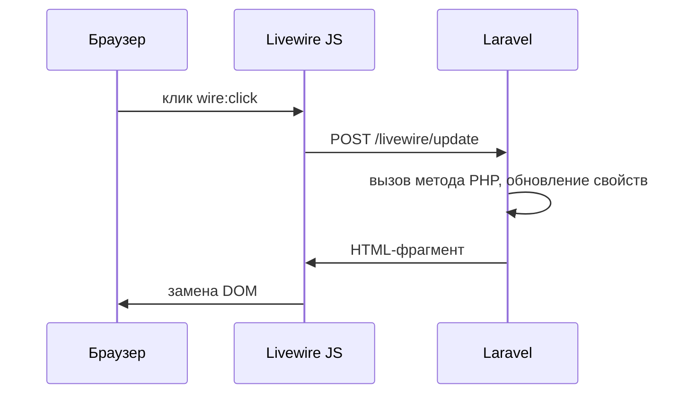

# Laravel и Livewire

<div class="article-tags">
  <span class="tag tag-required">ОБЯЗАТЕЛЬНО</span>
  <span class="tag tag-beginner">ДЛЯ НОВИЧКОВ</span>
</div>

<span class="complexity-badge">Разработчику</span>

---

## Laravel и Livewire

После [первой программы на Laravel](./1431.md) у вас классический сайт: форма отправляется, страница **полностью перезагружается**, сервер отдаёт новый HTML.

Для кнопок "+1 к лайкам", живого поиска по таблице, модальных окон без перезагрузки обычно пишут JavaScript (Vue, React) или берут **Livewire**.

**Livewire** — библиотека, где "компонент" — это **PHP-класс** + **Blade-шаблон**. При клике или вводе Livewire отправляет лёгкий AJAX-запрос на Laravel, обновляет свойства класса и перерисовывает только нужный фрагмент HTML. Отдельный SPA и сборка webpack для простых задач часто не нужны.

| Подход | Когда уместен |
|--------|----------------|
| Blade + формы | Простые CRUD, SEO-страницы, минимум JS |
| **Livewire** | Интерактив внутри Laravel одной командой PHP |
| [Sanctum + SPA](./1433.md) | Отдельный фронт на React/Vue, мобильное приложение |
| [Inertia.js](https://inertiajs.com) | Vue/React, но маршруты остаются в Laravel |

---

## Как это работает (без магии)



В layout обязательны `@livewireStyles` и `@livewireScripts` — они подключают небольшой JS, который перехватывает действия. CSRF-токен в layout (`@csrf` или meta) нужен для POST-запросов Livewire.

---

## Установка

```bash
composer require livewire/livewire
```

В `resources/views/layouts/app.blade.php` перед `</body>`:

```blade
@livewireStyles
@livewireScripts
```

---

## Первый компонент — счётчик

```bash
php artisan make:livewire Counter
```

Создаются:

- `app/Livewire/Counter.php` — логика;
- `resources/views/livewire/counter.blade.php` — разметка.

`app/Livewire/Counter.php`:

```php
<?php

namespace App\Livewire;

use Livewire\Component;

class Counter extends Component
{
    public int $count = 0;

    public function increment(): void
    {
        $this->count++;
    }

    public function decrement(): void
    {
        $this->count--;
    }

    public function render()
    {
        return view('livewire.counter');
    }
}
```

| Элемент | Смысл |
|---------|--------|
| `public int $count` | Свойство, видимое шаблону и сериализуемое при запросах Livewire |
| `increment()` | Публичный метод — можно вызвать из шаблона через `wire:click` |
| `render()` | Какой Blade вернуть |

Шаблон `resources/views/livewire/counter.blade.php`:

```blade
<div>
    <h2>Счётчик: {{ $count }}</h2>
    <button type="button" wire:click="increment">+</button>
    <button type="button" wire:click="decrement">−</button>
</div>
```

`wire:click="increment"` — по клику вызвать метод `increment` на сервере. Важно `type="button"`, иначе кнопка внутри `<form>` отправит форму целиком.

Подключение на странице:

```blade
@extends('layouts.app')

@section('content')
    <h1>Livewire</h1>
    <livewire:counter />
@endsection
```

Маршрут:

```php
Route::view('/livewire-demo', 'counter-page');
```

`php artisan serve` → `/livewire-demo`. Страница не перезагружается при +/- .

---

## `wire:model` — связь поля и свойства

Аналог `v-model` во Vue: значение input синхронизируется с PHP-свойством.

```bash
php artisan make:livewire TaskSearch
```

```php
<?php

namespace App\Livewire;

use App\Models\Task;
use Livewire\Component;

class TaskSearch extends Component
{
    public string $query = '';

    public function render()
    {
        $tasks = Task::query()
            ->when($this->query, fn ($q) => $q->where('title', 'like', '%'.$this->query.'%'))
            ->orderByDesc('id')
            ->limit(20)
            ->get();

        return view('livewire.task-search', compact('tasks'));
    }
}
```

Шаблон:

```blade
<div>
    <input type="search"
           wire:model.live.debounce.300ms="query"
           placeholder="Поиск…" />

    <ul class="mt-4">
        @forelse ($tasks as $task)
            <li>{{ $task->title }}</li>
        @empty
            <li>Ничего не найдено</li>
        @endforelse
    </ul>
</div>
```

---

### Разбор директив

| Директива | Смысл |
|-----------|--------|
| `wire:model="query"` | Двусторонняя связь с `$query` |
| `.live` | Обновлять при каждом вводе (без ожидания blur) |
| `.debounce.300ms` | Ждать 300 мс паузы в наборе — меньше запросов к серверу |

Модель `Task`: `php artisan make:model Task -m`, поле `title` в миграции.

---

## Валидация

Те же правила, что в HTTP-контроллере:

```php
public string $title = '';

public function save(): void
{
    $this->validate([
        'title' => 'required|string|max:200',
    ]);

    Task::create(['title' => $this->title]);
    $this->reset('title');
    $this->dispatch('task-saved');
}
```

```blade
<input wire:model="title" />
@error('title') <span class="text-red-600">{{ $message }}</span> @enderror
<button type="button" wire:click="save">Добавить</button>
```

`@error` — директива Laravel для сообщений валидации. `dispatch('task-saved')` — событие для других JS/Livewire-компонентов (опционально).

---

## Livewire и API — разные клиенты

| Сценарий | Инструмент |
|----------|------------|
| Сайт в Blade, кнопки и формы на сервере | Livewire |
| Мобильное приложение, отдельный React | [Sanctum API](./1433.md) |

Один проект может совмещать: публичная часть на Livewire, `/api` для мобильного клиента.

---

## Тестирование Livewire

```php
Livewire::test(Counter::class)
    ->call('increment')
    ->assertSet('count', 1);
```

Без браузера проверяется логика компонента.

---

## Частые ошибки

| Симптом | Причина |
|---------|---------|
| Полная перезагрузка страницы | Нет `@livewireScripts` или `type="submit"` без `wire:submit` |
| 419 | Нет CSRF в layout |
| Свойство не меняется | Свойство `private` или опечатка в `wire:model` |
| Медленный поиск | Убрали debounce; нет индекса на `title` в БД |

---

## Что попробовать

1. [Filament](./1435.md) — админка на Livewire без ручной вёрстки таблиц.
2. Trait `WithPagination` для длинных списков.
3. [Очереди](./1432.md) — тяжёлую работу после `save()` уводить в job.

---

## Связанные материалы

- [Первая программа на Laravel](./1431.md)
- [Laravel API и Sanctum](./1433.md)
- [Filament](./1435.md)
- [Laravel MVC](./143.md)

---

## Производительность Livewire-компонентов

Интерактивные экраны быстро растут, поэтому полезно сразу держать дисциплину запросов и рендеринга.

| Прием | Польза |
|---|---|
| `debounce` на поиске | Меньше HTTP-запросов при наборе |
| пагинация `WithPagination` | Короче SQL и меньше HTML в ответе |
| индексы в БД для полей фильтрации | Быстрее выборка |
| кеширование справочников | Быстрее первичный рендер |

---

### Мини-проверка

1. Включите debugbar или profiler.
2. Посмотрите число запросов на один ввод символа.
3. Оптимизируйте компонент до стабильной задержки интерфейса.

---

## Когда выбрать Livewire, а когда API + SPA

Выбор удобно делать по клиентам системы.

- Один веб-клиент и команда PHP: Livewire дает быструю реализацию.
- Несколько клиентов (web, mobile, partner API): логично строить API-слой как в [1433](./1433.md).
- Внутренняя админка: отличный сценарий для [Filament](./1435.md).

Такой подход экономит время команды и снижает архитектурные развилки в середине проекта.

---

{/* http-basics-link  */}
<div class="callout callout--tip">
  <div class="callout-title">Основа по протоколу</div>

  <div class="callout-body">
  Базовый разбор HTTP и HTTPS находится в отдельной статье — [HTTP как основа веб-интеграций](/encyclopedia/2-system-network/2-09-osnovy-integratsionnogo-vzaimodeystviya/118).
</div>
  </div>


