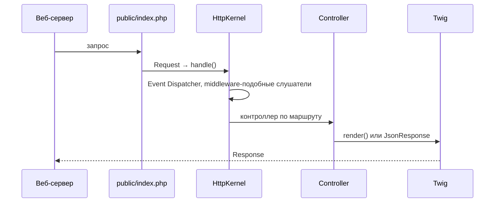

# Symfony

<div class="article-tags">
  <span class="tag tag-required">ОБЯЗАТЕЛЬНО</span>
  <span class="tag tag-beginner">ДЛЯ НОВИЧКОВ</span>
</div>

<span class="complexity-badge">Разработчику</span>
<span class="complexity-badge">Архитектору</span>

---

## Symfony

**Symfony** — зрелый PHP-фреймворк и набор переиспользуемых **компонентов** (HTTP, Console, Messenger, Validator и др.). Laravel и API Platform опираются на части Symfony; многие enterprise-проекты выбирают Symfony напрямую за предсказуемость, долгую поддержку LTS и строгую архитектуру.

Пошаговый старт: [Первая программа на Symfony](./1441.md). Шпаргалка: [Справочник по Symfony](./1442.md). Сравнение с Laravel: [Laravel](./143.md), [Экосистема PHP-приложений](./10.md).

---

## Философия — компоненты и полный фреймворк

| Подход | Описание |
|--------|----------|
| **Только компоненты** | Подключить `symfony/http-foundation` + `routing` в свой проект |
| **Symfony Framework** | Соглашения, бандлы, DI, конфигурация YAML/PHP |
| **Symfony Flex** | Рецепты: после `composer require` автоматически настраиваются файлы |

Требования: **PHP 8.2+**, Composer, расширения `ctype`, `iconv`, `mbstring` (см. официальную документацию для вашей версии).

---

## Жизненный цикл HTTP-запроса



Точка входа — **`public/index.php`**. Каталог `public/` — единственная директория, доступная извне (аналогично Laravel).

---

## Ключевые понятия

### Бандлы (Bundles)

Модуль функциональности: регистрирует маршруты, сервисы, шаблоны. `FrameworkBundle`, `TwigBundle`, `SecurityBundle` — стандартный набор.

---

### DI-контейнер

Зависимости объявляются в `config/services.yaml` и внедряются через конструктор:

```php
public function __construct(
    private readonly EntityManagerInterface $em,
) {}
```

Разбор:
- `public function __construct(...)` — конструктор класса; вызывается автоматически при создании объекта.
- `private readonly EntityManagerInterface $em` — свойство сразу объявляется в сигнатуре конструктора, получает зависимость и после инициализации не может быть переопределено.
- `EntityManagerInterface` — контракт Doctrine для работы с сущностями: `persist()`, `flush()`, `remove()`, работа с Unit of Work.
- Такой стиль называется constructor injection — сервис получает зависимости явно, что упрощает тестирование и замену реализаций.
- Symfony DI-контейнер по типу `EntityManagerInterface` автоматически подставляет подходящий сервис при создании класса.

Автоконфигурация помечает классы в `src/` как сервисы.

---

### Маршрутизация

Атрибуты PHP 8 (предпочтительно в новых проектах):

```php
#[Route('/hello', name: 'app_hello')]
public function hello(): Response
{
    return new Response('Hello');
}
```

Разбор:
- `#[Route(...)]` — PHP-атрибут, который объявляет маршрут прямо над методом контроллера.
- `'/hello'` — URL-путь; при GET-запросе на этот адрес роутер направляет выполнение в метод `hello()`.
- `name: 'app_hello'` — внутреннее имя маршрута для генерации ссылок через `path('app_hello')` и `url('app_hello')`.
- `public function hello(): Response` — метод обязан вернуть объект `Response`, чтобы Symfony отправил корректный HTTP-ответ.
- `new Response('Hello')` — формирует тело ответа со строкой `Hello`; при необходимости можно дополнить заголовки и статус-код.

---

### Doctrine ORM

Стандарт де-факто для работы с БД: сущности, репозитории, миграции (`php bin/console make:migration`).

---

### Messenger

Асинхронные задачи и очереди — аналог Laravel Queue. Транспорты: AMQP, Redis, Doctrine.

---

### Security

Firewall, аутентификация (form login, JWT через пакеты), роли и voters для авторизации.

---

## Symfony и Laravel

| | Symfony | Laravel |
|---|---------|---------|
| Стиль | Явная конфигурация, enterprise | Выразительные соглашения, скорость старта |
| ORM | Doctrine (Data Mapper) | Eloquent (Active Record) |
| Шаблоны | Twig | Blade |
| CLI | `bin/console` | `artisan` |
| Типичный заказчик | Банки, госсектор, крупный B2B | Стартапы, агентства, широкий рынок |

Оба фреймворка "взрослые"; выбор часто определяется командой и политикой компании, а не "слабостью" технологии.

---

## Инструменты

```bash
symfony new myapp --webapp    # скелет с Twig, Doctrine, Security
composer require symfony/orm-pack
php bin/console cache:clear
php bin/console debug:router
symfony server:start          # локальный сервер (Symfony CLI)
```

Разбор:
- `symfony new myapp --webapp` — создаёт полноценный стартовый проект с веб-стеком, включая шаблонизатор и стандартные пакеты.
- `composer require symfony/orm-pack` — подключает набор ORM-зависимостей для работы с Doctrine и миграциями.
- `php bin/console cache:clear` — очищает кэш контейнера и конфигурации; полезно после изменений в сервисах/маршрутах.
- `php bin/console debug:router` — выводит таблицу зарегистрированных маршрутов, HTTP-методы и соответствующие контроллеры.
- `symfony server:start` — запускает локальный сервер Symfony CLI, удобно для разработки без отдельной конфигурации Nginx/Apache.

---

## Связанные материалы

- [Первая программа на Symfony](./1441.md)
- [Composer](./111.md)
- [Модель исполнения PHP](./101.md)
- [Фреймворки и библиотеки PHP](./12.md)

---

## Где Symfony особенно силен

Symfony часто выбирают в проектах с длинным жизненным циклом и строгими требованиями к поддержке.

| Сценарий | Почему Symfony подходит |
|---|---|
| Крупные B2B-системы | Явная конфигурация и строгая структура модулей |
| API с высокими требованиями к контрактам | Сильная экосистема вокруг Serializer, Validator, Messenger |
| Интеграционные платформы | Компонентный подход и предсказуемый DI |

Такой профиль хорошо ложится на команды, где важна управляемость изменений между релизами.

---

## Практический маршрут изучения Symfony

1. Пройти [первую программу на Symfony](./1441.md).
2. Поднять CRUD с Doctrine и миграциями.
3. Добавить Messenger для фоновой задачи и сравнить с [очередями Laravel](./1432.md).
4. Закрыть качество тестами из [PHPUnit и тестирование PHP](./145.md).

После этих шагов Symfony воспринимается как понятный рабочий инструмент, а не как академический набор терминов.

---

{/* http-basics-link  */}
<div class="callout callout--tip">
  <div class="callout-title">Основа по протоколу</div>

  <div class="callout-body">
  Базовый разбор HTTP и HTTPS находится в отдельной статье — [HTTP как основа веб-интеграций](/encyclopedia/2-system-network/2-09-osnovy-integratsionnogo-vzaimodeystviya/118).
</div>
  </div>


