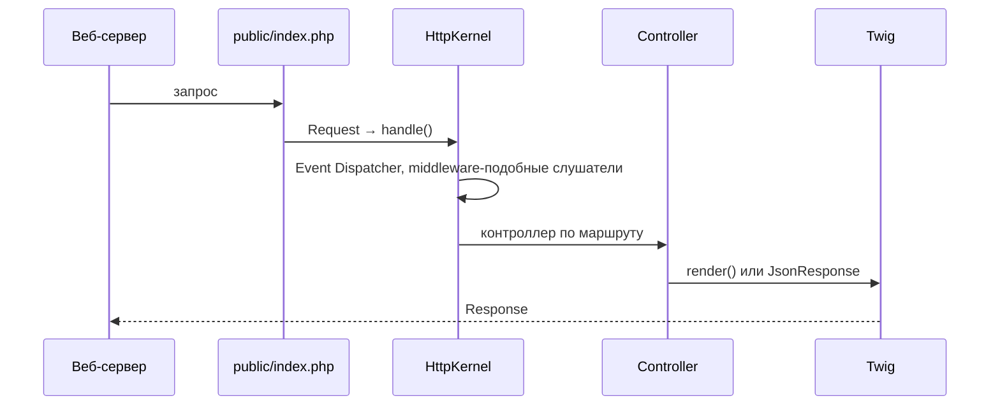

# Symfony

<div class="article-tags">
  <span class="tag tag-required">ОБЯЗАТЕЛЬНО</span>
  <span class="tag tag-beginner">ДЛЯ НОВИЧКОВ</span>
</div>

<span class="complexity-badge">Разработчику</span>
<span class="complexity-badge">Архитектору</span>

---

## Symfony

**Symfony** — зрелый PHP-фреймворк и набор переиспользуемых **компонентов** (HTTP, Console, Messenger, Validator и др.). Laravel и API Platform опираются на части Symfony; многие enterprise-проекты выбирают Symfony напрямую за предсказуемость, долгую поддержку LTS и строгую архитектуру.

Пошаговый старт: [Первая программа на Symfony](./1441.md). Шпаргалка: [Справочник по Symfony](./1442.md). Сравнение с Laravel: [Laravel](./143.md), [Экосистема PHP-приложений](./10.md).

---

## Философия — компоненты и полный фреймворк

| Подход | Описание |
|--------|----------|
| **Только компоненты** | Подключить `symfony/http-foundation` + `routing` в свой проект |
| **Symfony Framework** | Соглашения, бандлы, DI, конфигурация YAML/PHP |
| **Symfony Flex** | Рецепты: после `composer require` автоматически настраиваются файлы |

Требования: **PHP 8.2+**, Composer, расширения `ctype`, `iconv`, `mbstring` (см. официальную документацию для вашей версии).

---

## Жизненный цикл HTTP-запроса



Точка входа — **`public/index.php`**. Каталог `public/` — единственная директория, доступная извне (аналогично Laravel).

---

## Ключевые понятия

### Бандлы (Bundles)

Модуль функциональности: регистрирует маршруты, сервисы, шаблоны. `FrameworkBundle`, `TwigBundle`, `SecurityBundle` — стандартный набор.

---

### DI-контейнер

Зависимости объявляются в `config/services.yaml` и внедряются через конструктор:

```php
public function __construct(
    private readonly EntityManagerInterface $em,
) {}
```

Автоконфигурация помечает классы в `src/` как сервисы.

---

### Маршрутизация

Атрибуты PHP 8 (предпочтительно в новых проектах):

```php
#[Route('/hello', name: 'app_hello')]
public function hello(): Response
{
    return new Response('Hello');
}
```

---

### Doctrine ORM

Стандарт де-факто для работы с БД: сущности, репозитории, миграции (`php bin/console make:migration`).

---

### Messenger

Асинхронные задачи и очереди — аналог Laravel Queue. Транспорты: AMQP, Redis, Doctrine.

---

### Security

Firewall, аутентификация (form login, JWT через пакеты), роли и voters для авторизации.

---

## Symfony и Laravel

| | Symfony | Laravel |
|---|---------|---------|
| Стиль | Явная конфигурация, enterprise | Выразительные соглашения, скорость старта |
| ORM | Doctrine (Data Mapper) | Eloquent (Active Record) |
| Шаблоны | Twig | Blade |
| CLI | `bin/console` | `artisan` |
| Типичный заказчик | Банки, госсектор, крупный B2B | Стартапы, агентства, широкий рынок |

Оба фреймворка "взрослые"; выбор часто определяется командой и политикой компании, а не "слабостью" технологии.

---

## Инструменты

```bash
symfony new myapp --webapp    # скелет с Twig, Doctrine, Security
composer require symfony/orm-pack
php bin/console cache:clear
php bin/console debug:router
symfony server:start          # локальный сервер (Symfony CLI)
```

---

## Связанные материалы

- [Первая программа на Symfony](./1441.md)
- [Composer](./111.md)
- [Модель исполнения PHP](./101.md)
- [Фреймворки и библиотеки PHP](./12.md)

---
