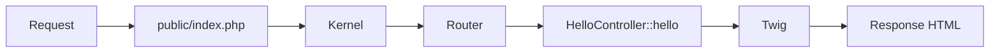

import FirstProgramPlay from '@site/src/components/FirstProgramPlay.jsx';

# Первая программа на Symfony

<div class="article-tags">
  <span class="tag tag-required">ОБЯЗАТЕЛЬНО</span>
  <span class="tag tag-beginner">ДЛЯ НОВИЧКОВ</span>
</div>

<span class="complexity-badge">Разработчику</span>
<span class="complexity-badge">Архитектору</span>

<FirstProgramPlay language="symfony" />

---

## Первая программа на Symfony

### Где применяют Symfony

**Symfony** — зрелый PHP-фреймворк с **компонентами**, **DI-контейнером** и явной конфигурацией. [Laravel](./1431.md) быстрее даёт "сайт из коробки"; Symfony часто выбирают в enterprise и долгоживущих API.

Для первого знакомства — страница "Привет, {'{имя}'}" и JSON `/api/hello`: видны маршрут, контроллер и **Twig**.

Обзор: [144.md](./144.md). База PHP: [13.md](./13.md). Composer: [111.md](./111.md).

---

### Что получится

| URL | Результат |
|-----|-----------|
| `/hello/World` | HTML "Привет, World!" |
| `/api/hello` | `{"message":"Hello from Symfony API"}` |

---

## Термины Symfony

| Термин | Значение |
|--------|----------|
| **Kernel** | Ядро: конфиг, бандлы, обработка запроса |
| **Контроллер** | Класс, возвращающий `Response` |
| **Twig** | Шаблонизатор (`{{ name }}`) |
| **`#[Route]`** | Маршрут над методом PHP |
| **DI** | Зависимости через конструктор автоматически |
| **Document root** | Только `public/` открыт веб-серверу |

---

## Требования

- PHP 8.2+
- [Composer](./111.md)
- [Symfony CLI](https://symfony.com/download) (рекомендуется)

---

## Создание проекта

```bash
symfony new symfony-hello --webapp
cd symfony-hello
```

Без CLI:

```bash
composer create-project symfony/skeleton symfony-hello
cd symfony-hello
composer require webapp
```

```bash
symfony server:start
# или
php -S 127.0.0.1:8000 -t public
```

Веб-сервер смотрит в **`public/`** (`public/index.php`). Каталоги `src/`, `config/`, `.env` из браузера недоступны.

---

## Контроллер

```bash
php bin/console make:controller HelloController
```

`src/Controller/HelloController.php`:

```php
<?php

namespace App\Controller;

use Symfony\Bundle\FrameworkBundle\Controller\AbstractController;
use Symfony\Component\HttpFoundation\Response;
use Symfony\Component\Routing\Attribute\Route;

class HelloController extends AbstractController
{
    #[Route('/hello/{name}', name: 'app_hello', requirements: ['name' => '[a-zA-Z]+'], defaults: ['name' => 'World'])]
    public function hello(string $name): Response
    {
        return $this->render('hello/hello.html.twig', [
            'name' => $name,
        ]);
    }

    #[Route('/api/hello', name: 'api_hello', methods: ['GET'])]
    public function apiHello(): Response
    {
        return $this->json(['message' => 'Hello from Symfony API']);
    }
}
```

---

### Разбор атрибута маршрута

| Параметр | Смысл |
|----------|--------|
| `'/hello/{name}'` | Сегмент `{name}` → аргумент `$name` |
| `name: 'app_hello'` | Имя для `path()` в Twig |
| `requirements` | Regex — кириллицу в path лучше в query |
| `defaults` | `/hello` → имя `World` |
| `methods: ['GET']` | Только GET для API |

```bash
php bin/console debug:router
```

---

## Шаблон Twig

`templates/hello/hello.html.twig`:

```twig


Привет


  <h1>Привет, {{ name }}!</h1>
  <p>Это ваша первая страница на Symfony.</p>

```

| Синтаксис | Смысл |
|-----------|--------|
| `` | Общий layout |
| `` | Переопределяемая секция |
| `{{ name }}` | Вывод с экранированием (XSS) |

---

## Структура каталогов

| Путь | Назначение |
|------|------------|
| `src/Controller/` | HTTP-обработчики |
| `src/Entity/` | Doctrine |
| `templates/` | Twig |
| `config/` | Сервисы, пакеты |
| `public/` | `index.php` |
| `var/` | Кэш, логи |

---

## Как запрос доходит до контроллера



---

## Частые ошибки

| Симптом | Причина |
|---------|---------|
| 404 на все URL | Document root не `public/` |
| Twig not found | Опечатка в пути шаблона |
| 500 после правок | `php bin/console cache:clear` |

---

## Что попробовать

1. `make:entity Note` — Doctrine.
2. `GET /api/notes` — JSON.
3. Сравнить с [Laravel-счётчиком](./1431.md).

---

## Дальше

- Security, API Platform;
- [Справочник Symfony](./1442.md);
- деплой: `APP_ENV=prod`, document root = `public/`.

---

## Мини-расширение после первого запуска

После страницы приветствия полезно добавить небольшую практику с формой и сохранением данных.

---

### Что сделать за 30 минут

- Создать сущность `Feedback`.
- Сделать форму с полями `name` и `message`.
- Сохранить запись через Doctrine.
- Вернуть подтверждение в Twig.

Этот шаг закрепляет полный путь: маршрут → контроллер → валидация → БД → шаблон.

---

## Команды, которые пригодятся в каждом проекте Symfony

```bash
php bin/console debug:container
php bin/console debug:event-dispatcher
php bin/console doctrine:migrations:status
php bin/console about
```

Эти команды ускоряют диагностику конфигурации и помогают быстро ориентироваться в новом коде.

Связанные материалы: [Symfony](./144.md), [Laravel](./143.md), [PHPUnit](./145.md).

---

{/* http-basics-link  */}
<div class="callout callout--tip">
  <div class="callout-title">Основа по протоколу</div>

  <div class="callout-body">
  Базовый разбор HTTP и HTTPS находится в отдельной статье — [HTTP как основа веб-интеграций](/encyclopedia/2-system-network/2-09-osnovy-integratsionnogo-vzaimodeystviya/118).
</div>
  </div>


