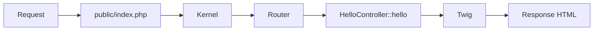

import ExternalCodeEmbed from '@site/src/components/ExternalCodeEmbed';


import ExternalPlayEmbed from '@site/src/components/ExternalPlayEmbed';


# Первая программа на Symfony

<div class="article-tags">
  <span class="tag tag-required">ОБЯЗАТЕЛЬНО</span>
  <span class="tag tag-beginner">ДЛЯ НОВИЧКОВ</span>
</div>

<span class="complexity-badge">Разработчику</span>
<span class="complexity-badge">Архитектору</span>

<ExternalPlayEmbed example="lab/first-program-play" title="Первая программа" minHeight={420} playProps={{ language: 'symfony' }} />

---

## Первая программа на Symfony

### Где применяют Symfony

**Symfony** — зрелый PHP-фреймворк с **компонентами**, **DI-контейнером** и явной конфигурацией. [Laravel](./1431.md) быстрее даёт "сайт из коробки"; Symfony часто выбирают в enterprise и долгоживущих API.

Для первого знакомства — страница "Привет, {'{имя}'}" и JSON `/api/hello`: видны маршрут, контроллер и **Twig**.

Обзор: [Symfony](./144.md). База PHP: [Первая программа на PHP](./13.md). Composer: [Composer - управление зависимостями в PHP](./111.md).

---

### Что получится

| URL | Результат |
|-----|-----------|
| `/hello/World` | HTML "Привет, World!" |
| `/api/hello` | `{"message":"Hello from Symfony API"}` |

---

## Термины Symfony

| Термин | Значение |
|--------|----------|
| **Kernel** | Ядро: конфиг, бандлы, обработка запроса |
| **Контроллер** | Класс, возвращающий `Response` |
| **Twig** | Шаблонизатор (`{{ name }}`) |
| **`#[Route]`** | Маршрут над методом PHP |
| **DI** | Зависимости через конструктор автоматически |
| **Document root** | Только `public/` открыт веб-серверу |

---

## Требования

- PHP 8.2+
- [Composer](./111.md)
- [Symfony CLI](https://symfony.com/download) (рекомендуется)

---

## Создание проекта

```bash
symfony new symfony-hello --webapp
cd symfony-hello
```

Разбор:
- `symfony new symfony-hello --webapp` — создаёт новый Symfony-проект с преднастроенным веб-набором пакетов.
- `symfony-hello` — имя каталога проекта; в нём появятся `src/`, `config/`, `public/`, `templates/`.
- Ключ `--webapp` включает практичные стартовые зависимости для серверного HTML-приложения.
- `cd symfony-hello` — переход в корень проекта, где находятся `composer.json` и `bin/console`.
- После этой команды все последующие CLI-операции выполняются уже в контексте созданного приложения.

Без CLI:

```bash
composer create-project symfony/skeleton symfony-hello
cd symfony-hello
composer require webapp
```

Разбор:
- `composer create-project symfony/skeleton symfony-hello` — устанавливает минимальный каркас Symfony через Composer.
- `symfony/skeleton` — облегченное стартовое ядро без расширенного веб-обвеса.
- `composer require webapp` — добавляет webapp-pack и подтягивает ключевые пакеты для обычного веб-проекта.
- Такой путь полезен, если Symfony CLI не установлен или в команде стандартизирован запуск через Composer.
- В результате структура проекта совпадает с типичным Symfony-приложением и готова к добавлению контроллеров.

```bash
symfony server:start
# или
php -S 127.0.0.1:8000 -t public
```

Разбор:
- `symfony server:start` — запускает локальный dev-сервер Symfony CLI с удобными настройками для фреймворка.
- `php -S 127.0.0.1:8000 -t public` — встроенный сервер PHP; `-t public` задаёт document root на публичную директорию.
- Строка `# или` показывает альтернативу: выбирается один из двух способов запуска.
- Привязка к `127.0.0.1:8000` ограничивает доступ локальной машиной, что подходит для разработки.
- Оба варианта направляют запросы в `public/index.php`, откуда стартует жизненный цикл Symfony.

Веб-сервер смотрит в **`public/`** (`public/index.php`). Каталоги `src/`, `config/`, `.env` из браузера недоступны.

---

## Контроллер

```bash
php bin/console make:controller HelloController
```

Разбор:
- `php bin/console` — точка входа в CLI-инструменты Symfony.
- `make:controller` — генератор из MakerBundle для быстрого создания контроллера и шаблона.
- `HelloController` — имя класса; Symfony создаёт файл `src/Controller/HelloController.php`.
- Команда ускоряет старт и задаёт базовую структуру метода-обработчика.
- После генерации код обычно дорабатывают вручную под конкретные маршруты и ответы.

`src/Controller/HelloController.php`:


<ExternalCodeEmbed example="php/php-507-1441-001" title="Контроллер" minHeight={498} />


Разбор:
- `namespace App\Controller;` — пространство имён; автозагрузка PSR-4 связывает его с `src/Controller`.
- `use ... Response` и `use ... Route` подключают классы ответа и атрибута маршрутизации.
- `class HelloController extends AbstractController` — наследование даёт хелперы `render()` и `json()`.
- `#[Route('/hello/{name}', ...)]` — маршрут с параметром URL; `requirements` ограничивает формат, `defaults` задаёт значение по умолчанию.
- `hello(string $name): Response` принимает параметр маршрута, передаёт данные в Twig и возвращает HTML-ответ.
- `render('hello/hello.html.twig', ['name' => $name])` рендерит шаблон и прокидывает переменную `name`.
- `#[Route('/api/hello', ... methods: ['GET'])]` ограничивает API-метод только HTTP GET.
- `apiHello()` возвращает JSON через `$this->json(...)`, что удобно для API-эндпоинтов.

---

### Разбор атрибута маршрута

| Параметр | Смысл |
|----------|--------|
| `'/hello/{name}'` | Сегмент `{name}` → аргумент `$name` |
| `name: 'app_hello'` | Имя для `path()` в Twig |
| `requirements` | Regex — кириллицу в path лучше в query |
| `defaults` | `/hello` → имя `World` |
| `methods: ['GET']` | Только GET для API |

```bash
php bin/console debug:router
```

Разбор:
- `debug:router` выводит зарегистрированные маршруты приложения.
- В таблице видны путь, имя маршрута, разрешённые HTTP-методы и целевой контроллер.
- Команда помогает быстро проверить, что атрибут `#[Route(...)]` действительно распознан.
- При 404 это первый диагностический шаг: видно, совпадает ли URL и метод запроса.
- Полезно запускать после добавления новых маршрутов или рефакторинга контроллеров.

---

## Шаблон Twig

`templates/hello/hello.html.twig`:

```twig


Привет


  <h1>Привет, {{ name }}!</h1>
  <p>Это ваша первая страница на Symfony.</p>

```

Разбор:
- `` — наследует базовый layout, чтобы не дублировать каркас страницы.
- `` — задаёт содержимое блока заголовка для этой страницы.
- `` — основная область контента, которую Twig подставляет в layout.
- `{{ name }}` — вывод переменной, переданной из контроллера; Twig экранирует HTML по умолчанию.
- Такой подход разделяет ответственность: контроллер готовит данные, Twig отвечает за представление.

| Синтаксис | Смысл |
|-----------|--------|
| `` | Общий layout |
| `` | Переопределяемая секция |
| `{{ name }}` | Вывод с экранированием (XSS) |

---

## Структура каталогов

| Путь | Назначение |
|------|------------|
| `src/Controller/` | HTTP-обработчики |
| `src/Entity/` | Doctrine |
| `templates/` | Twig |
| `config/` | Сервисы, пакеты |
| `public/` | `index.php` |
| `var/` | Кэш, логи |

---

## Как запрос доходит до контроллера



Разбор:
- Диаграмма показывает путь HTTP-запроса от клиента до финального HTML-ответа.
- `public/index.php` — единая точка входа, где поднимается ядро Symfony.
- `Kernel` и `Router` определяют, какой контроллер обработает конкретный URL.
- `HelloController::hello` готовит данные для шаблона и инициирует рендер.
- `Twig` формирует итоговую HTML-страницу, после чего `Response` отправляется в браузер.

---

## Частые ошибки

| Симптом | Причина |
|---------|---------|
| 404 на все URL | Document root не `public/` |
| Twig not found | Опечатка в пути шаблона |
| 500 после правок | `php bin/console cache:clear` |

---

## Что попробовать

1. `make:entity Note` — Doctrine.
2. `GET /api/notes` — JSON.
3. Сравнить с [Laravel-счётчиком](./1431.md).

---

## Дальше

- Security, API Platform;
- [Справочник Symfony](./1442.md);
- деплой: `APP_ENV=prod`, document root = `public/`.

---

## Мини-расширение после первого запуска

После страницы приветствия полезно добавить небольшую практику с формой и сохранением данных.

---

### Что сделать за 30 минут

- Создать сущность `Feedback`.
- Сделать форму с полями `name` и `message`.
- Сохранить запись через Doctrine.
- Вернуть подтверждение в Twig.

Этот шаг закрепляет полный путь: маршрут → контроллер → валидация → БД → шаблон.

---

## Команды, которые пригодятся в каждом проекте Symfony

```bash
php bin/console debug:container
php bin/console debug:event-dispatcher
php bin/console doctrine:migrations:status
php bin/console about
```

Разбор:
- `debug:container` показывает доступные сервисы DI-контейнера и их идентификаторы.
- `debug:event-dispatcher` выводит события и подписчиков, что полезно для трассировки поведения приложения.
- `doctrine:migrations:status` отображает состояние миграций: какие применены и какие ожидают запуска.
- `about` печатает сводную информацию о проекте и окружении Symfony.
- Набор команд закрывает типовые задачи диагностики: сервисы, события, база данных и окружение.

Эти команды ускоряют диагностику конфигурации и помогают быстро ориентироваться в новом коде.

Связанные материалы: [Symfony](./144.md), [Laravel](./143.md), [PHPUnit](./145.md).

---

{/* http-basics-link  */}
<div class="callout callout--tip">
  <div class="callout-title">Основа по протоколу</div>

  <div class="callout-body">
  Базовый разбор HTTP и HTTPS находится в отдельной статье — [HTTP как основа веб-интеграций](/encyclopedia/2-system-network/2-09-osnovy-integratsionnogo-vzaimodeystviya/118).
</div>
  </div>

{/* sidebar-collections */}

---

## В подборках

Статья входит в [тематические подборки](/about/collections) и блок «С чего начать?» на [главной](/). Соседние шаги того же маршрута:

**Первые шаги** ([маршрут подборки](/about/collections/pervye-shagi)) — [Первая программа на Laravel](/encyclopedia/5-languages/5-07-php/1431), [Ktor — первая программа](/encyclopedia/5-languages/5-09-kotlin/221), [Qt Quick — первая программа на QML](/encyclopedia/5-languages/5-06-cpp/2732), [Compose Multiplatform — первая программа](/encyclopedia/5-languages/5-09-kotlin/224), [Qt — первая программа](/encyclopedia/5-languages/5-06-cpp/2731), [Spring Boot на Kotlin — первая программа](/encyclopedia/5-languages/5-09-kotlin/232).

{/* /sidebar-collections */}

---
