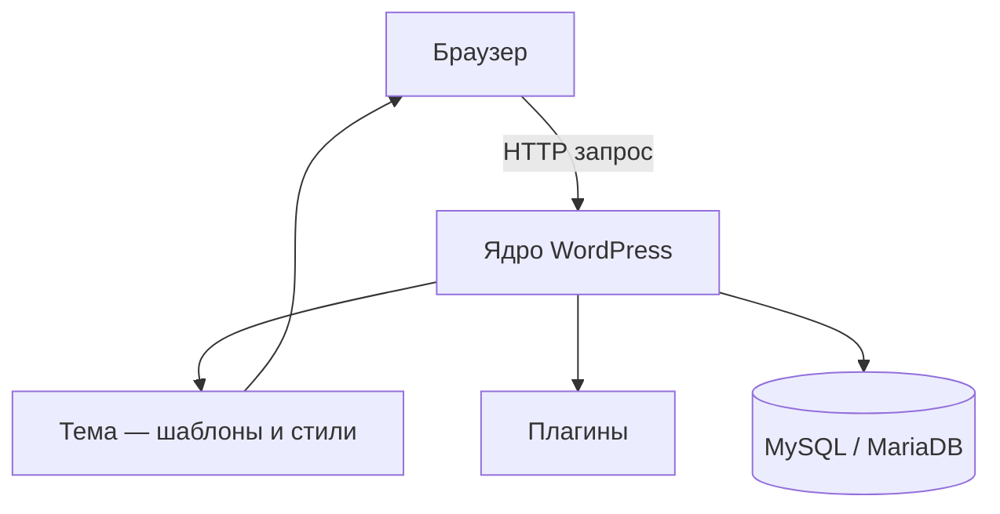

# WordPress

<div class="article-tags">
  <span class="tag tag-required">ОБЯЗАТЕЛЬНО</span>
  <span class="tag tag-beginner">ДЛЯ НОВИЧКОВ</span>
</div>

<span class="complexity-badge">Разработчику</span>
<span class="complexity-badge">Архитектору</span>

---

## Что такое WordPress

**WordPress** — открытая CMS на PHP с базой MySQL или MariaDB. Платформа покрывает блог, корпоративный сайт, медиа, каталог и e-commerce через плагины. Проект развивается сообществом и распространяется под GPL.

WordPress появился в 2003 году как блоговый движок и вырос в универсальную платформу публикации контента. На практике у команды есть готовая админка, редактор блоков, система ролей, библиотека тем и каталог плагинов.

Архитектура WordPress строится вокруг расширяемого ядра. Команда развивает проект через темы, плагины, блоки и хуки, а файлы ядра остаются без локальных правок.

---

## WordPress.com и WordPress.org

| Платформа | Что это | Когда использовать |
|---|---|---|
| **WordPress.org** | self-hosted WordPress, где вы управляете кодом, хостингом и обновлениями | Нужен полный контроль, кастомная разработка, свои интеграции |
| **WordPress.com** | управляемый сервис хостинга от Automattic на базе WordPress | Нужен быстрый запуск без администрирования сервера |

WordPress.org даёт максимальную гибкость на уровне плагинов, темы и DevOps. WordPress.com ускоряет старт и снимает часть инфраструктурных задач.

---

## Ключевые официальные ресурсы

- [wordpress.org/documentation](https://wordpress.org/documentation/) — пользовательская и эксплуатационная документация.
- [developer.wordpress.org](https://developer.wordpress.org/) — справка для разработчиков, API reference, handbook.
- [learn.wordpress.org](https://learn.wordpress.org/) — структурированные учебные траектории и курсы.
- [wordpress.org/plugins](https://wordpress.org/plugins/) — каталог плагинов.
- [wordpress.org/themes](https://wordpress.org/themes/) — каталог тем.
- [wordpress.org/hosting](https://wordpress.org/hosting/) — рекомендации по хостингу.
- [wordpress.org/showcase](https://wordpress.org/showcase/) — витрина живых сайтов.
- [wordpress.org/playground](https://wordpress.org/playground/) — запуск WordPress в браузере.
- [ru.wordpress.org](https://ru.wordpress.org/) — локализованный портал и новости на русском.

<div class="callout callout--info">
  <div class="callout-title">Фокус на проверяемых источниках</div>
  В технических решениях опирайтесь прежде всего на `developer.wordpress.org`, handbook и code reference. Обзорные данные удобно сверять через `documentation` и [статью в русской Википедии](https://ru.wikipedia.org/wiki/WordPress).
</div>

---

## Архитектура WordPress



---

## Жизненный цикл запроса

1. Запрос приходит в `index.php` и цепочку bootstrap ядра.
2. Инициализируется окружение, подключаются плагины и тема.
3. WordPress строит `WP_Query`, определяет тип контента и шаблон.
4. Срабатывают actions и filters.
5. Шаблон рендерит HTML.
6. Ответ уходит клиенту, а в фоне могут выполниться cron-задачи.

---

## Структура платформы

| Узел | Назначение | Типичные точки входа |
|---|---|---|
| Ядро | запросы, пользователи, роли, редактор, API | `wp-includes`, `wp-admin` |
| Тема | шаблоны и стили публичной части | `wp-content/themes/<theme>` |
| Плагины | функциональные расширения | `wp-content/plugins` |
| База | контент, метаданные, настройки | `wp_posts`, `wp_postmeta`, `wp_options`, `wp_users`, `wp_usermeta` |
| Медиа | файлы сайта | `wp-content/uploads` |

---

## Gutenberg и блоковая модель

Современный WordPress использует block editor (Gutenberg). Контент собирается из блоков, которые хранят структуру и настройки прямо в записи.

### Группы блоков

- **Text Blocks** — абзац, заголовок, список, цитата.
- **Media Blocks** — изображение, галерея, видео, файл.
- **Design Blocks** — группа, колонки, кнопки, стек, row.
- **Widget Blocks** — архив, календарь, последние записи.
- **Theme Blocks** — шаблонные и site editor блоки.
- **Embed Blocks** — встроенный внешний контент.

### Блоки в разработке

Блоки создаются через `@wordpress/create-block` и регистрируются в PHP/JS. Главные сущности:

- `block.json` — метаданные блока.
- `register_block_type()` — регистрация блока на стороне PHP.
- `edit` и `save` — React-компоненты редактора.

Подробнее по API блоков — в разделе Block Editor на `developer.wordpress.org`.

---

## Темы и шаблоны

| Тип темы | Подход | Где используется |
|---|---|---|
| Classic Theme | PHP-шаблоны, `functions.php`, Customizer | легаси-проекты и миграции |
| Block Theme | шаблоны блоков, `theme.json`, Site Editor | современные проекты и FSE |
| Hybrid Theme | смешанный подход | плавный переход между версиями |

Каталог тем с фильтрами и проверками находится на [wordpress.org/themes](https://wordpress.org/themes/).

---

## Плагины и экосистема

Каталог [wordpress.org/plugins](https://wordpress.org/plugins/) содержит десятки тысяч расширений. В продакшене команда фиксирует политику выбора плагинов:

1. Последнее обновление и совместимость с текущим релизом WordPress.
2. Количество активных установок и репутация автора.
3. Наличие changelog и публичной политики безопасности.
4. Нагрузка на сайт и конфликтность с другими плагинами.

Плагины, которые влияют на SEO, кэш, безопасность и e-commerce, проходят отдельное тестирование на staging.

---

## Хуки, функции и классы

### Actions (действия)

Action запускает побочный код в точке жизненного цикла.

```php
add_action('init', function () {
    register_post_type('book', [
        'label' => 'Books',
        'public' => true,
        'show_in_rest' => true,
    ]);
});
```

### Filters (фильтры)

Filter принимает значение, изменяет его и возвращает обратно.

```php
add_filter('the_title', function ($title) {
    return '[WP] ' . $title;
});
```

### Часто используемые хуки

| Хук | Тип | Назначение |
|---|---|---|
| `init` | action | регистрация CPT, таксономий, rewrite |
| `wp_enqueue_scripts` | action | подключение CSS и JS |
| `after_setup_theme` | action | регистрация меню, support-флаги |
| `save_post` | action | обработка логики при сохранении |
| `the_content` | filter | модификация контента перед выводом |
| `body_class` | filter | добавление CSS-классов |

### Базовые функции ядра

| Функция | Для чего |
|---|---|
| `register_post_type()` | регистрация пользовательского типа записи |
| `register_taxonomy()` | регистрация пользовательской таксономии |
| `get_posts()` | выборка записей |
| `wp_insert_post()` | создание и обновление записи |
| `wp_enqueue_script()` | подключение JavaScript |
| `wp_nonce_field()` | защита форм от CSRF |
| `wp_verify_nonce()` | проверка nonce |
| `esc_html()` / `esc_url()` | экранирование вывода |
| `sanitize_text_field()` | санитаризация входа |

### Важные классы ядра

| Класс | Роль |
|---|---|
| `WP_Query` | запросы к контенту |
| `WP_Post` | модель записи |
| `WP_User` | модель пользователя и ролей |
| `WP_REST_Request` | объект REST-запроса |
| `WP_REST_Response` | объект REST-ответа |
| `wpdb` | низкоуровневый доступ к БД через `$wpdb` |

Полная справка по классам и функциям доступна в Code Reference на `developer.wordpress.org/reference`.

---

## Типы контента и модель данных

WordPress хранит контент в единой модели `post + meta + taxonomy`. Ключевые сущности:

- `post` и `page` — базовые типы.
- `attachment` — медиа.
- `custom post type` — доменные сущности проекта.
- `category`, `post_tag` и кастомные таксономии — классификация.

---

## REST API

Базовый префикс REST API — `/wp-json/wp/v2/...`.

```bash
GET /wp-json/wp/v2/posts
GET /wp-json/wp/v2/pages
```

Подходы к аутентификации:

- Application Passwords для серверных интеграций;
- Cookie + nonce в админ-контексте;
- OAuth/JWT через проверенные расширения.

Headless-сценарий связывает WordPress как CMS и отдельный frontend на React или Next.js.

---

## WordPress Playground

[WordPress Playground](https://wordpress.org/playground/) запускает WordPress прямо в браузере без хостинга. Платформа полезна для:

- обучения и демонстраций;
- быстрой проверки плагина или темы;
- воспроизведения бага;
- сравнения поведения на версиях WordPress и PHP.

Playground поддерживает сценарии в браузере, Node.js и интеграции в developer workflow.

---

## Хостинг и эксплуатация

Рекомендации по выбору провайдера собраны на [wordpress.org/hosting](https://wordpress.org/hosting/). Для production важны:

1. Совместимая версия PHP и СУБД.
2. TLS, изоляция аккаунтов и резервное копирование.
3. Кэш на уровне страницы и объектов.
4. staging-окружение и безопасный процесс деплоя.
5. Наблюдаемость через логи, метрики и health checks.

---

## Безопасность проекта

| Практика | Результат |
|---|---|
| Регулярные обновления ядра, тем и плагинов | закрытие известных CVE |
| Роли с принципом минимальных привилегий | снижение риска захвата админки |
| 2FA и ограничение попыток входа | защита от брутфорса |
| Подпись и проверка источника плагинов | снижение supply-chain рисков |
| Экранирование и санитаризация в коде | защита от XSS и инъекций |
| SQL через `$wpdb->prepare()` | безопасные запросы |
| Резервные копии и тест восстановления | управляемое восстановление после инцидента |

---

## Частые проблемы

| Симптом | Что проверить |
|---|---|
| White Screen of Death | `wp-content/debug.log`, последняя правка плагина или темы |
| 404 после миграции | пересохранить permalink и проверить rewrite |
| Медленный админ-интерфейс | конфликт плагинов и отсутствие object cache |
| Ошибки после обновления | staging-прогон и проверка совместимости PHP |

---

## WordPress и кастомная разработка

| Критерий | WordPress | Laravel или Symfony |
|---|---|---|
| Основная задача | контент и редакторские процессы | бизнес-логика и сложные доменные сервисы |
| Скорость запуска | высокая с готовой админкой | зависит от объёма кастомной разработки |
| Расширение | темы, плагины, хуки | пакеты, сервис-контейнер, middleware |
| Headless-сценарии | сильная сторона через REST API | сильная сторона через API-first подход |

---

## Обучение и рост команды

- [learn.wordpress.org](https://learn.wordpress.org/) покрывает треки user, developer и theme developer.
- [wordpress.org/showcase](https://wordpress.org/showcase/) показывает реальные продакшен-кейсы и архитектурные паттерны.
- [developer.wordpress.org](https://developer.wordpress.org/) служит базой для стандарта кода, API и WP-CLI.

---

## Практический каркас команды

1. Публичный интерфейс хранится в теме или block theme.
2. Бизнес-логика и интеграции изолируются в отдельных плагинах.
3. Репозиторий разделяет локальное, staging и production окружения.
4. Обновления проходят через тестовый стенд и regression-checklist.
5. Бэкапы и recovery-runbook проверяются регулярно.

---

## Связанные материалы

- [Первая тема WordPress](./1461.md)
- [Экосистема PHP](./10.md)
- [Работа с базами данных из PHP](./20.md)
- [Первая программа на Laravel](./1431.md)
- [Веб-сайты и веб-приложения](/encyclopedia/2-system-network/2-04-kak-rabotayut-sayty-i-veb-sayty/intro)
- [Глоссарий — W](/glossary/W)

---

## Короткий исторический контекст

По данным исторических обзоров сообщества и [русской Википедии](https://ru.wikipedia.org/wiki/WordPress), WordPress развивался от блогового движка до платформы с блоковым редактором, API-first сценариями и крупной экосистемой open source решений.

---

{/* http-basics-link  */}
<div class="callout callout--tip">
  <div class="callout-title">Основа по протоколу</div>

  <div class="callout-body">
  Базовый разбор HTTP и HTTPS находится в отдельной статье — [HTTP как основа веб-интеграций](/encyclopedia/2-system-network/2-09-osnovy-integratsionnogo-vzaimodeystviya/118).
</div>
  </div>
