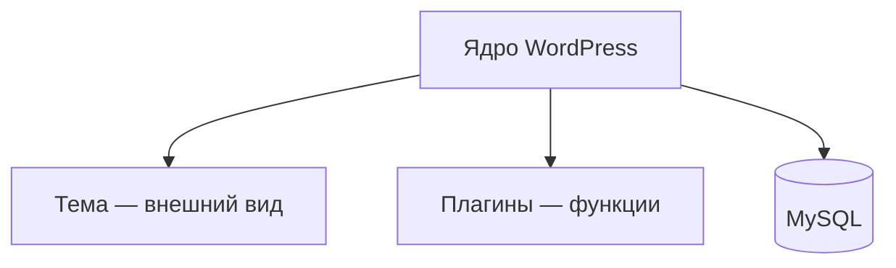

# WordPress

<div class="article-tags">
  <span class="tag tag-required">ОБЯЗАТЕЛЬНО</span>
  <span class="tag tag-beginner">ДЛЯ НОВИЧКОВ</span>
</div>

<span class="complexity-badge">Разработчику</span>
<span class="complexity-badge">Архитектору</span>

## WordPress

**WordPress** — CMS на PHP (~40% сайтов в интернете). Это не MVC-фреймворк как [Laravel](./143.md), а **расширяемое ядро** с хуками, темами оформления и плагинами.

Практика: [Первая тема WordPress](./1461.md). Локальный сервер: [Локальная среда разработки на PHP](./113.md), [Настройка веб-сервера](./112.md).

---

## Из чего состоит сайт



| Часть | Роль |
|-------|------|
| **Ядро** | Маршрутизация, пользователи, записи, медиа, админка |
| **Тема** | Шаблоны `header.php`, `single.php`, стили |
| **Плагин** | Любая доп. логика без правки ядра |
| **База** | Таблицы `wp_posts`, `wp_users`, `wp_options` и др. |

---

## Хуки — главный механизм расширения

**Actions** — выполнить код в точке жизненного цикла:

```php
add_action('init', function () {
    // регистрация типов, rewrite rules
});
```

**Filters** — изменить значение:

```php
add_filter('the_title', function ($title) {
    return '» ' . $title;
});
```

Порядок приоритетов: `add_action('hook', 'callback', 10, 1)` — третий аргумент.

---

## Типы контента

- **Записи (posts)** — блог, новости.
- **Страницы (pages)** — статичные URL.
- **Custom Post Types (CPT)** — портфолио, товары (часто с WooCommerce).
- **Таксономии** — рубрики, метки, свои классификаторы.

Регистрация CPT — в `functions.php` темы или в плагине через `register_post_type()`.

---

## REST API

Встроенный маршрут: `/wp-json/wp/v2/posts`.

Аутентификация: Application Passwords, JWT-плагины, OAuth для интеграций.

Headless-сценарий: фронт на [Next.js](/encyclopedia/5-languages/5-01-javascript/273.md), контент из WordPress как CMS.

---

## Безопасность (минимум)

- Не редактировать ядро — только темы/плагины.
- Обновлять ядро, темы и плагины.
- Уникальный префикс таблиц при установке.
- Права файлов: не `777`.
- Отключить `WP_DEBUG` на production.
- Использовать подготовленные запросы `$wpdb->prepare()`.

---

## WordPress vs Laravel

| | WordPress | Laravel |
|---|-----------|---------|
| Цель | Контент, блоги, маркетинг | Кастомные приложения |
| Расширение | Хуки, темы | Пакеты, сервис-контейнер |
| Админка | Готовая | Нужно строить или Nova/Filament |
| Кривая для «сайта за день» | Низкая | Выше |

---

## Связанные материалы

- [Первая тема WordPress](./1461.md)
- [Экосистема PHP](./10.md)
- [Работа с базами данных из PHP](./20.md)

---
