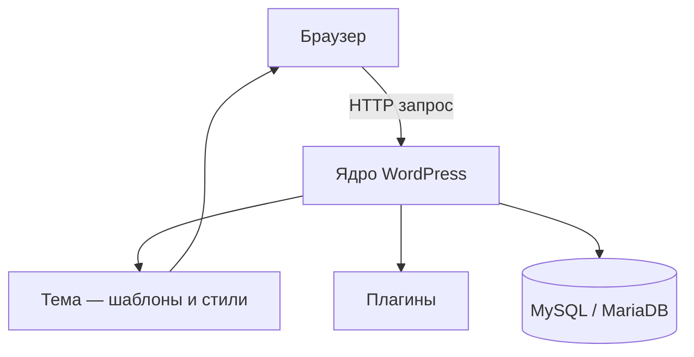

# WordPress

<div class="article-tags">
  <span class="tag tag-required">ОБЯЗАТЕЛЬНО</span>
  <span class="tag tag-beginner">ДЛЯ НОВИЧКОВ</span>
</div>

<span class="complexity-badge">Разработчику</span>
<span class="complexity-badge">Архитектору</span>

---

## WordPress

**WordPress** — система управления контентом (**CMS**, Content Management System) на PHP. С её помощью собирают блоги, корпоративные сайты, интернет-магазины (часто с плагином WooCommerce) и лендинги.

По оценкам рынка, на WordPress работает около трети всех сайтов в интернете — огромная экосистема тем, плагинов и документации.

Архитектура WordPress — **расширяемое ядро**: вы почти никогда не правите файлы ядра, а добавляете поведение через **темы** (внешний вид) и **плагины** (функции). Связь с ядром идёт через **хуки** — точки, куда можно "вклиниться" своим PHP-кодом.

Практика: [Первая тема WordPress](./1461.md). Локальный сервер: [Локальная среда разработки на PHP](./113.md), [Настройка веб-сервера](./112.md).

---

## Что такое CMS и чем WordPress отличается от "голого PHP"

| Подход | Что вы получаете |
|--------|------------------|
| **Свой PHP + фреймворк** (Laravel, Symfony) | Полный контроль, своя структура, админку строите сами |
| **WordPress** | Готовая админка, записи, медиа, пользователи, плагины "из коробки" |

WordPress выигрывает, когда главный продукт — **контент** (статьи, страницы, каталог с типовой логикой). Laravel и Symfony — когда нужно **кастомное приложение** с уникальной бизнес-логикой.

---

## Из чего состоит сайт на WordPress



---

### Жизненный цикл одного запроса (упрощённо)

1. Запрос попадает в `index.php` в корне установки.
2. Ядро загружает настройки, подключается к БД, определяет URL (пост, страница, архив).
3. Срабатывают **хуки** — плагины и тема могут изменить поведение.
4. Тема выбирает шаблон (`single.php`, `page.php` и т.д.) и отдаёт HTML.

| Часть | Роль | Где лежит |
|-------|------|-----------|
| **Ядро** | Маршрутизация, пользователи, записи, медиабиблиотека, админка | `wp-admin/`, `wp-includes/` |
| **Тема** | Внешний вид: шаблоны, CSS | `wp-content/themes/…` |
| **Плагин** | Дополнительная функция | `wp-content/plugins/…` |
| **База** | Посты, настройки, пользователи | Таблицы с префиксом, обычно `wp_` |

Типичные таблицы: `wp_posts`, `wp_users`, `wp_options`, `wp_postmeta`.

---

## Термины WordPress

| Термин | Значение |
|--------|----------|
| **Пост (post)** | Запись блога с датой |
| **Страница (page)** | Статичный URL (О компании, Контакты) |
| **CPT** | Свой тип контента: портфолио, товар |
| **Таксономия** | Рубрики, метки, свои справочники |
| **Шорткод** | `[gallery]` — блок из плагина в тексте |
| **FSE / block theme** | Тема на блоках Gutenberg и `theme.json` |

---

## Хуки — главный механизм расширения

### Actions (действия)

**Action** — "сделай что-то в этой точке".

```php
add_action('init', function () {
    // регистрация CPT, rewrite rules
});
```

Разбор `add_action('init', callback, 10, 1)`:

| Аргумент | Смысл |
|----------|--------|
| `'init'` | Имя хука |
| `callback` | Функция или замыкание |
| `10` | Приоритет (меньше — раньше) |
| `1` | Число аргументов хука |

---

### Filters (фильтры)

**Filter** — изменить значение; обязательно **вернуть** результат.

```php
add_filter('the_title', function ($title) {
    return '" ' . $title;
});
```

| Тип | Вопрос |
|-----|--------|
| Action | "Что ещё сделать?" |
| Filter | "Как изменить это значение?" |

Популярные хуки: `wp_enqueue_scripts`, `after_setup_theme`, `the_content`, `wp_footer`.

---

## Типы контента

- **Записи** — блог, новости.
- **Страницы** — статичные URL.
- **CPT** — `register_post_type()` в теме или плагине.
- **Таксономии** — `register_taxonomy()`.

После регистрации CPT: **Настройки → Постоянные ссылки → Сохранить**.

---

## REST API

Базовый префикс: `/wp-json/wp/v2/posts`.

Аутентификация для записи: Application Passwords, JWT-плагины, OAuth.

**Headless**: фронт на [Next.js](/encyclopedia/5-languages/5-01-javascript/273.md), контент из WordPress.

---

## Безопасность

| Правило | Зачем |
|---------|--------|
| Править только темы и плагины | Обновление ядра перезапишет правки |
| Обновлять ядро, темы, плагины | Закрытие уязвимостей |
| Уникальный префикс таблиц | Усложнение атак по шаблону |
| Права файлов без `777` | Лишняя запись для всех на хостинге |
| `WP_DEBUG` только локально | Отладка раскрывает пути на production |
| `$wpdb->prepare()` | Безопасный SQL |
| `esc_html()`, `sanitize_*` | Защита от XSS |

---

## WordPress и Laravel

| Критерий | WordPress | Laravel |
|----------|-----------|---------|
| Цель | Контент, блог, маркетинг | Кастомное приложение, API |
| Расширение | Хуки, темы, плагины | Composer, сервис-контейнер |
| Админка | Готовая | Nova, Filament или свой фронт |

---

## Частые ошибки

| Симптом | Что проверить |
|---------|----------------|
| Белый экран | `wp-content/debug.log`, `functions.php` |
| Стили сломались | Правили родительскую тему вместо дочерней |
| 404 на страницах | Постоянные ссылки — пересохранить |

---

## Связанные материалы

- [Первая тема WordPress](./1461.md)
- [Экосистема PHP](./10.md)
- [Работа с базами данных из PHP](./20.md)
- [Первая программа на Laravel](./1431.md)

---
---

<!-- http-basics-link -->
:::tip Основа по протоколу
Базовый разбор HTTP и HTTPS находится в отдельной статье — [HTTP как основа веб-интеграций](/encyclopedia/2-system-network/2-09-osnovy-integratsionnogo-vzaimodeystviya/118).
:::

