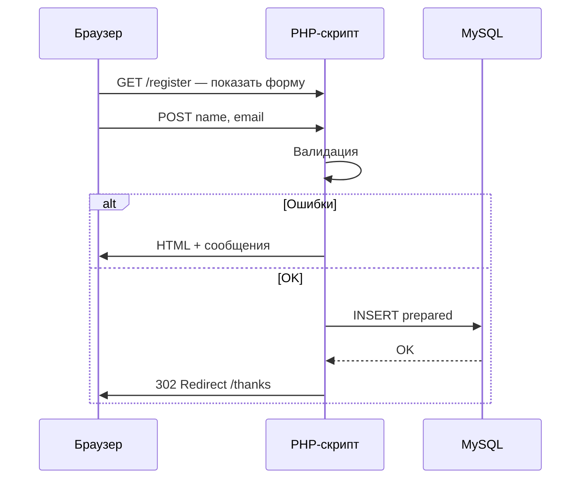

import ExternalCodeEmbed from '@site/src/components/ExternalCodeEmbed';


# От HTML-формы до записи в базу данных на PHP

<div class="article-tags">
  <span class="tag tag-required">ОБЯЗАТЕЛЬНО</span>
  <span class="tag tag-beginner">ДЛЯ НОВИЧКОВ</span>
</div>

<span class="complexity-badge">Разработчику</span>
<span class="complexity-badge">Архитектору</span>

Один сквозной сценарий связывает темы [форм](/encyclopedia/5-languages/5-07-php/151), [PDO](/encyclopedia/5-languages/5-07-php/160) и [исключений](/encyclopedia/5-languages/5-07-php/159). Без фреймворка — чтобы было видно каждый шаг. Загрузка файлов в форме — отдельно: [Загрузка файлов и валидация в PHP](/encyclopedia/5-languages/5-07-php/162).

Этот материал удобно воспринимать как шаблон "минимального production-ready потока" — принять вход, провалидировать, безопасно записать, корректно вернуть пользователя в UI.

---

## Схема потока



Разбор:
- Диаграмма показывает полный путь запроса от браузера до базы данных и обратно.
- Ветвление `alt/else` разделяет два сценария: валидация с ошибками и успешная запись.
- В успешной ветке сервер отправляет `302 Redirect`, чтобы браузер перешел на отдельную страницу результата.
- Такой паттерн устраняет повторную отправку формы при обновлении страницы.
- Блок помогает визуально связать отдельные фрагменты PHP-кода в единую цепочку обработки.

---

## Таблица и подключение

```sql
CREATE TABLE subscribers (
    id INT UNSIGNED AUTO_INCREMENT PRIMARY KEY,
    name VARCHAR(100) NOT NULL,
    email VARCHAR(255) NOT NULL,
    created_at DATETIME NOT NULL,
    UNIQUE KEY uq_email (email)
);
```

Разбор:
- `id` — автоинкрементный первичный ключ для уникальной идентификации записи.
- Поля `name` и `email` объявлены как `NOT NULL`, поэтому пустое значение база не примет.
- `created_at` хранит момент создания подписки для аудита и аналитики.
- `UNIQUE KEY uq_email (email)` запрещает дублирование одной и той же почты.
- Ограничение уникальности дополняет серверную валидацию и защищает данные от гонок.

Файл `bootstrap.php` — общее подключение PDO (подключается из скриптов):

```php
<?php
declare(strict_types=1);

$pdo = new PDO(
    'mysql:host=127.0.0.1;dbname=app;charset=utf8mb4',
    getenv('DB_USER') ?: 'app_user',
    getenv('DB_PASS') ?: '',
    [
        PDO::ATTR_ERRMODE            => PDO::ERRMODE_EXCEPTION,
        PDO::ATTR_DEFAULT_FETCH_MODE => PDO::FETCH_ASSOC,
    ],
);
```

Разбор:
- Файл служит единым bootstrap-слоем для подключения к базе из разных скриптов.
- `getenv('DB_USER')` и `getenv('DB_PASS')` читают секреты из окружения, а не из репозитория.
- DSN содержит `charset=utf8mb4`, чтобы корректно хранить многоязычный пользовательский ввод.
- `ERRMODE_EXCEPTION` делает обработку ошибок централизованной через исключения.
- Подключение выносится отдельно, чтобы сократить дублирование кода в обработчиках форм.

---

## Шаг 1 — форма (GET)

`public/register.php`:


<ExternalCodeEmbed example="php/php-507-161-001" title="Шаг 1 — форма (GET)" minHeight={390} />


Разбор:
- Скрипт отвечает за страницу формы по `GET` и отрисовывает HTML для ввода данных.
- Условие `if (!empty($_GET['error']))` показывает сообщение, если предыдущая отправка завершилась ошибкой.
- `<form action="register_submit.php" method="post">` отправляет данные в отдельный обработчик.
- Атрибуты `required`, `maxlength` и `type="email"` дают базовую клиентскую валидацию в браузере.
- Финальная проверка все равно выполняется на сервере, потому что клиентские ограничения можно обойти.

`method="post"` — данные в теле запроса, не в URL. Пароли и персональные данные не передают через GET.

---

## Шаг 2 — приём и валидация (POST)

`public/register_submit.php`:


<ExternalCodeEmbed example="php/php-507-161-002" title="Шаг 2 — приём и валидация (POST)" minHeight={552} />


Разбор:
- `require .../bootstrap.php` подключает готовый объект PDO и общие настройки окружения.
- `$_POST['name'] ?? ''` и `trim(...)` безопасно читают ввод и убирают лишние пробелы по краям.
- Массив `$errors` накапливает все нарушения правил вместо остановки на первой ошибке.
- `mb_strlen($name)` корректно считает длину Unicode-строк, включая кириллицу.
- `filter_var(..., FILTER_VALIDATE_EMAIL)` проверяет формат адреса на сервере.
- При наличии ошибок обработчик делает редирект и завершает выполнение через `exit`.

Фильтрация на сервере **обязательна**: клиентская проверка в браузере обходится за секунду.

Дополнительный практический совет — если форма длиннее двух-трех полей, ошибки и старые значения лучше хранить в сессии и возвращать через редирект, чтобы пользователь не терял введенные данные.

---

## Шаг 3 — запись через PDO


<ExternalCodeEmbed example="php/php-507-161-003" title="Шаг 3 — запись через PDO" minHeight={480} />


Разбор:
- Блок `try` оборачивает операцию записи в БД и последующий контроль ошибок.
- `prepare + execute` выполняют вставку подписчика безопасно и с параметризацией.
- `DateTimeImmutable('now')` формирует стабильный timestamp без изменения исходного объекта времени.
- В `catch` код `1062` обрабатывает нарушение уникальности email отдельным пользовательским сценарием.
- Для прочих ошибок пишется серверный лог и возвращается `500`, чтобы не раскрывать внутренние детали.
- Финальный редирект на `thanks.php` реализует паттерн Post/Redirect/Get.

Паттерн **Post/Redirect/Get**: после успешного POST браузер получает редирект на `thanks.php`. Обновление страницы не повторяет INSERT.

Если операция состоит из нескольких SQL-команд (например, подписчик + аудит-лог), объединяйте их в транзакцию из [статьи про PDO](/encyclopedia/5-languages/5-07-php/160).

---

## Шаг 4 — страница благодарности

`public/thanks.php` — статичный HTML "Спасибо за подписку". Без повторной обработки POST.

---

## Безопасность в этом сценарии

| Угроза | Мера |
|--------|------|
| SQL-инъекция | Только `prepare` + именованные параметры |
| XSS при выводе ошибок | `htmlspecialchars($msg, ENT_QUOTES, 'UTF-8')` для любого текста из POST |
| Повторная отправка формы | Редирект после успешного POST |
| CSRF | Токен в сессии и скрытое поле формы (см. [сессии](/encyclopedia/5-languages/5-07-php/155)) |
| Перебор email | Rate limit на уровне веб-сервера или кэша |

---

## Развитие сценария

1. Вынести валидацию в класс `App\Validation\SubscribeValidator` — [пространства имён](/encyclopedia/5-languages/5-07-php/157).
2. Хранить ошибки в `$_SESSION` и показывать их рядом с полями — [сессии](/encyclopedia/5-languages/5-07-php/155).
3. Статус подписки задать через [enum](/encyclopedia/5-languages/5-07-php/158).
4. Перейти на маршрутизацию фреймворка — [Laravel](/encyclopedia/5-languages/5-07-php/143) или [Symfony](/encyclopedia/5-languages/5-07-php/144).

---

## Что изучить дальше

- [Работа с данными со страницы](/encyclopedia/5-languages/5-07-php/151)
- [PDO](/encyclopedia/5-languages/5-07-php/160)
- [Работа с базами данных из PHP](/encyclopedia/5-languages/5-07-php/20)
- [Чек-лист самопроверки](/encyclopedia/5-languages/5-07-php/999)
- [Обработка исключений в прикладном коде](/encyclopedia/5-languages/5-07-php/159)

---
