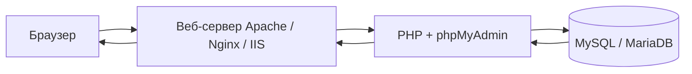

import ExternalCodeEmbed from '@site/src/components/ExternalCodeEmbed';


# phpMyAdmin — что это и где встретить

<div class="article-tags">
  <span class="tag tag-required">ОБЯЗАТЕЛЬНО</span>
  <span class="tag tag-beginner">ДЛЯ НОВИЧКОВ</span>
</div>

<span class="complexity-badge">Разработчику</span>

**phpMyAdmin** — инструмент с открытым исходным кодом (лицензия GPL), написанный на [PHP](/encyclopedia/5-languages/5-07-php/intro). Он даёт графический доступ к задачам администрирования [MySQL](/encyclopedia/3-data-markup/3-07-sql/889) и [MariaDB](/encyclopedia/3-data-markup/3-07-sql/889): создание баз и таблиц, выполнение [SQL](/encyclopedia/3-data-markup/3-07-sql/intro), управление пользователями, импорт и экспорт дампов. Официальное назначение сформулировано так: *handle the administration of a MySQL or MariaDB database server*.

phpMyAdmin — не отдельная СУБД и не замена серверу MySQL. Это **клиент**: тонкий слой между вами и уже запущенным сервером баз данных. Тот же результат можно получить в консоли `mysql`, в [DBeaver](/encyclopedia/3-data-markup/3-07-sql/4) или из PHP-кода через [PDO](/encyclopedia/5-languages/5-07-php/160) — phpMyAdmin просто переводит клики и формы в SQL-запросы и показывает ответ сервера в HTML.

<div class="callout callout--info">
  <div class="callout-title">Учётные записи</div>

  <div class="callout-body">
  При входе в phpMyAdmin вы вводите <strong>логин и пароль пользователя MySQL</strong>. Приложение не заводит своих пользователей — только проксирует аутентификацию в СУБД. Управление учётками MySQL делается через вкладку "Учётные записи" или SQL (<code>CREATE USER</code>, <code>GRANT</code> — см. <a href="/encyclopedia/3-data-markup/3-07-sql/889">MySQL — практика</a>).
  </div>
</div>

---

## Словарь главы

| Термин | Кратко |
|--------|--------|
| **СУБД** | Сервер MySQL/MariaDB, который хранит данные и выполняет SQL |
| **Клиент БД** | Программа, подключающаяся к СУБД: phpMyAdmin, `mysql`, PDO |
| **mysqli** | Расширение PHP для протокола MySQL; им пользуется phpMyAdmin |
| **Document root** | Каталог веб-сервера, откуда отдаются файлы по URL |
| **Дамп** | Файл с SQL-командами для резервной копии или переноса БД |
| **DDL / DML** | Языки определения структуры и изменения данных — подробнее в [статье 3](./3) |
| **configuration storage** | Служебная БД phpMyAdmin для закладок, истории, Designer — см. [статью 4](./4) |

---

## Зачем phpMyAdmin разработчику

На локальной машине phpMyAdmin решает три практические задачи:

- **Быстро посмотреть данные** — без написания скрипта можно открыть таблицу, отфильтровать строки, отредактировать поле.
- **Проверить схему** — индексы, типы столбцов, внешние ключи видны на вкладке "Структура".
- **Импортировать дамп** — после клонирования проекта или восстановления из бэкапа один файл `.sql` загружается через форму.

Для продакшена тот же инструмент опасен: полный доступ к данным через браузер. Поэтому на серверах его либо не ставят, либо закрывают за VPN и строгой аутентификацией — об этом ниже.

---

## Как устроена работа

Цепочка запроса типична для [PHP-приложения](/encyclopedia/5-languages/5-07-php/intro), работающего через [HTTP](/encyclopedia/2-system-network/2-09-osnovy-integratsionnogo-vzaimodeystviya/118):



| Компонент | Роль |
|-----------|------|
| **Браузер** | Отображает HTML-интерфейс; нужны cookies и JavaScript (Bootstrap 5 в phpMyAdmin 5.2) |
| **Веб-сервер** | Отдаёт файлы phpMyAdmin и передаёт запросы в PHP — см. [настройку веб-сервера](/encyclopedia/5-languages/5-07-php/112) |
| **PHP** | Выполняет логику, формирует SQL, обрабатывает загрузки файлов |
| **СУБД** | Принимает SQL по протоколу MySQL (сокет или TCP, обычно порт **3306**) |

### Что происходит при одном клике

1. Браузер отправляет **HTTP POST** (например, форма входа или кнопка "Выполнить" на вкладке SQL).
2. Веб-сервер передаёт запрос интерпретатору PHP.
3. Скрипт phpMyAdmin открывает соединение через **mysqli** и отправляет SQL на сервер MySQL.
4. СУБД выполняет запрос и возвращает результат (строки, ошибку или статус).
5. PHP собирает HTML-таблицу или сообщение об ошибке и отдаёт его браузеру.

Связь с сервером БД идёт через расширение **mysqli** (рекомендуемый драйвер в современных версиях). phpMyAdmin можно разместить на той же машине, что и MySQL, или на отдельном хосте с сетевым доступом к порту СУБД — как и любой другой MySQL-клиент.

### Разбор — минимальное подключение на PHP

Под капотом phpMyAdmin делает то же, что и ваш код, только с сотнями экранов поверх:


<ExternalCodeEmbed example="php/php-507-phpmyadmin-1-001" title="Разбор — минимальное подключение на PHP" minHeight={354} />


| Строка / фрагмент | Смысл |
|-------------------|--------|
| `$host = '127.0.0.1'` | TCP-подключение к локальному MySQL (аналог поля "Сервер" в форме входа) |
| `mysqli_connect(...)` | Устанавливает сессию клиента; без неё SQL некуда отправить |
| `'SHOW DATABASES'` | Служебный запрос — список баз; на главной phpMyAdmin вы видите тот же результат |
| `mysqli_fetch_assoc` | Построчное чтение ответа; в интерфейсе это превращается в HTML-таблицу |

В реальном приложении используйте [PDO с подготовленными запросами](/encyclopedia/5-languages/5-07-php/160), а не конкатенацию SQL — phpMyAdmin же рассчитан на администратора, который осознанно пишет произвольный SQL.

---

## Что умеет интерфейс

По [документации 5.2](https://docs.phpmyadmin.net/en/latest/), среди возможностей:

- создание, просмотр, изменение и удаление **баз**, **таблиц**, **представлений**, столбцов и индексов;
- выполнение, правка и **закладки** SQL, в том числе пакетных запросов;
- **импорт** из SQL, CSV, XML, OpenDocument; **экспорт** в SQL, CSV, XML, PDF, OpenDocument и др.;
- администрирование **нескольких серверов** из одной установки;
- учётные записи и **привилегии** MySQL;
- **хранимые процедуры**, функции, события, триггеры;
- **Designer** — схема связей и экспорт в PDF;
- **QBE** (Query-by-example) — визуальная сборка запросов с соединением таблиц;
- отслеживание изменений (при настроенном **configuration storage**);
- интерфейс на **десятках языков**, в том числе русский.

Подробности по операциям — в статьях [SQL, DDL и DML](./3) и [импорт, экспорт и FAQ](./4).

### Разбор — типичный SQL в вкладке "SQL"

После входа в базу `shop` разработчик часто выполняет такой набор:

```sql
-- Посмотреть структуру таблицы заказов
DESCRIBE orders;

-- Выборка с фильтром (DML)
SELECT id, customer_name, total
FROM orders
WHERE status = 'pending'
ORDER BY created_at DESC
LIMIT 20;

-- Добавить тестовую строку
INSERT INTO orders (customer_name, total, status)
VALUES ('Test User', 99.90, 'pending');
```

| Запрос | Что делает в phpMyAdmin |
|--------|-------------------------|
| `DESCRIBE orders` | Вкладка "Структура" таблицы `orders` — те же столбцы и типы |
| `SELECT ... WHERE ...` | Вкладка "Обзор" с фильтром или результат на вкладке SQL |
| `INSERT INTO ...` | Кнопка "Вставить" на вкладке "Обзор" генерирует похожий SQL |

phpMyAdmin **не проверяет бизнес-логику** приложения: если у пользователя MySQL есть право `DELETE`, одна команда `DELETE FROM orders` удалит все строки. Права задаёт администратор СУБД, не интерфейс.

### Горячие клавиши

Ускоряют навигацию, когда SQL-консоль уже открыта:

| Клавиша | Действие |
|---------|----------|
| `k` | Показать/скрыть консоль SQL |
| `h` | Домашняя страница |
| `s` | Настройки |
| `d` + `s` | Структура базы (на странице БД) |
| `d` + `f` | Поиск по базе |
| `t` + `s` | Структура таблицы |
| `t` + `f` | Поиск по таблице |
| Backspace | Предыдущая страница |

---

## В каких стеках встречается

phpMyAdmin часто **входит в дистрибутив** "веб-сервер + PHP + MySQL" для [локальной разработки](/encyclopedia/5-languages/5-07-php/113). Отдельная установка тоже возможна (Composer, Git, Docker).

| Стек / среда | Как открыть phpMyAdmin | Примечание |
|--------------|------------------------|------------|
| **Open Server (OSP)** | `http://127.0.0.1/openserver/phpmyadmin/`, `http://127.0.0.1/phpmyadmin`, домен `http://phpmyadmin.loc` | Версия и путь зависят от редакции панели; документация — в каталоге установки |
| **XAMPP** | `http://localhost/phpmyadmin` (алиас на `phpMyAdmin/`) | Windows/Linux/macOS; MySQL/MariaDB в комплекте |
| **WAMP / WampServer** | `http://localhost/phpmyadmin` | Аналог XAMPP для Windows |
| **MAMP** | `http://localhost:8888/phpMyAdmin/` (порт может отличаться) | macOS / Windows |
| **Denwer** | Виртуальный хост панели (классический стек под Windows) | Исторический локальный пакет |
| **AppServ** | Путь из документации пакета | Меньше распространён сегодня |
| **Laragon** | `http://localhost/phpmyadmin` | Windows, быстрая смена версий PHP/MySQL |
| **Docker** | Образ `phpmyadmin`, переменные `PMA_HOST`, `PMA_USER` | Удобно для изолированных сред |
| **Linux-дистрибутивы** | Пакет `phpmyadmin` (Debian/Ubuntu — конфиг в `/etc/phpmyadmin/`) | Отличается от "ванильного" `config.inc.php` в корне исходников |

<div class="callout callout--tip">
  <div class="callout-title">Локальный Open Server</div>

  <div class="callout-body">
  После запуска MySQL/MariaDB в панели OSP типичные параметры клиента: хост <code>127.0.0.1</code>, порт <code>3306</code>, пользователь <code>root</code>, пароль пустой (только для локальной разработки). Подробнее — в разделе <a href="/encyclopedia/5-languages/5-07-php/113">локальная среда PHP</a>.
  </div>
</div>

### Разбор — phpMyAdmin в Docker Compose

Изолированная среда без установки XAMPP на хост — типичный фрагмент `docker-compose.yml`:


<ExternalCodeEmbed example="yaml/php-507-phpmyadmin-1-002" title="Разбор — phpMyAdmin в Docker Compose" minHeight={408} />


| Параметр | Зачем |
|----------|--------|
| `PMA_HOST: db` | Имя сервиса БД в сети Docker — phpMyAdmin подключается к контейнеру `db`, не к `localhost` хоста |
| `ports: "8080:80"` | Интерфейс доступен по `http://localhost:8080` |
| `depends_on` | Контейнер phpMyAdmin стартует после контейнера с MariaDB |

Полная настройка установки и файла `config.inc.php` — в [статье 2](./2).

### Безопасность на продакшене

На **продакшене** phpMyAdmin обычно закрывают от публичного интернета (VPN, IP whitelist, отдельный поддомен с HTTPS), потому что это мощный административный интерфейс с прямым доступом к данным. Альтернатива — SSH-туннель к MySQL и локальный клиент ([Adminer](/encyclopedia/5-languages/5-07-php/phpmyadmin/5), DBeaver, `mysql` CLI).

---

## Первый вход

Пошагово — от запуска стека до списка баз на экране:

1. Запустите веб-сервер, PHP и MySQL/MariaDB в выбранном стеке ([113](/encyclopedia/5-languages/5-07-php/113)).
2. Откройте URL phpMyAdmin из таблицы выше.
3. Введите **пользователя MySQL** (часто `root` на локальной машине) и **пароль**.
4. На главной странице отобразится список баз и серверная информация (версия MySQL, кодировка, uptime).

### Если что-то пошло не так

| Симптом | Вероятная причина | Что проверить |
|---------|-------------------|---------------|
| Белый экран | PHP не выполняется или fatal error | Логи Apache/nginx, `display_errors` в dev |
| "Cannot connect" | MySQL не запущен или неверный хост/порт | Служба MySQL в панели стека, `127.0.0.1:3306` |
| "Access denied" | Неверный логин/пароль | Учётная запись в MySQL, не в phpMyAdmin |
| "кракозябры" в данных | Неверная кодировка соединения | Расширение `mbstring`, `utf8mb4` на сервере БД |
| Пустой список баз | У пользователя нет прав `SHOW DATABASES` | `GRANT` или вход под `root` локально |

Если страница пустая или кракозябры — проверьте версию PHP, расширение `mbstring` и кодировку соединения (`utf8mb4` на сервере БД). Режимы входа (`cookie`, `config`, `http`) и параметры `$cfg['Servers']` разбираются в [следующей статье](./2).

---

## История

Кратко: **MySQL-Webadmin** (1997, Tobias Rautenberger) → **phpMyAdmin** (с 1998) → с 2001 года координация **Marc Delisle** → инициатива **GoPHP5** и ветка 3.x+ под PHP 5.2+ и MySQL 5.

Параллельная линия для PostgreSQL — **WebDB** (2002) → переименование в **[phpPgAdmin](/encyclopedia/5-languages/5-07-php/phppgadmin/intro)**; общие корни, разные драйверы (`mysqli` и `pgsql`).

Полная хронология с таблицами версий, сравнением с **pgAdmin** и **Adminer** — в статье [История phpMyAdmin, phpPgAdmin и веб-админок БД на PHP](./5). Краткое определение — в [глоссарии](/glossary/P#phpmyadmin).

---

## См. также

- [phpMyAdmin — о разделе](./intro) — порядок статей раздела
- [Работа с базами данных из PHP](/encyclopedia/5-languages/5-07-php/20) — когда UI уже не нужен, а нужен код
- [Клиенты и инструменты SQL](/encyclopedia/3-data-markup/3-07-sql/4) — phpMyAdmin среди других клиентов
- [phpPgAdmin — что это](/encyclopedia/5-languages/5-07-php/phppgadmin/1) — аналог для PostgreSQL

---

## Следующий шаг

[Требования, установка и подключение](./2) — версии PHP и СУБД, файл `config.inc.php`, режимы `cookie` / `config` / `http` и параметры сервера в `$cfg['Servers']`.

---
