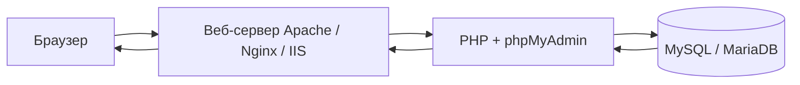

# phpMyAdmin — что это и где встретить

  ОБЯЗАТЕЛЬНО
  ДЛЯ НОВИЧКОВ

Разработчику

**phpMyAdmin** — инструмент с открытым исходным кодом (лицензия GPL), написанный на PHP. Он даёт графический доступ к задачам администрирования MySQL/MariaDB: создание баз и таблиц, выполнение SQL, управление пользователями, импорт и экспорт дампов. Официальное назначение сформулировано так: *handle the administration of a MySQL or MariaDB database server*.

  
Учётные записи

  

  При входе в phpMyAdmin вы вводите **логин и пароль пользователя MySQL**. Приложение не заводит своих пользователей — только проксирует аутентификацию в СУБД. Управление учётками MySQL делается через вкладку «Учётные записи» или SQL.
  

---

## Как устроена работа

Цепочка запроса типична для PHP-приложения:

| Компонент | Роль |
|-----------|------|
| **Браузер** | Отображает HTML-интерфейс; нужны cookies и JavaScript (Bootstrap 5 в phpMyAdmin 5.2) |
| **Веб-сервер** | Отдаёт файлы phpMyAdmin и передаёт запросы в PHP (Apache, nginx, IIS) |
| **PHP** | Выполняет логику, формирует SQL, обрабатывает загрузки файлов |
| **СУБД** | Принимает SQL по протоколу MySQL (сокет или TCP, обычно порт **3306**) |

Связь с сервером БД идёт через расширение **mysqli** (рекомендуемый драйвер в современных версиях). phpMyAdmin можно разместить на той же машине, что и MySQL, или на отдельном хосте с сетевым доступом к порту СУБД.

---

## Что умеет интерфейс

По документации 5.2, среди возможностей:

- создание, просмотр, изменение и удаление **баз**, **таблиц**, **представлений**, столбцов и индексов;
- выполнение, правка и **закладки** SQL, в том числе пакетных запросов;
- **импорт** из SQL, CSV, XML, OpenDocument; **экспорт** в SQL, CSV, XML, PDF, OpenDocument и др.;
- администрирование **нескольких серверов** из одной установки;
- учётные записи и **привилегии** MySQL;
- **хранимые процедуры**, функции, события, триггеры;
- **Designer** — схема связей и экспорт в PDF;
- **QBE** (Query-by-example) — визуальная сборка запросов с соединением таблиц;
- отслеживание изменений (при настроенном **configuration storage**);
- интерфейс на **десятках языков**, в том числе русский.

Подробности по операциям — в статьях [SQL, DDL и DML](./3) и [импорт, экспорт и FAQ](./4).

### Горячие клавиши

| Клавиша | Действие |
|---------|----------|
| `k` | Показать/скрыть консоль SQL |
| `h` | Домашняя страница |
| `s` | Настройки |
| `d` + `s` | Структура базы (на странице БД) |
| `d` + `f` | Поиск по базе |
| `t` + `s` | Структура таблицы |
| `t` + `f` | Поиск по таблице |
| Backspace | Предыдущая страница |

---

## В каких стеках встречается

phpMyAdmin часто **входит в дистрибутив** «веб-сервер + PHP + MySQL» для локальной разработки. Отдельная установка тоже возможна (Composer, Git, Docker).

| Стек / среда | Как открыть phpMyAdmin | Примечание |
|--------------|------------------------|------------|
| **Open Server (OSP)** | `http://127.0.0.1/openserver/phpmyadmin/`, `http://127.0.0.1/phpmyadmin`, домен `http://phpmyadmin.loc` | Версия и путь зависят от редакции панели; документация — в каталоге установки |
| **XAMPP** | `http://localhost/phpmyadmin` (алиас на `phpMyAdmin/`) | Windows/Linux/macOS; MySQL/MariaDB в комплекте |
| **WAMP / WampServer** | `http://localhost/phpmyadmin` | Аналог XAMPP для Windows |
| **MAMP** | `http://localhost:8888/phpMyAdmin/` (порт может отличаться) | macOS / Windows |
| **Denwer** | Виртуальный хост панели (классический стек под Windows) | Исторический локальный пакет |
| **AppServ** | Путь из документации пакета | Меньше распространён сегодня |
| **Laragon** | `http://localhost/phpmyadmin` | Windows, быстрая смена версий PHP/MySQL |
| **Docker** | Образ `phpmyadmin`, переменные `PMA_HOST`, `PMA_USER` | Удобно для изолированных сред |
| **Linux-дистрибутивы** | Пакет `phpmyadmin` (Debian/Ubuntu — конфиг в `/etc/phpmyadmin/`) | Отличается от «ванильного» `config.inc.php` в корне исходников |

  
Локальный Open Server

  

  После запуска MySQL/MariaDB в панели OSP типичные параметры клиента: хост <code>127.0.0.1</code>, порт <code>3306</code>, пользователь <code>root</code>, пароль пустой (только для локальной разработки). Подробнее — в разделе [локальная среда PHP](/encyclopedia/5-languages/5-07-php/113).
  

На **продакшене** phpMyAdmin обычно закрывают от публичного интернета (VPN, IP whitelist, отдельный поддомен с HTTPS), потому что это мощный административный интерфейс с прямым доступом к данным.

---

## Первый вход

1. Запустите веб-сервер, PHP и MySQL/MariaDB в выбранном стеке.
2. Откройте URL phpMyAdmin из таблицы выше.
3. Введите **пользователя MySQL** (часто `root` на локальной машине) и **пароль**.
4. На главной странице отобразится список баз и серверная информация.

Если страница пустая или «кракозябры» — проверьте версию PHP, расширение `mbstring` и кодировку соединения (`utf8mb4` на сервере БД).

---

## История

Кратко: **MySQL-Webadmin** (1997, Tobias Rautenberger) → **phpMyAdmin** (с 1998) → с 2001 года координация **Marc Delisle** → инициатива **GoPHP5** и ветка 3.x+ под PHP 5.2+ и MySQL 5.

Параллельная линия для PostgreSQL — **WebDB** (2002) → переименование в **[phpPgAdmin](/encyclopedia/5-languages/5-07-php/phppgadmin/intro)**; общие корни, разные драйверы (`mysqli` и `pgsql`).

Полная хронология с таблицами версий, сравнением с **pgAdmin** и **Adminer** — в статье [История phpMyAdmin, phpPgAdmin и веб-админок БД на PHP](./5).

---

## Следующий шаг

[Требования, установка и подключение](./2) — версии PHP и СУБД, файл `config.inc.php`, режимы `cookie` / `config` / `http` и параметры сервера в `$cfg['Servers']`.

---
