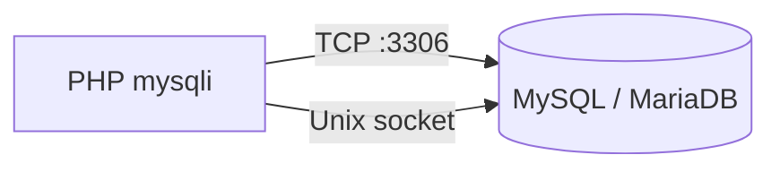

# phpMyAdmin — требования, установка и подключение

<div class="article-tags">
  <span class="tag tag-beginner">ДЛЯ НОВИЧКОВ</span>
</div>

<span class="complexity-badge">Разработчику</span>

В [первой статье раздела](./1) мы разобрали, что phpMyAdmin — это PHP-приложение между браузером и MySQL/MariaDB. Здесь — практика: какие версии нужны, куда положить файлы, как написать **`config.inc.php`** и успешно войти в интерфейс.

**Установка** сводится к двум шагам:

1. Разместить файлы проекта в каталоге, который обслуживает веб-сервер (document root или алиас).
2. Настроить **`config.inc.php`** — единственный файл, который вы редактируете для параметров подключения и безопасности.

Права на объекты MySQL по-прежнему задаёт администратор СУБД. phpMyAdmin **не создаёт** своих пользователей — он вызывает только те привилегии, которые уже выданы вошедшему аккаунту MySQL (`GRANT` / `REVOKE`). Подробнее о цепочке "браузер → веб-сервер → PHP → СУБД" — в [статье 1](./1).

---

## Требования (phpMyAdmin 5.2)

phpMyAdmin 5.2 — актуальная ветка на момент написания раздела. Она собрана под **PHP 7.2.5+**, использует **Bootstrap 5** во фронтенде и расширение **mysqli** для связи с сервером БД. Ниже — минимум, без которого установка либо не стартует, либо теряет часть функций.

### Веб-сервер

**Веб-сервер** — программа, которая принимает HTTP-запросы и передаёт PHP-скрипты интерпретатору. phpMyAdmin работает с любым сервером, способным выполнять PHP:

- **Apache** — классический выбор в XAMPP, Open Server, WAMP; часто через модуль `mod_php` или PHP-FPM.
- **nginx** — проксирует запросы в **php-fpm**; конфигурация отличается от Apache, но phpMyAdmin размещается так же — в каталоге, доступном через `root` или `alias`.
- **IIS** — Windows-сервер с FastCGI-модулем PHP.

Файлы проекта кладут в **document root** (корень сайта) или в отдельный каталог с **алиасом** URL. Пример для XAMPP — в [настройке Apache для PHP](/encyclopedia/5-languages/5-07-php/112#phpmyadmin): директива `Alias /phpmyadmin "C:/xampp/phpMyAdmin/"` публикует панель по адресу `http://localhost/phpmyadmin`.

<div class="callout callout--info">
  <div class="callout-title">Document root и алиас</div>

  <div class="callout-body">
  <strong>Document root</strong> — каталог, из которого веб-сервер отдаёт файлы по умолчанию (например, <code>C:/xampp/htdocs</code>). <strong>Алиас</strong> — виртуальный путь: URL <code>/phpmyadmin</code> указывает на другую папку на диске, не обязательно внутри document root.
  </div>
</div>

### PHP

**PHP** выполняет логику phpMyAdmin: формирует SQL, рендерит HTML, обрабатывает загрузку дампов. Версия и расширения проверяются при первом открытии — предупреждения о недостающих модулях видны на главной странице.

| Требование | Детали |
|------------|--------|
| Версия | **PHP 7.2.5** или новее; для новых стеков рекомендуется **PHP 8.x** |
| Обязательно | `session`, SPL, `hash`, `ctype`, JSON |
| Сильно рекомендуется | **mbstring** — многобайтовые строки, кодировки UTF-8, производительность |
| Для cookie-входа | **openssl** — шифрование cookie-сессии по умолчанию |
| Импорт ZIP | расширение **zip** |
| Миниатюры JPEG | **GD2** |
| Импорт XML / ODS | **libxml** |
| Проверка новой версии | `allow_url_fopen` или **curl** |
| Прогресс загрузки | см. FAQ по upload progress bar на phpmyadmin.net |

Что даёт каждое расширение:

- **`session`** — хранение состояния входа между запросами (режим `cookie`).
- **`mbstring`** — корректная работа с кириллицей и `utf8mb4`; без него возможны "кракозябры" в интерфейсе и результатах SQL.
- **`mysqli`** — драйвер связи с MySQL; без него подключение к СУБД невозможно.
- **`openssl`** — шифрование данных аутентификации в cookie; обязателен для безопасного входа в проде.
- **`zip`** — распаковка сжатых дампов при импорте.

#### Лимиты php.ini для импорта

Параметры **`upload_max_filesize`**, **`post_max_size`**, **`max_execution_time`**, **`memory_limit`** в `php.ini` ограничивают импорт больших дампов через браузер. Их поднимают при необходимости — подробная таблица и обходы через `UploadDir` описаны в [статье 4](./4).

| Директива | Что ограничивает |
|-----------|------------------|
| `upload_max_filesize` | Размер одного загружаемого файла |
| `post_max_size` | Весь POST-запрос (должен быть **≥** `upload_max_filesize`) |
| `max_execution_time` | Время выполнения скрипта импорта |
| `memory_limit` | Память на разбор SQL-файла в памяти |

Где править `php.ini` в локальном стеке — в [настройке веб-сервера для PHP](/encyclopedia/5-languages/5-07-php/112) и [локальной среде разработки](/encyclopedia/5-languages/5-07-php/113).

### СУБД, с которыми работает phpMyAdmin

**СУБД** (система управления базами данных) — сервер, который хранит данные и принимает SQL. phpMyAdmin поддерживает только **MySQL-совместимые** движки:

| СУБД | Минимальная версия | Примечание |
|------|-------------------|------------|
| **MySQL** | 5.5 и новее | Официальный Oracle MySQL, Percona Server |
| **MariaDB** | 5.5 и новее | Форк MySQL; часто идёт в XAMPP и Open Server |

**Не поддерживаются:** PostgreSQL, SQLite, MS SQL Server, Oracle. Для PostgreSQL — [phpPgAdmin](/encyclopedia/5-languages/5-07-php/phppgadmin/intro), pgAdmin, DBeaver или консольный `psql`. Общая теория SQL — в [разделе SQL](/encyclopedia/3-data-markup/3-07-sql/889).

Старые версии MySQL (4.x, ранние 5.0) требуют **старых релизов** phpMyAdmin — их можно скачать с [phpmyadmin.net/downloads](https://www.phpmyadmin.net/downloads/).

### Браузер

На стороне клиента нужны:

- **Cookies** — сессия входа в режиме `cookie`;
- **JavaScript** — интерфейс Bootstrap 5 и AJAX-операции.

Список поддерживаемых браузеров совпадает с требованиями **Bootstrap 5.0** (Chrome, Firefox, Safari, Edge актуальных версий).

---

## Установка

Способ установки зависит от окружения. Для локальной разработки почти всегда достаточно готового стека; ручная установка нужна на VPS, в Docker или при обновлении версии в существующем проекте.

### Готовый стек (рекомендуется новичку)

**Локальный стек** — пакет "веб-сервер + PHP + MySQL" для разработки на своей машине. phpMyAdmin уже входит в состав:

| Стек | Действия |
|------|----------|
| **XAMPP** | Запустить Apache и MySQL в панели → открыть `http://localhost/phpmyadmin` |
| **Open Server** | Запустить MySQL/MariaDB → `http://127.0.0.1/phpmyadmin` или домен `phpmyadmin.loc` |
| **Laragon** | `http://localhost/phpmyadmin` после старта сервисов |
| **WAMP / MAMP** | Аналогично XAMPP; порт MAMP может быть `8888` |

Отдельная установка **не нужна** — достаточно URL и учётных данных из [статьи 1](./1). Если MySQL не стартует, проверьте, не занят ли порт **3306** другим процессом.

### Windows без готового стека

Два типичных пути:

1. Установить **XAMPP** или **Laragon** — быстрее и без ручной настройки алиасов.
2. Скачать архив с [phpmyadmin.net](https://www.phpmyadmin.net/), распаковать в каталог веб-сервера, создать `config.inc.php` (см. ниже), настроить алиас Apache по [примеру в статье 112](/encyclopedia/5-languages/5-07-php/112#phpmyadmin).

### Composer

**Composer** — менеджер зависимостей PHP. Установка через него удобна, если phpMyAdmin — часть PHP-проекта или CI/CD:

```bash
composer create-project phpmyadmin/phpmyadmin
```

После команды появится каталог с полным деревом файлов. Document root веб-сервера нужно направить на этот каталог (или на `public/`, если структура пакета это предусматривает — см. README репозитория). Официальная инструкция: *Installing using Composer* в документации phpMyAdmin.

### Docker

**Docker** изолирует phpMyAdmin и MySQL в контейнерах — удобно для команды и тестовых сред:

```bash
docker pull phpmyadmin
```

Типичный запуск в связке с MySQL (упрощённый пример):

```yaml
services:
  db:
    image: mysql:8.0
    environment:
      MYSQL_ROOT_PASSWORD: secret
  phpmyadmin:
    image: phpmyadmin
    ports:
      - "8080:80"
    environment:
      PMA_HOST: db
      PMA_PORT: 3306
```

Разбор:

- **`PMA_HOST: db`** — имя сервиса MySQL внутри Docker-сети (не `127.0.0.1` с точки зрения контейнера phpMyAdmin).
- **`ports: "8080:80"`** — панель доступна в браузере по `http://localhost:8080`.
- Пароль root задаётся в контейнере `db`; на форме входа phpMyAdmin вводите `root` / `secret`.

Переменные окружения образа:

| Переменная | Назначение |
|------------|------------|
| `PMA_HOST` | Хост СУБД |
| `PMA_PORT` | Порт (по умолчанию 3306) |
| `PMA_USER` / `PMA_PASSWORD` | Учётные данные для режима `config` (автовход) |
| `PMA_ARBITRARY` | `1` — разрешить ввод произвольного хоста на форме входа |
| `PMA_ABSOLUTE_URI` | Полный URL установки за reverse proxy (nginx, Traefik) |

### Linux (пакет дистрибутива)

В **Debian/Ubuntu** пакет `phpmyadmin` ставится через `apt`:

```bash
sudo apt install phpmyadmin
```

Отличия от "ванильной" установки:

- Конфигурация часто лежит в **`/etc/phpmyadmin/`**, а не в корне исходников.
- Apache получает готовый алиас; для nginx нужна отдельная настройка FastCGI.
- При установке мастер спросит пароль для служебного пользователя MySQL и предложит настроить **dbconfig-common**.

Читайте **`/usr/share/doc/phpmyadmin/README.Debian.gz`** (или аналог в вашем дистрибутиве) перед правкой путей.

---

## Подключение к серверу БД

Подключение — это согласование трёх сторон: **куда** стучится PHP (хост, порт, сокет), **кем** (логин MySQL) и **как** (режим аутентификации phpMyAdmin).

### Параметры на форме входа (режим cookie)

После открытия phpMyAdmin в режиме **`cookie`** (по умолчанию) появляется форма с полями сервера и учётной записи MySQL:

| Поле | Локальная разработка (типично) | Продакшен |
|------|--------------------------------|-----------|
| Сервер | `127.0.0.1` или `localhost` | IP или DNS-имя сервера БД |
| Пользователь | `root` или пользователь проекта | Отдельный пользователь с минимальными правами |
| Пароль | пустой (только локально) или заданный вами | Обязательно сложный пароль |

**Порт** по умолчанию — **3306**. Если MySQL слушает другой порт (настройка в `my.ini` / `my.cnf`, часто в Open Server), его указывают:

- в **`config.inc.php`** — `$cfg['Servers'][$i]['port']`;
- или в расширенных параметрах на форме входа (если включено в конфиге).

<div class="callout callout--tip">
  <div class="callout-title">127.0.0.1 и localhost</div>

  <div class="callout-body">
  На одной машине <code>127.0.0.1</code> почти всегда идёт по <strong>TCP</strong> на порт 3306. Имя <code>localhost</code> на Linux/macOS часто резолвится в <strong>Unix-сокет</strong> — быстрее локально, но путь к сокету должен совпадать с настройкой MySQL. При ошибке "Cannot connect" попробуйте явно указать <code>127.0.0.1</code>.
  </div>
</div>

Те же параметры (хост, порт, база, пользователь, пароль) затем используются в PHP-коде через **PDO** или **mysqli** — см. [работу с БД из PHP](/encyclopedia/5-languages/5-07-php/20) и [PDO](/encyclopedia/5-languages/5-07-php/160).

### Файл config.inc.php

**`config.inc.php`** — главный конфигурационный файл установки. Все ваши переопределения пишутся только в нём. Незаданные параметры подставляются из **`libraries/config.default.php`** — этот файл **не редактируют** (он перезаписывается при обновлении).

Минимальный пример одного сервера:

```php
<?php
$cfg['blowfish_secret'] = 'длинная_случайная_строка_не_менее_32_символов';

$i = 1;
$cfg['Servers'][$i]['auth_type'] = 'cookie';
$cfg['Servers'][$i]['host'] = '127.0.0.1';
$cfg['Servers'][$i]['port'] = '3306';
$cfg['Servers'][$i]['extension'] = 'mysqli';
$cfg['Servers'][$i]['AllowNoPassword'] = true; // только локально, в проде — false
```

Разбор построчно:

| Строка | Смысл |
|--------|--------|
| `$cfg['blowfish_secret']` | Секрет для шифрования cookie-сессии в режиме `cookie`. Минимум **32 символа**, случайная строка. Без неё phpMyAdmin покажет предупреждение на главной. |
| `$i = 1` | Индекс сервера в массиве `$cfg['Servers']`. **Нумерация с 1**, не с 0 — это требование phpMyAdmin. |
| `auth_type = 'cookie'` | Логин и пароль MySQL вводятся на странице phpMyAdmin; сессия хранится в зашифрованном cookie. |
| `host` / `port` | Адрес и порт сервера БД. |
| `extension = 'mysqli'` | Драйвер PHP для MySQL. Устаревший `mysql` (без `i`) удалён в PHP 7+. |
| `AllowNoPassword = true` | Разрешить вход с пустым паролем. **Только для локальной разработки** — на сервере в интернете обязательно `false`. |

<div class="callout callout--danger">
  <div class="callout-title">Продакшен</div>

  <div class="callout-body">
  Отключите вход без пароля (<code>AllowNoPassword = false</code>), не используйте <code>root</code> с доступом из внешней сети, включите <strong>HTTPS</strong> и ограничьте URL phpMyAdmin (VPN, whitelist IP, Basic Auth на уровне веб-сервера). Подробнее о безопасности установки — в <a href="./4">статье 4</a> и разделе <a href="/encyclopedia/8-infra-security/8-07-informatsionnaya-bezopasnost/intro">информационной безопасности</a>.
  </div>
</div>

#### Ключевые директивы

| Директива | Назначение |
|-----------|------------|
| `$cfg['PmaAbsoluteUri']` | Полный URL установки (`https://db.example.com/phpmyadmin/`) — обязателен за reverse proxy |
| `$cfg['Servers'][$i]['host']` | Хост БД; массив `$i` начинается с **1** |
| `$cfg['Servers'][$i]['port']` | Порт TCP |
| `$cfg['Servers'][$i]['socket']` | Путь к Unix-сокету (альтернатива host+port на том же хосте) |
| `$cfg['Servers'][$i]['auth_type']` | `cookie`, `config`, `http`, `signon` |
| `$cfg['Servers'][$i]['user']` / `password` | Учётные данные для `auth_type = config` |
| `$cfg['Servers'][$i]['pmadb']` | Имя базы configuration storage (закладки, история) |
| `$cfg['TempDir']` | Каталог временных файлов импорта; обязателен при `open_basedir` |

**Несколько серверов** — несколько блоков с разными `$i`:

```php
$i = 1;
$cfg['Servers'][$i]['host'] = '127.0.0.1';
$cfg['Servers'][$i]['verbose'] = 'Локальная dev';

$i = 2;
$cfg['Servers'][$i]['host'] = '192.168.1.50';
$cfg['Servers'][$i]['verbose'] = 'Staging MySQL';
$cfg['Servers'][$i]['auth_type'] = 'cookie';
```

В выпадающем списке на форме входа отображается значение **`verbose`**; если оно пустое — показывается `host`.

### Способы соединения PHP ↔ MySQL

phpMyAdmin использует тот же транспорт, что и любое PHP-приложение с **mysqli**:

| Способ | Когда использовать |
|--------|-------------------|
| **TCP** `127.0.0.1:3306` | Универсально; удалённый сервер; Windows |
| **Unix-сocket** / **named pipe** | Тот же физический хост; часто быстрее и без сетевого стека |

В конфиге тип драйвера — **`mysqli`**. Параметр `$cfg['Servers'][$i]['connect_type']` (`tcp` или `socket`) уточняет способ; по умолчанию выбор зависит от значения `host`.



### SSL к серверу БД

Отдельно от **HTTPS** между браузером и phpMyAdmin можно включить **шифрование канала PHP → MySQL** (SSL/TLS). В документации *setup* описаны директивы `$cfg['Servers'][$i]['ssl']`, пути к CA и клиентским сертификатам. Это актуально, когда phpMyAdmin и MySQL на разных машинах в недоверенной сети.

---

## Режимы аутентификации

**Аутентификация** в phpMyAdmin — это способ передать логин и пароль MySQL в СУБД. phpMyAdmin **не подменяет** систему прав MySQL: видимые базы, таблицы и разрешённые операции определяются `GRANT` пользователя, под которым вы вошли.

| Режим | Поведение | Когда выбирать | Риск |
|-------|-----------|----------------|------|
| **cookie** (по умолчанию) | Форма входа; сессия в зашифрованном cookie | Локальная разработка, общий доступ команды | Нужны `blowfish_secret` и HTTPS в проде |
| **config** | Учётные данные в `config.inc.php`; вход автоматический | Внутренний мониторинг, Docker с `PMA_USER` | Утечка файла конфига = полный доступ к БД |
| **http** | Basic Auth на уровне Apache/IIS **до** phpMyAdmin | Дополнительный барьер на проде | Зависит от настройки веб-сервера; два слоя паролей |
| **signon** | Единый вход через внешнее PHP-приложение | Интеграция с корпоративным порталом | Требует разработки обёртки |

Пример режима **`config`** (только для изолированных сред):

```php
$cfg['Servers'][$i]['auth_type'] = 'config';
$cfg['Servers'][$i]['user'] = 'pma_readonly';
$cfg['Servers'][$i]['password'] = 'секрет_из_переменной_окружения';
```

Разбор:

- Вход без формы — phpMyAdmin сразу подключается указанным пользователем.
- Файл **`config.inc.php`** не должен быть доступен по HTTP (проверьте, что веб-сервер не отдаёт `.php` как статику и нет листинга каталогов).
- Для продакшена предпочтительнее **`cookie`** + отдельный пользователь MySQL с ограниченными правами.

### Blowfish и HTTPS

Для режима **`cookie`** обязательно задайте **`$cfg['blowfish_secret']`** — строку длиной 32+ символа. Она участвует в шифровании cookie; смена секрета разлогинивает всех пользователей.

Передача логина MySQL по незашифрованному **HTTP** позволяет перехватить учётные данные в открытой сети. На проде:

- включите **HTTPS** (Let's Encrypt, корпоративный сертификат);
- при необходимости принудите редирект в `$cfg['ForceSSL']`.

**Двухфакторная аутентификация** (TOTP, U2F) настраивается отдельно для каждого пользователя phpMyAdmin — см. [статью 4](./4) и официальный раздел *Two-factor authentication*.

---

## Configuration storage (pmadb)

**Configuration storage** (часто база **`phpmyadmin`** или **`pmadb`**) — служебная база MySQL для расширенных функций интерфейса, а не для данных вашего приложения.

Что даёт pmadb:

- **Закладки SQL** — сохранённые запросы между сессиями;
- **История** — долговременный журнал выполненных SQL;
- **Designer** — координаты таблиц на схеме, экспорт PDF;
- **Tracking** — отслеживание изменений структуры и данных;
- **Связи** для MyISAM — метаданные внешних ключей, которых нет на уровне движка.

Без pmadb **основные операции работают** — создание таблиц, SQL, импорт/экспорт. Отключаются закладки, долговременная история и часть визуальных связей.

Краткая схема настройки:

1. Создать базу и пользователя MySQL с правами **только** на служебные таблицы pmadb.
2. Выполнить скрипт **`sql/create_tables.sql`** из дистрибутива phpMyAdmin (вкладка SQL или консоль `mysql`).
3. Указать в `config.inc.php` имя базы и имена таблиц:

```php
$cfg['Servers'][$i]['pmadb'] = 'phpmyadmin';
$cfg['Servers'][$i]['bookmarktable'] = 'pma__bookmark';
$cfg['Servers'][$i]['relation'] = 'pma__relation';
$cfg['Servers'][$i]['table_info'] = 'pma__table_info';
$cfg['Servers'][$i]['history'] = 'pma__history';
```

Полный список таблиц и директив — в официальном разделе *Configuration storage*. Детали импорта и FAQ по pmadb — в [статье 4](./4).

---

## Типичные ошибки при первом подключении

| Симптом | Вероятная причина | Что проверить |
|---------|-------------------|---------------|
| "Cannot connect" / "Connection refused" | MySQL не запущен или неверный порт | Сервис MySQL в панели стека; `port` в конфиге |
| "Access denied for user" | Неверный логин/пароль или хост в `GRANT` | `SELECT user, host FROM mysql.user;`, права для `'user'@'localhost'` vs `'user'@'127.0.0.1'` |
| Предупреждение о `blowfish_secret` | Не задан секрет | Добавить `$cfg['blowfish_secret']` в `config.inc.php` |
| Пустая страница / HTTP 500 | Ошибка PHP, несовместимая версия | Лог Apache/nginx; `php -v`; включить `display_errors` только локально |
| "The mysqli extension is missing" | Не включён mysqli | Раскомментировать `extension=mysqli` в `php.ini`, перезапустить веб-сервер |

Проверка из консоли (тот же хост и пользователь, что в phpMyAdmin):

```bash
mysql -h 127.0.0.1 -P 3306 -u root -p -e "SELECT VERSION();"
```

Если команда успешна, а phpMyAdmin — нет, проблема в конфиге phpMyAdmin или PHP, а не в MySQL.

---

## Проверка установки

Чек-лист после настройки:

1. Откройте главную phpMyAdmin — **нет** предупреждений о `blowfish_secret`, mysqli, mbstring.
2. Войдите под пользователем MySQL — слева виден список баз (хотя бы `information_schema`, `mysql`, `performance_schema`).
3. Вкладка **SQL** → выполните:

```sql
SELECT VERSION();
SHOW DATABASES;
```

4. Создайте тестовую базу `test_pma_check` и удалите её (если есть права `CREATE` / `DROP`):

```sql
CREATE DATABASE test_pma_check;
DROP DATABASE test_pma_check;
```

Успешное выполнение подтверждает цепочку "веб-сервер → PHP → mysqli → MySQL". Дальше — [работа с SQL, DDL и DML в интерфейсе](./3): вкладки, консоль, создание таблиц и данные.

---

## См. также

- [phpMyAdmin — что это и где встретить](./1) — архитектура и URL локальных стеков
- [Импорт, экспорт, pmadb и FAQ](./4) — лимиты загрузки, 2FA, безопасность
- [История веб-админок БД на PHP](./5) — эволюция phpMyAdmin и phpPgAdmin
- [Глоссарий — phpMyAdmin](/glossary/P#phpmyadmin)
- [Клиенты и инструменты SQL](/encyclopedia/3-data-markup/3-07-sql/4)

---
