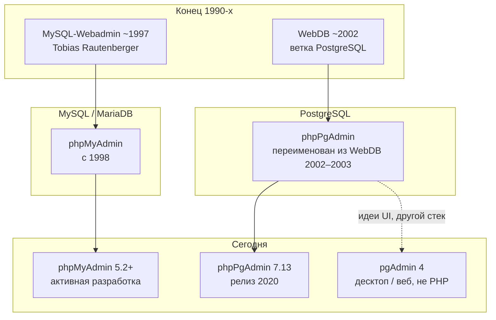

# История phpMyAdmin, phpPgAdmin и веб-админок БД на PHP

<div class="article-tags">
  <span class="tag tag-beginner">ДЛЯ НОВИЧКОВ</span>
</div>

<span class="complexity-badge">Разработчику</span>

Пятая статья раздела [phpMyAdmin](./intro) — про **откуда взялись** привычные веб-панели для MySQL и PostgreSQL. Две самые известные **PHP-оболочки** для реляционных СУБД в браузере выросли из одной волны конца 1990-х — идеи "админка через CGI/PHP вместо консоли". Их судьбы разошлись по **протоколу и диалекту SQL**, но архитектурная идея осталась общей: [веб-сервер](/encyclopedia/5-languages/5-07-php/112) → [PHP](/encyclopedia/5-languages/5-07-php/intro) → драйвер к серверу БД → HTML-формы поверх метаданных.

Если вы уже прошли [установку phpMyAdmin](./2) и работали с [SQL во вкладках](./3), эта глава объясняет, **почему** рядом существует отдельный [phpPgAdmin](/encyclopedia/5-languages/5-07-php/phppgadmin/intro) и почему для PostgreSQL сегодня чаще ставят **pgAdmin**, а не PHP-клиент.

---

## Словарь главы

| Термин | Кратко |
|--------|--------|
| **Веб-админка БД** | PHP-приложение в браузере, которое выполняет SQL от имени пользователя СУБД |
| **Wire protocol** | Бинарный протокол клиент ↔ сервер (MySQL и PostgreSQL используют разные) |
| **mysqli / pgsql** | Расширения PHP для MySQL/MariaDB и PostgreSQL — см. [статью 2](./2) |
| **Метаданные** | Системные каталоги: список баз, таблиц, типов, прав — то, что рисует дерево слева |
| **Дамп** | Файл с SQL или данными для резервного копирования — см. [статью 4](./4) |
| **LAMP/WAMP** | Стек Linux/Windows + Apache + MySQL + PHP, где phpMyAdmin ставили "из коробки" |
| **GoPHP5** | Кампания phpMyAdmin ~2007 — отказ от PHP 4 в основной ветке |

---

## Общая схема происхождения

В конце 1990-х администрирование MySQL чаще всего означало консоль `mysql` или десктопный клиент. **Веб** уже стал стандартным способом доступа к данным, но инструментов "открыть таблицу в браузере" почти не было. Первые эксперименты сводились к **CGI-скриптам** на Perl или C — тот же слой, что описан в [истории PHP](/encyclopedia/5-languages/5-07-php/11) для эпохи до встраиваемых модулей.



| Проект | СУБД | Язык | Статус (ориентир) |
|--------|------|------|-------------------|
| **phpMyAdmin** | MySQL, MariaDB | PHP | Активно, релизы 5.x, документация Sphinx |
| **phpPgAdmin** | PostgreSQL | PHP | Поддержка с перерывами; последний крупный релиз **7.13.0** (ноябрь 2020) |
| **pgAdmin** | PostgreSQL | Python/Electron + веб | Основной GUI для PostgreSQL в индустрии |
| **Adminer** | Несколько СУБД | PHP, один файл | Компактная альтернатива с 2007 года |

**Почему это важно сейчас.** Когда вы видите phpMyAdmin в [Open Server](/encyclopedia/5-languages/5-07-php/113) или XAMPP, вы пользуетесь продуктом **той же линии**, что и в 1998 году — только с Bootstrap 5, 2FA и поддержкой MariaDB. Понимание истории помогает не путать "устаревший UI" с "устаревшей СУБД" и объясняет, зачем в энциклопедии два параллельных раздела.

---

## Контекст эпохи — PHP, MySQL и браузер

Три технологии сошлись в одной точке:

- **[PHP 3/4](/encyclopedia/5-languages/5-07-php/11)** дал простой способ генерировать HTML на сервере без отдельного CGI-процесса на каждый запрос.
- **MySQL 3.23+** стал де-факто стандартом для динамических сайтов в паре с PHP.
- **Браузеры** научились отправлять формы (`POST`) и показывать таблицы — достаточно для CRUD без JavaScript-фреймворков.

Типичный сценарий 2000-х:

1. Администратор кладёт PHP-скрипты в document root Apache.
2. Скрипт через **mysql**-расширение (позже **mysqli**) подключается к локальному серверу.
3. Результат `SHOW TABLES` или `SELECT` выводится как HTML-таблица.

phpMyAdmin систематизировал этот паттерн: вместо самописных страниц — единый код с переводами, темами и экспортом. Подробнее об архитектуре "браузер → PHP → СУБД" — в [первой статье раздела](./1).

---

## MySQL-Webadmin и рождение phpMyAdmin

### Предшественник

**MySQL-Webadmin** (1997) — ранний веб-интерфейс к **MySQL**, написанный **Tobias Rautenberger**. Он заложил шаблон, который вы узнаете в современном phpMyAdmin:

- список баз на сервере;
- просмотр структуры таблицы;
- выполнение SQL из текстового поля;
- простые формы вставки и правки строк.

Это был **прототип идеи**, а не монолит на годы: интерфейс и безопасность быстро устаревали, зато доказали спрос.

### Самостоятельный phpMyAdmin

**phpMyAdmin** появился в **1998** как самостоятельный проект на PHP с тем же назначением. Интерфейс и сценарии работы развивались быстрее, чем у предшественника; название закрепилось как стандарт де-факто для MySQL в LAMP/WAMP/XAMPP.

| Период | Событие |
|--------|---------|
| 1997 | MySQL-Webadmin — прототип идеи "MySQL в браузере" |
| 1998 | Старт phpMyAdmin |
| 2001 | Руководство переходит к **Marc Delisle**; команда расширяется (Oliver Müller, Loïc Chaplais и др.) |
| 2000-е | Рост вместе с PHP 4/5 и MySQL 4/5; переводы, темы, экспорт/импорт |
| ~2007 | Инициатива **GoPHP5** — отказ от древних PHP/MySQL в основной ветке |
| 3.0+ | Минимум PHP 5.2 и MySQL 5; ветка 2.x — только безопасность для legacy |
| 2010-е | Поддержка InnoDB, триггеров, событий, Designer, pmadb |
| 5.x | PHP 7.2.5+, Bootstrap 5, MariaDB, улучшенный импорт, 2FA |

### GoPHP5 и привязка к версии PHP

Около **2007** года команда phpMyAdmin публично поддержала движение **GoPHP5**: основная ветка перестала обслуживать PHP 4 и старые API MySQL. Для разработчика это тот же принцип, что позже повторился в phpPgAdmin 7.x — **минимальная версия PHP и расширений** задаёт, какой релиз админки можно поставить на сервер. Требования phpMyAdmin 5.2 перечислены в [статье об установке](./2).

Современная линия описана в [документации phpMyAdmin 5.2](http://127.0.0.1/openserver/phpmyadmin/doc/html/intro.html) (в Open Server — локальная копия Sphinx) и в [введении раздела](./intro).

### Мини-разбор — что делает PHP-слой

Упрощённо запрос "показать таблицы" в phpMyAdmin сводится к цепочке, которую вы уже видели при работе с [PDO](/encyclopedia/5-languages/5-07-php/160):

```php
<?php
// Учебный фрагмент: суть mysqli, не production-код
$link = mysqli_connect('127.0.0.1', 'root', '', '', 3306);
mysqli_set_charset($link, 'utf8mb4');

$result = mysqli_query($link, 'SHOW TABLES');
while ($row = mysqli_fetch_row($result)) {
    echo '<li>' . htmlspecialchars($row[0], ENT_QUOTES, 'UTF-8') . '</li>';
}
mysqli_close($link);
```

phpMyAdmin делает то же самое, но:

- оборачивает вывод в шаблон и навигацию;
- проверяет права пользователя MySQL (`SHOW GRANTS`);
- кэширует метаданные и хранит настройки в **pmadb** — см. [статью 4](./4).

---

## WebDB и phpPgAdmin

Параллельно для **PostgreSQL** в начале **2002** шла разработка **WebDB** — веб-админки под PG. PostgreSQL уже поддерживался в PHP 3 через модуль **pgsql**, но готового "phpMyAdmin для PG" не было.

### Хронология переименования

В журнале изменений phpPgAdmin зафиксированы ранние вехи:

| Версия | Дата (по HISTORY) | Смысл |
|--------|-------------------|--------|
| 0.1 | начало 2002 | Первая dev-версия |
| 0.5 | 20 дек. 2002 | Первый публичный релиз, помечен как "не для продакшена" |
| 0.6 | 24 дек. 2002 | Исправления browse, пагинации, кавычек в паролях |
| 3.0.0-dev-1 | 2002–2003 | **Переименование в phpPgAdmin** (отказ от имени WebDB) |

В описаниях пакетов (Debian, FreeBSD) phpPgAdmin прямо называют **портом идей phpMyAdmin на PostgreSQL** — перенос парадигмы "веб-формы + SQL" на другой сервер и расширение **pgsql**.

### Эпохи phpPgAdmin

| Эпоха | Версии (ориентир) | PHP | PostgreSQL | Заметные вехи |
|-------|-------------------|-----|------------|---------------|
| Ранний WebDB / phpPgAdmin 3.x | 0.x – 3.0 | PHP 4 | 7.0 – 7.2 | Переводы, триггеры, FK, каскадный DROP |
| Стабилизация 4.x – 5.x | 4.x – 5.6 | PHP 5 → отказ от PHP 5 в 5.6 | 8.4 – 11 | Плагины, nested server groups, JSON/JSONB, тема bootstrap |
| Современная 7.x | 7.12 – 7.13 | PHP 7.x; 7.13 отсекает 7.1, последний с 7.2 | 12 – 14 (7.13) | Bootstrap 3.3.7, jQuery 3.4.1, исправления XSS |

После **7.13.0** (7 ноября 2020) публичные релизы шли реже; для новых проектов на PostgreSQL чаще выбирают **pgAdmin 4**, **DBeaver** или **psql** — см. [клиенты SQL](/encyclopedia/3-data-markup/3-07-sql/4) и [PostgreSQL — практика](/encyclopedia/3-data-markup/3-07-sql/888). phpPgAdmin остаётся в legacy-стеках и учебных средах, где уже развёрнут PHP.

### Мини-разбор — отличие на уровне PHP

Тот же сценарий "список объектов", но для PostgreSQL — другой API и **схемы**:

```php
<?php
// Учебный фрагмент: pgsql + information_schema
$conn = pg_connect('host=127.0.0.1 port=5432 dbname=postgres user=postgres');
$sql = "SELECT table_name FROM information_schema.tables
        WHERE table_schema = 'public' ORDER BY 1";
$res = pg_query($conn, $sql);
while ($row = pg_fetch_assoc($res)) {
    echo '<li>' . htmlspecialchars($row['table_name'], ENT_QUOTES, 'UTF-8') . '</li>';
}
pg_close($conn);
```

В phpPgAdmin дерево слева учитывает **схему** (`public`, `app`, …) — это главное UX-отличие от phpMyAdmin, где верхний уровень — **база → таблицы**. Подробнее — в [phpPgAdmin — что это](/encyclopedia/5-languages/5-07-php/phppgadmin/1).

---

## Почему два проекта, а не один

С точки зрения пользователя обе программы "делают одно и то же". С точки зрения реализации — **разные серверы, разные расширения PHP, разная модель прав и объектов**. Объединить одну кодовую базу без толстого слоя абстракции было бы дороже, чем поддерживать два специализированных клиента.

| Фактор | phpMyAdmin | phpPgAdmin |
|--------|------------|------------|
| Протокол | MySQL wire protocol | PostgreSQL frontend/backend |
| PHP-расширение | **mysqli** | **pgsql** |
| Модель объектов | База → таблицы | База → **схемы** → таблицы |
| Роли | `mysql.user`, привилегии MySQL | **Роли** PostgreSQL, `pg_hba.conf` |
| Дампы | mysqldump-стиль | **pg_dump**, **pg_dumpall** |
| Типы | ENGINE, AUTO_INCREMENT | SERIAL, sequences, JSONB, domains |

**Практический вывод.** Нельзя "переключить" phpMyAdmin на PostgreSQL одной настройкой — нужен другой драйвер, другие системные представления и другой синтаксис DDL. Отсюда два раздела энциклопедии и два репозитория upstream.

---

## Другие инструменты в том же слое

История не заканчивается парой phpMyAdmin / phpPgAdmin. В том же "слое" (доступ к БД через браузер или тонкий клиент) появились конкуренты и наследники:

- **phpPgAdmin** и **phpMyAdmin** — "классическая" связка PHP + Apache в сборках 2000–2010-х.
- **pgAdmin** (с 2002, с 2016 активная ветка **pgAdmin 4**) — нативный стек PostgreSQL Global Development Group, не PHP; сегодня это главный GUI для PG.
- **Adminer** (один PHP-файл, несколько СУБД) — появился позже (2007), удобен для быстрого доступа и сравнения диалектов в одном UI.
- **phpLiteAdmin** — SQLite в одном файле PHP; тот же принцип "скачал — положил в webroot".
- **DBeaver**, **DataGrip** — десктопные универсальные клиенты из [обзора инструментов SQL](/encyclopedia/3-data-markup/3-07-sql/4).

В [Open Server](/encyclopedia/5-languages/5-07-php/113) из коробки обычно идёт **phpMyAdmin**; **PostgreSQL** чаще сопровождают **pgAdmin** или консолью **psql** — phpPgAdmin ставят вручную или через пакет ОС.

<div class="callout callout--info">
  <div class="callout-title">Adminer как контрольный пример</div>

  <div class="callout-body">
  Один файл <code>adminer.php</code> подключается и к MySQL, и к PostgreSQL — но без Designer, pmadb и богатого импорта phpMyAdmin. История Adminer показывает альтернативный компромисс: <strong>минимальный код</strong> вместо <strong>полного набора админ-функций</strong>.
  </div>
</div>

---

## Уроки для разработчика

1. **Веб-админка ≠ отдельная СУБД.** Логин на странице phpMyAdmin или phpPgAdmin — это учётка сервера БД. Компромисс URL панели равен компромиссу данных; см. [безопасность и FAQ](./4).
2. **Версии PHP и расширений диктуют релиз админки.** GoPHP5 для MySQL; отказ от PHP 5 в phpPgAdmin 7.12 — тот же класс решений, что и миграция вашего кода на PHP 8.
3. **История объясняет дублирование в энциклопедии.** Отдельные главы [phpMyAdmin](./intro) и [phpPgAdmin](/encyclopedia/5-languages/5-07-php/phppgadmin/intro) отражают реальное разделение экосистем, а не избыточность авторов.
4. **Консоль не исчезла.** Дампы на гигабайты по-прежнему надёжнее через `mysqldump` / `pg_dump`, чем через форму импорта — см. [импорт и лимиты PHP](./4).
5. **Параллель с вашим кодом.** То, что phpMyAdmin делает через mysqli, вы делаете через [PDO или mysqli из PHP](/encyclopedia/5-languages/5-07-php/20) — панель лишь готовый клиент без собственной бизнес-логики.

---

## См. также

- [phpMyAdmin — что это и где встретить](./1)
- [phpPgAdmin — что это и где встретить](/encyclopedia/5-languages/5-07-php/phppgadmin/1)
- [PostgreSQL — практика и API](/encyclopedia/3-data-markup/3-07-sql/888)
- [MySQL — практическая работа и API](/encyclopedia/3-data-markup/3-07-sql/889)
- [История языка PHP](/encyclopedia/5-languages/5-07-php/11)

---
