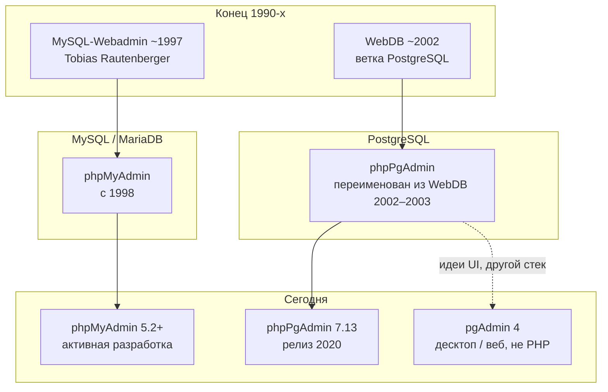

# История phpMyAdmin, phpPgAdmin и веб-админок БД на PHP

Разработчику

Две самые известные **PHP-оболочки** для реляционных СУБД в браузере выросли из одной волны конца 1990-х — «админка через CGI/PHP вместо консоли». Их судьбы разошлись по **протоколу и диалекту SQL**, но архитектурная идея осталась общей: веб-сервер, PHP, драйвер к серверу БД, HTML-формы поверх метаданных.

---

## Общая схема происхождения

| Проект | СУБД | Язык | Статус (ориентир) |
|--------|------|------|-------------------|
| **phpMyAdmin** | MySQL, MariaDB | PHP | Активно, релизы 5.x, документация Sphinx |
| **phpPgAdmin** | PostgreSQL | PHP | Поддержка с перерывами; последний крупный релиз **7.13.0** (ноябрь 2020) |
| **pgAdmin** | PostgreSQL | Python/Electron + веб | Основной GUI для PostgreSQL в индустрии |
| **Adminer** | Несколько СУБД | PHP, один файл | Компактная альтернатива |

---

## MySQL-Webadmin и рождение phpMyAdmin

**MySQL-Webadmin** (1997) — ранний веб-интерфейс к **MySQL**, написанный **Tobias Rautenberger**. Заложил шаблон: список баз, просмотр таблиц, выполнение SQL из браузера.

**phpMyAdmin** появился в **1998** как самостоятельный проект на PHP с тем же назначением. Интерфейс и сценарии работы развивались быстрее, чем у предшественника; название закрепилось как стандарт де-факто для MySQL в LAMP/WAMP/XAMPP.

| Период | Событие |
|--------|---------|
| 1997 | MySQL-Webadmin — прототип идеи «MySQL в браузере» |
| 1998 | Старт phpMyAdmin |
| 2001 | Руководство переходит к **Marc Delisle**; команда расширяется (Oliver Müller, Loïc Chaplais и др.) |
| 2000-е | Рост вместе с PHP 4/5 и MySQL 4/5; переводы, темы, экспорт/импорт |
| ~2007 | Инициатива **GoPHP5** — отказ от древних PHP/MySQL в основной ветке |
| 3.0+ | Минимум PHP 5.2 и MySQL 5; ветка 2.x — только безопасность для legacy |
| 2010-е | Поддержка InnoDB, триггеров, событий, Designer, pmadb |
| 5.x | PHP 7.2.5+, Bootstrap 5, MariaDB, улучшенный импорт, 2FA |

Современная линия описана в [документации phpMyAdmin 5.2](http://127.0.0.1/openserver/phpmyadmin/doc/html/intro.html) и в разделе [phpMyAdmin — о разделе](./intro).

---

## WebDB и phpPgAdmin

Параллельно для **PostgreSQL** в начале **2002** шла разработка **WebDB** — веб-админки под PG. В журнале изменений phpPgAdmin зафиксированы ранние вехи:

| Версия | Дата (по HISTORY) | Смысл |
|--------|-------------------|--------|
| 0.1 | начало 2002 | Первая dev-версия |
| 0.5 | 20 дек. 2002 | Первый публичный релиз, «не для продакшена» |
| 0.6 | 24 дек. 2002 | Исправления browse, пагинации, кавычек в паролях |
| 3.0.0-dev-1 | 2002–2003 | **Переименование в phpPgAdmin** (отказ от имени WebDB) |

В описаниях пакетов (Debian, FreeBSD) phpPgAdmin прямо называют **портом идей phpMyAdmin на PostgreSQL** — не форк построчно, а перенос парадигмы «веб-формы + SQL» на другой сервер и расширение **pgsql**.

### Эпохи phpPgAdmin

| Эпоха | Версии (ориентир) | PHP | PostgreSQL | Заметные вехи |
|-------|-------------------|-----|------------|---------------|
| Ранний WebDB / phpPgAdmin 3.x | 0.x – 3.0 | PHP 4 | 7.0 – 7.2 | Переводы, триггеры, FK, каскадный DROP |
| Стабилизация 4.x – 5.x | 4.x – 5.6 | PHP 5 → отказ от PHP 5 в 5.6 | 8.4 – 11 | Плагины, nested server groups, JSON/JSONB, тема bootstrap |
| Современная 7.x | 7.12 – 7.13 | PHP 7.x; 7.13 отсекает 7.1, последний с 7.2 | 12 – 14 (7.13) | Bootstrap 3.3.7, jQuery 3.4.1, исправления XSS |

После **7.13.0** (7 ноября 2020) публичные релизы шли реже; для новых проектов на PostgreSQL чаще выбирают **pgAdmin 4**, **DBeaver** или **psql**, а phpPgAdmin остаётся в legacy-стеках и учебных средах.

---

## Почему два проекта, а не один

| Фактор | phpMyAdmin | phpPgAdmin |
|--------|------------|------------|
| Протокол | MySQL wire protocol | PostgreSQL frontend/backend |
| PHP-расширение | **mysqli** | **pgsql** |
| Модель объектов | База → таблицы | База → **схемы** → таблицы |
| Роли | `mysql.user`, привилегии MySQL | **Роли** PostgreSQL, `pg_hba.conf` |
| Дампы | mysqldump-стиль | **pg_dump**, **pg_dumpall** |
| Типы | ENGINE, AUTO_INCREMENT | SERIAL, sequences, JSONB, domains |

Объединить один кодовую базу на практике не удалось бы без толстого слоя абстракции; поэтому сообщество поддерживает **два специализированных клиента**.

---

## Другие инструменты в том же слое

- **phpPgAdmin** и **phpMyAdmin** — «классическая» связка PHP + Apache в сборках 2000–2010-х.
- **pgAdmin** (с 2002, с 2016 активная ветка **pgAdmin 4**) — нативный стек PostgreSQL Global Development Group, не PHP.
- **Adminer** (один PHP-файл, несколько СУБД) — появился позже (2007), удобен для быстрого доступа.
- **phpLiteAdmin** — SQLite в одном файле PHP.

В [Open Server](/encyclopedia/5-languages/5-07-php/113) из коробки обычно идёт **phpMyAdmin**; **PostgreSQL** чаще сопровождают **pgAdmin** или консолью **psql** — phpPgAdmin ставят вручную или через пакет ОС.

---

## Уроки для разработчика

1. **Веб-админка ≠ отдельная СУБД** — логин всегда учётка сервера БД; компромисс URL phpMyAdmin/phpPgAdmin равен компромиссу данных.
2. **Версии PHP и расширений** диктуют, какой релиз админки можно поставить (GoPHP5 для MySQL; отказ от PHP 5 в phpPgAdmin 7.12).
3. **История объясняет дублирование** в энциклопедии: отдельные главы [phpMyAdmin](./intro) и [phpPgAdmin](/encyclopedia/5-languages/5-07-php/phppgadmin/intro) отражают реальное разделение экосистем, а не избыточность авторов.

---

## См. также

- [phpMyAdmin — что это и где встретить](./1)
- [phpPgAdmin — что это и где встретить](/encyclopedia/5-languages/5-07-php/phppgadmin/1)
- [PostgreSQL — практика и API](/encyclopedia/3-data-markup/3-07-sql/888)
- [История языка PHP](/encyclopedia/5-languages/5-07-php/11)

---
