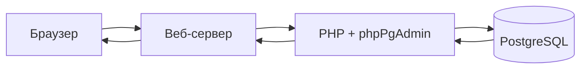

# phpPgAdmin — что это и где встретить

  ДЛЯ НОВИЧКОВ

Разработчику

**phpPgAdmin** — веб-интерфейс с открытым кодом (GPL) для управления сервером **PostgreSQL**. Проект позиционируется как «premier web-based administration tool for PostgreSQL» в репозитории [phppgadmin/phppgadmin](https://github.com/phppgadmin/phppgadmin).

Как и phpMyAdmin, приложение **не заводит своих пользователей**: на странице входа указываются **роль и пароль PostgreSQL** (часто `postgres` на локальной машине).

---

## Как устроена работа

| Компонент | Роль |
|-----------|------|
| Браузер | HTML-интерфейс, JavaScript |
| Веб-сервер | Apache, nginx + PHP-FPM |
| PHP + **pgsql** | Подключение `pg_connect`, выполнение SQL |
| PostgreSQL | Порт **5432** по умолчанию, аутентификация по `pg_hba.conf` |

Удалённый доступ возможен, если в `postgresql.conf` задан `listen_addresses` и в **pg_hba** разрешены подключения с IP веб-сервера.

---

## Возможности

По истории релизов и описанию пакетов, типичный набор:

- создание и удаление **баз** и **схем**;
- таблицы, представления, **sequences**, индексы, триггеры, функции;
- выполнение **произвольного SQL**, в том числе пакетами;
- **pg_dump** / **pg_dumpall** через настройку путей в config;
- управление **ролями** и правами (`GRANT` / `REVOKE`);
- просмотр данных с сортировкой, работа с **bytea**, **JSON/JSONB** (в новых ветках);
- несколько серверов в одной установке (`$conf['servers']`);
- темы, в том числе **bootstrap** (с 5.6);
- полнотекстовый поиск (расширения в ветке 5.x).

Актуальность функций зависит от версии phpPgAdmin и PostgreSQL на сервере.

---

## Где встречается

| Среда | phpPgAdmin | Примечание |
|-------|------------|------------|
| **Open Server** | Обычно **нет** в стандартной поставке | PostgreSQL — через **psql** или **pgAdmin** ([113](/encyclopedia/5-languages/5-07-php/113#postgresql)) |
| **XAMPP / WAMP** | Нет из коробки | Только MySQL/phpMyAdmin |
| **Debian / Ubuntu** | Пакет `phppgadmin` | Конфиг часто в `/etc/phppgadmin/` |
| **FreeBSD / Gentoo** | Порт `phppgadmin` | |
| **Arch Linux** | `phppgadmin` в community | `/etc/webapps/phppgadmin/config.inc.php` |
| **Ручная установка** | Git / архив с GitHub | Нужны PHP **pgsql**, mbstring |

  
Локальный PostgreSQL в OSP

  Типичное подключение: хост <code>127.0.0.1</code>, порт <code>5432</code>, роль <code>postgres</code>, пароль по настройке панели. Веб-интерфейс phpPgAdmin после установки — по своему URL (например <code>/phppgadmin</code> на виртуальном хосте).

---

## phpPgAdmin и phpMyAdmin — ключевые отличия

| Тема | phpMyAdmin | phpPgAdmin |
|------|------------|------------|
| СУБД | MySQL, MariaDB | PostgreSQL |
| PHP | mysqli | **pgsql** |
| Иерархия | Database → Table | Database → **Schema** → Table |
| Учётки | MySQL users | **Roles** |
| Дамп | SQL export / mysqldump | **pg_dump**, custom format |
| Активность (2020+) | Регулярные релизы 5.x | Релиз **7.13.0** (2020), далее реже |

Сравнение интерфейса удобно вести параллельно: [phpMyAdmin — SQL и DDL/DML](/encyclopedia/5-languages/5-07-php/phpmyadmin/3) и [phpPgAdmin — SQL и DDL/DML](./3).

---

## Первый вход

1. Убедитесь, что PostgreSQL запущен и PHP собран с **pgsql** (`php -m | findstr pgsql`).
2. Откройте URL установки phpPgAdmin.
3. Введите **имя роли** и **пароль** PostgreSQL.
4. Выберите сервер в списке (если настроено несколько в `config.inc.php`).

Ошибка «Your PHP installation does not support PostgreSQL» означает отсутствие расширения **pgsql** — переустановите PHP с `php-pgsql` или включите `extension=pgsql` в `php.ini`.

---

## История — куда читать дальше

Кратко: проект начался как **WebDB** (2002), публичные 0.5/0.6 — декабрь 2002, переименование в **phpPgAdmin** — ветка 3.0.0-dev-1. Линия **7.x** (2019–2020) добавила PHP 7.x и PostgreSQL 12–14.

Полная таблица эпох и связь с **MySQL-Webadmin** / **phpMyAdmin** — в статье [История веб-админок БД на PHP](/encyclopedia/5-languages/5-07-php/phpmyadmin/5).

---

## Следующий шаг

[Требования, установка и подключение](./2).

Теория SQL и типы Postgres — [888](/encyclopedia/3-data-markup/3-07-sql/888); после phpPgAdmin — [практикум PostgreSQL 8.11](/encyclopedia/8-infra-security/8-11-praktikum-postgresql/intro).

---
