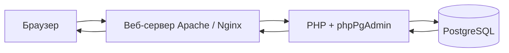

import ExternalCodeEmbed from '@site/src/components/ExternalCodeEmbed';


# phpPgAdmin — что это и где встретить

<div class="article-tags">
  <span class="tag tag-beginner">ДЛЯ НОВИЧКОВ</span>
</div>

<span class="complexity-badge">Разработчику</span>

**phpPgAdmin** — инструмент с открытым исходным кодом (лицензия GPL), написанный на [PHP](/encyclopedia/5-languages/5-07-php/intro). Он даёт графический доступ к задачам администрирования [PostgreSQL](/encyclopedia/3-data-markup/3-07-sql/888): создание баз и схем, выполнение [SQL](/encyclopedia/3-data-markup/3-07-sql/intro), управление ролями, дампы через **pg_dump**. В репозитории [phppgadmin/phppgadmin](https://github.com/phppgadmin/phppgadmin) проект описан как "premier web-based administration tool for PostgreSQL".

phpPgAdmin — не отдельная СУБД и не замена серверу PostgreSQL. Это **клиент**: тонкий слой между вами и уже запущенным экземпляром Postgres. Тот же результат можно получить в консоли **psql**, в [pgAdmin 4](/encyclopedia/3-data-markup/3-07-sql/4), [DBeaver](/encyclopedia/3-data-markup/3-07-sql/4) или из PHP-кода через [PDO](/encyclopedia/5-languages/5-07-php/160) — phpPgAdmin переводит клики и формы в SQL-запросы и показывает ответ сервера в HTML.

<div class="callout callout--info">
  <div class="callout-title">Роли вместо пользователей MySQL</div>

  <div class="callout-body">
  На странице входа phpPgAdmin указываются <strong>имя роли</strong> и <strong>пароль PostgreSQL</strong> (часто <code>postgres</code> на локальной машине). Приложение не заводит своих учёток — только проксирует аутентификацию в СУБД. Управление ролями делается через пункт "Roles" или SQL (<code>CREATE ROLE</code>, <code>GRANT</code> — см. <a href="/encyclopedia/3-data-markup/3-07-sql/888">PostgreSQL — практика</a> и <a href="./3">SQL, DDL и DML</a>).
  </div>
</div>

<div class="callout callout--info">
  <div class="callout-title">pgAdmin и phpPgAdmin</div>

  <div class="callout-body">
  В промышленных и учебных средах для PostgreSQL чаще встречают <strong>pgAdmin 4</strong> (отдельное приложение, не PHP). phpPgAdmin остаётся полезен там, где уже есть LAMP/PHP-стек и нужен лёгкий веб-клиент без установки pgAdmin — см. сравнение в <a href="/encyclopedia/5-languages/5-07-php/phpmyadmin/5">истории веб-админок</a>.
  </div>
</div>

---

## Словарь главы

| Термин | Кратко |
|--------|--------|
| **СУБД** | Сервер PostgreSQL, который хранит данные и выполняет SQL |
| **Клиент БД** | Программа, подключающаяся к СУБД: phpPgAdmin, **psql**, pgAdmin, PDO |
| **pgsql** | Расширение PHP для протокола PostgreSQL; им пользуется phpPgAdmin |
| **Роль (role)** | Учётная запись Postgres: может иметь LOGIN, права на объекты, членство в группах |
| **Схема (schema)** | Пространство имён внутри базы: `public`, `app`, `audit` — таблицы живут в схеме |
| **pg_hba.conf** | Файл правил аутентификации: кто с какого IP может подключиться и как |
| **Дамп** | Резервная копия через **pg_dump** / **pg_dumpall**, не plain SQL как у mysqldump |
| **DDL / DML** | Языки определения структуры и изменения данных — подробнее в [статье 3](./3) |

---

## Зачем phpPgAdmin разработчику

На локальной машине phpPgAdmin решает три практические задачи:

- **Быстро посмотреть данные** — открыть таблицу в схеме `public`, отсортировать строки, отредактировать поле без скрипта.
- **Проверить схему** — индексы, типы столбцов, sequences, триггеры видны в дереве объектов и на вкладках структуры.
- **Выполнить ad-hoc SQL** — проверить запрос из приложения, посмотреть план через `EXPLAIN` (углублённо — [881](/encyclopedia/3-data-markup/3-07-sql/881), [практикум 8.11](/encyclopedia/8-infra-security/8-11-praktikum-postgresql/2)).

Для продакшена тот же инструмент опасен: полный доступ к данным через браузер. На серверах phpPgAdmin либо не ставят, либо закрывают за VPN, IP whitelist и HTTPS — подробнее в [статье 4](./4).

---

## Как устроена работа

Цепочка запроса типична для [PHP-приложения](/encyclopedia/5-languages/5-07-php/intro), работающего через [HTTP](/encyclopedia/2-system-network/2-09-osnovy-integratsionnogo-vzaimodeystviya/118):



| Компонент | Роль |
|-----------|------|
| **Браузер** | HTML-интерфейс, JavaScript; в ветке 5.6+ тема на Bootstrap 3 |
| **Веб-сервер** | Отдаёт файлы phpPgAdmin и передаёт запросы в PHP — см. [настройку веб-сервера](/encyclopedia/5-languages/5-07-php/112) |
| **PHP + pgsql** | Подключение `pg_connect`, выполнение SQL через `pg_query` |
| **PostgreSQL** | Порт **5432** по умолчанию; аутентификация по **pg_hba.conf** и паролю роли |

Удалённый доступ возможен, если в `postgresql.conf` задан `listen_addresses` и в **pg_hba** разрешены подключения с IP веб-сервера — см. [конфигурацию Postgres](/encyclopedia/8-infra-security/8-11-praktikum-postgresql/3) и [статью 2](./2).

### Что происходит при одном клике

1. Браузер отправляет **HTTP POST** (форма входа, кнопка "Execute" на вкладке SQL).
2. Веб-сервер передаёт запрос интерпретатору PHP.
3. Скрипт phpPgAdmin открывает соединение через **pgsql** и отправляет SQL на сервер PostgreSQL.
4. СУБД проверяет роль, права на объект (схему, таблицу) и выполняет запрос.
5. PHP собирает HTML-таблицу или сообщение об ошибке и отдаёт его браузеру.

Связь с сервером БД идёт через расширение **pgsql** (аналог **mysqli** у [phpMyAdmin](/encyclopedia/5-languages/5-07-php/phpmyadmin/1)). phpPgAdmin можно разместить на той же машине, что и PostgreSQL, или на отдельном хосте с сетевым доступом к порту **5432**.

### Разбор — минимальное подключение на PHP

Под капотом phpPgAdmin делает то же, что и ваш код, только с десятками экранов поверх:

```php
<?php
$conn_string = 'host=127.0.0.1 port=5432 dbname=postgres user=postgres password=secret';
$conn = pg_connect($conn_string);
if (!$conn) {
    die('Ошибка подключения');
}

$result = pg_query($conn, 'SELECT datname FROM pg_database WHERE datistemplate = false');
while ($row = pg_fetch_assoc($result)) {
    echo $row['datname'] . "\n";
}
pg_close($conn);
```

| Строка / фрагмент | Смысл |
|-------------------|--------|
| `$conn_string = 'host=...'` | Параметры DSN: хост, порт, база, роль, пароль — аналог полей формы входа |
| `pg_connect(...)` | Устанавливает сессию клиента; без неё SQL некуда отправить |
| `SELECT datname FROM pg_database` | Служебный запрос — список баз; на главной phpPgAdmin вы видите тот же результат |
| `datistemplate = false` | Исключает служебные шаблоны `template0` и `template1` |
| `pg_fetch_assoc` | Построчное чтение ответа; в интерфейсе это превращается в HTML-таблицу |

В реальном приложении используйте [PDO с подготовленными запросами](/encyclopedia/5-languages/5-07-php/160), а не конкатенацию SQL — phpPgAdmin рассчитан на администратора, который осознанно пишет произвольный SQL.

---

## Что умеет интерфейс

По истории релизов и описанию пакетов, типичный набор:

- создание и удаление **баз** и **схем**;
- таблицы, представления, **sequences**, индексы, триггеры, функции на PL/pgSQL;
- выполнение **произвольного SQL**, в том числе пакетами;
- **pg_dump** / **pg_dumpall** через настройку путей в `config.inc.php`;
- управление **ролями** и правами (`GRANT` / `REVOKE`);
- просмотр данных с сортировкой, работа с **bytea**, **JSON/JSONB** (в новых ветках);
- несколько серверов в одной установке (`$conf['servers']`);
- темы, в том числе **bootstrap** (с 5.6);
- полнотекстовый поиск (расширения в ветке 5.x).

Актуальность функций зависит от версии phpPgAdmin и PostgreSQL на сервере. Подробности по операциям — в [SQL, DDL и DML](./3) и [дампы, роли и FAQ](./4).

### Разбор — типичный SQL во вкладке SQL

После входа в базу `shop` разработчик часто выполняет такой набор (диалект PostgreSQL):


<ExternalCodeEmbed example="sql/php-507-phppgadmin-1-001" title="Разбор — типичный SQL во вкладке SQL" minHeight={372} />


| Запрос | Что делает в phpPgAdmin |
|--------|-------------------------|
| `information_schema.tables` | Список таблиц в схеме — то же, что раскрытие узла **public** в дереве |
| `SELECT ... FROM public.orders` | Явная схема `public`; без неё Postgres ищет объект в `search_path` |
| `INSERT ... RETURNING id` | Возвращает сгенерированный ключ из **sequence** — удобнее, чем отдельный `SELECT currval` |

phpPgAdmin **не проверяет бизнес-логику** приложения: если у роли есть право `DELETE`, одна команда `DELETE FROM orders` удалит все строки. Права задаёт администратор СУБД через роли, не интерфейс — см. [транзакции и блокировки](/encyclopedia/3-data-markup/3-07-sql/77).

---

## В каких стеках встречается

phpPgAdmin **реже встроен в локальные пакеты**, чем [phpMyAdmin](/encyclopedia/5-languages/5-07-php/phpmyadmin/1): типичные стеки XAMPP и Open Server идут с MySQL, а Postgres ставят отдельно. Зато на Linux-серверах пакет `phppgadmin` — обычное дополнение к LAMP + PostgreSQL.

| Стек / среда | phpPgAdmin | Как получить доступ | Примечание |
|--------------|------------|---------------------|------------|
| **Open Server (OSP)** | Обычно **нет** в стандартной поставке | PostgreSQL через **psql** или **pgAdmin** | Подробнее — [113, PostgreSQL](/encyclopedia/5-languages/5-07-php/113#postgresql) |
| **XAMPP / WAMP** | Нет из коробки | Только MySQL/phpMyAdmin | Postgres и phpPgAdmin — вручную или Docker |
| **Debian / Ubuntu** | Пакет `phppgadmin` | URL из конфига Apache, часто `/phppgadmin` | Конфиг в `/etc/phppgadmin/` |
| **FreeBSD / Gentoo** | Порт `phppgadmin` | По документации порта | |
| **Arch Linux** | `phppgadmin` в community | `/etc/webapps/phppgadmin/config.inc.php` | |
| **Docker** | Образ или ручная сборка поверх `php:apache` | Проброс порта 80/443 | См. пример ниже |
| **Ручная установка** | Git / архив с GitHub | Document root или алиас `/phppgadmin` | Нужны PHP **pgsql**, **mbstring** |

<div class="callout callout--tip">
  <div class="callout-title">Локальный PostgreSQL в OSP</div>

  <div class="callout-body">
  Типичное подключение: хост <code>127.0.0.1</code>, порт <code>5432</code>, роль <code>postgres</code>, пароль по настройке панели. Веб-интерфейс phpPgAdmin после установки — по своему URL (например <code>/phppgadmin</code> на виртуальном хосте). База по Postgres — в <a href="/encyclopedia/5-languages/5-07-php/113">локальной среде PHP</a>.
  </div>
</div>

### Разбор — phpPgAdmin рядом с Postgres в Docker Compose

Изолированная среда без установки Postgres на хост — типичный фрагмент `docker-compose.yml`:


<ExternalCodeEmbed example="yaml/php-507-phppgadmin-1-002" title="Разбор — phpPgAdmin рядом с Postgres в Docker Compose" minHeight={390} />


| Параметр | Зачем |
|----------|--------|
| `postgres:16` | Сервер БД; phpPgAdmin подключается к хосту `db` внутри сети Compose |
| `POSTGRES_USER` / `PASSWORD` | Роль для входа в phpPgAdmin — те же значения в форме логина |
| `volumes: ./phppgadmin` | Каталог с GitHub; в `config.inc.php` указывают `host=db`, не `localhost` |
| `ports: "8080:80"` | Интерфейс доступен по `http://localhost:8080` |

В `config.inc.php` для контейнера `web` хост сервера — имя сервиса **`db`**, не `127.0.0.1` хост-машины. Полная настройка — в [статье 2](./2).

---

## phpPgAdmin и phpMyAdmin — ключевые отличия

Если вы уже знакомы с [phpMyAdmin](/encyclopedia/5-languages/5-07-php/phpmyadmin/intro), полезно держать в голове параллель и расхождения:

| Тема | phpMyAdmin | phpPgAdmin |
|------|------------|------------|
| СУБД | [MySQL, MariaDB](/encyclopedia/3-data-markup/3-07-sql/889) | [PostgreSQL](/encyclopedia/3-data-markup/3-07-sql/888) |
| PHP-драйвер | **mysqli** | **pgsql** |
| Иерархия объектов | Database → Table | Database → **Schema** → Table |
| Учётки | MySQL users | **Roles** (роли с LOGIN) |
| Автоинкремент | `AUTO_INCREMENT` | **SERIAL** / **sequence** + `RETURNING` |
| Дамп | SQL export / mysqldump | **pg_dump**, custom format, directory |
| Индекс серверов в config | с **1** | с **0** |
| Активность (2020+) | Регулярные релизы 5.x | Релиз **7.13.0** (2020), далее реже |

Сравнение интерфейса удобно вести параллельно: [phpMyAdmin — SQL и DDL/DML](/encyclopedia/5-languages/5-07-php/phpmyadmin/3) и [phpPgAdmin — SQL и DDL/DML](./3). Общая история обеих линий — [статья 5 phpMyAdmin](/encyclopedia/5-languages/5-07-php/phpmyadmin/5).

---

## Первый вход

Пошагово — от запуска стека до списка баз на экране:

1. Убедитесь, что PostgreSQL запущен (`pg_isready -h 127.0.0.1 -p 5432` или служба в панели стека).
2. Проверьте расширение PHP **pgsql**: `php -m | findstr pgsql` (Windows) или `php -m | grep pgsql` (Linux/macOS).
3. Откройте URL установки phpPgAdmin.
4. Введите **имя роли** и **пароль** PostgreSQL.
5. Выберите сервер в списке, если в `config.inc.php` настроено несколько в `$conf['servers']`.

### Если что-то пошло не так

| Симптом | Вероятная причина | Что проверить |
|---------|-------------------|---------------|
| "Your PHP installation does not support PostgreSQL" | Нет расширения **pgsql** | Пакет `php-pgsql`, строка `extension=pgsql` в `php.ini` |
| "Login failed" / отказ в доступе | Неверная роль/пароль или правило **pg_hba** | `pg_hba.conf`, метод `md5`/`scram-sha-256`, перезагрузка Postgres |
| "could not connect to server" | Сервер не слушает порт или неверный хост | `listen_addresses`, firewall, `127.0.0.1:5432` |
| Пустой список баз | У роли нет `CONNECT` на базы | `GRANT CONNECT`, вход под `postgres` локально |
| Белый экран | Fatal error PHP | Логи Apache/nginx, `mbstring` для phpPgAdmin 7.12+ |

Ошибка **"Your PHP installation does not support PostgreSQL"** однозначно указывает на отсутствие **pgsql** — переустановите PHP с `php-pgsql` или включите расширение в `php.ini`. Параметры `$conf['servers']` и **pg_hba** разбираются в [следующей статье](./2).

---

## История

Кратко: проект начался как **WebDB** (2002), публичные 0.5/0.6 — декабрь 2002, переименование в **phpPgAdmin** — ветка 3.0.0-dev-1. Линия **7.x** (2019–2020) добавила PHP 7.x и PostgreSQL 12–14.

Параллельная линия для MySQL — **MySQL-Webadmin** → **[phpMyAdmin](/encyclopedia/5-languages/5-07-php/phpmyadmin/5)**; общие корни веб-админок на PHP, разные драйверы (**mysqli** и **pgsql**).

Полная таблица эпох, сравнение с **pgAdmin** и **Adminer** — в статье [История веб-админок БД на PHP](/encyclopedia/5-languages/5-07-php/phpmyadmin/5). Краткое определение — в [глоссарии](/glossary/P#phppgadmin).

---

## См. также

- [phpPgAdmin — о разделе](./intro) — порядок статей раздела
- [Работа с базами данных из PHP](/encyclopedia/5-languages/5-07-php/20) — когда UI уже не нужен, а нужен код
- [Клиенты и инструменты SQL](/encyclopedia/3-data-markup/3-07-sql/4) — phpPgAdmin среди psql, pgAdmin, DBeaver
- [phpMyAdmin — что это](/encyclopedia/5-languages/5-07-php/phpmyadmin/1) — аналог для MySQL/MariaDB
- [PostgreSQL — практика и API](/encyclopedia/3-data-markup/3-07-sql/888) — типы, роли, диалект SQL
- [Практикум PostgreSQL 8.11](/encyclopedia/8-infra-security/8-11-praktikum-postgresql/intro) — MVCC, Docker, бэкапы после освоения UI

---

## Следующий шаг

[Требования, установка и подключение](./2) — версии PHP и PostgreSQL, файл `config.inc.php`, **pg_hba.conf**, `listen_addresses` и несколько серверов в `$conf['servers']`.

Теория SQL и типы Postgres — [888](/encyclopedia/3-data-markup/3-07-sql/888); после phpPgAdmin — [практикум PostgreSQL 8.11](/encyclopedia/8-infra-security/8-11-praktikum-postgresql/intro).

---
