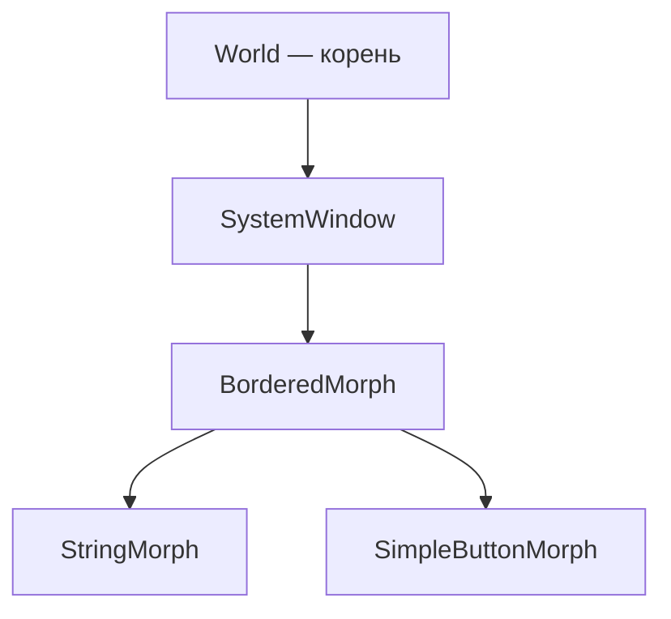
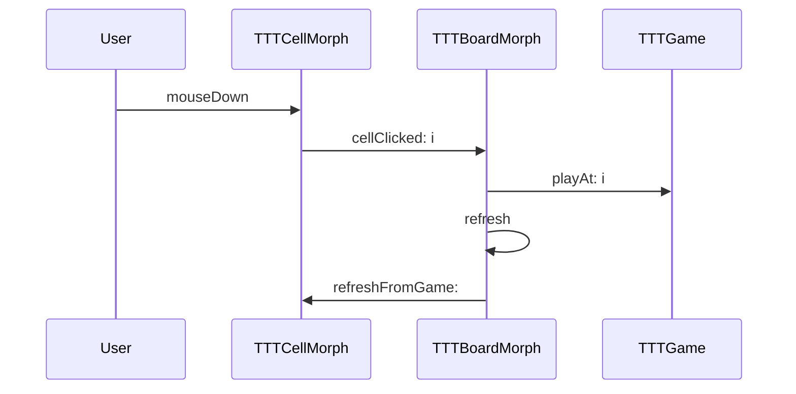

# Morphic — графическая система

<div class="article-tags">
  <span class="tag tag-required">ОБЯЗАТЕЛЬНО</span>
  <span class="tag tag-beginner">ДЛЯ НОВИЧКОВ</span>
</div>

<span class="complexity-badge">Разработчику</span>

---

## Morphic

См. также: [Справочник §12](./5.md#12-графическая-система-morphic) · [Pharo](./13.md) · [Squeak](./14.md) · [ООП в Smalltalk](./4.md) · [Крестики-нолики](./12.md) · [SmallDesktop](./21.md) · [Raylib в Pharo](./16.md) · [Десктопные приложения](/encyclopedia/4-code-dev/4-11-desktopnye-prilozheniya/1)

---

### Что такое Morphic?

**Morphic** — графический каркас **Smalltalk**, в котором **каждый элемент интерфейса — объект**. Базовый класс — **Morph** (от "metamorphosis", метаморфоза) — прямоугольная область с координатами, размером, цветом, дочерними морфами и методами отрисовки.

**Ключевые термины:**

- **Морф (Morph)** — визуальный объект; умеет `drawOn:`, принимать события, содержать детей.
- **World** — корневой морф рабочего стола [Pharo](./13.md) / [Squeak](./14.md).
- **Submorphs** — дочерние морфы; дерево submorphs — это сцена UI.
- **Halos** — "ореолы" для изменения размера и меню морфа (в режиме разработки).

Morphic используют Pharo и Squeak. В старых системах Smalltalk-80 был слой **Views** (классический MVC); Morphic его заменил единым деревом объектов. Исторически Morphic создали в Apple, затем перенесли в [Squeak](./14.md); Pharo унаследовал и развивает его.

**Главная идея:** UI не описывают XML или HTML, а **собирают из живых объектов**, которые можно инспектировать в Debugger, сохранить в image и изменить на лету — в духе [live coding](./22.md).

<div class="callout callout--tip">
  <div class="callout-title">Связь с разделом "Десктоп"</div>
  <div class="callout-body">
  Окна, фокус, события клавиатуры и цикл "событие → обработчик → перерисовка" в Morphic — частный случай тем из <a href="/encyclopedia/4-code-dev/4-11-desktopnye-prilozheniya/1">Десктопных приложений</a>. Там — общая теория; здесь — конкретная реализация в Smalltalk.
  </div>
</div>

---

### Морф и дерево сцены

Каждый морф в типичном случае:

- хранит **bounds** — прямоугольник в координатах **родителя**;
- рисует себя в **`drawOn:`** (или наследует заливку через `color`);
- содержит **submorphs** — список дочерних морфов;
- получает **события** мыши и клавиатуры, если ответил `true` в `handlesMouseDown:` или держит **фокус** клавиатуры.

#### Пример — панель с подписью

```smalltalk
panel := Morph new.
panel color: Color lightGray.
panel extent: 300 @ 200.

label := StringMorph contents: 'Привет, Morphic!'.
label position: 20 @ 20.
panel addMorph: label.

panel openInWorld
```

**Разбор построчно:**

| Строка | Смысл |
|--------|-------|
| `Morph new` | Создание экземпляра; `new` — сообщение классу `Morph` |
| `panel color: Color lightGray` | Установка цвета заливки; `Color lightGray` — объект-цвет |
| `panel extent: 300 @ 200` | Размер 300×200; `@` создаёт объект `Point` |
| `StringMorph contents: '…'` | Морф для однострочного текста |
| `label position: 20 @ 20` | Смещение относительно **родителя** (пока label ещё без родителя — от (0,0) world при open) |
| `panel addMorph: label` | Вложить label в panel; координаты position теперь относительно panel |
| `panel openInWorld` | Показать на рабочем столе Pharo |

**Полезные сообщения:**

- `openInHand` — морф "приклеен" к курсору для перетаскивания;
- `delete` — убрать с экрана;
- `extent:` / `position:` — геометрия вручную (как в практикумах раздела).



---

### Основные классы морфов

| Класс | Назначение |
|-------|------------|
| `Morph` | Базовый контейнер и "холст" |
| `BorderedMorph` | Прямоугольник с рамкой |
| `StringMorph` | Однострочный текст |
| `TextMorph` | Многострочный редактируемый текст |
| `SimpleButtonMorph` | Кнопка через `target` + `actionSelector` |
| `PluggableTextMorph` | Поле ввода, связанное с моделью (`TextModel`) |
| `ImageMorph` | Растровое изображение |
| `ScrollPane` | Прокручиваемая область |
| `SystemWindow` | Окно с заголовком и кнопками |

**Где это уже использовано в энциклопедии:**

- [TTTCellMorph / TTTBoardMorph](./12.md) — сетка, клики, кнопка "Новая игра";
- [DesktopAppMorph](./21.md) — панели, тема, `PluggableTextMorph`;
- [PongGameMorph](./31.md) — stepping, клавиатура, счёт;
- [ShooterGameMorph](./44.md) — ~60 FPS, коллизии.

Полный список паттернов — [§12 справочника](./5.md#12-графическая-система-morphic).

---

### События мыши и клавиатуры

Morphic **не опрашивает** клавиатуру в цикле `while`. Система доставляет **события** морфу под курсором или морфу с фокусом. Переопределяемые методы:

| Метод | Когда вызывается |
|-------|------------------|
| `handlesMouseDown:` | Разрешить ли клик (вернуть `true`) |
| `mouseDown:` | Кнопка мыши нажата |
| `mouseUp:` | Отпущена |
| `mouseMove:` | Движение с зажатой кнопкой |
| `handlesKeyboard:` | Принимать ли клавиши |
| `keyStroke:` | Символ с клавиатуры (**нужен фокус**) |

#### Паттерн pluggable-кнопки

```smalltalk
btn := SimpleButtonMorph new.
btn label: 'OK'.
btn target: self.
btn actionSelector: #buttonPressed.
```

**Разбор:**

- `SimpleButtonMorph new` — готовый морф-кнопка без подкласса.
- `label:` — текст на кнопке.
- `target:` — объект, которому пошлют действие (часто `self` доски или формы).
- `actionSelector:` — символ имени **унарного** метода, например `#buttonPressed`.

По клику кнопка шлёт **`buttonPressed`** объекту `target`. Это тот же приём, что в [крестиках-ноликах](./12.md) для "Новая игра".

**Фокус клавиатуры в играх:** перед WASD или стрелками **кликните по окну игры**. Иначе `keyStroke:` уйдёт другому морфу — типичная ошибка в [SmallPong](./31.md) и [SmallShooter](./44.md).

---

### Stepping — игровой цикл Morphic

В Morphic **нет** отдельного `main()` с `while running`. Анимация и игры использую **stepping**:

1. Морф вызывает `self startStepping`.
2. Система периодически шлёт сообщение **`step`** с интервалом **`stepTime`** (миллисекунды).
3. Остановка — `stopStepping`.

```smalltalk
stepTime
	^ 16   "≈ 60 кадров в секунду"

step
	self movePlayer.
	self checkCollisions.
	self changed
```

**Разбор:**

| Элемент | Роль |
|---------|------|
| `stepTime` | Пауза между вызовами `step`; 16 ms ≈ 62 FPS |
| `step` | Один "тик" игры: логика + запрос перерисовки |
| `changed` | Просит Morphic перерисовать bounds морфа |

Сравнение с Python [Pygame](/encyclopedia/9-spinoff/9-04-razrabotka-igr/praktikum-razrabotki-igr/3): там вы сами крутите `while running` и `clock.tick(60)`. В Morphic **система** вызывает `step` — модель остаётся чистой.

**Разделение слоёв** (как в [SmallPong](./31.md)):

- **`PongGame`** — координаты, счёт, правила; **не знает** о Morphic;
- **`PongGameMorph>>step`** — `game tick`, затем двигает дочерние морфы ракеток и мяча.

---

### Отрисовка — drawOn и changed

По умолчанию `Morph>>drawOn:` заливает прямоугольник цветом `color`. Своя графика — переопределение:

```smalltalk
drawOn: aCanvas
	super drawOn: aCanvas.
	aCanvas
		lineColor: Color white;
		drawLineFrom: 0 @ (self height // 2) to: self width @ (self height // 2)
```

**Разбор:**

- `super drawOn: aCanvas` — сначала фон (заливка `color`).
- `aCanvas` — объект-кисть; сообщения `lineColor:`, `drawLineFrom:to:` рисуют линию.
- `self height // 2` — целочисленное деление; `//` — см. [типы и числа](./33.md).

После изменения состояния **обязательно** `self changed`. Без него экран может не обновиться до следующего полного цикла — частая ошибка новичков.

Пример кастомного поля — [PongPlayfieldMorph](./31.md) (пунктирная линия посередине).

---

### Компоновка и окна

**Ручная компоновка** (все практикумы раздела):

- `addMorph:` — добавить ребёнка;
- `removeAllMorphs` — очистить контейнер (список заметок в SmallDesktop);
- `position:` / `extent:` — абсолютное размещение.

**Автоматическая компоновка** (для больших форм):

- `layoutPolicy:` — `TableLayout`, `ProportionalLayout` и др.;
- `hResizing` / `vResizing` — растягивание при изменении окна.

**SystemWindow** — обёртка с заголовком. Открытие из практикума:

```smalltalk
TTTBoardMorph class >> open
	^ self new openInWindow
```

`openInWindow` создаёт `SystemWindow`, помещает морф внутрь и показывает на World — пользователь видит "обычное" окно с заголовком.

---

### Morphic и MVC

**MVC** (Model–View–Controller) впервые цельно описали в **Smalltalk-80**. В практикумах энциклопедии — **упрощённый MVC**:

| Слой | Пример класса | Обязанность |
|------|---------------|-------------|
| **Model** | `TTTGame`, `PongGame` | Правила и состояние; **без** импорта Morphic |
| **View** | `TTTCellMorph`, морфы ракеток | Отображение |
| **Controller** | `TTTBoardMorph` | Клики/клавиши → вызовы модели → `refresh` |

Модель можно тестировать в Playground:

```smalltalk
g := TTTGame new.
g playAt: 1.
g playAt: 5.
g winner   "→ проверка логики без UI"
```

Морфы **знают** о модели, но не дублируют правила победы — см. [ООП-модель](./4.md) и [крестики-нолики](./12.md).



---

### Morphic и внешние библиотеки

| | Morphic | [Raylib](./16.md) через FFI |
|---|---------|----------------------------|
| Зависимости | Только image | `raylib.dll` / `.so` |
| Окно | Внутри World Pharo | Отдельное OS-окно |
| Игровой цикл | `step` / `stepTime` | `while !WindowShouldClose()` |
| Отладчик | Между кадрами в Pharo | Сложнее при падении FFI |
| Практикумы | TTT, SmallDesktop, SmallPong, SmallShooter | Дополнение для нативного рендера |

Для **учебных GUI и 2D-аркад** в разделе Smalltalk достаточно Morphic. [Raylib](./16.md) — следующий уровень, когда нужны текстуры, шейдеры и звук как в [играх на C++](/encyclopedia/5-languages/5-06-cpp/22).

---

### Частые ошибки

| Симптом | Причина | Решение |
|---------|---------|---------|
| `MessageNotUnderstood` при клике | Не вызван `initialize` / не создан `labelMorph` | Проверить порядок инициализации |
| Клавиши "молчат" | Нет фокуса | Клик по окну игры |
| "Замороженная" картинка | Нет `changed` | Вызвать после изменения модели |
| Индексы съехали | Путаница 0-based и 1-based | `Array>>at:` в Pharo с **1** |
| Лаги | Тяжёлая логика в `step` | Вынести в модель; упростить `drawOn:` |

Больше типичных сбоев — [FAQ итогов](./998.md).

---

### Маршрут обучения

| Шаг | Материал | Навык |
|-----|----------|-------|
| 1 | [§12 справочника](./5.md#12-графическая-система-morphic) | Шпаргалка API |
| 2 | [Крестики-нолики](./12.md) | Клики, кнопка, MVC |
| 3 | [SmallDesktop](./21.md) | Формы, панели, тема |
| 4 | [SmallPong](./31.md) или [SmallShooter](./44.md) | Stepping, клавиатура |

---

### Историческая справка

Morphic разработали **Дэн Ингаллс** и команда в **Apple** (1990-е), затем перенесли в **Squeak**, заменив устаревший MVC Views. Единое дерево морфов упростило **direct manipulation** — перетаскивание, halos, скрипты Etoys. [Pharo](./13.md) унаследовал Morphic и добавляет **Spec2** (декларативные формы) для "взрослых" приложений; учебный путь раздела сознательно идёт через **классические морфы**, чтобы вы видели объекты на экране буквально.
