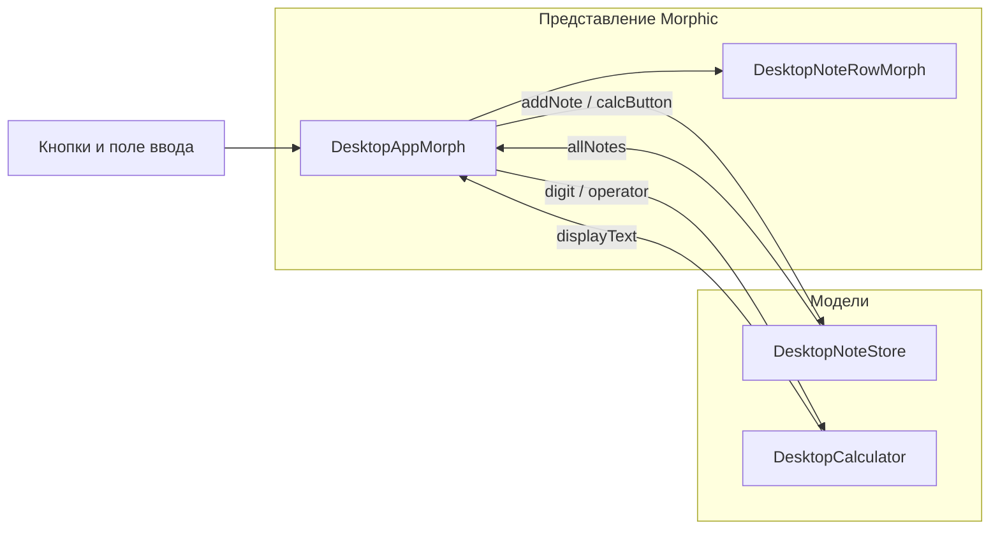

import ExternalCodeEmbed from '@site/src/components/ExternalCodeEmbed';


# SmallDesktop на Morphic — практикум

<div class="article-tags">
  <span class="tag tag-required">ОБЯЗАТЕЛЬНО</span>
  <span class="tag tag-beginner">ДЛЯ НОВИЧКОВ</span>
</div>

<span class="complexity-badge">Разработчику</span>
<span class="complexity-badge">Архитектору</span>

---

## О чём эта статья

Пошаговый практикум: вы соберёте **настольное приложение** в **Pharo** на **Morphic** — с боковой панелью, несколькими экранами, полем ввода, кнопками и строкой статуса. Это типичный каркас **десктопного GUI**: навигация, формы, действия пользователя, периодическое обновление интерфейса.

Каждый класс создаётся **в Class Browser** с нуля. После каждого блока кода — разбор: что делает строка, зачем нужен приём, куда смотреть в документации.

**База и смежные темы**

- [Первая программа](./11.md) — Playground, Accept, категории классов.
- [ООП-модель](./4.md) — инстанс-переменные, сообщения, протоколы.
- [Крестики-нолики](./12.md) — тот же MVC на меньшем объёме.
- [Типы данных](./33.md) — `OrderedCollection`, `Symbol`, строки.
- Morphic — [§12 справочника](./5.md#12-графическая-система-morphic), подробнее [Morphic](./15.md).
- Теория окон — [Десктопные приложения](/encyclopedia/4-code-dev/4-11-desktopnye-prilozheniya/1).

<div class="callout callout--info">
  <div class="callout-title">Для кого материал</div>

  <div class="callout-body">
  <ul>
    <li><strong>Pharo 10+</strong> (рекомендуется 11/12) — см. [Pharo](./13.md).</li>
    <li>Пройдена <a href="./11.md">первая программа</a> — Playground, Class Browser, Accept (Ctrl+S).</li>
    <li>Желательно пройти <a href="./12.md">практикум "крестики-нолики"</a> — там те же Morphic-приёмы на меньшем объёме.</li>
    <li>Теория окон — <a href="/encyclopedia/4-code-dev/4-11-desktopnye-prilozheniya/1">Десктопные приложения</a>, <a href="/encyclopedia/4-code-dev/4-11-desktopnye-prilozheniya/112">Особенности разработки</a>.</li>
  </ul>
  </div>
</div>

---

## Ключевые понятия

| Термин | Что это | Где встретится |
|--------|---------|----------------|
| **Morphic** | Графическая система Pharo — UI из **морфов**, объектов, которые рисуют себя и дочерние виджеты | [Справочник §12](./5.md#12-графическая-система-morphic), [Morphic](./15.md) |
| **Морф** | Базовый визуальный объект (`Morph`, `BorderedMorph`, `StringMorph`…) | Шаги 3–8 ниже |
| **Model–View–Controller (MVC)** | Модель хранит данные; представление рисует; контроллер связывает ввод с моделью | [ООП](./4.md), [десктопные приложения](/encyclopedia/4-code-dev/4-11-desktopnye-prilozheniya/1) |
| **Stepping** | Morphic периодически шлёт морфу `step` — таймер без отдельного потока | Шаг 8; сравните [SmallShooter](./44.md) (~60 FPS) |
| **Протокол** | Группа методов в браузере (`initialization`, `actions`…) — организация кода | [Рекомендации](./101.md) |
| **Image** | Живой снимок системы — классы и объекты сохраняются с IDE | [О языке](./1.md) |

---

## Архитектура проекта

| Класс | Роль | Наследник |
|-------|------|-----------|
| `DesktopNoteStore` | Список заметок — добавление, удаление, очистка | `Object` |
| `DesktopCalculator` | Логика калькулятора — цифры, операции, экран | `Object` |
| `DesktopNoteRowMorph` | Одна строка списка с кнопкой удаления | `BorderedMorph` |
| `DesktopAppMorph` | Главное окно — навигация, панели, тема, статус | `Morph` |



**Как проходить практикум**

1. Создайте категорию классов `SmallDesktop` в System Browser.
2. Идите по **шагам 1–8** — после каждого **Accept** и блок "Самопроверка".
3. На шаге 8 выполните `DesktopAppMorph open`.
4. Сохраните **image** (File → Save).

<div class="callout callout--tip">
  <div class="callout-title">Совет по темпу</div>

  <div class="callout-body">
  Не перескакивайте шаги 1–2 ради "скорее увидеть окно". Модели без Morphic — основа отладки: ошибку в калькуляторе или списке заметок можно воспроизвести в Playground за секунды.
  </div>
</div>

---

## Что получится

| Раздел | Поведение |
|--------|-----------|
| **Заметки** | Ввод текста, "Добавить", "Очистить всё", удаление строки кнопкой **×** |
| **Калькулятор** | Цифры, `+ − × ÷`, десятичная точка, смена знака, `C` и `=` |
| **О программе** | Статический текст о проекте |
| **Настройки** | Кнопки "Светлая тема" / "Тёмная тема" |
| **Статус** | Название раздела, число заметок, часы (обновление раз в секунду) |

Четыре класса в категории `SmallDesktop`:

| Класс | Роль |
|-------|------|
| `DesktopNoteStore` | Модель — список заметок |
| `DesktopCalculator` | Модель — логика калькулятора |
| `DesktopNoteRowMorph` | Представление — одна строка списка |
| `DesktopAppMorph` | Контроллер + корневое окно |

---

## Требования

- **Pharo 10** или новее (рекомендуется 11/12).
- Пройдена [первая программа](./11.md) — Playground, Class Browser, **Accept** (Ctrl+S).
- Желательно пройти [крестики-нолики](./12.md) — там те же приёмы Morphic на меньшем объёме.

---

## MVC в этом проекте

В Smalltalk-80 впервые оформили **Model–View–Controller**. В SmallDesktop роли распределены так:

| Роль | Классы | Ответственность |
|------|--------|-----------------|
| **Model** | `DesktopNoteStore`, `DesktopCalculator` | Данные и правила; не знают про экран |
| **View** | `DesktopNoteRowMorph`, морфы внутри `DesktopAppMorph` | Рисуют текст, кнопки, рамки |
| **Controller** | Методы `DesktopAppMorph` (`addNote`, `calcButtonPressed:`, `showSection:`) | Переводят клики в сообщения модели и обновляют view |

**Правило практикума** — сначала модель, потом UI. Так же устроен [практикум "крестики-нолики"](./12.md): `TTTGame` не импортирует Morphic.

---

## Шаг 1 — хранилище заметок `DesktopNoteStore`

**Цель шага** — описать список заметок как обычный объект Smalltalk, который можно создать и проверить в Playground без единого морфа.

### Зачем отдельный класс

- UI будет меняться (другой шрифт, прокрутка), а правила списка — "не добавлять пустое", "удалить по индексу" — останутся здесь.
- `OrderedCollection` сохраняет **порядок** добавления — для заметок это естественнее, чем `Set` ([типы данных](./33.md)).

### 1.1. Объявление класса

В **Class Browser** — **New class**, шаблон замените на:

```smalltalk
Object subclass: #DesktopNoteStore
	instanceVariableNames: 'notes'
	classVariableNames: ''
	poolDictionaries: ''
	category: 'SmallDesktop'!
```

Нажмите **Accept**.

**Разбор объявления**

- `#DesktopNoteStore` — **глобальный символ** имени класса; решётка в Smalltalk означает литерал `Symbol` ([синтаксис](./3.md)).
- `instanceVariableNames: 'notes'` — у каждого экземпляра свой список; переменные **не видны снаружи** без геттеров.
- `category: 'SmallDesktop'!` — папка в браузере; восклицательный знак завершает объявление класса.

### 1.2. Инициализация

Протокол `initialization`, метод `initialize`:

```smalltalk
initialize
	super initialize.
	notes := OrderedCollection new
```

**Разбор**

- `super initialize` — базовая инициализация `Object`; в Pharo её вызывают явно ([ООП](./4.md)).
- `OrderedCollection new` — пустая упорядоченная коллекция; методы `add:`, `removeAt:`, `size` описаны в [справочнике](./5.md).

### 1.3. Доступ

Протокол `accessing`:

```smalltalk
allNotes
	^ notes copy

count
	^ notes size
```

**Разбор**

- `^ notes copy` — **защитная копия**: вызывающий код получает новую коллекцию и не может испортить внутреннее состояние через `add:` или `removeAll`.
- `count` — короткий геттер для строки статуса на шаге 8.

### 1.4. Действия

Протокол `actions`:

```smalltalk
addNote: aString
	| trimmed |
	trimmed := aString withBlanksTrimmed.
	trimmed isEmpty ifTrue: [ ^ false ].
	notes add: trimmed.
	^ true

clearAll
	notes removeAll

removeAt: anIndex
	notes removeAt: anIndex ifAbsent: []
```

**Разбор**

- `| trimmed |` — **локальная переменная** метода (объявляется в начале).
- `withBlanksTrimmed` — убирает пробелы и переводы строк по краям; `"   "` не станет заметкой.
- `ifTrue: [ ^ false ]` — **ранний выход** с результатом `false`; UI поймёт, что добавлять нечего.
- `removeAt: anIndex ifAbsent: []` — индексы **с 1** ([массивы и коллекции](./33.md)); при ошибочном индексе — тихий no-op.

### 1.5. Самопроверка

```smalltalk
| store |
store := DesktopNoteStore new.
store addNote: '  Первая  '.
store addNote: ''.
store count.           " 1 "
store allNotes.        " an OrderedCollection('Первая') "
store removeAt: 1.
store count.           " 0 "
```

Ожидаемое поведение:

- после двух `addNote:` в списке одна строка `"Первая"`;
- `allNotes` — копия, не тот же объект, что внутри store;
- после `removeAt: 1` счётчик снова 0.

---

## Шаг 2 — модель калькулятора `DesktopCalculator`

**Цель шага** — вынести арифметику в модель. Кнопки на шаге 6 будут только **переводить** нажатия в сообщения `digit:`, `operator:`, `equals`.

### Двухрегистровая схема

Калькулятор хранит:

| Поле | Назначение |
|------|------------|
| `display` | Строка на "экране" |
| `pendingValue` | Первый операнд, уже подтверждённый |
| `pendingOperator` | Символ `#+`, `#-`, `#*` или `#/` |
| `freshEntry` | Следующая цифра **заменит** экран, а не допишется |

Это упрощённый **калькулятор без приоритета умножения** — `2 + 3 × 4` считается слева направо, как в [учебных примерах](./101.md), а не как в инженерном калькуляторе.

### 2.1. Объявление класса

```smalltalk
Object subclass: #DesktopCalculator
	instanceVariableNames: 'display pendingOperator pendingValue freshEntry'
	classVariableNames: ''
	poolDictionaries: ''
	category: 'SmallDesktop'!
```

### 2.2. Инициализация и сброс

Протокол `initialization`:

```smalltalk
initialize
	super initialize.
	self clear
```

Протокол `actions`, метод `clear`:

```smalltalk
clear
	display := '0'.
	pendingOperator := nil.
	pendingValue := nil.
	freshEntry := true
```

**Разбор**

- `nil` у оператора — "операция ещё не выбрана"; на `equals` в таком состоянии ничего не делаем.
- `freshEntry := true` после сброса — первая цифра заменит `"0"`.

### 2.3. Экран и цифры

Протокол `accessing`:

```smalltalk
displayText
	^ display
```

Протокол `actions`:


<ExternalCodeEmbed example="smalltalk/smalltalk-508-21-001" title="2.3. Экран и цифры" minHeight={444} />


**Разбор**

- `$5` — **символ** цифры; `asString` даёт `"5"` для конкатенации.
- `display, digit` — **конкатенация строк** (сообщение `,` у `String`).
- `includes: $.` — в строке уже есть точка; вторую не добавляем.
- `asNumber negated` — быстрый способ сменить знак; для учебного калькулятора достаточно.

### 2.4. Операции и равно

```smalltalk
operator: aSymbol
	pendingOperator ifNotNil: [ self computePending ].
	pendingValue := display asNumber.
	pendingOperator := aSymbol.
	freshEntry := true

equals
	pendingOperator ifNil: [ ^ self ].
	self computePending.
	pendingOperator := nil.
	pendingValue := nil.
	freshEntry := true
```

Протокол `private`, метод `computePending`:


<ExternalCodeEmbed example="smalltalk/smalltalk-508-21-002" title="2.4. Операции и равно" minHeight={390} />


**Разбор**

- Вложенные `ifTrue:ifFalse:` — типичный стиль Smalltalk вместо `switch` ([синтаксис](./3.md)).
- `#+`, `#-` — **символы**; UI передаёт их из подписей кнопок на шаге 6.
- `right ~= 0` — деление на ноль не ломает модель; экран остаётся на `left` (упрощение для практикума).
- `printString` — число снова становится строкой для `StringMorph`.

### 2.5. Самопроверка

```smalltalk
| c |
c := DesktopCalculator new.
c digit: $2.
c digit: $5.
c operator: #+.
c digit: $3.
c equals.
c displayText.    " '28' "
```

Цепочка `25 + 3` — проверка `freshEntry` и `computePending` без UI.

---

## Шаг 3 — строка списка `DesktopNoteRowMorph`

**Цель шага** — вынести **одну строку** списка в отдельный морф. Главное окно не будет рисовать текст и кнопку удаления вручную для каждой заметки.

### Morphic-иерархия

- `BorderedMorph` — прямоугольник с рамкой ([Morphic §12](./5.md#12-графическая-система-morphic)).
- Внутри — `StringMorph` (текст) и `SimpleButtonMorph` (кнопка **×**).
- Родитель (`DesktopAppMorph`) получит сообщение `deleteNoteAt:` — **делегирование**, как `cellClicked:` в [крестиках-ноликах](./12.md).

### 3.1. Объявление класса

```smalltalk
BorderedMorph subclass: #DesktopNoteRowMorph
	instanceVariableNames: 'index appMorph labelMorph deleteButton'
	classVariableNames: ''
	poolDictionaries: ''
	category: 'SmallDesktop'!
```

### 3.2. Сборка строки

Протокол `initialization`:


<ExternalCodeEmbed example="smalltalk/smalltalk-508-21-003" title="3.2. Сборка строки" minHeight={336} />


**Разбор**

- `initializeApp:at:text:` — **фабричная инициализация**: после `new` сразу настраиваем морф; возвращать `self` не обязательно, если вызываете только ради побочного эффекта.
- `8 @ 6` — объект `Point`; `@` — сообщение у числа для координат внутри родителя.
- `target:actionSelector:` — по клику кнопка шлёт `#deleteClicked` **этому** морфу, не окну напрямую ([сравните с `newGameButton` в крестиках](./12.md)).
- `alpha: 0.4` — полупрозрачная рамка.

### 3.3. Удаление

Протокол `actions`:

```smalltalk
deleteClicked
	appMorph deleteNoteAt: index
```

Строка **не знает** про `DesktopNoteStore` — только индекс и ссылка на главное окно. Так проще менять хранилище или добавлять подтверждение удаления в одном месте.

---

## Шаг 4 — каркас `DesktopAppMorph`

**Цель шага** — корневой морф, боковая навигация и переключение **видимости** панелей. Содержимое панелей заполните на шагах 5–7.

### Компоновка окна

```text
┌─────────────────────────────────────────────┐
│ SmallDesktop    │  [активная панель 430×390] │
│ [Заметки]       │                             │
│ [Калькулятор]   │                             │
│ [О программе]   │                             │
│ [Настройки]     │                             │
│                 │  Раздел: … │ Заметок: …  ⏰ │
└─────────────────────────────────────────────┘
  ~160 px sidebar      контент + status bar
```

### 4.1. Объявление класса

```smalltalk
Morph subclass: #DesktopAppMorph
	instanceVariableNames: 'noteStore calculator darkTheme currentSection sidebarButtons notesPanel calculatorPanel aboutPanel settingsPanel noteInputModel noteInputMorph noteListMorph statusMorph clockMorph accentColor'
	classVariableNames: ''
	poolDictionaries: ''
	category: 'SmallDesktop'!
```

Много **инстанс-переменных** — нормально для корневого Morphic-окна; альтернатива — вынести каждую панель в отдельный подкласс (усложнение на потом).

### 4.2. Точка входа

Протокол `instance creation` (метод **класса**):

```smalltalk
open
	^ self new openInWorld
```

На шаге 8 `openInWorld` экземпляра откроет **окно с заголовком**; пока достаточно для промежуточной отладки.

### 4.3. Инициализация

Протокол `initialization`:

```smalltalk
initialize
	super initialize.
	noteStore := DesktopNoteStore new.
	calculator := DesktopCalculator new.
	darkTheme := false.
	currentSection := #notes.
	accentColor := (Color r: 0.2 g: 0.45 b: 0.85).
	self buildUI.
	self applyTheme.
	self startStepping
```

**Разбор**

- `#notes` — **символ** текущего раздела; сравнение через `=` быстро и читаемо.
- `buildUI` — вынесенная сборка; `initialize` остаётся коротким ([стиль](./101.md)).
- `startStepping` — включает вызовы `step` / `stepTime` (шаг 8).

### 4.4. Сборка интерфейса

```smalltalk
buildUI
	self extent: 620 @ 460.
	self buildSidebar.
	self buildPanels.
	self buildStatusBar.
	self showSection: #notes
```

`extent:` — размер **в пикселях**; `620 @ 460` задаёт и ширину sidebar, и область контента.

### 4.5. Боковая панель


<ExternalCodeEmbed example="smalltalk/smalltalk-508-21-004" title="4.5. Боковая панель" minHeight={516} />


**Разбор**

- `#(...)` — **литерал массива**; `( #notes 'Заметки' )` — пара "символ раздела + подпись".
- `labels do: [ :pair | ... ]` — перебор массива блоком ([блоки кода](./3.md)).
- `sidebarButtons` — `Dictionary` символ → кнопка; нужен для подсветки активного раздела в `showSection:`.
- `setProperty:toValue:` / `getProperty:` — произвольные метаданные на морфе без новых подклассов.

### 4.6. Навигация между разделами

Протокол `navigation`:


<ExternalCodeEmbed example="smalltalk/smalltalk-508-21-005" title="4.6. Навигация между разделами" minHeight={354} />


**Разбор**

- Все панели **созданы один раз** и лежат в одной точке `(170 @ 16)`; `visible: false` прячет неактивные — проще, чем пересоздавать морфы.
- Подсветка кнопки — смена `color:`; в промышленном UI использовали бы стили, здесь — наглядно.
- `refreshStatusBar` — текст статуса зависит от `currentSection` (шаг 8).

### 4.7. Заготовка панелей

Пока добавьте **пустые** панели, чтобы `buildUI` компилировался:

```smalltalk
buildPanels
	notesPanel := BorderedMorph new extent: 430 @ 390.
	calculatorPanel := BorderedMorph new extent: 430 @ 390.
	aboutPanel := BorderedMorph new extent: 430 @ 390.
	settingsPanel := BorderedMorph new extent: 430 @ 390.
	{ notesPanel. calculatorPanel. aboutPanel. settingsPanel } do: [ :each |
		self addMorph: each.
		each position: 170 @ 16 ]
```

`{ a. b. c }` — **литерал массива** в фигурных скобках; удобно для итерации.

### 4.8. Самопроверка

```smalltalk
DesktopAppMorph open
```

Ожидаемое:

- слева заголовок и четыре кнопки;
- справа одна белая панель;
- клик по пунктам меняет **цвет** активной кнопки;
- ошибок в Transcript нет.

---

## Шаг 5 — панель заметок

**Цель шага** — связать `TextModel`, кнопки и `DesktopNoteStore`; список перерисовывается целиком через `refreshNotes`.

### Ввод текста в Morphic

| Компонент | Роль |
|-----------|------|
| `TextModel` | Хранит строку, уведомляет подписчиков об изменениях |
| `PluggableTextMorph` | Виджет однострочного/многострочного ввода, привязанный к модели |

Такая связка — классический Smalltalk-паттерн **pluggable** UI ([Morphic §12](./5.md#12-графическая-система-morphic)).

### 5.1. Построение панели

Протокол `initialization`:


<ExternalCodeEmbed example="smalltalk/smalltalk-508-21-006" title="5.1. Построение панели" minHeight={720} />


**Разбор**

- `noteInputModel contents` — чтение текста при `addNote` (шаг 5.2).
- `noteListMorph` — **контейнер** без рамки; дочерние `DesktopNoteRowMorph` позиционируются вручную (`origin + (0 @ 32)`).
- Метод **возвращает** `panel`; в `buildPanels` пишите `notesPanel := self buildNotesPanel`.

### 5.2. Действия с заметками

Протокол `notes`:


<ExternalCodeEmbed example="smalltalk/smalltalk-508-21-007" title="5.2. Действия с заметками" minHeight={552} />


**Разбор**

- `ifTrue:` после `addNote:` — пустая строка не очищает поле ввода.
- `removeAllMorphs` + полное пересоздание строк — простая стратегия; индексы в кнопках удаления всегда актуальны.
- После изменения списка обновляем **статус** ("Заметок: N").

### 5.3. Самопроверка

- Добавьте две заметки — обе видны, счётчик в статусе растёт.
- Удалите одну кнопкой **×** — индексы не "ломаются".
- "Очистить всё" — пустой список, счётчик 0.

---

## Шаг 6 — панель калькулятора

**Цель шага** — сетка кнопок и **тонкий** адаптер между UI и `DesktopCalculator`.

### Паттерн "метка на морфе"

Экран калькулятора помечен свойством `#calcDisplay`. При обновлении не храним отдельную ссылку в инстанс-переменной — ищем среди `submorphs`:

- меньше полей в `DesktopAppMorph`;
- тот же приём, что `#desktopSection` на кнопках навигации.

### 6.1. Построение панели


<ExternalCodeEmbed example="smalltalk/smalltalk-508-21-008" title="6.1. Построение панели" minHeight={720} />


**Разбор**

- Вложенный `do:` строит **сетку** — outer по строкам, inner по кнопкам.
- `origin := 16 @ origin y` — в начале каждой строки X сбрасывается в 16.
- Подпись `'±'` обрабатывается отдельно в `calcButtonPressed:`.

### 6.2. Обработка кнопок

Протокол `calculator`:


<ExternalCodeEmbed example="smalltalk/smalltalk-508-21-009" title="6.2. Обработка кнопок" minHeight={408} />


**Разбор**

- UI **не считает** — только переводит label в сообщения модели (MVC).
- `label first isDigit` — отличим `"7"` от `"+"` без длинного `case`.
- `submorphsDo:` — обход прямых детей панели.

### 6.3. Самопроверка

- `12 + 3 =` → экран `15`.
- `C` → снова `0`.
- Цепочка с `-` и `±` — знак меняется без сбоя.

---

## Шаг 7 — информация, настройки и тема

**Цель шага** — статический экран, переключатели темы и централизованная перекраска виджетов.

### 7.1. Панель "О программе"


<ExternalCodeEmbed example="smalltalk/smalltalk-508-21-010" title="7.1. Панель &quot;О программе&quot;" minHeight={552} />


`String cr` — перевод строки; многострочный текст в одном `StringMorph` без `TextMorph`.

### 7.2. Панель "Настройки"


<ExternalCodeEmbed example="smalltalk/smalltalk-508-21-011" title="7.2. Панель &quot;Настройки&quot;" minHeight={606} />


### 7.3. Переключение темы

Протокол `theme`:


<ExternalCodeEmbed example="smalltalk/smalltalk-508-21-012" title="7.3. Переключение темы" minHeight={516} />


**Разбор**

- Три палитры через `ifTrue:ifFalse:` — учебная **theme switch**, не полноценная система стилей.
- Обход `submorphsDo:` перекрашивает **прямых** детей панелей; строки заметок (`DesktopNoteRowMorph`) — отдельные морфы; для полной тёмной темы списка позже расширьте `applyTheme`.
- `showSection: currentSection` — заново подсветить sidebar после смены фона.

Обновите `buildPanels`:

```smalltalk
buildPanels
	notesPanel := self buildNotesPanel.
	calculatorPanel := self buildCalculatorPanel.
	aboutPanel := self buildAboutPanel.
	settingsPanel := self buildSettingsPanel.
	{ notesPanel. calculatorPanel. aboutPanel. settingsPanel } do: [ :each |
		self addMorph: each.
		each position: 170 @ 16 ]
```

---

## Шаг 8 — строка статуса, stepping и запуск

**Цель шага** — вывести агрегированную информацию и показать **stepping** Morphic без отдельного таймер-потока.

### Stepping в Morphic

1. `startStepping` в `initialize` регистрирует морф в очереди.
2. Система периодически шлёт `step`.
3. `stepTime` возвращает интервал в миллисекундах.

Для часов достаточно **1000 ms**. В [SmallShooter](./44.md) тот же механизм, но `stepTime` ≈ 16 — ~60 кадров в секунду.

### 8.1. Строка статуса

```smalltalk
buildStatusBar
	statusMorph := StringMorph contents: '' font: (TextStyle default fontOfSize: 12).
	self addMorph: statusMorph.
	statusMorph position: 170 @ 418.

	clockMorph := StringMorph contents: '' font: (TextStyle default fontOfSize: 12).
	self addMorph: clockMorph.
	clockMorph position: 520 @ 418
```

Протокол `display`:

```smalltalk
refreshStatusBar
	| sectionName |
	sectionName := currentSection = #notes
		ifTrue: [ 'Заметки' ]
		ifFalse: [
			currentSection = #calculator
				ifTrue: [ 'Калькулятор' ]
				ifFalse: [
					currentSection = #about
						ifTrue: [ 'О программе' ]
						ifFalse: [ 'Настройки' ] ] ].
	statusMorph contents: 'Раздел: ', sectionName, '  |  Заметок: ', noteStore count asString.
	clockMorph contents: Time now print24
```

**Разбор**

- Конкатенация `'Раздел: ', sectionName, ...` — несколько аргументов у `,` у строки.
- `Time now print24` — часы:минуты:секунды в 24-часовом формате.
- Вызов из `refreshNotes`, `showSection:` и `step` держит UI согласованным с моделью.

### 8.2. Периодическое обновление

Протокол `stepping`:

```smalltalk
step
	self refreshStatusBar

stepTime
	^ 1000
```

Каждую секунду часы тикают даже без действий пользователя — типичный **status bar** десктопного приложения ([§112](/encyclopedia/4-code-dev/4-11-desktopnye-prilozheniya/112)).

### 8.3. Окно с заголовком

Протокол `opening`:

```smalltalk
openInWorld
	^ self openInWindowLabeled: 'SmallDesktop — демо-приложение'
```

Метод класса `open` оставьте:

```smalltalk
open
	^ self new openInWorld
```

`openInWorld` **экземпляра** теперь открывает окно SystemWindow, а не рисует морф на "рабочем столе" Pharo.

### 8.4. Финальный запуск

1. Все четыре класса приняты (**Accept**) без ошибок компиляции.
2. В Playground:

```smalltalk
DesktopAppMorph open
```

3. Сценарии:

| Сценарий | Ожидание |
|----------|----------|
| "Заметки" → ввод → "Добавить" | Строка в списке, поле очищается, в статусе "Заметок: 1" |
| Кнопка **×** у заметки | Строка исчезает, счётчик уменьшается |
| "Калькулятор" → `7 * 8 =` | Экран `56` |
| "Настройки" → "Тёмная тема" | Тёмный фон панелей и sidebar |
| Подождать 1–2 сек | Часы в правом нижнем углу обновляются |
| "О программе" | Текст о проекте |

4. Сохраните image — File → Save.

---

## Как устроен поток событий

```text
Клик "Добавить"
    → DesktopAppMorph>>addNote
        → DesktopNoteStore>>addNote:
        → DesktopAppMorph>>refreshNotes
            → DesktopNoteRowMorph (новые строки)
            → refreshStatusBar

Клик кнопки калькулятора
    → DesktopAppMorph>>calcButtonPressed:
        → DesktopCalculator>>digit: / operator: / …
        → refreshCalculatorDisplay

Stepping (каждую 1 с)
    → DesktopAppMorph>>step
        → refreshStatusBar (часы, счётчик)
```

**Итог**

- Модели не импортируют Morphic — их можно unit-тестировать ([101.md](./101.md)).
- `DesktopAppMorph` — **контроллер + корневой view**: один класс, но роли в голове держите раздельно.
- Любое действие пользователя → сообщение модели → **явный** `refresh*` UI; Morphic не "сам догадается".

---

## Сравнение с SmallShooter

[Практикум SmallShooter](./44.md) — **игра** с циклом ~60 FPS и клавиатурой. Архитектура параллельна:

| SmallDesktop | SmallShooter |
|--------------|--------------|
| `DesktopNoteStore`, `DesktopCalculator` | `ShooterGame` |
| `DesktopAppMorph` | `ShooterGameMorph` |
| `stepTime` = 1000 (часы) | `stepTime` = 16 (анимация) |
| Кнопки и поле ввода | `handleKeyDown:` / `handleKeyUp:` |

После этого практикума логично перейти к [SmallShooter](./44.md) или [SmallPong](./31.md) — там те же **stepping** и ввод, но другой UX.

---

## Частые ошибки

| Симптом | Причина | Что сделать |
|---------|---------|-------------|
| `UndefinedObject>>DNU` при "Добавить" | Не создан `noteInputModel` | Проверьте `buildNotesPanel` и порядок `buildUI` |
| Калькулятор не реагирует | Панель — заготовка без кнопок | В `buildPanels` вызовите `buildCalculatorPanel` |
| Панели накладываются | Не вызывается `showSection:` | Проверьте `buildUI` и `visible:` |
| Часы стоят | Нет `startStepping` или `step` | Добавьте в `initialize` и протокол `stepping` |
| Тема не меняет текст | Не обновлены вложенные морфы | Расширьте `applyTheme` для `DesktopNoteRowMorph` |
| Метод не виден после правки | Забыли **Accept** | Ctrl+S в панели метода |
| Индекс при удалении "мимо" | Путаница 0-based и 1-based | В Pharo `removeAt:` — с **1** ([33.md](./33.md)) |

---

## Что попробовать дальше

1. **SUnit-тест** для `DesktopCalculator` — победа в [крестиках](./12.md) уже показывает, как гонять модель без UI.
2. Сохранение заметок в файл — `FileStream`, сериализация ([типы данных](./33.md)).
3. `ScrollPane` вокруг `noteListMorph` — длинный список заметок.
4. Игровой цикл — [SmallPong](./31.md) или [SmallShooter](./44.md).
5. Вынести каждую панель в отдельный подкласс `Morph` — шаг к модульному UI.

Справочник Morphic — [§12](./5.md#12-графическая-система-morphic). Стиль и протоколы — [101.md](./101.md). Следующий уровень UI — [Morphic](./15.md).

---
