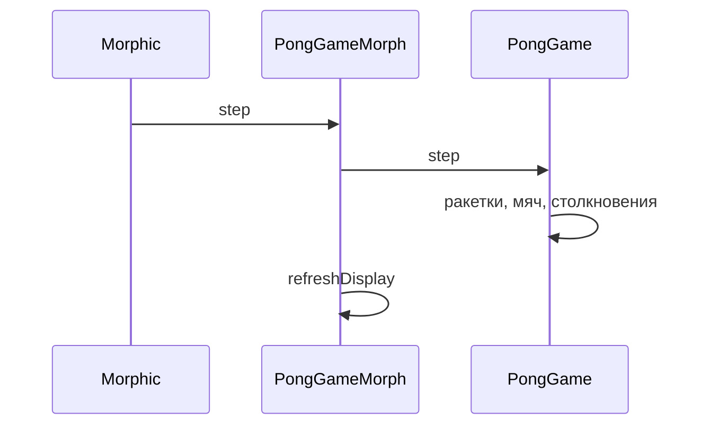

import ExternalCodeEmbed from '@site/src/components/ExternalCodeEmbed';


# SmallPong на Morphic — практикум

<div class="article-tags">
  <span class="tag tag-beginner">ДЛЯ НОВИЧКОВ</span>
</div>

<span class="complexity-badge">Разработчику</span>
<span class="complexity-badge">Начальный уровень</span>

---

## О чём эта статья

Пошаговый практикум — вы соберёте графическую игру **"пинг-понг"** в **Pharo** на **Morphic**, **по шагам в Class Browser**, с разбором каждого класса и метода. Логика матча живёт в `PongGame`, интерфейс — в морфах; связь между ними повторяет идеи **MVC** из [ООП в Smalltalk](/encyclopedia/5-languages/5-08-smalltalk/4) и [десктопной архитектуры](/encyclopedia/4-code-dev/4-11-desktopnye-prilozheniya/1).

База: [Первая программа](./11.md), [ООП-модель](./4.md), [Morphic](./15.md). Соседний практикум без игрового цикла — [крестики-нолики](./12.md). Эталон для сверки — [полная ревизия](#full-revision) в конце статьи или ваш `.st`-файл после прохождения этапов.

---

## Требования

- **Pharo 10+** (рекомендуется 11/12) — [первая программа](./11.md), [среда Pharo](./13.md).
- Class Browser, Playground, **Accept** (Ctrl+S).
- Желательно пройти [крестики-нолики](./12.md) или [SmallDesktop на Morphic](./21.md).

---

## Коротко об оригинале Pong

**Pong** (Atari, 1972) — одна из первых коммерчески успешных аркад. Два игрока отбивают мяч ракетками по горизонтали; проигрывает тот, кто пропустил мяч за свою линию. Вся "сложность" — в **тайминге** и **угле отскока**. Учебная версия повторяет петлю "ввод → движение → столкновение → счёт", которую в [Python — Ping Pong](/encyclopedia/9-spinoff/9-04-razrabotka-igr/praktikum-razrabotki-igr/3) масштабируют до меню, ИИ и конечного автомата.

---

## Словарь

| Термин | В SmallPong |
|--------|-------------|
| **Image** | Живой образ Pharo — код и объекты в памяти; сохраняется через File → Save |
| **Морф (Morph)** | Объект UI, который рисует себя и принимает события — [Morphic](./15.md) |
| **Модель** | `PongGame` — координаты, скорости, счёт; не знает о морфах |
| **Stepping** | Периодический вызов `step` у морфа (~60 кадров/с при `stepTime` 16) |
| **Протокол** | Категория методов в Browser (`game`, `accessing`, `display`) |
| **FileIn** | Загрузка `.st`-файла с объявлениями классов в image |

---

## Управление

| Клавиша | Действие |
|---------|----------|
| `W` / `S` | Левая ракетка |
| `↑` / `↓` | Правая ракетка |
| `Пробел` | Пауза / продолжить |
| Кнопка "Новая игра" | Сброс матча |

Кликните по окну игры для **фокуса клавиатуры**.

---

## Что получится

| Элемент | Поведение |
|---------|-----------|
| Поле 600×400 | Тёмно-зелёный фон, серая линия по центру |
| Две ракетки | Белые прямоугольники, W/S и стрелки |
| Мяч | Жёлтый квадрат 12×12, отскок от стен и ракеток |
| Счёт | Строка вида `3 : 7`, победа при 11 очках |
| Пауза | Пробел; кнопка "Новая игра" сбрасывает матч |

Три класса в категории `SmallPong`:

| Класс | Роль |
|-------|------|
| `PongGame` | Модель — физика, счёт, пауза, победа |
| `PongPlayfieldMorph` | Декор поля — центральная линия |
| `PongGameMorph` | Окно — морфы, stepping, клавиатура |

<div class="callout callout--tip">
  <div class="callout-title">Чем отличается от Python/Pygame</div>

  <div class="callout-body">
  В Pygame вы сами крутите цикл <code>while running</code>, зовёте <code>pygame.event.get()</code> и рисуете на <code>screen</code>. В Pharo морф подписывается на <code>startStepping</code>, а Morphic периодически шлёт ему <code>step</code>. Модель (<code>PongGame</code>) не знает о морфах — только числа и флаги. Подробный трек с FSM и ИИ — <a href="/encyclopedia/9-spinoff/9-04-razrabotka-igr/praktikum-razrabotki-igr/3">Python — Ping Pong</a>.
  </div>
</div>

**Оценка времени** — 2–4 часа при прохождении всех этапов в Class Browser.

### Карта этапов

| Этап | Фокус | Результат |
|------|--------|-----------|
| 0 | Подготовка Pharo | Категория `SmallPong`, Browser открыт |
| 1 | `PongGame` — каркас | Константы поля, `initialize`, `resetGame` |
| 2 | Доступ и ввод | Геттеры, флаги `leftUp` / `rightDown` |
| 3 | `step` — стены | Мяч летит и отскакивает от верха/низа |
| 4 | Ракетки и гол | Отскок от ракеток, счёт, `gameOver` |
| 5 | `PongPlayfieldMorph` | Центральная линия на поле |
| 6 | `PongGameMorph` — UI | Поле, ракетки, мяч, счёт, кнопка |
| 7 | Stepping | Живой цикл ~60 FPS |
| 8 | Клавиатура и запуск | `PongGameMorph open` |
| 9 | FileIn | Загрузка готового `.st` |

---

## Как проходить практикум

1. Создайте категорию **SmallPong** в Class Browser.
2. Идите этапы **0–9 по порядку** — после каждого метода жмите **Accept** (Ctrl+S).
3. Запускайте `PongGameMorph open` в Playground; **кликните по окну** для фокуса клавиатуры.
4. Отмечайте **Самопроверку**; при расхождении — [полная ревизия](#full-revision).

<span id="architecture"></span>

## Архитектура

Три класса повторяют схему **model + view + controller** — как в [SmallShooter](./44.md) и [десктопных приложениях](/encyclopedia/4-code-dev/4-11-desktopnye-prilozheniya/112):

```text
PongGameMorph          ← окно, клавиатура, startStepping
  ├── StringMorph      ← счёт
  ├── SimpleButtonMorph ← "Новая игра"
  └── PongPlayfieldMorph ← drawOn — линия, ракетки, мяч
        └── game: PongGame ← координаты и физика без Morphic
```

**Определение.** **Stepping** — встроенный игровой цикл Morphic: морф с `startStepping` получает `step` каждые `stepTime` миллисекунд (~16 ms → 60 FPS). В [Pygame Pong](/encyclopedia/9-spinoff/9-04-razrabotka-igr/praktikum-razrabotki-igr/3) тот же цикл вы пишете через `while running` и `clock.tick()`.

| Класс | Роль |
|-------|------|
| `PongGame` | Модель — мяч, ракетки, счёт, пауза |
| `PongPlayfieldMorph` | Рисование поля и объектов |
| `PongGameMorph` | Окно, stepping, клавиатура |

---

<span id="stage-0"></span>

## Этап 0 — подготовка

**Цель** — рабочая среда Pharo и категория для классов.

### Что сделать

1. Установите **Pharo 10+** — [первая программа](/encyclopedia/5-languages/5-08-smalltalk/11).
2. Откройте **Class Browser** (Nautilus / System Browser).
3. Создайте категорию классов **SmallPong** — правая панель → `+` → `Add category`.
4. Убедитесь, что Playground выполняет:

```smalltalk
Transcript show: 'ok'; cr
```

(нужно открытое окно **Transcript**).

### Теория

- **Категория классов** — пространство имён в Browser, не пакет на диске. Все три класса SmallPong лягут в `SmallPong`.
- **Accept (Ctrl+S)** — единственный способ "вкомпилировать" метод в **image**; без него Playground увидит старую версию или `MessageNotUnderstood` ([FAQ раздела](/encyclopedia/5-languages/5-08-smalltalk/998)).

### Самопроверка

- [ ] Pharo запускается, Browser показывает категории.
- [ ] После Accept тестовый метод виден в списке протоколов класса.

---

<span id="stage-1"></span>
## Этап 1 — класс PongGame, инициализация

**Цель** — модель игры **без UI** — размеры поля, сброс состояния, подача мяча.

Сначала **логика**, потом морфы — тот же порядок, что в [практикуме "Крестики-нолики"](/encyclopedia/5-languages/5-08-smalltalk/12#шаг-1--модель-игры-tttgame).

### 1.1. Объявление класса

В Browser: **+** → **Class**. Шаблон:

```smalltalk
Object subclass: #PongGame
	instanceVariableNames: 'fieldWidth fieldHeight paddleWidth paddleHeight ballSize paddleSpeed ballSpeed winningScore ballX ballY ballVX ballVY leftPaddleY rightPaddleY leftScore rightScore leftUp leftDown rightUp rightDown paused gameOver winner'
	classVariableNames: ''
	poolDictionaries: ''
	category: 'SmallPong'!
```

**Accept.**

Инстанс-переменные хранят **всё состояние матча** — координаты, скорости, флаги клавиш, счёт. UI читает их только через методы протокола `accessing` (этап 2).

### 1.2. Инициализация

Протокол `initialization`:

```smalltalk
initialize
	super initialize.
	fieldWidth := 600.
	fieldHeight := 400.
	paddleWidth := 12.
	paddleHeight := 80.
	ballSize := 12.
	paddleSpeed := 8.
	ballSpeed := 5.
	winningScore := 11.
	paused := false.
	self resetGame
```

Разбор:

- `super initialize` — обязательный вызов родителя `Object` ([инкапсуляция](/encyclopedia/5-languages/5-08-smalltalk/101#инкапсуляция-состояния)).
- Числа после `:=` — **константы поля** в пикселях логической модели (не окна Morphic).
- `self resetGame` — один вход для "новый матч"; `initialize` и кнопка "Новая игра" вызывают его же.

### 1.3. Сброс игры и подача

Протокол `game`:


<ExternalCodeEmbed example="smalltalk/smalltalk-508-31-001" title="1.3. Сброс игры и подача" minHeight={498} />


Разбор:

- `//` — целочисленное деление; центр мяча совпадает с центром поля.
- `#( -1 1 )` — литерал массива; `atRandom` выбирает направление влево или вправо по X и вверх/вниз по Y.
- `resetBall` после гола — **подача** из центра с новой случайной траекторией.
- `winner := nil` — пока никто не набрал 11; позже туда попадёт `#Left` или `#Right` (**символ** — именованная константа в Smalltalk).

### 1.4. Проверка в Playground

```smalltalk
| g |
g := PongGame new.
g leftScore.
g rightScore.
g ballPosition
```

Ожидается `0`, `0` и точка `Point` около `294@194` (центр поля минус половина мяча).

---

<span id="stage-2"></span>
## Этап 2 — доступ к состоянию и ввод

**Цель** — UI сможет **читать** координаты и **передавать** нажатия клавиш, не лезя в инстанс-переменные напрямую.

### 2.1. Протокол accessing


<ExternalCodeEmbed example="smalltalk/smalltalk-508-31-002" title="2.1. Протокол accessing" minHeight={588} />


Разбор:

- `@` — создание объекта `Point` (x@y); так Morphic задаёт позиции.
- `leftPaddleOrigin` — отступ **10 px** от левого края поля; правая ракетка симметрично у правого края.
- Координаты модели — от **левого верхнего угла** поля (0@0), ось Y растёт **вниз** — как на экране ([справочник Morphic](/encyclopedia/5-languages/5-08-smalltalk/5#122-создание-и-отображение)).
- Методы `leftScore` / `rightScore` — **геттеры** с тем же именем, что и переменная; внутри `^ leftScore` возвращает инстанс-переменную.

### 2.2. Протокол input


<ExternalCodeEmbed example="smalltalk/smalltalk-508-31-003" title="2.2. Протокол input" minHeight={318} />


Разбор:

- Суффикс `:` в имени — **ключевое сообщение** с одним аргументом ([синтаксис](/encyclopedia/5-languages/5-08-smalltalk/3)).
- Булевы флаги вместо "какая клавиша нажата" в модели — морф собирает клавиши в `Set` и раз в кадр вызывает `syncInput` (этап 8).
- `paused not` — унарное сообщение объекту `false`/`true`.

### 2.3. Текст для HUD

Протокол `game` (дополните):

```smalltalk
scoreText
	^ leftScore asString, ' : ', rightScore asString

statusText
	gameOver ifTrue: [
		winner = #Left
			ifTrue: [ ^ 'Победил левый игрок!' ]
			ifFalse: [ ^ 'Победил правый игрок!' ] ].
	paused ifTrue: [ ^ 'Пауза (пробел — продолжить)' ].
	^ 'W/S — левый, ↑/↓ — правый, пробел — пауза'
```

Разбор:

- `,` у `String` — конкатенация; `asString` у `SmallInteger` даёт `'0'`, `'11'` и т.д.
- Вложенные `ifTrue:` / `ifFalse:` — ранний возврат строки статуса; иначе подсказка по управлению.
- `winner = #Left` — сравнение с символом; `#Right` обрабатывается веткой `ifFalse:`.

### 2.4. Проверка

```smalltalk
PongGame new scoreText
```

→ `'0 : 0'`.

---

<span id="stage-3"></span>
## Этап 3 — метод step, движение и стены

**Цель** — один **тик симуляции** — ракетки по флагам, мяч движется, отскок от верхней и нижней границы.

### 3.1. Код

Протокол `game`:


<ExternalCodeEmbed example="smalltalk/smalltalk-508-31-004" title="3.1. Код" minHeight={408} />


### 3.2. Разбор

- `^ self` при `gameOver` и `paused` — **ранний выход**; остальная физика не выполняется.
- `max: 0` и `min: fieldHeight - paddleHeight` — ракетка не выходит за поле по вертикали.
- `ballVX` / `ballVY` — скорость в **пикселях за тик** (не за секунду); при `stepTime` 16 мс это ~312 px/с по каждой оси при `ballSpeed = 5`.
- Отскок от "стены" — принудительно ставим `ballY` на границу и разворачиваем `ballVY` через `abs` / `negated`.

### 3.3. Порядок в кадре (важно на этапе 4)

На каждом тике соблюдайте цепочку:

1. Движение ракеток по флагам.
2. Движение мяча.
3. Столкновения со стенами.
4. (этап 4) Столкновения с ракетками и гол.

Если поменять местами "мяч" и "ракетки", мяч на один кадр окажется **внутри** ракетки — типичная причина "залипания" ([частые ошибки](#common-errors)).

### 3.4. Проверка

```smalltalk
| g |
g := PongGame new.
20 timesRepeat: [ g step ].
g ballPosition
```

Координата Y меняется; при ударе о верх/низ знак `ballVY` меняется (смотрите в Inspector).

---

<span id="stage-4"></span>
## Этап 4 — ракетки, гол и победа

**Цель** — столкновения с ракетками (с **углом отскока**), очки за пропущенный мяч, победа до 11.

### 4.1. Полный метод step

Замените метод `step` на версию со столкновениями (локальные переменные в начале метода):


<ExternalCodeEmbed example="smalltalk/smalltalk-508-31-005" title="4.1. Полный метод step" minHeight={720} />


### 4.2. Проверка победы

```smalltalk
checkWinFor: aSide
	(leftScore >= winningScore) ifTrue: [
		gameOver := true.
		winner := #Left.
		^ self ].
	(rightScore >= winningScore) ifTrue: [
		gameOver := true.
		winner := #Right ]
```

Параметр `aSide` здесь не используется — метод вызывается для побочного эффекта; при желании добавьте логирование в Transcript.

### 4.3. Разбор физики

- `leftRect := origin extent:` — прямоугольник ракетки в координатах **модели** ([коллекции и числа](/encyclopedia/5-languages/5-08-smalltalk/33)).
- `intersects:` — пересечение `Rectangle` мяча и ракетки.
- Условие `ballVX < 0` — мяч летит **влево**, имеет смысл проверять только левую ракетку (и наоборот).
- `relativeHit` от −0.5 (верх ракетки) до 0.5 (низ) задаёт новую `ballVY` — **удар по краю** даёт круче угол; тот же приём в [Python — Ping Pong, этап 9](/encyclopedia/9-spinoff/9-04-razrabotka-igr/praktikum-razrabotki-igr/3).
- Гол — `ballX + ballSize < 0` (мяч ушёл влево → очко **правому**); затем `resetBall`, матч продолжается, если `gameOver` ещё false.

### 4.4. Проверка

```smalltalk
| g |
g := PongGame new.
g leftDown: true.
100 timesRepeat: [ g step ].
g leftScore.
g rightScore
```

При пропущенных мячах счёт растёт; после 11 очков `g gameOver` → `true`.

---

<span id="stage-5"></span>
## Этап 5 — PongPlayfieldMorph

**Цель** — морф поля с **центральной линией**; кастомная отрисовка поверх заливки.

### 5.1. Объявление класса

```smalltalk
Morph subclass: #PongPlayfieldMorph
	instanceVariableNames: ''
	classVariableNames: ''
	poolDictionaries: ''
	category: 'SmallPong'!
```

### 5.2. Отрисовка

Протокол `display`:

```smalltalk
drawOn: aCanvas
	| midX top bottom |
	super drawOn: aCanvas.
	midX := self bounds center x.
	top := self bounds top + 8.
	bottom := self bounds bottom - 8.
	aCanvas
		lineFrom: midX @ top
		to: midX @ bottom
		width: 2
		color: (Color gray alpha: 0.35)
```

Разбор:

- `drawOn:` — хук Morphic; вызывается при перерисовке морфа.
- `super drawOn:` — заливает прямоугольник цветом `self color`.
- `self bounds` — прямоугольник морфа в **координатах родителя**; линия чуть короче поля (отступ 8 px).
- `Color gray alpha: 0.35` — полупрозрачная серая линия, как сетка корта.

### 5.3. Проверка

```smalltalk
PongPlayfieldMorph new
	color: (Color r: 0.05 g: 0.12 b: 0.05);
	extent: 600@400;
	openInHand
```

Появится зелёное поле с серой линией по центру.

---

<span id="stage-6"></span>
## Этап 6 — PongGameMorph, сборка UI

**Цель** — окно с полем, ракетками, мячом, счётом, статусом и кнопкой "Новая игра".

По структуре похоже на [TTTBoardMorph](/encyclopedia/5-languages/5-08-smalltalk/12) — родительский морф собирает детей и связывает их с моделью.

### 6.1. Объявление класса

```smalltalk
Morph subclass: #PongGameMorph
	instanceVariableNames: 'game playfieldOrigin playfieldMorph leftPaddleMorph rightPaddleMorph ballMorph scoreMorph statusMorph newGameButton pressedKeys'
	classVariableNames: ''
	poolDictionaries: ''
	category: 'SmallPong'!
```

### 6.2. initialize и buildUI

Протокол `initialization`:


<ExternalCodeEmbed example="smalltalk/smalltalk-508-31-006" title="6.2. initialize и buildUI" minHeight={720} />


Разбор:

- `playfieldOrigin := 10 @ 50` — поле сдвинуто вниз; **верхние ~50 px** — чёрный HUD (счёт, статус, кнопка).
- `addMorph:` — дочерний морф рисуется **поверх** родителя; порядок добавления влияет на Z-order.
- `SimpleButtonMorph` + `target:actionSelector:` — кнопка шлёт `#newGame` получателю `self` ([события Morphic](/encyclopedia/5-languages/5-08-smalltalk/5#123-события)).
- `StringMorph` — только отображение текста; содержимое обновляем в `refreshDisplay`.

### 6.3. Синхронизация модели и морфов

Протокол `display`:

```smalltalk
refreshDisplay
	| origin |
	origin := playfieldOrigin.
	leftPaddleMorph position: origin + game leftPaddleOrigin.
	rightPaddleMorph position: origin + game rightPaddleOrigin.
	ballMorph position: origin + game ballPosition.
	scoreMorph contents: game scoreText.
	statusMorph contents: game statusText
```

Протокол `actions`:

```smalltalk
newGame
	game resetGame.
	pressedKeys removeAll.
	self refreshDisplay
```

Разбор:

- `origin + game leftPaddleOrigin` — **перевод координат** из модели (0..600) в координаты окна (сдвиг на HUD).
- Модель не знает о `playfieldOrigin` — смещение только во view; чистое разделение MVC.
- `pressedKeys removeAll` — после сброса не остаётся "залипших" клавиш.

### 6.4. Проверка

```smalltalk
PongGameMorph new openInHand
```

Статичная картинка — поле, ракетки по центру, счёт `0 : 0`. Мяч пока не двигается (нет stepping).

---

<span id="stage-7"></span>
## Этап 7 — игровой цикл stepping

**Цель** — мяч и ракетки обновляются **автоматически**, без ручного `step` в Playground.

### 7.1. Код

В конец `initialize` добавьте:

```smalltalk
	self startStepping
```

Протокол `stepping`:

```smalltalk
step
	game step.
	self refreshDisplay

stepTime
	^ 16
```

### 7.2. Теория stepping

- `startStepping` регистрирует морф в **очереди тиков** Morphic.
- Каждые `stepTime` миллисекунд Morphic вызывает `step` у морфа — аналог одного прохода `update()` + `draw()` в игровом движке.
- `16` мс ≈ **62 кадра/с** — плавнее, чем 33 мс (30 FPS).
- Важно: `step` у `PongGameMorph` **перекрывает** унаследованный `step` у `Morph` — в теле сначала логика игры, потом перерисовка позиций.

Схема одного кадра:



### 7.3. Проверка

Откройте морф снова — мяч должен летать; ракетки пока неподвижны (ввода ещё нет).

---

<span id="stage-8"></span>
## Этап 8 — клавиатура и запуск в окне

**Цель** — W/S и стрелки, пауза по пробелу, окно с заголовком и **фокусом клавиатуры**.

### 8.1. События клавиатуры

Протокол `events`:


<ExternalCodeEmbed example="smalltalk/smalltalk-508-31-007" title="8.1. События клавиатуры" minHeight={534} />


Разбор:

- `handlesKeyboard:` → `true` — морф **хочет** клавиатурные события.
- `keydown:` / `keyup:` — точки входа Morphic; делегируем в `handleKeyDown:` / `handleKeyUp:`.
- `anEvent keyName` — строка вроде `'W'`, `'ArrowUp'`, `' '` (пробел).
- `Set pressedKeys` — множество **всех зажатых** клавиш; при удержании W морф на каждом keydown не дублирует, а `includes:` в `syncInput` даёт стабильный флаг.
- Каскад `game leftUp: ...; leftDown: ...` — несколько сообщений одному объекту подряд ([рекомендации по стилю](/encyclopedia/5-languages/5-08-smalltalk/101#каскадирование-сообщений)).

### 8.2. Точка входа

Протокол `instance creation` (метод класса):

```smalltalk
open
	^ self new openInWorld
```

Протокол `focus`:

```smalltalk
openInWorld
	| window |
	window := self openInWindowLabeled: 'Пинг-понг'.
	window activate.
	self takeKeyboardFocus.
	^ window
```

Разбор:

- `openInWindowLabeled:` — морф в отдельном окне с заголовком.
- `takeKeyboardFocus` — **обязательно**; без клика по окну стрелки могут не дойти до игры.

### 8.3. Запуск

Playground:

```smalltalk
PongGameMorph open
```

### 8.4. Самопроверка

- [ ] W/S двигают левую ракетку, стрелки — правую.
- [ ] Пробел ставит паузу, в статусе текст про паузу.
- [ ] Кнопка "Новая игра" сбрасывает поле и счёт.
- [ ] При 11 очках — сообщение о победителе в `statusText`.

---

<span id="stage-9"></span>
## Этап 9 — загрузка через FileIn

Если вы проходили этапы в Browser, код уже в **image**. Для переноса на другую машину или быстрой установки — файл **LoadSmallPong.st** (формат **fileOut** Pharo), который вы можете сохранить через File → File Out для категории `SmallPong`.

**Вариант 1 — меню**

- File → File In… → выберите ваш `LoadSmallPong.st`.

**Вариант 2 — Playground** (подставьте путь к `.st` на вашем диске)

```smalltalk
FileStream readOnlyFileNamed: 'C:\path\to\LoadSmallPong.st' do: [:stream |
	stream fileIn ].
```

Затем:

```smalltalk
PongGameMorph open
```

Не забудьте **Save image** — FileIn меняет image в памяти; на диск изменения попадут только после сохранения ([о языке и image](/encyclopedia/5-languages/5-08-smalltalk/1)).

---

<span id="architecture"></span>
## Архитектура и поток данных

| Слой | Класс | Ответственность |
|------|-------|-----------------|
| Модель | `PongGame` | Правила, физика, счёт |
| Представление | `PongGameMorph`, дочерние морфы | Позиции, текст, кнопка |
| Ввод | `PongGameMorph` | `pressedKeys`, `syncInput` |
| Декор | `PongPlayfieldMorph` | Линия посередине поля |

**Координатная система окна** (упрощённо):

```
Окно PongGameMorph (чёрный фон)
┌────────────────────────────────────────────┐
│  счёт 3 : 7          [Новая игра]        │  ← y = 0..50 HUD
│  W/S — левый...                          │
│  ┌────────────────────────────────────┐  │
│  │ ● ракетка    · мяч    ракетка ●    │  │  ← playfieldOrigin 10@50
│  │         │ центральная линия │      │  │
│  └────────────────────────────────────┘  │
└────────────────────────────────────────────┘
```

Такое разделение позволяет:

- тестировать `PongGame>>step` в Playground без UI;
- менять цвета и шрифты, не трогая физику;
- позже добавить сетевого игрока, подменив только `syncInput`.

Следующий уровень сложности в том же разделе — [SmallShooter](/encyclopedia/5-languages/5-08-smalltalk/44) (несколько сущностей, стрельба).

---

<span id="full-revision"></span>
## Полная ревизия

Итоговая структура категории **SmallPong**:

| Класс | Протоколы (основные) |
|-------|----------------------|
| `PongGame` | `initialization`, `accessing`, `input`, `game` |
| `PongPlayfieldMorph` | `display` |
| `PongGameMorph` | `instance creation`, `initialization`, `stepping`, `actions`, `display`, `events`, `focus` |

Сверьте с эталонным `LoadSmallPong.st`:

- три класса в категории `SmallPong`;
- `PongGameMorph class>>open` и `openInWorld` с `takeKeyboardFocus`;
- `winningScore := 11` в `initialize`;
- `stepTime` → `16`;
- полный `step` с `intersects:` и `checkWinFor:`.

---

<span id="final-checklist"></span>
## Итоговая самопроверка

- [ ] `PongGame new` после Accept не даёт `MessageNotUnderstood`.
- [ ] 100 вызовов `step` в Playground меняют `ballPosition`.
- [ ] `PongPlayfieldMorph` рисует центральную линию.
- [ ] `PongGameMorph open` открывает окно с заголовком "Пинг-понг".
- [ ] Победа при 11 очках, `statusText` показывает победителя.
- [ ] Image сохранён после сессии (File → Save).

---

<span id="common-errors"></span>
## Частые ошибки

| Симптом | Причина | Что сделать |
|---------|---------|-------------|
| `MessageNotUnderstood` | Метод не принят | Accept (Ctrl+S) в Browser |
| Клавиши не работают | Нет фокуса | Клик по окну; проверьте `takeKeyboardFocus` |
| Мяч "залипает" в ракетке | Неверный порядок в `step` | Сначала ракетки, потом мяч, потом `intersects:` |
| Код пропал после перезапуска | Не сохранён image | File → Save |
| Два класса `PongGame` | FileIn поверх своей версии | Удалите дубликат в Browser или загрузите в чистый image |

Подробнее — [FAQ раздела Smalltalk](/encyclopedia/5-languages/5-08-smalltalk/998), [чек-лист](/encyclopedia/5-languages/5-08-smalltalk/999).

---

## Дальше

- Звук при отскоке — `SampledSound` или `PluckedSound` ([стандартная библиотека](/encyclopedia/5-languages/5-08-smalltalk/5)).
- Вынесите константы в отдельный класс или shared pool.
- ИИ для правой ракетки — следование за `ballY` (идея из [Python-практикума, этап 12](/encyclopedia/9-spinoff/9-04-razrabotka-igr/praktikum-razrabotki-igr/3)).
- Стиль протоколов — [Рекомендации по разработке](/encyclopedia/5-languages/5-08-smalltalk/101).
- Другой язык, тот же жанр — [Практикум игр на Python](/encyclopedia/9-spinoff/9-04-razrabotka-igr/praktikum-razrabotki-igr/intro).

---

{/* sidebar-collections */}

## В подборках

**Языки** — [Smalltalk — о разделе](/encyclopedia/5-languages/5-08-smalltalk/intro), [ООП в Smalltalk](/encyclopedia/5-languages/5-08-smalltalk/4), [Крестики-нолики](/encyclopedia/5-languages/5-08-smalltalk/12), [Morphic в справочнике](/encyclopedia/5-languages/5-08-smalltalk/5#12-графическая-система-morphic).

**Игры** — [Практикум разработки игр](/encyclopedia/9-spinoff/9-04-razrabotka-igr/praktikum-razrabotki-igr/intro), [Python — Ping Pong](/encyclopedia/9-spinoff/9-04-razrabotka-igr/praktikum-razrabotki-igr/3), [SmallShooter](/encyclopedia/5-languages/5-08-smalltalk/44).

{/* /sidebar-collections */}

---
