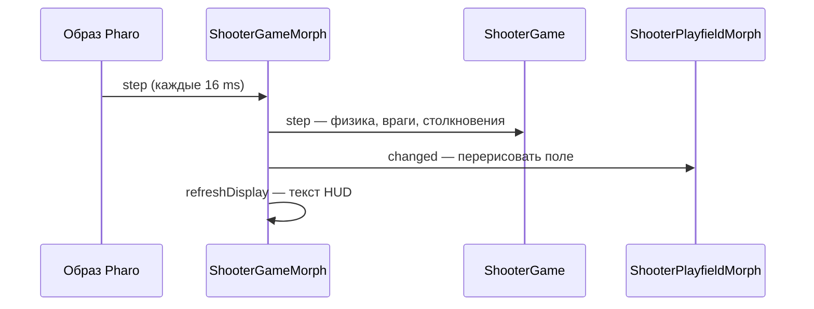
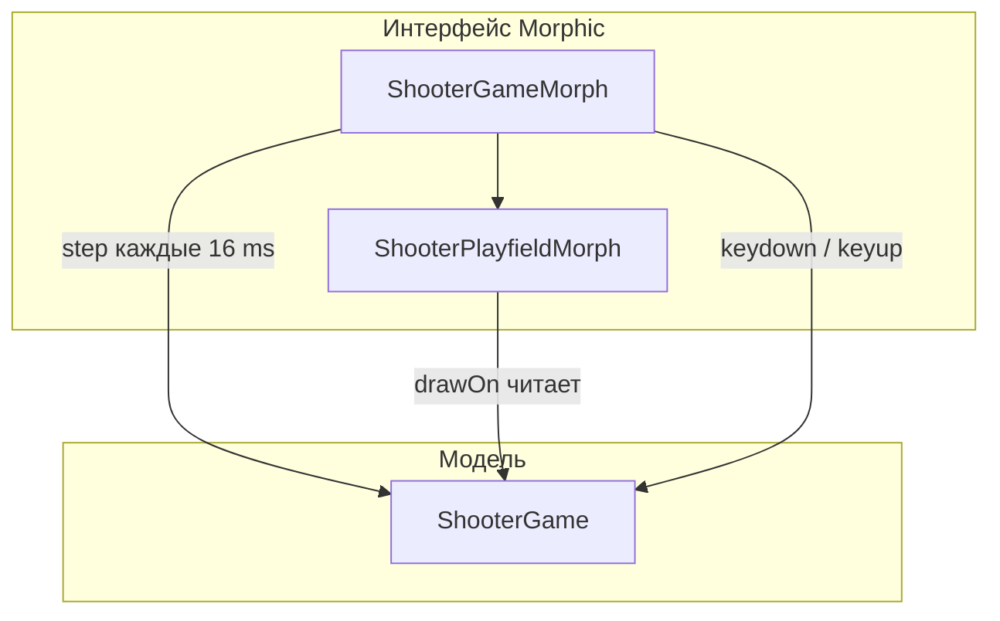

import ExternalCodeEmbed from '@site/src/components/ExternalCodeEmbed';


# Smalltalk — SmallShooter

<div class="article-tags">
  <span class="tag tag-beginner">НАЧАЛЬНЫЙ</span>
</div>

<span class="complexity-badge">Разработчику</span>
<span class="complexity-badge">Начальный уровень</span>

---

## О практикуме

**SmallShooter** — учебный **вертикальный shoot'em up** (шутер с видом сверху, корабль внизу, враги сверху). Жанр родом из аркад 1980-х (*Galaga*, *1942*, *Xevious*) — короткие сессии, нарастающая сложность, счёт и жизни.

Соберём игру в **Pharo** на **Morphic** — без pip, без Pygame, без спрайтов. Всё рисуем примитивами (`fillRectangle`, `fillOval`), логику держим в обычных объектах Smalltalk, а окно и клавиатуру — в **морфах**.

<div class="callout callout--tip">
  <div class="callout-title">Чем отличается от Python/Pygame</div>

  <div class="callout-body">
  В <a href="/encyclopedia/5-languages/5-02-python/312">разработке игр на Python</a> вы сами крутите <code>while running</code> и зовёте <code>pygame.display.flip()</code>. В Pharo морф подписывается на <code>startStepping</code>, а образ периодически шлёт ему сообщение <code>step</code>. Близкий по архитектуре трек на Smalltalk — <a href="/encyclopedia/5-languages/5-08-smalltalk/31">SmallPong</a>; там те же три роли — модель, поле, окно.
  </div>
</div>

**Что получится после всех этапов**

- Окно 500×700 с полем 480×640 и звёздным фоном.
- Корабль, стрельба, три типа врагов, бесконечные волны.
- Счёт, жизни, пауза, game over и кнопка "Новая игра".

**Оценка времени** — 3–5 часов, если идти через Class Browser и проверять каждый этап.

| Механика | Реализация |
|----------|------------|
| Поле | 480×640 px, параллакс-звёзды |
| Игрок | 3 жизни, 90 тиков неуязвимости после урона |
| Враги | `#grunt`, `#zigzag`, `#shooter` (2 HP) |
| Волны | `#break` → `#spawning` → `#fighting` → снова `#break` |
| Кадры | `stepTime` = 16 ms (~60 FPS) |

<div class="callout callout--info">
  <div class="callout-title">Для кого материал</div>

  <div class="callout-body">
  Нужны Pharo 10+ и пройденная <a href="/encyclopedia/5-languages/5-08-smalltalk/11">первая программа</a> — Playground, Class Browser, Accept (Ctrl+S). Желательно освежить <a href="/encyclopedia/5-languages/5-08-smalltalk/4">ООП в Smalltalk</a>, <a href="/encyclopedia/5-languages/5-08-smalltalk/33">коллекции и символы</a> и раздел <a href="/encyclopedia/5-languages/5-08-smalltalk/5#12-графическая-система-morphic">Morphic в справочнике</a>.
  </div>
</div>

---

## Теория перед кодом

Перед этапами полезно зафиксировать несколько понятий — они будут встречаться в каждом шаге.

### Игровой цикл

**Игровой цикл** — повторяющаяся последовательность "прочитать ввод → обновить состояние → отрисовать кадр". В Pygame это явный `while` в `main.py`. В Morphic цикл **встроен в образ**: морф с `startStepping` получает `step` каждые `stepTime` миллисекунд.



### Модель и представление

**Модель** (`ShooterGame`) — чистая логика — координаты, списки пуль, правила столкновений. Она **не импортирует** Morphic и не рисует.

**Представление** (`ShooterPlayfieldMorph`) — читает модель и рисует на `Canvas`. Метод `drawOn:` вызывается системой, когда морф помечен как `changed`.

**Контроллер** (в нашем случае часть `ShooterGameMorph`) — переводит события клавиатуры в сообщения модели (`movingLeft:`, `tryShoot`).

Такой раздел отражает классическую идею **MVC**, заложенную в Smalltalk-80; в Pharo UI строят на Morphic, но принцип тот же. Подробнее — в [философии Smalltalk](/encyclopedia/5-languages/5-08-smalltalk/22) и [десктопных приложениях](/encyclopedia/4-code-dev/4-11-desktopnye-prilozheniya/112).

### Символы как метки состояния

**Символ** (`#break`, `#grunt`) — именованная константа в Smalltalk. Для состояния волны и типа врага символ удобнее строки: сравнение `waveState = #break` быстрое и однозначное. См. [типы данных](/encyclopedia/5-languages/5-08-smalltalk/33).

### Данные в массивах вместо классов

На учебном проекте пуля — `{ x. y. vx. vy. isPlayer }`, враг — `{ x. y. type. hp. shootTimer. phase }`. Это **OrderedCollection** массивов (`#()`). Так быстрее набрать прототип; позже можно вынести `Bullet` и `Enemy` в отдельные классы — см. [раздел "Что дальше"](#what-next).

---

## Как проходить практикум

1. Установите **Pharo 10+** — [инструкция в первой программе](/encyclopedia/5-languages/5-08-smalltalk/11#шаг-1--установка-pharo-на-windows).
2. Создайте категорию **`SmallShooter`** в System Browser.
3. На каждом этапе добавляйте методы в указанные **протоколы** и жмите **Accept** (Ctrl+S).
4. Запускайте `ShooterGameMorph open` в Playground; **кликните по окну**, иначе клавиатура не дойдёт до морфа.
5. Пройдите **самопроверку** в конце этапа.
6. Если что-то расходится — [полная ревизия](#full-revision).

**Управление в финальной версии**

| Клавиша | Действие |
|---------|----------|
| ← / → или A / D | Движение корабля |
| Пробел | Огонь (можно удерживать) |
| P | Пауза / продолжить |
| R | Рестарт после game over |
| Кнопка "Новая игра" | Сброс счёта и волны |

### Карта этапов

| Этап | Тема | Классы |
|------|------|--------|
| [0](#stage-0) | Окно и модель | все три — каркас |
| [1](#stage-1) | Движение | `ShooterGame`, `ShooterGameMorph` |
| [2](#stage-2) | Стрельба | `ShooterGame`, отрисовка пуль |
| [3](#stage-3) | Враги Grunt | `ShooterGame`, `ShooterPlayfieldMorph` |
| [4](#stage-4) | Столкновения и счёт | `ShooterGame` |
| [5](#stage-5) | Волны | `ShooterGame` |
| [6](#stage-6) | Zigzag и Shooter | `ShooterGame`, отрисовка |
| [7](#stage-7) | UI и пауза | `ShooterGameMorph` |

---

<span id="architecture"></span>

## Архитектура

Три класса разделяют ответственность — **модель**, **холст** и **окно**:

```text
ShooterGameMorph          ← окно, клавиатура, step / stepTime
  ├── StringMorph         ← счёт, строка статуса
  ├── SimpleButtonMorph   ← "Новая игра"
  └── ShooterPlayfieldMorph ← drawOn — фон, звёзды, объекты
        └── game: ShooterGame ← логика без Morphic
```



| Класс | Роль |
|-------|------|
| `ShooterGame` | Корабль, пули, враги, волны, столкновения |
| `ShooterPlayfieldMorph` | Canvas — звёзды, прямоугольники и овалы |
| `ShooterGameMorph` | Компоновка UI, `startStepping`, клавиатура |

| Термин | Значение в проекте |
|--------|-------------------|
| **Морф** | Объект UI, умеющий рисовать себя и ловить события |
| **Stepping** | Периодический вызов `step` у морфа |
| **Тик** | Один проход `ShooterGame>>step`; счётчик `tickCount` |
| **HUD** | Строки счёта и подсказок над полем |

Формат записей в коллекциях:

- Пуля — `{ x. y. vx. vy. isPlayer }` — пятый элемент `true`/`false` различает игрока и врага.
- Враг — `{ x. y. type. hp. shootTimer. phase }` — `type` это `#grunt`, `#zigzag` или `#shooter`; `phase` нужен для синусоиды zigzag.

---

<span id="dependencies"></span>

## Зависимости

- **Pharo 10** или новее (рекомендуется 11/12).
- Дополнительные пакеты **не нужны** — Morphic уже в образе.

В System Browser создайте категорию **SmallShooter** (имя пакета может совпадать). Все три класса живут в ней — так проще найти код в Browser и сохранить вместе с image.

---

<span id="stage-0"></span>

## Этап 0 — окно, модель и отрисовка корабля

**Цель** — три класса, окно со звёздным фоном и кораблём внизу. Игровой цикл уже крутится (`tickCount` растёт), но движения и врагов пока нет.

### Теория этапа

- **`Object subclass:`** — объявление класса в панели Browser; список **instanceVariableNames** задаёт поля каждого экземпляра.
- **`initialize`** — вызывается после `new`; здесь задаём размеры поля и зовём `resetGame`.
- **`^`** (caret) — возврат значения из метода; без него метод вернёт `self`.
- **`@`** — создаёт объект `Point` (координата или размер).

### 0.1 Класс ShooterGame

**Объявление класса** (панель определения, subclass of `Object`):

```smalltalk
Object subclass: #ShooterGame
    instanceVariableNames: 'fieldWidth fieldHeight playerX playerY playerWidth playerHeight playerSpeed playerLives invulnerableTimer bullets enemies score waveNumber waveState waveBreakTimer spawnIndex spawnQueue spawnDelayTimer shootTimer movingLeft movingRight paused gameOver highScore tickCount'
    classVariableNames: ''
    poolDictionaries: ''
    category: 'SmallShooter'
```

Протокол **`initialization`**, метод **`initialize`**:


<ExternalCodeEmbed example="smalltalk/smalltalk-508-44-001" title="0.1 Класс ShooterGame" minHeight={318} />


Протокол **`game`**:


<ExternalCodeEmbed example="smalltalk/smalltalk-508-44-002" title="0.1 Класс ShooterGame" minHeight={720} />


Протокол **`accessing`** — геттеры для морфа (модель **не отдаёт** инстанс-переменные напрямую наружу, только через сообщения):


<ExternalCodeEmbed example="smalltalk/smalltalk-508-44-003" title="0.1 Класс ShooterGame" minHeight={696} />


### 0.2 Класс ShooterPlayfieldMorph

Subclass of **`Morph`**. Инстанс-переменные: **`game`**, **`stars`**.


<ExternalCodeEmbed example="smalltalk/smalltalk-508-44-004" title="0.2 Класс ShooterPlayfieldMorph" minHeight={354} />


Протокол **`display`**, метод **`drawOn:`** (фон, звёзды, корабль):


<ExternalCodeEmbed example="smalltalk/smalltalk-508-44-005" title="0.2 Класс ShooterPlayfieldMorph" minHeight={390} />


### 0.3 Класс ShooterGameMorph

Subclass of **`Morph`**. Переменные: `game playfieldOrigin playfieldMorph scoreMorph statusMorph newGameButton pressedKeys spaceHeld`.

**Классовый метод** **`open`**:

```smalltalk
open
    ^ self new openInWorld
```

Протокол **`initialization`**:


<ExternalCodeEmbed example="smalltalk/smalltalk-508-44-006" title="0.3 Класс ShooterGameMorph" minHeight={642} />


Протокол **`stepping`**:

```smalltalk
step
    game step.
    self refreshDisplay

stepTime
    ^ 16
```

Протокол **`display`**:

```smalltalk
refreshDisplay
    scoreMorph contents: game scoreText.
    statusMorph contents: game statusText.
    playfieldMorph changed
```

Протокол **`actions`** (упрощённый `newGame`, доработаем на [этапе 7](#stage-7)):

```smalltalk
newGame
    game resetGame.
    playfieldMorph buildStars.
    self refreshDisplay
```

Протокол **`focus`**:

```smalltalk
openInWorld
    | window |
    window := self openInWindowLabeled: 'SmallShooter'.
    window activate.
    self takeKeyboardFocus.
    ^ window
```

### Запуск

```smalltalk
ShooterGameMorph open
```

**Самопроверка**

- [ ] Окно "SmallShooter" с тёмным полем и звёздами.
- [ ] Голубой корабль внизу по центру.
- [ ] Строка счёта: `Счёт: 0  Волна: 0  Жизни: 3`.
- [ ] Кнопка "Новая игра" сбрасывает поле.

### Разбор

| Строка / конструкция | Смысл |
|---------------------|--------|
| `super initialize` | Сначала инициализация предка `Object`, потом наши поля |
| `waveState := #break` | Волна ещё не началась; позже добавим автоматический старт |
| `self resetGame` в `initialize` | Один метод собирает начальное состояние партии |
| `startStepping` | Morphic начнёт слать `step` этому морфу |
| `stepTime` → `16` | 1000 / 16 ≈ 62 кадра в секунду |
| `playfieldMorph changed` | Пометка "грязной" области — нужна перерисовка `drawOn:` |
| `addMorph:` | Вложенный морф; дерево морфов = дерево виджетов |

`ShooterGame` можно тестировать **без UI** в Playground:

```smalltalk
g := ShooterGame new.
g step.
g scoreText
```

---

<span id="stage-1"></span>

## Этап 1 — движение корабля

**Цель** — корабль ездит влево и вправо, не выходя за края поля.

### Теория этапа

**Ввод** в Morphic приходит **событиями** (`keydown:`, `keyup:`). Мы не опрашиваем клавиатуру в `step` — вместо этого храним множество **`pressedKeys`** и на каждое событие синхронизируем флаги модели. Так модель остаётся независимой от Morphic (удобно для тестов и [SmallPong](/encyclopedia/5-languages/5-08-smalltalk/31)).

### ShooterGame, протокол input

```smalltalk
movingLeft: aBoolean
    movingLeft := aBoolean

movingRight: aBoolean
    movingRight := aBoolean
```

Ключевое слово **`movingLeft:`** с двоеточием — это **ключевое сообщение** с одним аргументом; см. [синтаксис](/encyclopedia/5-languages/5-08-smalltalk/3).

### ShooterGame, протокол player

```smalltalk
movePlayer
    movingLeft ifTrue: [
        playerX := (playerX - playerSpeed) max: 0 ].
    movingRight ifTrue: [
        playerX := (playerX + playerSpeed) min: fieldWidth - playerWidth ]
```

Обновите **`step`** — после таймеров добавьте движение (таймеры понадобятся на [этапе 2](#stage-2)):

```smalltalk
step
    gameOver ifTrue: [ ^ self ].
    paused ifTrue: [ ^ self ].
    tickCount := tickCount + 1.
    shootTimer > 0 ifTrue: [ shootTimer := shootTimer - 1 ].
    invulnerableTimer > 0 ifTrue: [ invulnerableTimer := invulnerableTimer - 1 ].
    self movePlayer
```

### ShooterGameMorph, протокол events


<ExternalCodeEmbed example="smalltalk/smalltalk-508-44-007" title="ShooterGameMorph, протокол events" minHeight={516} />


**Самопроверка**

- [ ] ←/→ и A/D двигают корабль.
- [ ] Корабль останавливается у левого и правого края.
- [ ] После клика по окну клавиши доходят до игры.

### Разбор

| Фрагмент | Зачем |
|----------|--------|
| `(playerX - playerSpeed) max: 0` | `max:` не даёт уйти левее нуля |
| `min: fieldWidth - playerWidth` | Правый край с учётом ширины спрайта |
| `pressedKeys includes:` | Проверка удерживаемой клавиши |
| `ifAbsent: []` | Удаление из `Set` без ошибки, если клавиши уже нет |
| `handlesKeyboard: ^ true` | Морф заявляет, что хочет получать клавиатуру |

---

<span id="stage-2"></span>

## Этап 2 — стрельба

**Цель** — жёлтые пули летят вверх; между выстрелами — короткая пауза (кулдаун).

### Теория этапа

**Кулдаун** (`shootTimer`) считается в **тиках**, не в секундах: при 60 FPS 8 тиков ≈ 130 ms. Так проще — не нужен `Time` в модели.

Пуля хранится как **массив** с полями скорости `vx`, `vy`. У игрока `vy = -9` (вверх по экрану, где y растёт вниз — типичная экранная система координат).

### ShooterGame, протокол input

```smalltalk
tryShoot
    shootTimer <= 0 ifTrue: [
        self addPlayerBullet.
        shootTimer := 8 ]
```

### ShooterGame, протокол player

```smalltalk
addPlayerBullet
    | bx by |
    bx := playerX + (playerWidth // 2) - 2.
    by := playerY - 6.
    bullets add: { bx. by. 0. -9. true }
```

Пятый элемент `true` — метка **своей** пули; пули врагов будут с `false`.

### ShooterGame, протокол bullets

```smalltalk
updateBullets
    | toRemove bullet x y |
    toRemove := OrderedCollection new.
    bullets do: [ :each |
        bullet := each.
        x := bullet first + bullet third.
        y := bullet second + bullet fourth.
        bullet at: 1 put: x.
        bullet at: 2 put: y.
        (y < -10 or: [ y > fieldHeight + 10 or: [ x < -10 or: [ x > fieldWidth + 10 ] ] ])
            ifTrue: [ toRemove add: bullet ] ].
    toRemove do: [ :each | bullets remove: each ifAbsent: [] ]
```

Добавьте в **`step`**: `self updateBullets`.

### ShooterGameMorph

Обновите **`step`**:

```smalltalk
step
    spaceHeld ifTrue: [ game tryShoot ].
    game step.
    self refreshDisplay
```

В **`handleKeyDown:`** / **`handleKeyUp:`**:

```smalltalk
"в handleKeyDown:"
keyName = ' ' ifTrue: [
    spaceHeld := true.
    game tryShoot ].

"в handleKeyUp:"
keyName = ' ' ifTrue: [ spaceHeld := false ].
```

### ShooterPlayfieldMorph — фрагмент drawOn

```smalltalk
game bulletsList do: [ :bullet |
    | isPlayer x y |
    isPlayer := bullet fifth.
    x := bullet first.
    y := bullet second.
    isPlayer ifTrue: [
        aCanvas fillRectangle: (x @ y extent: 4 @ 10) color: Color yellow ] ]
```

**Самопроверка**

- [ ] Пробел создаёт пулю вверх.
- [ ] Удержание пробела даёт серию выстрелов с паузой.
- [ ] Пули исчезают за краем экрана.

### Разбор

| Элемент массива пули | Роль |
|---------------------|------|
| 1-й (`first`) | x |
| 2-й (`second`) | y |
| 3-й (`third`) | vx |
| 4-й (`fourth`) | vy |
| 5-й (`fifth`) | `isPlayer` |

`bullet at: 1 put: x` **мутирует** массив на месте — коллекция хранит ссылку на тот же объект. Альтернатива — immutable объекты; для учебного шутера массивов достаточно.

`spaceHeld ifTrue:` в `step` морфа + `tryShoot` по keydown — двойной путь: и одиночное нажатие, и автоповтор при удержании.

---

<span id="stage-3"></span>

## Этап 3 — враги Grunt

**Цель** — красные блоки летят вниз. Волны пока вручную — один враг для проверки движения и отрисовки.

### Теория этапа

**Grunt** — простейший тип: постоянная скорость вниз. Запись врага включает **запасные** поля под будущее: `shootTimer` для `#shooter`, `phase` для `#zigzag`.

`enemySpeed` зависит от `waveNumber` — даже на этом этапе заложена прогрессия сложности.

### ShooterGame, протокол enemies


<ExternalCodeEmbed example="smalltalk/smalltalk-508-44-008" title="ShooterGame, протокол enemies" minHeight={714} />


Добавьте в **`step`**: `self updateEnemies`.

**Тест в Playground** (до [волн](#stage-5)):

```smalltalk
g := ShooterGame new.
g addEnemyAt: 200 @ -30 type: #grunt.
ShooterGameMorph open
```

### ShooterPlayfieldMorph — фрагмент drawOn

```smalltalk
game enemiesList do: [ :enemy |
    | type enemySize x y |
    type := enemy third.
    enemySize := game enemySizeFor: type.
    x := enemy first.
    y := enemy second.
    type = #grunt ifTrue: [
        aCanvas fillRectangle: (x @ y extent: enemySize) color: Color red ] ]
```

**Самопроверка**

- [ ] Grunt виден и движется вниз.
- [ ] Враг исчезает за нижним краем (урон игроку добавим на [этапе 4](#stage-4)).

### Разбор

| Поле врага | Индекс | Назначение |
|------------|--------|------------|
| x, y | 1, 2 | Позиция |
| type | 3 | `#grunt`, `#zigzag`, `#shooter` |
| hp | 4 | Жизни; у shooter будет 2 |
| shootTimer | 5 | Обратный отсчёт до выстрела |
| phase | 6 | Фаза синусоиды для zigzag |

`(80 + 120 atRandom)` — случайная задержка стрельбы в тиках; `atRandom` — сообщение интервала, см. [справочник](/encyclopedia/5-languages/5-08-smalltalk/5).

---

<span id="stage-4"></span>

## Этап 4 — столкновения, счёт и жизни

**Цель** — пули уничтожают врагов; касание врага или пропуск его за экран отнимает жизнь.

### Теория этапа

**AABB-столкновение** — проверяем пересечение прямоугольников (`Rectangle>>intersects:`). Для аркады этого достаточно; точная pixel-perfect коллизия здесь не нужна.

**Неуязвимость** после урона — 90 тиков (~1,5 s), чтобы игрок не потерял все жизни за один кадр. Мигание корабля в `drawOn:` синхронизировано с `invulnerable`.

### ShooterGame, протокол player

```smalltalk
damagePlayer
    invulnerableTimer > 0 ifTrue: [ ^ self ].
    playerLives := playerLives - 1.
    invulnerableTimer := 90.
    playerLives <= 0 ifTrue: [
        gameOver := true ]
```

Обновите **`updateEnemies`** — враг ушёл за экран:

```smalltalk
(y > fieldHeight + 40) ifTrue: [
    toRemove add: enemy.
    self damagePlayer ]
```

### ShooterGame, протокол collisions


<ExternalCodeEmbed example="smalltalk/smalltalk-508-44-009" title="ShooterGame, протокол collisions" minHeight={624} />


Добавьте в **`step`**: `self checkCollisions` и `score > highScore ifTrue: [ highScore := score ]`.

**Самопроверка**

- [ ] Попадание — +50 и исчезновение grunt.
- [ ] Столкновение с врагом — −1 жизнь, корабль мигает.
- [ ] При 0 жизней — статус "Игра окончена…".

### Разбор

| Блок в checkCollisions | Логика |
|------------------------|--------|
| Цикл по `bullets` с `fifth ifTrue` | Только **свои** пули бьют врагов |
| `killedEnemies` как `Set` | Один враг не получает два попадания в том же тике |
| `enemy at: 4 put:` | Уменьшение HP; при 0 — очки и удаление |
| Второй цикл по `enemies` | Корабль врезается в живого врага |
| `deadBullets` / `deadEnemies` | Сначала собираем, потом удаляем — иначе сломаем итерацию `do:` |

Очки за типы заложены заранее — пригодятся на [этапе 6](#stage-6).

---

<span id="stage-5"></span>

## Этап 5 — волны

**Цель** — автоматический спавн — пауза, очередь точек, бой, снова пауза.

### Теория этапа

**Конечный автомат волны** — три состояния-символа:

- `#break` — пауза между волнами (`waveBreakTimer`).
- `#spawning` — враги появляются по очереди `spawnQueue`.
- `#fighting` — все заспавнены; ждём, пока `enemies` опустеет.

`buildSpawnQueue` чередует **четыре паттерна** (`waveNumber \\ 4`) — линия, эшелоны, диагональ, "клин".

### ShooterGame, протокол enemies

```smalltalk
randomEnemyType
    | roll |
    roll := 100 atRandom.
    waveNumber < 3 ifTrue: [ ^ #grunt ].
    roll <= 50 ifTrue: [ ^ #grunt ].
    roll <= 80 ifTrue: [ ^ #zigzag ].
    ^ #shooter
```

### ShooterGame, протокол waves


<ExternalCodeEmbed example="smalltalk/smalltalk-508-44-010" title="ShooterGame, протокол waves" minHeight={720} />


Добавьте в **`step`**: `self updateWaves`. В конец **`checkCollisions`**: `self checkWaveComplete`.

**Самопроверка**

- [ ] Статус "Готовься к волне 1!", затем появление врагов.
- [ ] Номер волны растёт после зачистки.
- [ ] До 18 врагов в волне на высоких номерах.

### Разбор

```text
#break ──(таймер)──► beginWave ──► #spawning
                                      │
                    spawnNextEnemy ◄──┘
                                      │
              все точки очереди ─────► #fighting
                                      │
              enemies isEmpty ───────► #break
```

`count := (waveNumber + 3) min: 18` — мягкий потолок, чтобы экран не превращался в "кашу". `spawnDelayTimer := 5` — пауза между появлениями в одной волне.

---

<span id="stage-6"></span>

## Этап 6 — Zigzag, Shooter и пули врагов

**Цель** — полный набор противников; фиолетовый Shooter стреляет вниз.

### Теория этапа

| Тип | Поведение | Очки |
|-----|-----------|------|
| `#grunt` | Прямо вниз | 50 |
| `#zigzag` | y + sin(phase) по x | 75 |
| `#shooter` | Вниз + периодический выстрел, 2 HP | 150 |

**Zigzag** сдвигает x через `(phase sin * 2.5)` — `phase` растёт с тиками и зависит от стартовой x, чтобы траектории не совпадали.

### ShooterGame, протокол bullets

```smalltalk
addEnemyBulletAt: aPoint
    bullets add: { aPoint x. aPoint y. 0. 5. false }
```

Замените **`updateEnemies`** целиком:


<ExternalCodeEmbed example="smalltalk/smalltalk-508-44-011" title="ShooterGame, протокол bullets" minHeight={534} />


Дополните **`checkCollisions`** — пули врага (вставьте после цикла "пуля игрока × враг", до цикла "корабль × враг"):

```smalltalk
bullets do: [ :bullet |
    (bullet fifth not and: [ invulnerableTimer <= 0 ]) ifTrue: [
        bulletRect := bullet first @ bullet second extent: 4 @ 8.
        (bulletRect intersects: playerRect) ifTrue: [
            deadBullets add: bullet.
            self damagePlayer ] ] ].
```

Дополните **`drawOn:`** — zigzag, shooter, оранжевые пули; полный текст — в [ревизии](#full-revision).

**Самопроверка**

- [ ] С 3-й волны — zigzag и shooter.
- [ ] Shooter выдерживает два попадания.
- [ ] Оранжевые пули наносят урон.

### Разбор

`bullet fifth not` — отбор **чужих** пуль. Один массив `bullets` на все снаряды упрощает `updateBullets`, но требует дисциплины с fifth-флагом.

`enemy at: 5 put:` после выстрела — перезарядка; с ростом `waveNumber` интервал уменьшается (`max: 0` не даёт уйти в минус).

---

<span id="stage-7"></span>

## Этап 7 — пауза и полный UI

**Цель** — клавиши P/R, полный сброс через "Новая игра", финальная отрисовка.

### ShooterGame, протокол input

```smalltalk
togglePause
    paused := paused not
```

### ShooterGameMorph

В **`handleKeyDown:`**:

```smalltalk
(keyName = 'p' or: [ keyName = 'P' ]) ifTrue: [ game togglePause ].
(keyName = 'r' or: [ keyName = 'R' ]) ifTrue: [
    game gameOver ifTrue: [ self newGame ] ]
```

Обновите **`newGame`**:

```smalltalk
newGame
    game resetGame.
    pressedKeys removeAll.
    spaceHeld := false.
    playfieldMorph buildStars.
    self refreshDisplay
```

Замените **`drawOn:`** в `ShooterPlayfieldMorph` на [версию из ревизии](#full-revision).

**Самопроверка**

- [ ] P ставит на паузу; в `step` модели срабатывает ранний `^ self`.
- [ ] R после game over перезапускает партию.
- [ ] "Новая игра" сбрасывает счёт и пересоздаёт звёзды.

### Разбор

| Действие | Что происходит |
|----------|----------------|
| `togglePause` | Флаг `paused`; модель не обновляется, морф всё равно рисует HUD |
| `pressedKeys removeAll` | После рестарта не "залипает" старое направление |
| `buildStars` | Новый случайный фон — визуально другая партия |
| `takeKeyboardFocus` в `openInWorld` | Без фокуса морф не получит `keydown:` |

Сохраните **image** (File → Save в Pharo) — иначе классы пропадут при закрытии без сохранения. См. [рекомендации по разработке](/encyclopedia/5-languages/5-08-smalltalk/101).

---

<span id="full-revision"></span>

## Полная ревизия

Сверьте финальные версии ключевых методов с листингами ниже. Если поведение расходится — откройте протокол в Class Browser и сравните построчно.

**Запуск**

```smalltalk
ShooterGameMorph open
```

<details>
<summary>Полный drawOn для ShooterPlayfieldMorph</summary>


<ExternalCodeEmbed example="smalltalk/smalltalk-508-44-012" title="Полная ревизия" minHeight={720} />


</details>

| Класс | Методов (ориентир) | Назначение |
|-------|-------------------|------------|
| `ShooterGame` | ~35 | Модель |
| `ShooterPlayfieldMorph` | 3 | Рисование |
| `ShooterGameMorph` | ~15 | Окно и ввод |

---

<span id="final-checklist"></span>

## Финальный чек-лист

- [ ] `ShooterGameMorph open` — окно без ошибок в Transcript.
- [ ] Движение, стрельба, пауза работают.
- [ ] Три типа врагов; волны не заканчиваются.
- [ ] Счёт и жизни обновляются в `scoreMorph`.
- [ ] Game over; "Новая игра" и R сбрасывают состояние.
- [ ] Image сохранён — классы останутся в образе.

---

<span id="what-next"></span>

## Что дальше

**Рефакторинг модели**

- Классы `Bullet` и `Enemy` вместо массивов — инкапсуляция и читаемость ([ООП](/encyclopedia/5-languages/5-08-smalltalk/4)).
- Протокол `update` у сущностей — полиморфизм через сообщения.

**Контент и polish**

- Звук — `FMSound` или samples в Pharo.
- Таблица рекордов — сериализация через [STON](/encyclopedia/5-languages/5-08-smalltalk/5#13-сериализация-и-сохранение).
- Боссы и power-up — новые символы-состояния в `ShooterGame`.

**Соседние материалы**

- [SmallPong](/encyclopedia/5-languages/5-08-smalltalk/31) — другой жанр, та же схема model + morph.
- [SmallDesktop на Morphic](/encyclopedia/5-languages/5-08-smalltalk/21) — формы и кнопки без игрового цикла.
- [Python-практикумы](/encyclopedia/9-spinoff/9-04-razrabotka-igr/praktikum-razrabotki-igr/intro) — Bubble Shooter, Match3 и др.; Battle City — [на GitHub](https://github.com/Spirzen/BattleCity).
- [Компьютерные игры — о разделе](/encyclopedia/1-basics/1-18-kompyuternye-igry/intro) — жанры и базовая терминология.

{/* sidebar-collections */}

---

## В подборках

Статья входит в раздел **Smalltalk** и перекликается с [практикумом игр на Python](/encyclopedia/9-spinoff/9-04-razrabotka-igr/praktikum-razrabotki-igr/intro) и [разработкой игр на Python](/encyclopedia/5-languages/5-02-python/312).

{/* /sidebar-collections */}

---
