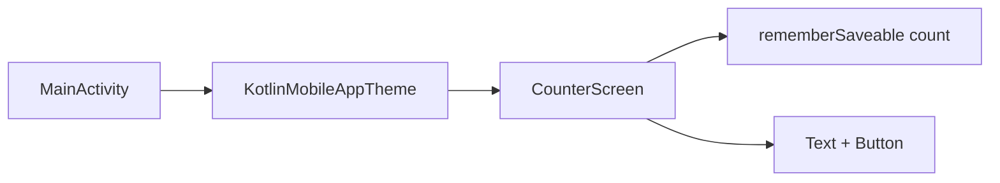

# Kotlin — KotlinMobileApp

<span class="complexity-badge">Разработчику</span>
<span class="complexity-badge">Начальный уровень</span>

---

## О практикуме

**KotlinMobileApp** — учебное Android-приложение: экран с приветствием, крупным числом и кнопкой "Увеличить". Состояние счётчика сохраняется при повороте телефона через **`rememberSaveable`**.

Эталон для сверки: `F:\Projects\JVM\Kotlin\KotlinMobileApp`.

Теория Compose и Activity — [229.md](/encyclopedia/5-languages/5-09-kotlin/229). Общий маршрут мобильной разработки на Kotlin — [234.md](/encyclopedia/5-languages/5-09-kotlin/234).

<div class="callout callout--tip">
  <div class="callout-title">Чем отличается от XML-примера в 1135</div>

  <div class="callout-body">
  В <a href="/encyclopedia/4-code-dev/4-12-mobilnye-prilozheniya/1135">Kotlin в мобильных</a> первый экран ещё на XML и <code>findViewById</code>. Здесь — сразу <strong>Compose</strong>: UI описывается Kotlin-функциями, без <code>activity_main.xml</code>.
  </div>
</div>

<div class="callout callout--info">
  <div class="callout-title">Для кого материал</div>

  <div class="callout-body">
  Нужны Android Studio, JDK 17 и пройденная <a href="./229">статья про Compose</a>. База языка — <a href="./11">основы Kotlin</a>, <a href="./15">ООП</a>. Теория платформы — <a href="/encyclopedia/4-code-dev/4-12-mobilnye-prilozheniya/1135">Kotlin в мобильных приложениях</a>, маршрут — <a href="./234">мобильные приложения на Kotlin</a>.
  </div>
</div>

---

## Словарь практикума

| Термин | В этом проекте |
|--------|----------------|
| `@Composable` | Функция `CounterScreen`, которая рисует UI |
| `Scaffold` | Каркас экрана с отступами под системные панели |
| `rememberSaveable` | Хранит `count` в `Bundle` Activity при повороте |
| `MaterialTheme` | Цвета и шрифты Material3 через `KotlinMobileAppTheme` |
| `stringResource` | Текст из `res/values/strings.xml`, готовность к локализации |
| `@Preview` | Превью экрана в Android Studio без эмулятора |

---

## Архитектура проекта

```
app/src/main/
  java/.../kotlinmobileapp/
    MainActivity.kt
    CounterScreen.kt
    ui/theme/Color.kt, Theme.kt, Type.kt
  res/values/strings.xml
```



**Почему без ViewModel**

- Одно целое число, нет фоновых задач и диска.
- `rememberSaveable` сериализует значение в состояние Activity — для учебного счётчика этого достаточно.
- Следующий шаг — [Kotlinochi](./23.md) (ViewModel + DataStore) или [231.md](./231.md) (Room).

**Оценка времени** — 1–2 часа. После каждого этапа нажимайте **Run**.

### Карта этапов

| Этап | Фокус | Результат |
|------|--------|-----------|
| 0 | Android Studio | Проект с Compose и Gradle |
| 1 | `MainActivity` | Activity вызывает Compose-дерево |
| 2 | Theme | Material3, светлая/тёмная схема |
| 3 | `CounterScreen` | Вёрстка без изменяемого состояния |
| 4 | Состояние | `rememberSaveable`, инкремент |
| 5 | Ресурсы и Preview | `strings.xml`, `@Preview` |

---

<span id="stage-0"></span>
## Этап 0 — проект в Android Studio

### Цель этапа

Получить шаблон Android-проекта с включённым Jetpack Compose и синхронизированным Gradle.

### Шаги

1. Установите **Android Studio** (Ladybug или новее) — см. [Kotlin в мобильных](/encyclopedia/4-code-dev/4-12-mobilnye-prilozheniya/1135).
2. **File → New → New Project → Empty Activity** (или Empty Compose Activity, если доступен).
3. Параметры:
   - Name: `KotlinMobileApp`
   - Package: `com.example.kotlinmobileapp`
   - Language: **Kotlin**
   - Minimum SDK: **API 26** (Android 8.0)
4. Дождитесь **Gradle Sync** (индикатор внизу IDE).

### Файл `app/build.gradle.kts`

Проверьте ключевые фрагменты — они включают Compose и согласуют версии:

```kotlin
plugins {
    id("com.android.application")
    id("org.jetbrains.kotlin.android")
    id("org.jetbrains.kotlin.plugin.compose")
}

android {
    namespace = "com.example.kotlinmobileapp"
    compileSdk = 35

    defaultConfig {
        applicationId = "com.example.kotlinmobileapp"
        minSdk = 26
        targetSdk = 35
    }

    compileOptions {
        sourceCompatibility = JavaVersion.VERSION_17
        targetCompatibility = JavaVersion.VERSION_17
    }

    kotlinOptions { jvmTarget = "17" }

    buildFeatures { compose = true }
}

dependencies {
    val composeBom = platform("androidx.compose:compose-bom:2024.10.01")
    implementation("androidx.core:core-ktx:1.15.0")
    implementation("androidx.activity:activity-compose:1.9.3")
    implementation(composeBom)
    implementation("androidx.compose.ui:ui")
    implementation("androidx.compose.material3:material3")
}
```

### Разбор Gradle

| Строка | Зачем |
|--------|-------|
| `plugin.compose` | Компилятор Compose для `@Composable` |
| `buildFeatures { compose = true }` | Включает Compose в модуле `app` |
| `compose-bom` | Одна версия BOM для всех артефактов `androidx.compose.*` |
| `activity-compose` | Функция `setContent { }` в Activity |
| `minSdk 26` | Разумный минимум для Material3 и современных API |
| Java / JVM 17 | Требование AGP 8+ и типичный LTS JDK |

Подробнее про сборку APK — [112.md](/encyclopedia/4-code-dev/4-12-mobilnye-prilozheniya/112).

### Самопроверка

- [ ] **Run** на эмуляторе — приложение открывается.
- [ ] В Project view есть `MainActivity.kt` и `ui/theme/`.
- [ ] Нет красных ошибок после Sync.

---

<span id="stage-1"></span>
## Этап 1 — `MainActivity`

### Цель этапа

Связать жизненный цикл Android (**Activity**) с корнем Compose UI.

### Код

Замените `MainActivity.kt`:

```kotlin
package com.example.kotlinmobileapp

import android.os.Bundle
import androidx.activity.ComponentActivity
import androidx.activity.compose.setContent
import androidx.activity.enableEdgeToEdge
import com.example.kotlinmobileapp.ui.theme.KotlinMobileAppTheme

class MainActivity : ComponentActivity() {
    override fun onCreate(savedInstanceState: Bundle?) {
        super.onCreate(savedInstanceState)
        enableEdgeToEdge()
        setContent {
            KotlinMobileAppTheme {
                CounterScreen()
            }
        }
    }
}
```

### Разбор построчно

- **`ComponentActivity`** — базовый класс Activity с поддержкой Compose (вместо устаревшего `AppCompatActivity` + XML).
- **`onCreate`** — первый вызов при создании экрана; здесь настраивают UI ([жизненный цикл](/encyclopedia/4-code-dev/4-12-mobilnye-prilozheniya/1135)).
- **`enableEdgeToEdge()`** — контент рисуется под статус-баром и navigation bar; отступы даёт `Scaffold` на следующих этапах.
- **`setContent { … }`** — замена `setContentView(R.layout.…)`; внутри лямбды — только `@Composable`-функции.
- **`KotlinMobileAppTheme { … }`** — обёртка Material3 (цвета, типографика).
- **`CounterScreen()`** — наш экран; файл создадим на этапе 3 (пока IDE покажет unresolved reference — это нормально).

### Самопроверка

- [ ] Импорты `ComponentActivity`, `setContent` разрешаются.
- [ ] Проект компилируется после добавления заглушки `CounterScreen` или пропуска Run до этапа 3.

---

<span id="stage-2"></span>
## Этап 2 — тема Material3

### Цель этапа

Единые цвета и шрифты для всего приложения; поддержка светлой и тёмной темы.

### Теория

**Material3** — дизайн-система Google для Android. В Compose тема задаётся через `MaterialTheme(colorScheme, typography)` — дочерние `Text`, `Button` берут стили оттуда автоматически.

Шаблон Android Studio создаёт три файла в `ui/theme/`:

- `Color.kt` — константы `Color(0xFF…)`
- `Type.kt` — `Typography` (размеры заголовков и body)
- `Theme.kt` — функция `KotlinMobileAppTheme`

### Пример `Color.kt`

```kotlin
val Purple40 = Color(0xFF6650a4)
val Pink40 = Color(0xFF7D5260)
```

### Пример `Theme.kt`

```kotlin
@Composable
fun KotlinMobileAppTheme(
    darkTheme: Boolean = isSystemInDarkTheme(),
    content: @Composable () -> Unit,
) {
    val colorScheme = if (darkTheme) DarkColorScheme else LightColorScheme
    MaterialTheme(
        colorScheme = colorScheme,
        typography = Typography,
        content = content,
    )
}
```

**Разбор**

- `isSystemInDarkTheme()` — следует системной настройке "тёмная тема".
- `MaterialTheme(…)` — провайдер стилей для всего поддерева Composable.

### Самопроверка

- [ ] Любой `@Preview` с `KotlinMobileAppTheme { Text("test") }` показывает превью.
- [ ] Переключение Dark Mode в эмуляторе меняет палитру приложения.

---

<span id="stage-3"></span>
## Этап 3 — каркас `CounterScreen`

### Цель этапа

Сверстать экран **без** изменяемого состояния — только статичный текст "0" и пустой обработчик кнопки.

### Теория layout в Compose

- **`Column`** — дочерние элементы друг под другом.
- **`Modifier`** — цепочка декораций (отступы, размер); `fillMaxSize()`, `padding()`.
- **`Scaffold`** — стандартный каркас Material; `innerPadding` учитывает системные панели после `enableEdgeToEdge`.
- **`Arrangement.Center`** — центрирование по вертикали внутри Column.

### Код

Создайте `CounterScreen.kt`:

```kotlin
package com.example.kotlinmobileapp

import androidx.compose.foundation.layout.*
import androidx.compose.material3.*
import androidx.compose.runtime.Composable
import androidx.compose.ui.Alignment
import androidx.compose.ui.Modifier
import androidx.compose.ui.text.style.TextAlign
import androidx.compose.ui.unit.dp

@Composable
fun CounterScreen() {
    Scaffold { innerPadding ->
        Column(
            modifier = Modifier
                .fillMaxSize()
                .padding(innerPadding)
                .padding(24.dp),
            horizontalAlignment = Alignment.CenterHorizontally,
            verticalArrangement = Arrangement.Center,
        ) {
            Text(
                text = "Привет! Это простое приложение на Kotlin",
                style = MaterialTheme.typography.headlineMedium,
                textAlign = TextAlign.Center,
            )
            Spacer(modifier = Modifier.height(32.dp))
            Text(
                text = "0",
                style = MaterialTheme.typography.displayLarge,
            )
            Spacer(modifier = Modifier.height(24.dp))
            Button(onClick = { }) {
                Text("Увеличить")
            }
        }
    }
}
```

### Разбор

| Элемент | Роль |
|---------|------|
| `@Composable` | Помечает функцию, которую Compose может вызывать при recomposition |
| `headlineMedium` / `displayLarge` | Стили Material3 — крупное число визуально главнее подписи |
| `Spacer` | Фиксированный вертикальный зазор в dp |
| `Button(onClick = { })` | Пока пустой lambda — кнопка не меняет состояние |

**Run** — на экране три блока по центру.

### Самопроверка

- [ ] Текст и кнопка видны, кнопка нажимается без эффекта.
- [ ] Нет краша при повороте (состояния пока нет — это ожидаемо).

---

<span id="stage-4"></span>
## Этап 4 — состояние счётчика

### Цель этапа

Сделать число **изменяемым** и **устойчивым** к повороту экрана.

### Теория состояния в Compose

**State** — данные, от которых зависит картинка на экране. При изменении state Compose запускает **recomposition** — пересчитывает затронутые `@Composable`.

| API | Поведение |
|-----|-----------|
| `remember { mutableStateOf(0) }` | Живёт, пока Composable в дереве; **теряется** при уничтожении Activity |
| `rememberSaveable { mutableIntStateOf(0) }` | Сохраняется в `Bundle` Activity — **переживает** поворот |

При **configuration change** (поворот, смена языка) Android уничтожает и создаёт Activity заново. Без `rememberSaveable` или ViewModel счётчик обнулится — типичная ошибка новичков ([229.md](/encyclopedia/5-languages/5-09-kotlin/229)).

### Код

```kotlin
import androidx.compose.runtime.getValue
import androidx.compose.runtime.mutableIntStateOf
import androidx.compose.runtime.saveable.rememberSaveable
import androidx.compose.runtime.setValue

@Composable
fun CounterScreen() {
    var count by rememberSaveable { mutableIntStateOf(0) }

    // … внутри Column:
    Text(
        text = count.toString(),
        style = MaterialTheme.typography.displayLarge,
    )
    Button(onClick = { count++ }) {
        Text("Увеличить")
    }
}
```

### Разбор

- **`var count by …`** — делегат: присвоение `count++` вызывает `mutableIntStateOf` и триггерит recomposition.
- **`mutableIntStateOf`** — специализированный state для `Int` (меньше аллокаций, чем `mutableStateOf(0)`).
- **`onClick = { count++ }`** — lambda без параметров; каждое нажатие увеличивает state.

**Проверка поворота:** нажмите кнопку 5–10 раз → **Ctrl+F11** (rotate) → число должно остаться тем же.

Когда появятся сеть, БД или таймер — переносите state в **ViewModel** ([Kotlinochi](./23.md), [231.md](./231.md)).

### Самопроверка

- [ ] Каждое нажатие увеличивает число на 1.
- [ ] После поворота эмулятора значение **не** сбрасывается.

---

<span id="stage-5"></span>
## Этап 5 — строковые ресурсы и Preview

### Цель этапа

Вынести тексты из Kotlin в ресурсы и добавить превью для быстрой вёрстки в IDE.

### Зачем `strings.xml`

- **Локализация** — позже добавите `values-en/strings.xml` без правки кода.
- **Единообразие** — имя приложения и подписи в одном месте.
- **Практика Android** — так делают production-приложения ([1135](/encyclopedia/4-code-dev/4-12-mobilnye-prilozheniya/1135)).

### `res/values/strings.xml`

```xml
<resources>
    <string name="app_name">Kotlin Mobile App</string>
    <string name="greeting">Привет! Это простое приложение на Kotlin</string>
    <string name="increment">Увеличить</string>
</resources>
```

### Использование в Compose

```kotlin
import androidx.compose.ui.res.stringResource
import androidx.compose.ui.tooling.preview.Preview

Text(
    text = stringResource(R.string.greeting),
    style = MaterialTheme.typography.headlineMedium,
    textAlign = TextAlign.Center,
)
Button(onClick = { count++ }) {
    Text(text = stringResource(R.string.increment))
}

@Preview(showBackground = true)
@Composable
private fun CounterScreenPreview() {
    KotlinMobileAppTheme {
        CounterScreen()
    }
}
```

### Разбор `@Preview`

- Компилятор генерирует отдельный preview-ран в IDE — **эмулятор не нужен**.
- `showBackground = true` — белый/тёмный фон за контентом.
- Preview-функция **private** — не попадает в APK.

### Самопроверка

- [ ] Preview `CounterScreenPreview` отображается на панели Design.
- [ ] Структура файлов совпадает с эталоном `KotlinMobileApp`.

---

## Что дальше

| Направление | Материал |
|-------------|----------|
| Игра с ViewModel, DataStore, таймером | [Kotlinochi](./23.md) |
| Список заметок с SQLite | [Room + ViewModel](./231.md) |
| HTTP с телефона | [Ktor Client](./228.md) |
| Сборка и USB-установка | [1121](/encyclopedia/4-code-dev/4-12-mobilnye-prilozheniya/1121) |
| Публикация в Store | [1141](/encyclopedia/4-code-dev/4-12-mobilnye-prilozheniya/1141) |

---

### Частые ошибки

| Симптом | Причина | Решение |
|---------|---------|---------|
| `Unresolved reference: CounterScreen` | Другой package или нет файла | Положите `CounterScreen.kt` рядом с `MainActivity` |
| Счётчик сбрасывается | `remember` вместо `rememberSaveable` | Замените API ([этап 4](#stage-4)) |
| Preview пустой / ошибка | Нет `MaterialTheme` | Оберните в `KotlinMobileAppTheme` |
| `Unresolved reference: R` | Ошибка в `res/` или нет Sync | **Build → Clean Project**, Sync Gradle |
| Кнопка не реагирует | Пустой `onClick` | Добавьте `{ count++ }` |

---

### Что попробовать

1. Добавить кнопку "Сброс" с `count = 0`.
2. Ограничить счётчик сверху (`if (count < 99) count++`).
3. Вынести цвет кнопки в `Color.kt` и передать в `Button(colors = …)`.
4. Сравнить этот проект с [Kotlinochi](./23.md) — тот же Compose, но state в ViewModel.

---
