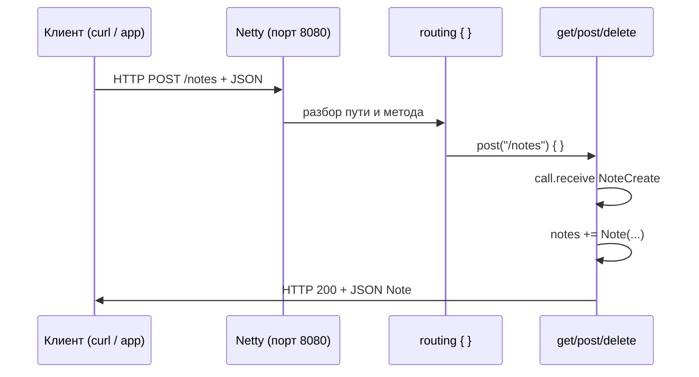

import ExternalCodeEmbed from '@site/src/components/ExternalCodeEmbed';


# Ktor — первая программа

<div class="article-tags">
  <span class="tag tag-required">ОБЯЗАТЕЛЬНО</span>
  <span class="tag tag-beginner">ДЛЯ НОВИЧКОВ</span>
</div>

<span class="complexity-badge">Разработчику</span>
<span class="complexity-badge">Архитектору</span>

---

## Ktor — первая программа

Эта статья — пошаговый вход в **backend на Kotlin**: вы поднимете маленький HTTP-сервер, который отвечает на запросы из браузера, `curl` или мобильного приложения. Код можно повторить без опыта в сетевых протоколах: ниже есть словарь терминов и разбор каждой важной строки.

**Ktor** — асинхронный фреймворк от JetBrains для HTTP-серверов и HTTP-клиентов. Внутри он опирается на [корутины](./222.md): пока один запрос ждёт сеть или диск, поток JVM может обслуживать другие запросы.

База языка: [Первая программа на Kotlin](./2.md). Экосистема: [Экосистема Kotlin](./10.md). Android и сеть с устройства: [мобильный раздел](/encyclopedia/4-code-dev/4-12-mobilnye-prilozheniya/1135).

---

## Что вы строите

Небольшой **REST API** для заметок:

| Метод HTTP | Путь | Смысл |
|------------|------|--------|
| `GET` | `/health` | "Сервер жив?" — для мониторинга |
| `GET` | `/notes` | Список всех заметок |
| `POST` | `/notes` | Создать заметку (тело — JSON) |
| `DELETE` | `/notes/{id}` | Удалить заметку по номеру |

Данные пока хранятся **в памяти** (`mutableListOf`) — после перезапуска сервера список обнулится. Для постоянного хранения позже подключают базу данных; логика маршрутов останется похожей.

<div class="callout callout--info">
  <div class="callout-title">Почему пример сделан in-memory</div>

  <div class="callout-body">
  Такой формат позволяет сначала понять HTTP-слой и маршрутизацию. После закрепления добавьте репозиторий и БД по статье [Работа с базами данных](./18.md), сохранив те же endpoint'ы.
</div>
  </div>


---

## Словарь терминов

| Термин | Простыми словами |
|--------|------------------|
| **HTTP** | Протокол обмена: клиент (браузер, приложение) шлёт **запрос**, сервер возвращает **ответ** с кодом статуса и телом. |
| **REST API** | Набор URL ("ресурсов"), к которым обращаются методами `GET`, `POST`, `DELETE` и т.д. Вместо "страниц HTML" часто отдают **JSON**. |
| **Маршрут (route)** | Связка "путь + метод" → код обработчика. В Ktor блок `routing { get("/health") { ... } }`. |
| **JSON** | Текстовый формат данных: `{"id":1,"text":"Привет"}`. Удобен для приложений и веба. |
| **Сериализация** | Превращение объекта Kotlin (`Note`) в JSON и обратно. Здесь — библиотека `kotlinx.serialization`. |
| **Engine (движок)** | Низкоуровневый слой, который слушает порт и принимает TCP-соединения. **Netty** — популярный выбор на JVM. |
| **Плагин (feature)** | Подключаемая возможность: разбор JSON, логи, CORS, авторизация. В коде — `install(ContentNegotiation)`. |
| **`call`** | Контекст одного HTTP-запроса: параметры пути, тело, ответ (`call.respond`). |
| **`embeddedServer`** | Запуск встроенного сервера в том же процессе, что и `main` — без отдельного Tomcat. |

---

## Создание проекта

### Вариант 1 — генератор

На [start.ktor.io](https://start.ktor.io) выберите:

- **Engine:** Netty
- **Dependencies:** `Routing`, `Content Negotiation`, `kotlinx-serialization`

Скачайте архив, откройте в IntelliJ IDEA, выполните `./gradlew run`.

```bash
./gradlew run
```

Разбор:
- `./gradlew` запускает Gradle Wrapper из проекта и гарантирует использование согласованной версии Gradle.
- Команда `run` собирает проект и стартует приложение через `application`-плагин.
- Такой запуск удобен для локальной разработки: изменения кода быстро проверяются без ручной сборки JAR.

---

### Вариант 2 — Gradle вручную

Файл `build.gradle.kts` в корне проекта:


<ExternalCodeEmbed example="kotlin/kotlin-509-221-001" title="Вариант 2 — Gradle вручную" minHeight={372} />


Разбор:
- Блок `plugins` подключает компилятор Kotlin, сериализацию и поддержку запуска приложения.
- `repositories { mavenCentral() }` указывает основной источник зависимостей JVM-экосистемы.
- В `dependencies` перечислены серверный core Ktor, движок Netty, JSON-плагин и сериализатор.
- `logback-classic` добавляет конфигурируемое логирование запросов и внутренних событий приложения.
- `application { mainClass.set(...) }` задаёт точку входа, которую использует `gradlew run`.

**Разбор фрагмента:**

- `kotlin("plugin.serialization")` — компилятор генерирует код для `@Serializable`.
- `ktor-server-netty` — движок Netty.
- `content-negotiation` + `serialization-kotlinx-json` — автоматический JSON в запросах и ответах.
- `logback` — логи в консоль (кто к какому URL обратился).
- `mainClass` — класс с функцией `main` (для файла `Application.kt` имя станет `ApplicationKt`).

---

## Модели данных

```kotlin
@Serializable
data class Note(val id: Int, val text: String)

@Serializable
data class NoteCreate(val text: String)
```

Разбор:
- `@Serializable` включает генерацию кода сериализации для преобразования моделей в JSON и обратно.
- `data class Note` описывает сущность ответа API с обязательными `id` и `text`.
- `data class NoteCreate` моделирует входное тело запроса при создании заметки.
- Разделение входной и выходной моделей упрощает валидацию и развитие контракта API. См. [Проверка и валидация](/encyclopedia/4-code-dev/4-14-razrabotka-i-otladka/118).

| Элемент | Зачем |
|---------|--------|
| `@Serializable` | Помечает класс для `kotlinx.serialization` — из него можно сделать JSON. |
| `data class` | Автоматические `equals`, `copy`, удобная печать. |
| `Note` | Полная заметка с `id` — то, что сервер отдаёт клиенту. |
| `NoteCreate` | Только текст при создании — клиент ещё не знает `id`, его выдаёт сервер. |

---

## Полный код `Application.kt`


<ExternalCodeEmbed example="kotlin/kotlin-509-221-002" title="Полный код `Application.kt`" minHeight={720} />


Разбор:
- Импорты `io.ktor.server.*` подключают API запуска сервера, маршрутов, чтения запросов и отправки ответов.
- `main()` поднимает сервер на порту `8080` и регистрирует функцию `Application::module` как конфигурацию.
- `install(ContentNegotiation) { json() }` включает автоматическую JSON-сериализацию для тел запросов и ответов.
- `notes` и `nextId` хранят состояние in-memory и выдают идентификаторы новым заметкам.
- В `routing { ... }` объявлены endpoint'ы `GET`, `POST`, `DELETE` и их логика обработки HTTP-вызовов.

---

### Построчный разбор `main` и модуля

```kotlin
fun main() {
    embeddedServer(Netty, port = 8080, module = Application::module).start(wait = true)
}
```

Разбор:
- `embeddedServer(...)` создаёт HTTP-сервер внутри текущего процесса JVM.
- `Netty` выбирается как сетевой engine для приёма соединений и обработки запросов.
- `module = Application::module` передаёт ссылку на функцию конфигурации приложения.
- `start(wait = true)` удерживает главный поток активным, пока сервер не остановлен.

- `embeddedServer` — создаёт сервер в текущем JVM-процессе.
- `Netty` — конкретный движок.
- `port = 8080` — слушать `http://127.0.0.1:8080`.
- `module = Application::module` — при старте вызовется ваша функция `Application.module()`.
- `main` не завершится, пока сервер работает (удобно для `./gradlew run`).

```sql
start(wait = true)
```

Разбор:
- Параметр `wait = true` переводит запуск в блокирующий режим: приложение остаётся в рабочем состоянии.
- Для CLI-сценариев это стандартный режим, чтобы процесс не завершился сразу после инициализации.
- При `wait = false` сервер стартует асинхронно и управление возвращается вызывающему коду.

```kotlin
fun Application.module() {
    install(ContentNegotiation) { json() }
```

Разбор:
- Расширение `Application.module()` объединяет конфигурацию плагинов и маршрутов в одной точке.
- `install(ContentNegotiation)` подключает механизм выбора формата данных по HTTP-заголовкам.
- `json()` регистрирует JSON-конвертер, чтобы `call.receive<T>()` и `call.respond(...)` работали с объектами Kotlin.

Расширение `Application.module` — идиоматичный стиль Ktor: настройка привязана к жизненному циклу приложения. Плагин **Content Negotiation** смотрит заголовок `Content-Type` и превращает тело запроса/ответа в JSON и обратно.

```kotlin
val notes = mutableListOf<Note>()
var nextId = 1
```

Разбор:
- `mutableListOf<Note>()` создаёт изменяемую коллекцию для хранения заметок в оперативной памяти.
- `var nextId = 1` хранит счётчик идентификаторов, который увеличивается при каждом `POST`.
- Такой подход удобен для учебного API без подключения БД, миграций и репозиториев.

"База данных" в памяти. `nextId++` выдаёт уникальный номер каждой новой заметке (сначала 1, потом 2, …).

---

### Маршруты

**`GET /health`**

```kotlin
get("/health") {
    call.respond(mapOf("status" to "ok"))
}
```

Разбор:
- `get("/health")` регистрирует маршрут проверки доступности сервиса.
- `call.respond(...)` отправляет HTTP-ответ клиенту с телом JSON-объекта.
- `mapOf("status" to "ok")` формирует компактный payload, подходящий для мониторинга и probe-проверок.

Клиент получит JSON `{"status":"ok"}` и код **200 OK**. Так проверяют, что процесс запущен (оркестраторы, балансировщики).

**`GET /notes`**

```kotlin
call.respond(notes)
```

Разбор:
- `notes` содержит текущее состояние коллекции заметок в памяти.
- `call.respond(notes)` сериализует список `List<Note>` в JSON-массив автоматически через `ContentNegotiation`.
- Endpoint предоставляет read-модель API, которую клиент может отобразить или кэшировать.

Список сериализуется в JSON-массив: `[{"id":1,"text":"..."}, ...]`.

**`POST /notes`**

```kotlin
val body = call.receive<NoteCreate>()
val note = Note(nextId++, body.text)
notes += note
call.respond(note)
```

Разбор:
- `call.receive<NoteCreate>()` десериализует JSON-тело входящего запроса в типобезопасную модель.
- `Note(nextId++, body.text)` создаёт новую сущность и одновременно увеличивает счётчик ID.
- `notes += note` добавляет запись в изменяемую коллекцию приложения.
- `call.respond(note)` возвращает созданный объект клиенту как подтверждение результата операции.

1. `receive<NoteCreate>()` — прочитать тело запроса как JSON в объект Kotlin.
2. Собрать `Note` с новым `id`.
3. Добавить в список и вернуть созданную заметку клиенту (обычно код 200).

**`DELETE /notes/{id}`**

- `{id}` в пути — **параметр маршрута**. Для `/notes/5` значение `"5"` лежит в `call.parameters["id"]`.
- `toIntOrNull()` — безопасное преобразование; при мусоре в URL вернём **400 Bad Request**.
- `removeIf { it.id == id }` — удалить элемент из списка.
- **204 No Content** — успех без тела; **404** — заметки с таким `id` не было.

---

## Запуск

```bash
./gradlew run
```

Разбор:
- Команда используется для быстрого локального старта сервера из корня проекта.
- При запуске Gradle сначала компилирует Kotlin-код и разрешает зависимости.
- После успешной сборки запускается JVM-процесс с Ktor-приложением и логами в консоль.

В логах появится строка вроде `Responding at http://0.0.0.0:8080`. Остановка — `Ctrl+C` в терминале.

---

## Проверка вручную

```bash
curl http://127.0.0.1:8080/health
curl http://127.0.0.1:8080/notes
curl -X POST http://127.0.0.1:8080/notes \
  -H "Content-Type: application/json" \
  -d '{"text":"Изучить Ktor"}'
curl -X DELETE http://127.0.0.1:8080/notes/1
```

Разбор:
- Первые два вызова `curl` проверяют здоровье сервиса и чтение списка заметок (`GET`-маршруты).
- `-X POST` вместе с `-H "Content-Type: application/json"` отправляет JSON в endpoint создания заметки.
- Параметр `-d '{...}'` передаёт тело запроса, которое сервер читает через `receive<NoteCreate>()`.
- `-X DELETE` удаляет конкретный ресурс по ID и помогает проверить корректность статусов `204/404`.

| Команда | Что проверяет |
|---------|----------------|
| Первая | Жив ли сервер |
| Вторая | Пустой или полный список |
| Третья | Создание с JSON-телом |
| Четвёртая | Удаление по `id` |

Заголовок `Content-Type: application/json` говорит серверу: тело запроса — JSON. Без него `receive<NoteCreate>()` может не сработать.

---

## Как запрос проходит через Ktor



Разбор:
- Диаграмма показывает полный путь запроса: от клиента через Netty и роутер до конкретного обработчика.
- Узел `Routing` выбирает нужный endpoint на основе HTTP-метода и URL.
- Внутри `Handler` выполняется бизнес-логика: чтение тела, создание заметки, изменение состояния.
- Завершающий шаг формирует HTTP-ответ с кодом и JSON, который возвращается клиенту.

---

## Плагины (следующий шаг)

| Плагин | Назначение |
|--------|------------|
| `Authentication` | JWT, Basic, OAuth |
| `CORS` | Запросы из браузера с другого домена |
| `StatusPages` | Единый формат ошибок вместо разрозненных `respondText` |
| `CallLogging` | Лог каждого запроса (метод, путь, время) |

Подключение похоже на `install(ContentNegotiation)`: объявляете в `Application.module()` до или после `routing`.

---

## Ktor и Spring

| Стек | Когда уместен |
|------|----------------|
| **Ktor** | Kotlin-first, явные маршруты, лёгкий старт, корутины в обработчиках |
| **Spring Boot** | Большая экосистема (Security, Data, Cloud), команда уже на Spring |

Spring на Kotlin: [Spring Boot на Kotlin — первая программа](./232.md). Java-обзор: [Spring для Kotlin/Java](/encyclopedia/5-languages/5-03-java/27).

---

### Частые ошибки

| Симптом | Причина |
|---------|---------|
| `Connection refused` | Сервер не запущен или другой порт |
| 415 / пустое тело при POST | Нет заголовка `Content-Type: application/json` |
| `@Serializable` не найден | Не подключён плагин `kotlin("plugin.serialization")` |
| Порт занят | Уже работает другой процесс на 8080 |

---

### Что попробовать

1. Добавить `PUT /notes/{id}` для редактирования текста.
2. Подключить `CallLogging` и посмотреть логи при `curl`.
3. Написать клиент на [Ktor Client](./228.md) к этому же серверу.

---

## Мини-чеклист качества API

Перед тем как считать первый сервер "готовым", проверьте базовые инженерные пункты:

- коды ответов согласованы (`200/201/204/400/404`);
- ошибки возвращаются в одном формате JSON;
- есть `GET /health` и минимум один тест в `testApplication`;
- входные данные валидируются до бизнес-логики;
- логируются метод, путь, статус и время запроса.

Этот чеклист пригодится и для следующей статьи по тестированию — [Тестирование на Kotlin](./223.md).

---

## Связанные материалы

- [Ktor Client — HTTP-запросы](./228.md)
- [Корутины](./222.md)
- [DSL и функции с получателем](./230.md) — почему `routing { }` читается как мини-язык
- [Тестирование](./223.md)

---

{/* http-basics-link  */}
<div class="callout callout--tip">
  <div class="callout-title">Основа по протоколу</div>

  <div class="callout-body">
  Базовый разбор HTTP и HTTPS находится в отдельной статье — [HTTP как основа веб-интеграций](/encyclopedia/2-system-network/2-09-osnovy-integratsionnogo-vzaimodeystviya/118).
</div>
  </div>

{/* sidebar-collections */}

---

## В подборках

Статья входит в [тематические подборки](/about/collections) и блок «С чего начать?» на [главной](/). Соседние шаги того же маршрута:

**Первые шаги** ([маршрут подборки](/about/collections/pervye-shagi)) — [Первая программа на Symfony](/encyclopedia/5-languages/5-07-php/1441), [Compose Multiplatform — первая программа](/encyclopedia/5-languages/5-09-kotlin/224), [Первая программа на Laravel](/encyclopedia/5-languages/5-07-php/1431), [Spring Boot на Kotlin — первая программа](/encyclopedia/5-languages/5-09-kotlin/232), [Qt Quick — первая программа на QML](/encyclopedia/5-languages/5-06-cpp/2732), [Первая программа на Gin](/encyclopedia/5-languages/5-10-go/2412).

{/* /sidebar-collections */}

---
