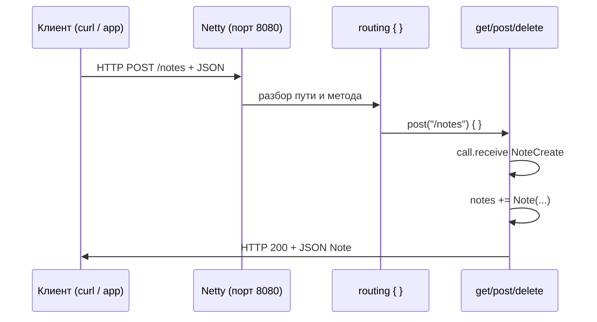

# Ktor — первая программа

<div class="article-tags">
  <span class="tag tag-required">ОБЯЗАТЕЛЬНО</span>
  <span class="tag tag-beginner">ДЛЯ НОВИЧКОВ</span>
</div>

<span class="complexity-badge">Разработчику</span>
<span class="complexity-badge">Архитектору</span>

## Ktor — первая программа

Эта статья — пошаговый вход в **backend на Kotlin**: вы поднимете маленький HTTP-сервер, который отвечает на запросы из браузера, `curl` или мобильного приложения. Код можно повторить без опыта в сетевых протоколах: ниже есть словарь терминов и разбор каждой важной строки.

**Ktor** — асинхронный фреймворк от JetBrains для HTTP-серверов и HTTP-клиентов. Внутри он опирается на [корутины](./222.md): пока один запрос ждёт сеть или диск, поток JVM может обслуживать другие запросы.

База языка: [Первая программа на Kotlin](./2.md). Экосистема: [Экосистема Kotlin](./10.md). Android и сеть с устройства: [мобильный раздел](/encyclopedia/4-code-dev/4-12-mobilnye-prilozheniya/1135).

---

## Что вы строите

Небольшой **REST API** для заметок:

| Метод HTTP | Путь | Смысл |
|------------|------|--------|
| `GET` | `/health` | «Сервер жив?» — для мониторинга |
| `GET` | `/notes` | Список всех заметок |
| `POST` | `/notes` | Создать заметку (тело — JSON) |
| `DELETE` | `/notes/{id}` | Удалить заметку по номеру |

Данные пока хранятся **в памяти** (`mutableListOf`) — после перезапуска сервера список обнулится. Для постоянного хранения позже подключают базу данных; логика маршрутов останется похожей.

---

## Словарь терминов

| Термин | Простыми словами |
|--------|------------------|
| **HTTP** | Протокол обмена: клиент (браузер, приложение) шлёт **запрос**, сервер возвращает **ответ** с кодом статуса и телом. |
| **REST API** | Набор URL («ресурсов»), к которым обращаются методами `GET`, `POST`, `DELETE` и т.д. Вместо «страниц HTML» часто отдают **JSON**. |
| **Маршрут (route)** | Связка «путь + метод» → код обработчика. В Ktor блок `routing { get("/health") { ... } }`. |
| **JSON** | Текстовый формат данных: `{"id":1,"text":"Привет"}`. Удобен для приложений и веба. |
| **Сериализация** | Превращение объекта Kotlin (`Note`) в JSON и обратно. Здесь — библиотека `kotlinx.serialization`. |
| **Engine (движок)** | Низкоуровневый слой, который слушает порт и принимает TCP-соединения. **Netty** — популярный выбор на JVM. |
| **Плагин (feature)** | Подключаемая возможность: разбор JSON, логи, CORS, авторизация. В коде — `install(ContentNegotiation)`. |
| **`call`** | Контекст одного HTTP-запроса: параметры пути, тело, ответ (`call.respond`). |
| **`embeddedServer`** | Запуск встроенного сервера в том же процессе, что и `main` — без отдельного Tomcat. |

---

## Создание проекта

### Вариант 1: генератор

На [start.ktor.io](https://start.ktor.io) выберите:

- **Engine:** Netty
- **Dependencies:** `Routing`, `Content Negotiation`, `kotlinx-serialization`

Скачайте архив, откройте в IntelliJ IDEA, выполните `./gradlew run`.

### Вариант 2: Gradle вручную

Файл `build.gradle.kts` в корне проекта:

```kotlin
plugins {
    kotlin("jvm") version "1.9.24"
    kotlin("plugin.serialization") version "1.9.24"
    application
}

repositories { mavenCentral() }

dependencies {
    implementation("io.ktor:ktor-server-core-jvm:2.3.12")
    implementation("io.ktor:ktor-server-netty-jvm:2.3.12")
    implementation("io.ktor:ktor-server-content-negotiation-jvm:2.3.12")
    implementation("io.ktor:ktor-serialization-kotlinx-json-jvm:2.3.12")
    implementation("ch.qos.logback:logback-classic:1.5.6")
}

application { mainClass.set("com.example.ApplicationKt") }
```

**Разбор фрагмента:**

- `kotlin("plugin.serialization")` — компилятор генерирует код для `@Serializable`.
- `ktor-server-netty` — движок Netty.
- `content-negotiation` + `serialization-kotlinx-json` — автоматический JSON в запросах и ответах.
- `logback` — логи в консоль (кто к какому URL обратился).
- `mainClass` — класс с функцией `main` (для файла `Application.kt` имя станет `ApplicationKt`).

---

## Модели данных

```kotlin
@Serializable
data class Note(val id: Int, val text: String)

@Serializable
data class NoteCreate(val text: String)
```

| Элемент | Зачем |
|---------|--------|
| `@Serializable` | Помечает класс для `kotlinx.serialization` — из него можно сделать JSON. |
| `data class` | Автоматические `equals`, `copy`, удобная печать. |
| `Note` | Полная заметка с `id` — то, что сервер отдаёт клиенту. |
| `NoteCreate` | Только текст при создании — клиент ещё не знает `id`, его выдаёт сервер. |

---

## Полный код `Application.kt`

```kotlin
package com.example

import io.ktor.serialization.kotlinx.json.*
import io.ktor.server.application.*
import io.ktor.server.engine.*
import io.ktor.server.netty.*
import io.ktor.server.request.*
import io.ktor.server.response.*
import io.ktor.server.routing.*
import kotlinx.serialization.Serializable

@Serializable
data class Note(val id: Int, val text: String)

@Serializable
data class NoteCreate(val text: String)

fun main() {
    embeddedServer(Netty, port = 8080, module = Application::module).start(wait = true)
}

fun Application.module() {
    install(ContentNegotiation) { json() }

    val notes = mutableListOf<Note>()
    var nextId = 1

    routing {
        get("/health") {
            call.respond(mapOf("status" to "ok"))
        }
        get("/notes") {
            call.respond(notes)
        }
        post("/notes") {
            val body = call.receive<NoteCreate>()
            val note = Note(nextId++, body.text)
            notes += note
            call.respond(note)
        }
        delete("/notes/{id}") {
            val id = call.parameters["id"]?.toIntOrNull()
                ?: return@delete call.respondText("bad id", status = io.ktor.http.HttpStatusCode.BadRequest)
            if (notes.removeIf { it.id == id }) {
                call.respondText(status = io.ktor.http.HttpStatusCode.NoContent)
            } else {
                call.respondText("not found", status = io.ktor.http.HttpStatusCode.NotFound)
            }
        }
    }
}
```

### Построчный разбор `main` и модуля

```kotlin
fun main() {
    embeddedServer(Netty, port = 8080, module = Application::module).start(wait = true)
}
```

- `embeddedServer` — создаёт сервер в текущем JVM-процессе.
- `Netty` — конкретный движок.
- `port = 8080` — слушать `http://127.0.0.1:8080`.
- `module = Application::module` — при старте вызовется ваша функция `Application.module()`.
- `start(wait = true)` — `main` не завершится, пока сервер работает (удобно для `./gradlew run`).

```kotlin
fun Application.module() {
    install(ContentNegotiation) { json() }
```

Расширение `Application.module` — идиоматичный стиль Ktor: настройка привязана к жизненному циклу приложения. Плагин **Content Negotiation** смотрит заголовок `Content-Type` и превращает тело запроса/ответа в JSON и обратно.

```kotlin
val notes = mutableListOf<Note>()
var nextId = 1
```

«База данных» в памяти. `nextId++` выдаёт уникальный номер каждой новой заметке (сначала 1, потом 2, …).

### Маршруты

**`GET /health`**

```kotlin
get("/health") {
    call.respond(mapOf("status" to "ok"))
}
```

Клиент получит JSON `{"status":"ok"}` и код **200 OK**. Так проверяют, что процесс запущен (оркестраторы, балансировщики).

**`GET /notes`**

```kotlin
call.respond(notes)
```

Список сериализуется в JSON-массив: `[{"id":1,"text":"..."}, ...]`.

**`POST /notes`**

```kotlin
val body = call.receive<NoteCreate>()
val note = Note(nextId++, body.text)
notes += note
call.respond(note)
```

1. `receive<NoteCreate>()` — прочитать тело запроса как JSON в объект Kotlin.
2. Собрать `Note` с новым `id`.
3. Добавить в список и вернуть созданную заметку клиенту (обычно код 200).

**`DELETE /notes/{id}`**

- `{id}` в пути — **параметр маршрута**. Для `/notes/5` значение `"5"` лежит в `call.parameters["id"]`.
- `toIntOrNull()` — безопасное преобразование; при мусоре в URL вернём **400 Bad Request**.
- `removeIf { it.id == id }` — удалить элемент из списка.
- **204 No Content** — успех без тела; **404** — заметки с таким `id` не было.

---

## Запуск

```bash
./gradlew run
```

В логах появится строка вроде `Responding at http://0.0.0.0:8080`. Остановка — `Ctrl+C` в терминале.

---

## Проверка вручную

```bash
curl http://127.0.0.1:8080/health
curl http://127.0.0.1:8080/notes
curl -X POST http://127.0.0.1:8080/notes \
  -H "Content-Type: application/json" \
  -d '{"text":"Изучить Ktor"}'
curl -X DELETE http://127.0.0.1:8080/notes/1
```

| Команда | Что проверяет |
|---------|----------------|
| Первая | Жив ли сервер |
| Вторая | Пустой или полный список |
| Третья | Создание с JSON-телом |
| Четвёртая | Удаление по `id` |

Заголовок `Content-Type: application/json` говорит серверу: тело запроса — JSON. Без него `receive<NoteCreate>()` может не сработать.

---

## Как запрос проходит через Ktor



---

## Плагины (следующий шаг)

| Плагин | Назначение |
|--------|------------|
| `Authentication` | JWT, Basic, OAuth |
| `CORS` | Запросы из браузера с другого домена |
| `StatusPages` | Единый формат ошибок вместо разрозненных `respondText` |
| `CallLogging` | Лог каждого запроса (метод, путь, время) |

Подключение похоже на `install(ContentNegotiation)`: объявляете в `Application.module()` до или после `routing`.

---

## Ktor и Spring

| Стек | Когда уместен |
|------|----------------|
| **Ktor** | Kotlin-first, явные маршруты, лёгкий старт, корутины в обработчиках |
| **Spring Boot** | Большая экосистема (Security, Data, Cloud), команда уже на Spring |

Spring на Kotlin: [232.md](./232.md). Java-обзор: [Spring для Kotlin/Java](/encyclopedia/5-languages/5-03-java/27).

---

### Частые ошибки

| Симптом | Причина |
|---------|---------|
| `Connection refused` | Сервер не запущен или другой порт |
| 415 / пустое тело при POST | Нет заголовка `Content-Type: application/json` |
| `@Serializable` не найден | Не подключён плагин `kotlin("plugin.serialization")` |
| Порт занят | Уже работает другой процесс на 8080 |

---

### Что попробовать

1. Добавить `PUT /notes/{id}` для редактирования текста.
2. Подключить `CallLogging` и посмотреть логи при `curl`.
3. Написать клиент на [Ktor Client](./228.md) к этому же серверу.

---

## Связанные материалы

- [Ktor Client — HTTP-запросы](./228.md)
- [Корутины](./222.md)
- [DSL и функции с получателем](./230.md) — почему `routing { }` читается как мини-язык
- [Тестирование](./223.md)

---
