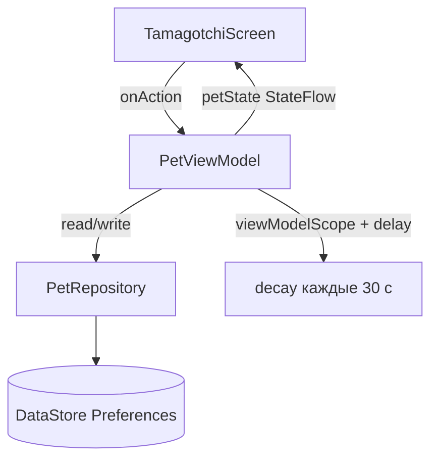

import ExternalCodeEmbed from '@site/src/components/ExternalCodeEmbed';


# Kotlin — Kotlinochi

<span class="complexity-badge">Разработчику</span>
<span class="complexity-badge">Средний уровень</span>

---

## О практикуме

**Kotlinochi** — тамагочi "Коточи": три шкалы (здоровье, энергия, чистота), три действия и **игровой цикл** угасания на **корутинах**. Состояние пишется в **DataStore** и восстанавливается после закрытия приложения, в том числе с **offline decay** — "питомец скучал, пока вас не было".

Эталон: `F:\Projects\JVM\Kotlin\Kotlinochi`.

Перед стартом: [KotlinMobileApp](./22.md) (Compose) + [корутины](./222.md) + [Flow](./226.md). Обзор MVVM на Android — [1135](/encyclopedia/4-code-dev/4-12-mobilnye-prilozheniya/1135).

<div class="callout callout--info">
  <div class="callout-title">Для кого материал</div>

  <div class="callout-body">
  Сначала — <a href="./22">KotlinMobileApp</a> или <a href="./229">Compose — первый экран</a>, затем <a href="./222">корутины</a> и <a href="./226">Flow</a>. Здесь вы соберёте полный <strong>MVVM</strong>: <code>PetViewModel</code>, <code>StateFlow</code>, <code>PetRepository</code>, <strong>DataStore Preferences</strong>.
  </div>
</div>

---

## Словарь практикума

| Термин | В Kotlinochi |
|--------|--------------|
| **MVVM** | Model (`PetState`) + View (`TamagotchiScreen`) + ViewModel (`PetViewModel`) |
| **DataStore** | Асинхронное key-value хранилище вместо SharedPreferences |
| **StateFlow** | Поток состояния питомца; UI подписывается через `collectAsState()` |
| **decay** | Плановое уменьшение статов |
| **offline decay** | Догоняющие тики за время, пока приложение было закрыто |
| **Canvas** | Отрисовка кота без PNG-спрайтов |

---

## Архитектура



**Оценка времени** — 3–5 часов.

### Карта этапов

| Этап | Фокус | Результат |
|------|--------|-----------|
| 0 | Gradle | ViewModel, DataStore, Compose |
| 1 | Model | `PetState`, `PetMood`, `PetAction` |
| 2 | Repository | Flow из DataStore, suspend `save` |
| 3 | ViewModel | Действия, decay, offline |
| 4 | Theme | Пастельная палитра |
| 5 | Компоненты | `StatBar`, `ActionButton` |
| 6 | `PetDisplay` | Canvas-кот и анимация |
| 7 | `TamagotchiScreen` | Сборка экрана, Snackbar |
| 8 | `MainActivity` | Запуск |

---

<span id="stage-0"></span>
## Этап 0 — проект и зависимости

### Цель этапа

Android-проект с Compose и библиотеками для **MVVM** и **персистентности**.

### Шаги

1. **New Project → Empty Activity**, package `com.kotlinochi.tamagotchi`, minSdk **26**.
2. В `app/build.gradle.kts` к зависимостям из [KotlinMobileApp](./22.md#stage-0) добавьте:

```kotlin
dependencies {
    val composeBom = platform("androidx.compose:compose-bom:2024.10.01")
    implementation("androidx.lifecycle:lifecycle-viewmodel-compose:2.8.7")
    implementation("androidx.lifecycle:lifecycle-runtime-compose:2.8.7")
    implementation("androidx.datastore:datastore-preferences:1.1.1")
    implementation(composeBom)
    implementation("androidx.compose.material3:material3")
    implementation("androidx.compose.material:material-icons-extended")
    // + core-ktx, activity-compose, ui — как в KotlinMobileApp
}
```

### Разбор зависимостей

| Артефакт | Назначение |
|----------|------------|
| `lifecycle-viewmodel-compose` | `viewModel()` внутри `@Composable` |
| `lifecycle-runtime-compose` | `collectAsState()` для Flow/StateFlow |
| `datastore-preferences` | Типобезопасные ключи `intPreferencesKey`, async API |
| `material-icons-extended` | Опционально; в эталоне emoji в тексте, не icon font |

**DataStore vs SharedPreferences** — DataStore пишет на диск **асинхронно** и отдаёт `Flow`; это лучше стыкуется с корутинами ([226.md](./226.md)).

### Самопроверка

- [ ] Gradle Sync успешен.
- [ ] Созданы пакеты `model`, `data`, `viewmodel`, `ui` (можно пустые).

---

<span id="stage-1"></span>
## Этап 1 — модель `PetState`

### Цель этапа

Описать **правила игры** в чистых Kotlin-классах без `android.*` — их проще тестировать и переносить.

### Код `model/PetState.kt`


<ExternalCodeEmbed example="kotlin/kotlin-509-23-001" title="Код `model/PetState.kt`" minHeight={462} />


Добавьте `PetMood`, `PetAction`, `ActionFeedback` — полный блок в эталоне (полный блок — в эталоне `model/PetState.kt`).

### Разбор

- **`data class`** — автоматические `equals`, `copy`; удобно для immutable state ([15.md](./15.md)).
- **`mood` (computed property)** — UI не решает "грустный или нет"; одна функция `fromStats` — **единый источник правды**.
- **`lastUpdatedMillis`** — метка времени для offline decay.
- **`clamped()`** — после арифметики stat не выходят за 0…100.

### Логика `PetMood.fromStats` (идея)

Приоритет проверок сверху вниз:

- критическое состояние — health &lt; 15 или все три stat очень низкие;
- болезнь, голод/сон, грязь;
- иначе — ecstatic / happy / sad.

### Самопроверка

- [ ] `PetState().mood == PetMood.Happy` при 80/80/80.
- [ ] `PetState(health = 10).mood == PetMood.Critical`.

---

<span id="stage-2"></span>
## Этап 2 — `PetRepository` и DataStore

### Цель этапа

Единая точка доступа к диску; ViewModel не знает про ключи Preferences.

### Код `data/PetRepository.kt`


<ExternalCodeEmbed example="kotlin/kotlin-509-23-002" title="Код `data/PetRepository.kt`" minHeight={498} />


Ключи — в `companion object`: `stringPreferencesKey("name")`, `intPreferencesKey("health")`, …

### Разбор

- **`preferencesDataStore(name = …)`** — extension на `Context`; один DataStore на файл.
- **`Flow<PetState>`** — при каждом изменении prefs эмитится новый объект (для подписчиков; ViewModel в эталоне держит свой `StateFlow`).
- **`suspend fun save`** — вызывается из корутины; не блокирует main thread.

Для табличных данных (история кормлений) позже — [Room](./231.md).

### Самопроверка

- [ ] Проект компилируется.
- [ ] Имена ключей уникальны.

---

<span id="stage-3"></span>
## Этап 3 — `PetViewModel`

### Цель этапа

Вся **игровая логика** и **фоновый таймер** — вне Composable.

### Каркас класса


<ExternalCodeEmbed example="kotlin/kotlin-509-23-003" title="Каркас класса" minHeight={408} />


### Действия игрока — `onAction`


<ExternalCodeEmbed example="kotlin/kotlin-509-23-004" title="Действия игрока — `onAction`" minHeight={462} />


**Разбор trade-off'ов**

- Кормление быстро поднимает energy — но нельзя "перекормить" (кнопка disabled при energy ≥ 95 в UI).
- Игра тратит energy — нельзя играть при energy &lt; 20.
- Мытьё сильно чистит, но слегка утомляет.

### Decay — один тик

```kotlin
private fun applyDecayStep(state: PetState): PetState {
    var health = state.health - 1
    var energy = state.energy - 3
    var cleanliness = state.cleanliness - 2

    if (energy < 30) health -= 2
    if (cleanliness < 30) health -= 2
    if (energy < 15) health -= 1

    return state.copy(health = health, energy = energy, cleanliness = cleanliness)
}
```

Каждые **30 секунд** (`DECAY_INTERVAL_MS = 30_000L`) корутина вызывает `applyTickDecay()` → обновляет `_petState` → `repository.save()`.

### Offline decay

```kotlin
private fun applyOfflineDecay(state: PetState): PetState {
    val elapsed = (System.currentTimeMillis() - state.lastUpdatedMillis).coerceAtLeast(0)
    val ticks = (elapsed / DECAY_INTERVAL_MS).toInt()
    if (ticks <= 0) return state.clamped()

    var result = state
    repeat(ticks.coerceAtMost(MAX_OFFLINE_TICKS)) {
        result = applyDecayStep(result)
    }
    return result.clamped()
}
```

**Зачем `MAX_OFFLINE_TICKS = 48`** — cap ~24 часа offline, чтобы не убить питомца за месяц отсутствия одним открытием.

### Игровой цикл

```kotlin
private fun startDecayLoop() {
    viewModelScope.launch {
        while (true) {
            delay(DECAY_INTERVAL_MS)
            applyTickDecay()
        }
    }
}
```

`viewModelScope` отменяется в `onCleared()` — нет утечки после закрытия экрана ([222.md](./222.md)).

### Самопроверка

- [ ] Через ~1 минуту energy заметно ниже 80 (с временным UI или Logcat).
- [ ] `onAction(Feed)` поднимает energy; Snackbar-текст через `_feedback`.
- [ ] После kill процесса и паузы 2+ мин stat ниже, чем при instant restart без паузы.

---

<span id="stage-4"></span>
## Этап 4 — тема

### Цель этапа

Визуальный стиль "милого" тамагочi — пастельные цвета, не дефолтный Material purple.

### `ui/theme/Color.kt` (фрагмент)

```kotlin
val CreamBackground = Color(0xFFFFF5F7)
val SoftPink = Color(0xFFFFB5C5)
val DeepPink = Color(0xFFFF8FAB)
val MintGreen = Color(0xFFB8F2E6)
val HealthRed = Color(0xFFFF6B8A)
val EnergyYellow = Color(0xFFFFB74D)
val CleanBlue = Color(0xFF64B5F6)
```

`KotlinochiTheme` — обёртка `MaterialTheme`; фон экрана — `CreamBackground` у `Scaffold(containerColor = …)`.

### Самопроверка

- [ ] Экран не белый дефолтный — виден кремовый фон.

---

<span id="stage-5"></span>
## Этап 5 — `StatBar` и `ActionButton`

### Цель этапа

Вынести повторяющиеся куски UI в **переиспользуемые** Composable — как компоненты в React ([272](/encyclopedia/5-languages/5-01-javascript/272)).

### `StatBar`

- Row с emoji, подписью и `"$value%"`.
- Полоска прогресса — `Box` с `fillMaxWidth(animatedProgress)`.
- **`animateFloatAsState`** — плавное изменение ширины при новом value (600 ms).

### `ActionButton`

- Принимает `PetAction`, `containerColor`, `enabled`, `onClick`.
- Внутри Column с emoji и `action.label`.
- `ButtonDefaults.buttonColors` — при `enabled = false` полупрозрачный цвет.

### Самопроверка

- [ ] `@Preview` для `StatBar` и `ActionButton` в IDE.
- [ ] При value 80 → 40 полоска анимируется, не прыгает.

---

<span id="stage-6"></span>
## Этап 6 — `PetDisplay` (Canvas)

### Цель этапа

"Спрайт" без PNG — рисуем кота **примитивами** и меняем выражение от `PetMood`.

### Техники в эталоне

| Приём | Эффект |
|-------|--------|
| `rememberInfiniteTransition` + `animateFloat` | Лёгкий bounce при Happy/Ecstatic |
| Отдельная анимация `blink` | Глаза сужаются раз в ~3 с |
| `Canvas { drawCircle, drawPath }` | Голова, уши, щёки, рот |
| `when (mood)` для `Path` рта | Улыбка / грусть / линия / сон |
| Доп. круги при `Dirty`, `Sleepy` | Пятна, "пузырь сна" |

Рот через **`quadraticTo`** — дуга улыбки или перевернутая дуга грусти.

Полный файл ~200 строк — копируйте из `PetDisplay.kt` эталона **блоками**: тело → глаза → рот → mood-ветки.

### Самопроверка

- [ ] При `PetMood.Sad` — грустный рот; при `Ecstatic` — подпрыгивание.
- [ ] Emoji настроения в углу (`mood.emoji`) совпадает с `PetMood`.

---

<span id="stage-7"></span>
## Этап 7 — `TamagotchiScreen`

### Цель этапа

Собрать экран и связать **StateFlow → UI**.

### Ключевые фрагменты


<ExternalCodeEmbed example="kotlin/kotlin-509-23-005" title="Ключевые фрагменты" minHeight={588} />


### Разбор

- **`viewModel()`** — default parameter; Android создаёт/переиспользует ViewModel для Activity.
- **`collectAsState()`** — подписка на Flow; при новом `_petState` — recomposition ([226.md](./226.md)).
- **`LaunchedEffect(feedback)`** — side-effect при смене feedback; показ Snackbar и сброс.
- **`verticalScroll`** — на маленьких экранах контент прокручивается.

### Самопроверка

- [ ] Три кнопки меняют stat; disabled-состояния работают.
- [ ] Snackbar после каждого действия.
- [ ] Полоски и Canvas обновляются без ручного `invalidate()`.

---

<span id="stage-8"></span>
## Этап 8 — `MainActivity`

### Цель этапа

Точка входа — как в [KotlinMobileApp](./22.md#stage-1), но `TamagotchiScreen()` и `KotlinochiTheme`.

```kotlin
class MainActivity : ComponentActivity() {
    override fun onCreate(savedInstanceState: Bundle?) {
        super.onCreate(savedInstanceState)
        enableEdgeToEdge()
        setContent {
            KotlinochiTheme {
                TamagotchiScreen()
            }
        }
    }
}
```

### Финальная проверка

1. **Run** — покормите и поиграйте; stat меняются, Snackbar реагирует.
2. Подождите 1–2 минуты — passive decay.
3. Свайп "закрыть" приложение, пауза 3 мин, открыть — offline decay.
4. Сверка с `F:\Projects\JVM\Kotlin\Kotlinochi`.

### Самопроверка

- [ ] Полный сценарий совпадает с эталоном.

---

## Сверка с эталоном

| Файл | На что смотреть |
|------|-----------------|
| `PetViewModel.kt` | `DECAY_INTERVAL_MS`, `MAX_OFFLINE_TICKS`, `applyDecayStep`, отмена job в `onCleared` |
| `PetRepository.kt` | Пять ключей DataStore, дефолты 80 |
| `PetDisplay.kt` | Все ветки `when (mood)` для рта и blink |
| `TamagotchiScreen.kt` | `enabled` на кнопках, цвета Snackbar |

---

## Что дальше

- Уменьшить `DECAY_INTERVAL_MS` до 5_000L для быстрых тестов.
- Экран переименования питомца (`name` в DataStore).
- [Room + ViewModel](./231.md) — журнал действий.
- [Публикация Android](/encyclopedia/4-code-dev/4-12-mobilnye-prilozheniya/1141).
- Сравнить с [Kivy Snake](/encyclopedia/5-languages/5-02-python/kivy-praktikum/3) — другой язык, та же идея game loop.

---

### Частые ошибки

| Симптом | Причина | Решение |
|---------|---------|---------|
| Статы не падают | Нет `startDecayLoop()` или decay не в `viewModelScope` | [Этап 3](#stage-3) |
| После перезапуска всё 80 | Не вызывается `repository.save` | `persist()` после каждого изменения |
| ViewModel не находится | Нет `lifecycle-viewmodel-compose` | [Этап 0](#stage-0) |
| Canvas пустой | Нет `Modifier.size` у Canvas | Минимум 180.dp |
| Snackbar не показывается | `feedback` не сбрасывается | `clearFeedback()` после show |
| ANR | `repository.save` в main thread без coroutine | Только `viewModelScope.launch` |

---

### Что попробовать

1. Добавить четвёртый stat "счастье" — потребует новый ключ DataStore и ветку в `fromStats`.
2. Вибрация при `PetMood.Critical` — `Vibrator` из Android API ([1135](/encyclopedia/4-code-dev/4-12-mobilnye-prilozheniya/1135)).
3. Unit-тест `applyDecayStep` без эмулятора — [223.md](./223.md).

---
