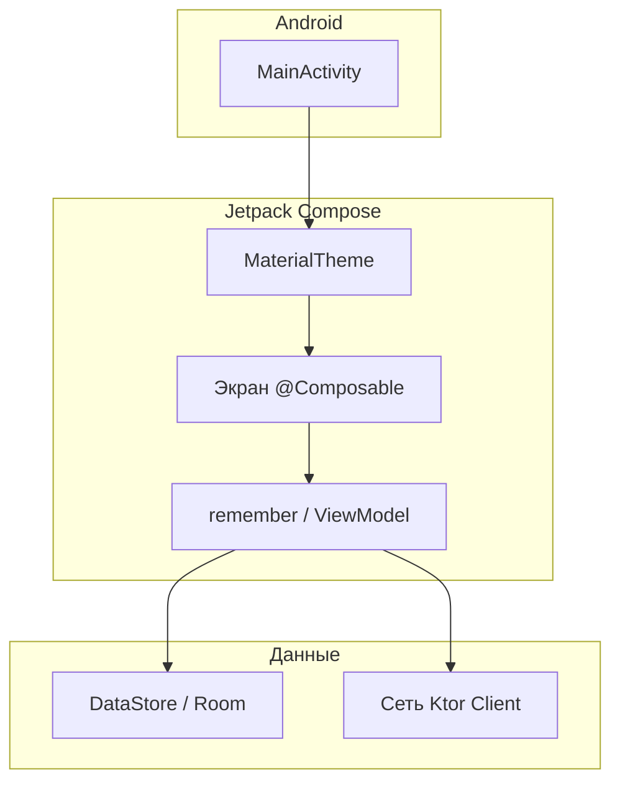

# Мобильные приложения на Kotlin

  ОБЯЗАТЕЛЬНО
  ДЛЯ НОВИЧКОВ

Разработчику
Архитектору

---

## Мобильные приложения на Kotlin

**Kotlin** с **2019** года — язык, который Google рекомендует для новых Android-проектов. Это не отдельная платформа: приложение всё равно работает на **Android Runtime (ART)**, использует **Activity**, жизненный цикл экрана и магазин Google Play — но исходный код пишется лаконичнее и безопаснее, чем на Java.

В **разделе Kotlin** этой энциклопедии собран **языковой маршрут** — Compose, ViewModel, корутины, DataStore. Общая дисциплина "мобильная разработка" (ограничения батареи, сенсор, подпись APK, сравнение Flutter и React Native) живёт в [разделе "Мобильные приложения"](/encyclopedia/4-code-dev/4-12-mobilnye-prilozheniya/intro).

Развёрнутый обзор Kotlin именно на Android — [Kotlin в мобильных приложениях](/encyclopedia/4-code-dev/4-12-mobilnye-prilozheniya/1135): Activity, Jetpack, MVVM, nullable-типы и первый проект в Android Studio.

---

## Словарь терминов

| Термин | Простыми словами |
|--------|------------------|
| **Activity** | "Окно" приложения на Android; точка входа экрана, управляет жизненным циклом. |
| **Jetpack Compose** | UI на Kotlin-функциях `@Composable` вместо XML-макетов. |
| **ViewModel** | Объект, переживающий поворот экрана; хранит данные и логику экрана. |
| **StateFlow** | Поток "последнее значение состояния" для подписки из UI. |
| **Корутина** | Легковесная асинхронная задача; таймер игры или запись на диск не блокируют UI. |
| **DataStore** | Современная замена SharedPreferences для ключ–значение на диске. |
| **Room** | Локальная SQL-база с ORM поверх SQLite. |
| **Gradle (KTS)** | Система сборки; версии SDK и библиотек задаются в `build.gradle.kts`. |
| **APK / AAB** | Файл установки; AAB — формат для загрузки в Google Play. |

Подробнее про Activity и Compose — [Jetpack Compose — первый экран](./229.md). Про процессы и потоки — [асинхронность](/encyclopedia/4-code-dev/4-05-asinhronnost/1), про корутины — [Корутины в Kotlin](./222.md).

---

## Стек учебного Android-приложения

Современный "минимальный продуктовый" стек Google выглядит так:

| Слой | Технология | Зачем |
|------|------------|-------|
| Язык | Kotlin | Официальный стандарт Android, null-safety, корутины из коробки |
| UI | **Jetpack Compose** | Декларативный интерфейс: описываете состояние — фреймворк перерисовывает экран |
| Состояние экрана | `remember` / **ViewModel** + **StateFlow** | Пережить поворот телефона, отделить логику от отрисовки |
| Фоновая работа | **Корутины** | Таймеры, сеть, запись на диск без ANR |
| Локальные данные | **DataStore** или **Room** | Настройки и простые модели / полноценные таблицы |
| Сборка | Gradle (KTS) | Зависимости, `minSdk`, release-сборка |

**Когда что выбирать**

- Один экран, одно число, нет сети — достаточно `rememberSaveable` ([KotlinMobileApp](./22.md)).
- Игра с таймером и сохранением — ViewModel + DataStore + корутины ([Kotlinochi](./23.md)).
- Список заметок с поиском — Room + ViewModel ([Room, ViewModel и Compose — список заметок](./231.md)).

База Compose — [Jetpack Compose — первый экран](./229.md). Асинхронность — [корутины](./222.md) и [Flow](./226.md).

---

## Два учебных проекта

Эталонные репозитории на диске (можно открыть в Android Studio и сверять diff):

| Проект | Путь | Тип | Чему учит |
|--------|------|-----|-----------|
| **KotlinMobileApp** | `F:\Projects\JVM\Kotlin\KotlinMobileApp` | Простое приложение | Compose, `rememberSaveable`, Material3, `strings.xml` |
| **Kotlinochi** | `F:\Projects\JVM\Kotlin\Kotlinochi` | Игра-тамагочи | MVVM, DataStore, корутины, игровой цикл показателей, Canvas |

| Практикум | Статья | Время |
|-----------|--------|-------|
| Счётчик — первое приложение | [KotlinMobileApp](./22.md) | 1–2 ч |
| Тамагочи "Коточи" | [Kotlinochi](./23.md) | 3–5 ч |

  
С чего начать

  

  Если Compose ещё не открывали — сначала <a href="./229">первый экран Compose</a>, затем <a href="./22.md">KotlinMobileApp</a>. Для игры с сохранением и таймером — <a href="./23.md">Kotlinochi</a> после <a href="./222">корутин</a> и <a href="./226">Flow</a>.
  

---

## Рекомендуемый маршрут

| Шаг | Материал | Что получите |
|-----|----------|--------------|
| 1 | [Первая программа](./2.md) + [Compose](./229.md) | Hello World в эмуляторе |
| 2 | [Kotlin в мобильных](/encyclopedia/4-code-dev/4-12-mobilnye-prilozheniya/1135) | Activity, Jetpack, MVVM, nullable |
| 3 | [Практикум KotlinMobileApp](./22.md) | Счётчик с кнопкой, переживает поворот |
| 4 | [Корутины](./222.md) → [Flow](./226.md) | `viewModelScope`, `StateFlow`, `collectAsState` |
| 5 | [Практикум Kotlinochi](./23.md) | Игра с DataStore и decay-циклом |
| 6 | [Сборка APK](/encyclopedia/4-code-dev/4-12-mobilnye-prilozheniya/112) → [публикация](/encyclopedia/4-code-dev/4-12-mobilnye-prilozheniya/1141) | Установка на свой телефон |

После шага 5 логично прочитать [Room + ViewModel](./231.md) — тот же паттерн, но с SQL вместо key-value.

---

## Kotlin и другие мобильные стеки

| Критерий | Kotlin + Compose | Flutter | React Native |
|----------|------------------|---------|--------------|
| Платформы | Android (iOS — через KMP отдельно) | iOS + Android одним кодом | iOS + Android |
| Язык UI | Kotlin | Dart | JavaScript / TypeScript |
| Вид UI | Нативные Material-компоненты | Свои виджеты, единый стиль | Мост к нативным view |
| Когда выбирать | Целевой Android, стек Google | Один код на две ОС, свой дизайн | Уже есть React-команда |

**Практические следствия**

- **Kotlin + Compose** — максимальная интеграция с Android (уведомления, фоновые сервисы, Play Billing) без "моста".
- **Flutter** — быстрее вывести один UI на iOS и Android; см. [Flutter](/encyclopedia/5-languages/5-22-dart/311).
- **React Native** — переиспользование навыков веб-React; см. [Первая программа на React Native](/encyclopedia/4-code-dev/4-12-mobilnye-prilozheniya/11311).

Сравнение сложности сборки — [Сборка и развёртывание мобильных приложений](/encyclopedia/4-code-dev/4-12-mobilnye-prilozheniya/112). AAA-игры на **Unity / Unreal** — [раздел "Разработка игр"](/encyclopedia/9-spinoff/9-04-razrabotka-igr/122). **Kotlinochi** — учебная **2D-игра на Compose**, не игровой движок: весь код на Kotlin, без C# и без редактора сцен.

---

## Как устроено типичное Compose-приложение

- **Activity** создаётся системой, вызывает `setContent { … }` — дальше живёт дерево Composable.
- **Recomposition** — при изменении `State` Compose перерисовывает только затронутые виджеты ([Jetpack Compose — первый экран](./229.md)).
- **ViewModel** переживает поворот: Activity уничтожается, ViewModel — нет (пока процесс жив).

---

### Частые ошибки

| Симптом | Вероятная причина | Куда смотреть |
|---------|-------------------|---------------|
| Счётчик сбрасывается при повороте | `remember` вместо `rememberSaveable` или нет ViewModel | [Jetpack Compose — первый экран](./229.md), [KotlinMobileApp](./22.md) |
| ANR "приложение не отвечает" | Диск или сеть в main thread | [Корутины в Kotlin](./222.md), `viewModelScope` |
| Gradle не видит Compose | Нет `buildFeatures { compose = true }` или BOM | [KotlinMobileApp, этап 0](./22.md#stage-0) |
| `INSTALL_FAILED` на телефоне | Debug-подпись, старая версия, USB-отладка | [Отладка по USB на Android](/encyclopedia/4-code-dev/4-12-mobilnye-prilozheniya/1121) |
| Статы игры не сохраняются | Нет `repository.save` после изменения | [Kotlinochi, этап 3](./23.md#stage-3) |

---

### Что попробовать

1. Пройти [KotlinMobileApp](./22.md) и вынести все строки в `strings.xml` + добавить `values-en`.
2. В Kotlinochi уменьшить `DECAY_INTERVAL_MS` до 5 секунд и наблюдать offline decay после сворачивания приложения.
3. Собрать debug APK и установить по USB — [Отладка по USB на Android](/encyclopedia/4-code-dev/4-12-mobilnye-prilozheniya/1121).
4. Сравнить [KotlinMobileApp](./22.md) (без ViewModel) и [Kotlinochi](./23.md) (полный MVVM) — один и тот же Compose, разная глубина архитектуры.

---
