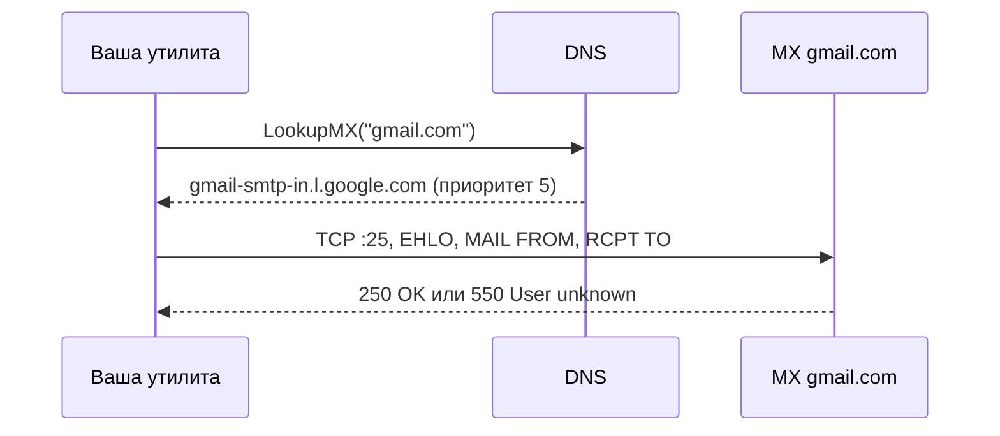
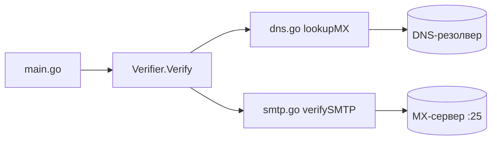

# GoEmailVerifier — практикум

<span class="complexity-badge">Разработчику</span>
<span class="complexity-badge">Начальный уровень</span>

См. также: [Первая программа](./24.md) · [TCP и UDP](./27.md) · [Тестирование](./192.md) · [CLI на cobra](./33.md) · [GoHTMLParser](./211.md).

---

## О практикуме

**GoEmailVerifier** — консольная утилита, которая отвечает на вопрос "можно ли доставить письмо на этот адрес?" без отправки самого письма. Проверка идёт в три слоя:

1. **Синтаксис** — строка похожа на email (`user@domain.tld`).
2. **DNS** — у домена есть MX-записи, указывающие на почтовые серверы.
3. **SMTP** — один из MX-серверов принимает или отклоняет адрес через команду `RCPT TO`.

Проект целиком на **стандартной библиотеке Go**: `flag`, `net`, `net/smtp`, `regexp`, `testing`. Сторонних зависимостей нет — весь код собирается по шагам на [этапах 0–6](#stage-0) ниже.

Соседний [GoHTMLParser](./211.md) — другой сетевой сценарий (HTTP GET и парсинг HTML), но та же идея "маленькая CLI-утилита на stdlib".

<div class="callout callout--info">
  <div class="callout-title">Для кого материал</div>

  <div class="callout-body">
  Нужны Go 1.22+, пройденная <a href="/encyclopedia/5-languages/5-10-go/24">первая программа</a> и базовое понимание <a href="/encyclopedia/5-languages/5-10-go/191">обработки ошибок</a>. Сеть — <a href="/encyclopedia/5-languages/5-10-go/27">TCP и UDP</a>; модули — <a href="/encyclopedia/5-languages/5-10-go/29">go mod</a>; тесты — <a href="/encyclopedia/5-languages/5-10-go/192">статья про testing</a>.
  </div>
</div>

---

## Ключевые термины

| Термин | Простыми словами |
|--------|------------------|
| **Email** | Адрес вида `локальная_часть@домен`; локальная часть — имя ящика, домен — зона, где ищут почтовые серверы |
| **DNS** | Система имён: по домену `gmail.com` возвращает записи разных типов (A, MX, TXT…) |
| **MX-запись** | Mail eXchange — "куда слать почту для этого домена"; у записи есть **приоритет** (меньше число — важнее сервер) |
| **SMTP** | Протокол передачи почты между серверами; работает поверх **TCP**, обычно порт **25** |
| **RCPT TO** | SMTP-команда "кому письмо"; сервер отвечает OK или кодом ошибки (например 550) |
| **Null-sender** | Пустой отправитель в `MAIL FROM <>` — часто используют при проверке без реальной отправки |
| **CLI** | Command Line Interface — программа, которой передают аргументы и флаги в терминале |

Теория протоколов на уровне интеграций — [HTTP как основа веб-интеграций](/encyclopedia/2-system-network/2-09-osnovy-integratsionnogo-vzaimodeystviya/118); здесь мы опускаемся на уровень TCP и прикладного SMTP.

---

## Как устроена доставка почты

Когда вы отправляете письмо с `you@yourmail.com` на `friend@gmail.com`, происходит примерно следующее:



- **DNS** не знает, существует ли конкретный ящик — только где искать почтовый сервер домена.
- **SMTP** может сказать "ящик есть" или "нет", но многие серверы **намеренно** не раскрывают это незнакомым IP (anti-harvesting).
- Утилита **учебная**: она показывает работу `net.LookupMX`, `net/smtp` и обработку ошибок в Go, а не продуктовую верификацию базы контактов.

<div class="callout callout--warning">
  <div class="callout-title">Ограничения SMTP-проверки</div>

  <div class="callout-body">
  Многие почтовые серверы не отвечают на RCPT TO с чужих IP или всегда возвращают "OK". Порт <strong>25</strong> часто закрыт у домашних провайдеров. Результат "вероятно существует" — не юридическое доказательство доставляемости.
  </div>
</div>

---

## Чему научитесь

После практикума вы сможете:

- инициализировать [Go-модуль](/encyclopedia/5-languages/5-10-go/29) и собрать один бинарник через `go build`;
- разложить код по файлам одного пакета `main` без преждевременного усложнения;
- вызывать DNS из Go и интерпретировать MX-записи;
- установить TCP-соединение с таймаутом и пройти минимальный SMTP-диалог;
- описать результат проверки структурой с полем-указателем (`*bool` для трёх состояний);
- принять аргументы через [пакет `flag`](/encyclopedia/5-languages/5-10-go/2411) и вернуть ненулевой **exit code**;
- написать [table-driven тест](/encyclopedia/5-languages/5-10-go/192) для чистых функций.

---

## Архитектура проекта

| Файл | Роль |
|------|------|
| `main.go` | CLI — флаги `-timeout`, `-mx`, вывод результата, код выхода |
| `verifier.go` | Структура `Result`, тип `Verifier`, метод `Verify`, `ParseDomain`, `PrintMX` |
| `dns.go` | `lookupMX` — DNS-запрос и сортировка MX по приоритету |
| `smtp.go` | `verifySMTP` — TCP, EHLO, MAIL FROM, RCPT TO |
| `verifier_test.go` | Table-driven тесты regex и `ParseDomain` |



Почему не один файл? Каждый слой (CLI, оркестрация, DNS, SMTP) меняется по своим причинам — так проще читать и тестировать. Пока всё в `package main`; выделение в `internal/` имеет смысл, когда появятся переиспользуемые пакеты — см. [GoHTMLParser](./211.md).

Для одной команды и двух флагов достаточно `flag` из stdlib. Дерево подкоманд, конфиг из YAML и shell completion — [CLI на cobra и viper](./33.md).

---

## Как проходить практикум

1. Создайте каталог и выполните `go mod init` ([этап 0](#stage-0)).
2. Идите по этапам 0–6 ниже — после каждого шага запускайте `go run .` или `go test`.
3. На этапе 2 проверьте `-mx google.com` — в терминале должен появиться список MX с приоритетами.
4. На этапе 5 соберите бинарник `go build -o email-verifier .` и вызовите `user@gmail.com`.
5. Отметьте пункты "Самопроверка" в конце каждого этапа.
6. Если SMTP падает по timeout — это нормально для домашней сети; DNS-часть (`-mx`) всё равно должна работать.

---

## Карта этапов

| Этап | Фокус | Результат |
|------|--------|-----------|
| 0 | Модуль Go | Каталог с `go.mod`, первый запуск |
| 1 | Модель данных | `Result`, regex, `NewVerifier` |
| 2 | DNS | `lookupMX` в `dns.go`, команда `PrintMX` |
| 3 | SMTP | `verifySMTP` в `smtp.go` |
| 4 | Verifier | Полный `Verify`, `ParseDomain`, вывод |
| 5 | CLI | `main.go` с `flag` и exit code |
| 6 | Тесты | `verifier_test.go`, `go test` |

---

<span id="stage-0"></span>
## Этап 0 — модуль и каркас

**Цель** — рабочий Go-модуль с одним файлом и командой `go run`.

### Теория

**Go-модуль** — каталог с файлом `go.mod`, в котором указаны имя модуля и версия Go. С Go 1.16+ модули — стандартный способ организации проекта; старый `$GOPATH` для новых учебных проектов не нужен. Подробнее — [Модули и go mod](./29.md), [Первая программа](./24.md).

Пакет **`main`** — единственный, из которого собирается исполняемый файл. Функция **`func main()`** — точка входа, аналог `public static void main` в Java, но без класса-обёртки — см. [package main и func main()](./40.md).

### Команды

```bash
mkdir email-verifier && cd email-verifier
go mod init github.com/you/email-verifier
```

- `mkdir` создаёт каталог проекта.
- `go mod init` записывает в `go.mod` путь модуля (здесь вымышленный `github.com/you/...` — для локальной учебной работы подойдёт любой уникальный путь).

Создайте `main.go`:

```go
package main

import "fmt"

func main() {
	fmt.Println("GoEmailVerifier — заготовка")
}
```

Запуск:

```bash
go run .
```

Точка `.` означает "текущий модуль" — Go найдёт все `.go` файлы пакета `main` и скомпилирует их.

### Разбор `main.go`

| Строка | Смысл |
|--------|--------|
| `package main` | Исполняемый пакет; имя `main` — требование toolchain |
| `import "fmt"` | Подключение пакета форматированного вывода из stdlib |
| `func main()` | Начало выполнения программы |

### Самопроверка

- [ ] `go version` показывает Go 1.22+.
- [ ] В каталоге есть `go.mod` и `main.go`.
- [ ] `go run .` печатает заготовку без ошибок.

---

<span id="stage-1"></span>
## Этап 1 — `Result` и проверка формата

**Цель** — описать результат проверки структурой и отсечь заведомо неверный синтаксис email.

### Теория

**Валидация email** в продакшене обычно двухуровневая. Общая таблица проверок — [Проверка и валидация](/encyclopedia/4-code-dev/4-14-razrabotka-i-otladka/118).

- **Синтаксис** — строка соответствует шаблону (быстро, офлайн).
- **Доставляемость** — домен принимает почту, ящик может существовать (медленно, нужна сеть).

На этом этапе делаем только синтаксис. Полный RFC 5322 разбирать не будем — для учебного проекта достаточно **regexp**, который отсекает явный мусор (`@`, пробелы, отсутствие домена). Работа со строками — [Строки, руны и Unicode](./26.md).

Поле **`Exists *bool`** — указатель на `bool`, а не сам `bool`. Так в Go кодируют **три состояния**:

| Значение `Exists` | Интерпретация |
|-------------------|---------------|
| `nil` | SMTP ещё не вызывали или не удалось получить ответ |
| `&true` | Сервер принял `RCPT TO` |
| `&false` | Сервер явно отклонил адрес |

Обычный `bool` не различает "false" и "не проверяли" — оба дают `false`.

### Код

Создайте `verifier.go`:

```go
package main

import (
	"regexp"
	"strings"
	"time"
)

var emailRegex = regexp.MustCompile(`^[a-zA-Z0-9._%+\-]+@[a-zA-Z0-9.\-]+\.[a-zA-Z]{2,}$`)

// Result — результат проверки одного адреса.
type Result struct {
	Email  string
	Valid  bool   // синтаксис корректен
	Exists *bool  // nil — не удалось проверить через SMTP
	Domain string
	MXHost string
	Detail string
	Error  error
}

// Verifier проверяет email через DNS (MX) и SMTP (RCPT TO).
type Verifier struct {
	Timeout time.Duration
}

func NewVerifier(timeout time.Duration) *Verifier {
	return &Verifier{Timeout: timeout}
}

func (v *Verifier) Verify(email string) Result {
	email = strings.TrimSpace(strings.ToLower(email))
	result := Result{Email: email}

	if !emailRegex.MatchString(email) {
		result.Detail = "некорректный формат email"
		return result
	}
	result.Valid = true

	parts := strings.SplitN(email, "@", 2)
	result.Domain = parts[1]
	result.Detail = "синтаксис OK (DNS/SMTP — на следующих этапах)"
	return result
}
```

Временно измените `main.go`:

```go
package main

import (
	"fmt"
	"time"
)

func main() {
	v := NewVerifier(15 * time.Second)
	fmt.Printf("%+v\n", v.Verify("User@Example.COM"))
	fmt.Printf("%+v\n", v.Verify("not-an-email"))
}
```

### Разбор `Verify` на этапе 1

| Фрагмент | Зачем |
|----------|--------|
| `regexp.MustCompile` | Компиляция шаблона **один раз** при старте; при ошибке в паттерне — panic (допустимо для константы) |
| `TrimSpace` + `ToLower` | Нормализация ввода: ` User@Mail.COM ` → `user@mail.com` |
| `SplitN(..., "@", 2)` | Ровно одно разбиение — локальная часть может содержать редкие символы, домен — `parts[1]` |
| `return result` без `Error` | Некорректный формат — не exception, а часть доменной модели ([ошибки в Go](./191.md)) |

### Самопроверка

- [ ] `User@Example.COM` → `Valid: true`, домен `example.com`, регистр нормализован.
- [ ] `not-an-email` → `Valid: false`, `Detail` про формат.
- [ ] `Exists` пока всегда `nil`.

---

<span id="stage-2"></span>
## Этап 2 — DNS MX lookup

**Цель** — по домену получить список почтовых серверов и вывести их с приоритетами.

### Теория

**DNS** (Domain Name System) переводит имена в данные. Для почты нужен тип записи **MX** (Mail eXchange). У каждой MX-записи два поля:

- **Host** — hostname сервера (часто с точкой в конце, например `gmail-smtp-in.l.google.com.`).
- **Pref** (preference) — приоритет; сервер с **меньшим** числом пробуют первым.

Если MX нет — домен, скорее всего, не принимает почту по SMTP (или использует A-запись как fallback, что мы здесь не разбираем).

В Go DNS вызывают через пакет **`net`**: `net.LookupMX(domain)` — блокирующий вызов с резолвером ОС. Это тот же уровень стека, что и TCP-сокеты — [TCP и UDP в Go](./27.md).

### Код

Создайте `dns.go`:

```go
package main

import (
	"fmt"
	"net"
	"sort"
)

// lookupMX находит MX-записи домена через DNS и сортирует их по приоритету.
func lookupMX(domain string) ([]*net.MX, error) {
	mxRecords, err := net.LookupMX(domain)
	if err != nil {
		return nil, fmt.Errorf("DNS MX lookup: %w", err)
	}
	if len(mxRecords) == 0 {
		return nil, fmt.Errorf("MX-записи для домена %q не найдены", domain)
	}

	sort.Slice(mxRecords, func(i, j int) bool {
		return mxRecords[i].Pref < mxRecords[j].Pref
	})

	return mxRecords, nil
}
```

Добавьте в `verifier.go` функцию `PrintMX` и импорт `"fmt"`:

```go
// PrintMX выводит MX-записи домена (для демонстрации работы DNS).
func PrintMX(domain string) error {
	records, err := lookupMX(domain)
	if err != nil {
		return err
	}
	fmt.Printf("MX-записи для %s:\n", domain)
	for _, mx := range records {
		fmt.Printf("  приоритет %d → %s\n", mx.Pref, strings.TrimSuffix(mx.Host, "."))
	}
	return nil
}
```

Проверка из `main.go`:

```go
func main() {
	if err := PrintMX("google.com"); err != nil {
		fmt.Println("ошибка:", err)
	}
}
```

### Разбор `lookupMX`

| Строка | Смысл |
|--------|--------|
| `net.LookupMX` | Запрос к DNS; при NXDOMAIN или сетевой ошибке — `err != nil` |
| `fmt.Errorf("...: %w", err)` | Обёртка ошибки — цепочка причин, идиома Go ([191.md](./191.md)) |
| `len(mxRecords) == 0` | Технически редкий случай, но явная проверка лучше пустого цикла |
| `sort.Slice` + `Pref` | Сортировка in-place; первый элемент — самый приоритетный MX |
| `TrimSuffix(mx.Host, ".")` | DNS часто возвращает FQDN с trailing dot — для вывода и SMTP убираем |

### Пример вывода

Для `google.com` вы увидите несколько строк с разными приоритетами — это нормально: у крупных доменов несколько MX для отказоустойчивости.

### Самопроверка

- [ ] `PrintMX("google.com")` — список MX с приоритетами.
- [ ] `PrintMX("домен-которого-нет.invalid")` — понятная ошибка DNS.
- [ ] Функция возвращает `error`, а не паникует.

---

<span id="stage-3"></span>
## Этап 3 — SMTP-проверка

**Цель** — установить TCP-соединение с MX-сервером и узнать, принимает ли он адрес получателя.

### Теория

**SMTP** (Simple Mail Transfer Protocol) — текстовый протокол поверх TCP. Минимальный диалог для проверки ящика (без отправки тела письма):

1. **TCP connect** на порт 25 MX-хоста.
2. **EHLO** / **HELO** — представиться клиентом.
3. **MAIL FROM** — указать отправителя (мы используем пустой `<>` — null-sender).
4. **RCPT TO** — указать получателя; здесь сервер говорит, есть ящик или нет.
5. **QUIT** — завершить сессию. Команду **DATA** не вызываем — письмо не отправляем.

Типичные коды ответа:

| Код | Частый смысл |
|-----|--------------|
| 250 | Команда принята |
| 550 | Mailbox unavailable — ящик не найден или недоступен |
| 551 | User not local |
| 553 | Mailbox name not allowed |

Пакет **`net/smtp`** в stdlib инкапсулирует отправку команд; низкоуровневый сокет — **`net.DialTimeout`** из [статьи про TCP](./27.md).

### Код

Создайте `smtp.go`:

```go
package main

import (
	"fmt"
	"net"
	"net/smtp"
	"strings"
	"time"
)

// verifySMTP подключается к почтовому серверу и проверяет адрес через RCPT TO.
func verifySMTP(mxHost, email string, timeout time.Duration) (exists bool, detail string, err error) {
	host := strings.TrimSuffix(mxHost, ".")
	addr := net.JoinHostPort(host, "25")

	conn, err := net.DialTimeout("tcp", addr, timeout)
	if err != nil {
		return false, "", fmt.Errorf("TCP-соединение с %s: %w", addr, err)
	}
	defer conn.Close()

	if err := conn.SetDeadline(time.Now().Add(timeout)); err != nil {
		return false, "", err
	}

	client, err := smtp.NewClient(conn, host)
	if err != nil {
		return false, "", fmt.Errorf("SMTP-клиент: %w", err)
	}
	defer client.Close()

	if err := client.Hello("email-verifier.local"); err != nil {
		return false, "", fmt.Errorf("EHLO/HELO: %w", err)
	}

	// Отправитель для проверки — типичный null-sender.
	if err := client.Mail(""); err != nil {
		return false, "", fmt.Errorf("MAIL FROM: %w", err)
	}

	if err := client.Rcpt(email); err != nil {
		return false, parseSMTPError(err), nil
	}

	_ = client.Quit()
	return true, "сервер принял RCPT TO", nil
}

func parseSMTPError(err error) string {
	msg := err.Error()
	if strings.Contains(msg, "550") {
		return "адрес не существует (550)"
	}
	if strings.Contains(msg, "551") {
		return "адрес не локален для сервера (551)"
	}
	if strings.Contains(msg, "553") {
		return "некорректный адрес (553)"
	}
	return msg
}
```

### Разбор `verifySMTP`

| Шаг | Код | Зачем |
|-----|-----|--------|
| Адрес | `JoinHostPort(host, "25")` | Корректная склейка host:port с учётом IPv6 |
| Таймаут connect | `DialTimeout` | Не зависнуть, если MX не отвечает |
| Дедлайн сессии | `SetDeadline` | Ограничить весь обмен, не только connect |
| Освобождение | `defer conn.Close()` | Закрыть сокет при любом выходе из функции |
| Приветствие | `Hello("email-verifier.local")` | Имя клиента для логов сервера |
| Ошибка RCPT | `return false, parse..., nil` | Ответ "ящик не найден" — **не** transport error, а бизнес-результат |
| Успех | `return true, "...", nil` | Сервер принял получателя |

<div class="callout callout--tip">
  <div class="callout-title">Порт 25</div>

  <div class="callout-body">
  Если на этапе 4 появляется <code>connection timed out</code> — проверьте, не блокирует ли провайдер исходящий порт 25. Флаг <code>-mx</code> (этап 5) работает без SMTP. Для экспериментов подойдёт VPS или корпоративная сеть с открытым 25.
  </div>
</div>

### Самопроверка

- [ ] `go build .` — компиляция без ошибок.
- [ ] Понимаете разницу между `err != nil` (сеть, протокол) и `exists == false` (SMTP-код 550).

---

<span id="stage-4"></span>
## Этап 4 — оркестрация `Verify`

**Цель** — связать синтаксис, DNS и SMTP в один метод и красиво вывести результат.

### Теория

**Оркестрация** — функция верхнего уровня задаёт порядок шагов и правила fallback:

- синтаксис неверен → дальше не идём;
- DNS не ответил → фиксируем `Error`, SMTP не вызываем;
- первый MX недоступен → пробуем следующий по приоритету;
- один MX ответил на RCPT → возвращаем результат и не опрашиваем остальных.

`ParseDomain` понадобится CLI-флагу `-mx`: пользователь может передать и `google.com`, и `user@gmail.com` — утилита извлечёт домен.

### Код `Verify`

Замените метод `Verify` в `verifier.go`:

```go
func (v *Verifier) Verify(email string) Result {
	email = strings.TrimSpace(strings.ToLower(email))
	result := Result{Email: email}

	if !emailRegex.MatchString(email) {
		result.Detail = "некорректный формат email"
		return result
	}
	result.Valid = true

	parts := strings.SplitN(email, "@", 2)
	result.Domain = parts[1]

	mxRecords, err := lookupMX(result.Domain)
	if err != nil {
		result.Error = err
		result.Detail = err.Error()
		return result
	}

	var lastErr error
	for _, mx := range mxRecords {
		host := strings.TrimSuffix(mx.Host, ".")
		exists, detail, err := verifySMTP(host, email, v.Timeout)
		if err != nil {
			lastErr = err
			continue
		}

		result.MXHost = host
		result.Exists = &exists
		result.Detail = detail
		return result
	}

	result.Error = lastErr
	if lastErr != nil {
		result.Detail = fmt.Sprintf("не удалось связаться ни с одним MX: %v", lastErr)
	} else {
		result.Detail = "нет доступных MX-серверов"
	}
	return result
}
```

### Код `ParseDomain`

```go
// ParseDomain извлекает домен из email или возвращает строку как есть.
func ParseDomain(input string) (string, error) {
	input = strings.TrimSpace(input)
	if strings.Contains(input, "@") {
		parts := strings.SplitN(input, "@", 2)
		if len(parts[1]) == 0 {
			return "", fmt.Errorf("домен не указан")
		}
		return parts[1], nil
	}
	if net.ParseIP(input) != nil {
		return "", fmt.Errorf("ожидается домен или email, не IP")
	}
	return input, nil
}
```

Добавьте `"net"` в import `verifier.go`.

### Вывод результата

В `main.go` (временно, до этапа 5):

```go
func main() {
	v := NewVerifier(15 * time.Second)
	printResult(v.Verify("user@gmail.com"))
}

func printResult(r Result) {
	fmt.Printf("Email:  %s\n", r.Email)
	fmt.Printf("Формат: %s\n", yesNo(r.Valid))
	if r.Domain != "" {
		fmt.Printf("Domain: %s\n", r.Domain)
	}
	if r.MXHost != "" {
		fmt.Printf("MX:     %s\n", r.MXHost)
	}
	switch {
	case r.Exists == nil:
		fmt.Printf("SMTP:   не проверен (%s)\n", r.Detail)
	case *r.Exists:
		fmt.Printf("SMTP:   вероятно существует (%s)\n", r.Detail)
	default:
		fmt.Printf("SMTP:   не существует (%s)\n", r.Detail)
	}
	if r.Error != nil {
		fmt.Printf("Ошибка: %v\n", r.Error)
	}
}

func yesNo(v bool) string {
	if v {
		return "корректный"
	}
	return "некорректный"
}
```

### Разбор цикла по MX

| Ситуация | Поведение |
|----------|-----------|
| `verifySMTP` вернул `err != nil` | Запоминаем в `lastErr`, `continue` — пробуем следующий MX |
| `verifySMTP` вернул `exists == false` | Это **ответ сервера**, не сбой сети — сразу `return result` |
| Все MX недоступны | `Exists` остаётся `nil`, в `Detail` текст про недоступность |
| `switch` в `printResult` | Три ветки для `*bool` — без dereference при `nil` |

Слово "вероятно" в выводе — намеренное: SMTP-проверка эвристическая, не доказательство.

### Самопроверка

- [ ] Валидный email — DNS находит MX; SMTP отвечает или timeout (зависит от сети).
- [ ] `@example.com` без локальной части — отсекается regex на этапе 1.
- [ ] `printResult` не паникует при `Exists == nil`.

---

<span id="stage-5"></span>
## Этап 5 — CLI с `flag`

**Цель** — принять аргументы из командной строки, добавить флаги и код выхода для скриптов.

### Теория

**CLI-утилита** в Unix-смысле — программа с:

- **positional arguments** — то, что остаётся после флагов (`email-verifier user@gmail.com`);
- **flags** — опции (`-mx`, `-timeout 30s`);
- **exit code** — 0 при успехе, ненулевой при ошибке (важно для shell и CI).

Пакет **`flag`** из stdlib достаточен для одной команды — так же устроены многие примеры в [Простых приложениях](./2411.md). Когда появятся подкоманды (`tool check`, `tool mx`) — [cobra и viper](./33.md).

`flag.Duration` понимает суффиксы Go: `30s`, `1m30s`, `500ms`.

### Код

Замените `main.go` финальной версией:

```go
package main

import (
	"flag"
	"fmt"
	"os"
	"time"
)

func main() {
	timeout := flag.Duration("timeout", 15*time.Second, "таймаут DNS/SMTP операций")
	mxOnly := flag.Bool("mx", false, "только показать MX-записи домена")
	flag.Parse()

	args := flag.Args()
	if len(args) == 0 {
		printUsage()
		os.Exit(1)
	}

	target := args[0]

	if *mxOnly {
		domain, err := ParseDomain(target)
		if err != nil {
			fmt.Fprintf(os.Stderr, "ошибка: %v\n", err)
			os.Exit(1)
		}
		if err := PrintMX(domain); err != nil {
			fmt.Fprintf(os.Stderr, "ошибка: %v\n", err)
			os.Exit(1)
		}
		return
	}

	v := NewVerifier(*timeout)
	result := v.Verify(target)

	printResult(result)

	if result.Error != nil || !result.Valid || (result.Exists != nil && !*result.Exists) {
		os.Exit(1)
	}
}

func printUsage() {
	fmt.Fprintf(os.Stderr, `Email Verifier Tool — проверка существования email через DNS (MX) и SMTP

Использование:
  email-verifier <email>           проверить адрес
  email-verifier -mx <domain>      показать MX-записи домена
  email-verifier -timeout 30s <email>

Примеры:
  email-verifier user@gmail.com
  email-verifier -mx google.com
  email-verifier -mx user@gmail.com

`)
}
```

### Сборка и запуск

```bash
go build -o email-verifier .
./email-verifier -mx google.com
./email-verifier user@gmail.com
echo $?   # код выхода: 0 или 1
```

`go build` создаёт **статически слинкованный** бинарник — на машине без установленного Go его можно запускать напрямую ([Первая программа](./24.md)).

### Разбор CLI

| Элемент | Назначение |
|---------|------------|
| `flag.Parse()` | Разобрать `os.Args`; после него — только positional args |
| `flag.Args()` | Слайс аргументов без флагов |
| `fmt.Fprintf(os.Stderr, ...)` | Сообщения об ошибках в stderr — stdout свободен для пайпов |
| `os.Exit(1)` | Сигнал ошибки вызывающему скрипту |
| Условие перед `Exit` | Невалидный формат, transport error или `Exists == false` — всё это "неуспех" |

### Самопроверка

- [ ] Без аргументов — usage в stderr и exit 1.
- [ ] `-mx google.com` — список MX, exit 0.
- [ ] `-timeout 5s` — более короткое ожидание SMTP.
- [ ] `go build` — один файл `email-verifier` (или `.exe` на Windows).

---

<span id="stage-6"></span>
## Этап 6 — table-driven тесты

**Цель** — автоматически проверить чистые функции без сети.

### Теория

**Unit-тест** в Go — файл `*_test.go`, функции `TestXxx(t *testing.T)`, запуск `go test`. **Table-driven** стиль — таблица кейсов в слайсе структур и цикл с `t.Run` — идиома языка ([Тестирование в Go](./192.md)).

Что тестируем:

- **regex** — детерминирован, не ходит в сеть;
- **`ParseDomain`** — чистая функция строк → строка/error.

Что **не** тестируем в unit-тестах без mock:

- `lookupMX` — реальный DNS;
- `verifySMTP` — живой MX на порту 25.

Для интеграционных тестов нужен стаб SMTP или build tag `integration` — за рамками базового практикума.

### Код

Создайте `verifier_test.go`:

```go
package main

import (
	"testing"
)

func TestEmailRegex(t *testing.T) {
	valid := []string{
		"user@example.com",
		"user.name+tag@sub.example.co.uk",
	}
	invalid := []string{
		"not-an-email",
		"@example.com",
		"user@",
		"user@.com",
	}

	for _, email := range valid {
		if !emailRegex.MatchString(email) {
			t.Errorf("expected valid: %q", email)
		}
	}
	for _, email := range invalid {
		if emailRegex.MatchString(email) {
			t.Errorf("expected invalid: %q", email)
		}
	}
}

func TestParseDomain(t *testing.T) {
	tests := []struct {
		input   string
		want    string
		wantErr bool
	}{
		{"user@gmail.com", "gmail.com", false},
		{"gmail.com", "gmail.com", false},
		{"user@", "", true},
	}

	for _, tt := range tests {
		got, err := ParseDomain(tt.input)
		if (err != nil) != tt.wantErr {
			t.Errorf("ParseDomain(%q) error = %v, wantErr %v", tt.input, err, tt.wantErr)
			continue
		}
		if got != tt.want {
			t.Errorf("ParseDomain(%q) = %q, want %q", tt.input, got, tt.want)
		}
	}
}
```

### Запуск

```bash
go test -v .
go test -cover .
```

### Разбор тестов

| Приём | Где |
|-------|-----|
| `package main` | Тесты видят неэкспортируемые `emailRegex`, `ParseDomain` |
| Два слайса valid/invalid | Простая таблица без лишней структуры для regex |
| `tests := []struct{...}` | Классический table-driven для `ParseDomain` |
| `(err != nil) != tt.wantErr` | Проверка "ожидали ли ошибку" одним сравнением |
| `t.Errorf` + `%q` | `%q` печатает строки в кавычках — видны пробелы |

### Самопроверка

- [ ] `go test` — все тесты зелёные.
- [ ] В каталоге пять файлов — `main.go`, `verifier.go`, `dns.go`, `smtp.go`, `verifier_test.go`.
- [ ] `-cover` показывает покрытие (SMTP-файлы будут с низким % — это ожидаемо).

---

## Что дальше

| Направление | Материал |
|-------------|----------|
| Подкоманды и YAML-конфиг | [CLI на cobra и viper](./33.md) |
| HTTP API вместо CLI | [Gin](./2412.md), [Веб на stdlib](./25.md) |
| Параллельная проверка списка адресов | [Горутины и каналы](./21.md) |
| Покрытие, mock SMTP | [Тестирование](./192.md) |
| Парсинг HTML по URL | [GoHTMLParser](./211.md) |

Идеи для самостоятельного расширения:

- читать адреса из файла (по одному на строку);
- флаг `-json` для машиночитаемого вывода;
- worker pool из N горутин для пакетной проверки;
- логирование через [`slog`](./29.md) вместо `fmt.Printf`.

---

### Частые ошибки

| Симптом | Вероятная причина | Решение |
|---------|-------------------|---------|
| `connection timed out` на SMTP | Порт 25 закрыт провайдером | `-mx` для DNS; другая сеть или VPS |
| `MX-записи не найдены` | Опечатка в домене или домен без почты | Проверьте домен через `nslookup -type=mx` |
| `undefined: lookupMX` | `dns.go` не в том пакете | Все файлы — `package main`, один каталог |
| Тесты не видят функции | Другой package в `*_test.go` | `package main`, не `main_test` |
| `flag provided but not defined` | Аргументы до `flag.Parse` | Сначала объявить флаги, потом `Parse()` |
| Паника при `*r.Exists` | Dereference при `nil` | `switch` с веткой `r.Exists == nil` |

---
