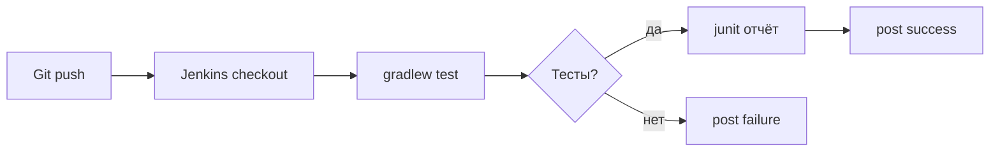

# Jenkins Pipeline — первый Jenkinsfile

<div class="article-tags">
  <span class="tag tag-required">ОБЯЗАТЕЛЬНО</span>
  <span class="tag tag-beginner">ДЛЯ НОВИЧКОВ</span>
</div>

<span class="complexity-badge">Разработчику</span>

---

## Jenkins Pipeline — первый Jenkinsfile

**CI/CD** — автоматизация сборки и доставки: при каждом push в Git сервер **собирает** проект, **запускает тесты** и (опционально) выкатывает артефакт.

**Jenkins** — один из популярных CI-серверов. Сценарий сборки хранят в файле **`Jenkinsfile`** в корне репозитория — это **Pipeline as Code**: изменения проходят code review, как обычный код.

Синтаксис Pipeline — **Groovy**, но API другой, чем в [Gradle DSL](./23.md): здесь ключевые слова `pipeline`, `stage`, `agent`, а не `dependencies` и `tasks`.

Groovy в pipeline: [основы § Jenkins](./11.md) · тесты: [Spock](./21.md) · Java-сборка: [Maven](/encyclopedia/5-languages/5-03-java/12).

---

### Что получится

При push Jenkins клонирует репозиторий, выполнит `./gradlew test`, опубликует результаты JUnit. Вы поймёте каждый блок минимального `Jenkinsfile`.

```bash
./gradlew test
```

---

## Термины

| Термин | Простыми словами |
|--------|------------------|
| **Job (задача)** | Настроенный пайплайн в Jenkins |
| **Agent (агент)** | Машина/контейнер, где выполняются шаги |
| **Stage (этап)** | Логический шаг: Checkout, Test, Deploy |
| **Step** | Одна команда внутри stage (`sh`, `echo`) |
| **Declarative pipeline** | Структурированный стиль `pipeline { stages { } }` |
| **SCM** | Source Control — Git в нашем случае |
| **Multibranch** | Отдельная сборка на каждую ветку с `Jenkinsfile` |

---

## Pipeline as Code и Freestyle

| Freestyle job (UI) | Pipeline as Code |
|--------------------|------------------|
| Настройка кликами в браузере | `Jenkinsfile` в Git, ревью в PR |
| Сложно воспроизвести на другой ветке | Одинаковый сценарий на feature и main |
| История изменений размыта | История в Git blame |

Для новых проектов команды обычно выбирают **Pipeline** или **Multibranch Pipeline**.

---

## Минимальный Jenkinsfile

Положите в **корень** репозитория:

```groovy
pipeline {
    agent any

    options {
        timestamps()
        timeout(time: 20, unit: 'MINUTES')
    }

    stages {
        stage('Checkout') {
            steps {
                checkout scm
            }
        }

        stage('Build & Test') {
            steps {
                sh './gradlew test --no-daemon'
            }
        }
    }

    post {
        always {
            junit '**/build/test-results/test/*.xml'
        }
        success {
            echo 'Сборка успешна'
        }
        failure {
            echo 'Сборка упала — смотрите лог stage'
        }
    }
}
```

---

### Разбор построчно

| Фрагмент | Смысл |
|----------|--------|
| `pipeline { }` | Корень declarative pipeline |
| `agent any` | Запуск на любом подключённом агенте с JDK и Git |
| `options { timestamps() }` | В логе — время каждой строки |
| `timeout(... 20 ... MINUTES)` | Убить зависшую сборку через 20 минут |
| `stage('Checkout')` | Этап 1: получить код |
| `checkout scm` | Git clone по настройкам job (URL, ветка) |
| `sh './gradlew test --no-daemon'` | Shell на Linux-агенте; `--no-daemon` — Gradle не оставляет фоновый процесс в CI |
| `post { always { junit ... } }` | После всех stage — загрузить XML тестов в Jenkins |
| `success` / `failure` | Действия при итоге сборки |

**Windows-агент:** вместо `sh` используйте `bat './gradlew.bat test --no-daemon'`.

---

### Maven вместо Gradle

```groovy
stage('Build & Test') {
    steps {
        sh 'mvn -B test'
    }
}
```

В `post` путь к Surefire:

```groovy
junit '**/target/surefire-reports/*.xml'
```

`-B` — batch mode Maven (меньше интерактива в логе).

---

## Подключение в Jenkins

1. **New Item** → имя → **Pipeline** (или **Multibranch Pipeline**).
2. В настройках: **Pipeline script from SCM**.
3. **SCM:** Git → URL репозитория, credentials при необходимости.
4. **Script Path:** `Jenkinsfile` (по умолчанию в корне).
5. **Save** → **Build Now**.

**Multibranch Pipeline** сам находит ветки и `Jenkinsfile` на каждой; удобно для GitFlow и PR из fork (с политикой безопасности).

Первый запуск может упасть, если в репозитории нет **`gradlew`** — wrapper нужно закоммитить вместе с проектом.

---

## Credentials (секреты)

Пароли, токены Docker Registry, ключи API **не пишут в открытом виде** в `Jenkinsfile`:

```groovy
environment {
    DOCKER_TOKEN = credentials('docker-hub-token-id')
}
```

| Шаг | Действие |
|-----|----------|
| Jenkins UI | **Manage Jenkins → Credentials** |
| Добавить | Secret text или Username + password |
| **ID** | Совпадает со строкой в `credentials('...')` |
| В pipeline | Переменная `DOCKER_TOKEN` подставится при сборке |

В логах Jenkins маскирует секреты, но случайный `echo "${DOCKER_TOKEN}"` в скрипте всё равно опасен — не печатайте секреты.

```bash
echo "${DOCKER_TOKEN}"
```

---

## Declarative и scripted

| Declarative | Scripted (`node { }`) |
|-------------|------------------------|
| Жёсткая структура `pipeline { stages { } }` | Произвольный Groovy-скрипт |
| Проще читать новичкам | Гибче, сложнее сопровождать |
| Внутри можно `script { }` | Весь файл — код |

Для старта — **declarative**. Сложную логику (циклы по модулям) иногда выносят в `script { }` внутри одного stage.

Пример declarative + Groovy:

```groovy
stage('Matrix') {
    steps {
        script {
            def branches = ['main', 'develop']
            branches.each { b ->
                echo "Checking branch ${b}"
            }
        }
    }
}
```

---

## Типичный поток сборки JVM-проекта



После зелёных тестов следующим stage часто добавляют `docker build` или деплой — это уже отдельные статьи DevOps.

```bash
docker build
```

---

### Частые ошибки

| Симптом | Причина |
|---------|---------|
| `gradlew: not found` | Нет wrapper в репо — выполните `gradle wrapper` и закоммитьте |
| JDK не той версии | **Global Tool Configuration** → JDK, или `tool name: 'jdk17'` в pipeline |
| `checkout` пустой | В job не настроен SCM (для Pipeline from SCM URL задаётся в job) |
| Тесты зелёные, job красный | Неверный glob в `junit '...'` |
| Spock не в отчёте | Путь к XML Gradle: `build/test-results/test/` |

[Spock](./21.md)-тесты попадают в тот же `./gradlew test`, отдельный шаг не нужен.

```bash
./gradlew test
```

---

### Что попробовать

1. Stage `Docker build` после тестов, если есть `Dockerfile`.

```bash
Docker build
```
2. `parallel { stage('Unit'){...} stage('Lint'){...} }` — параллельные этапы.
3. Webhook из GitHub/GitLab — сборка на каждый push без "Build Now".

---

### Дальше

[Spock](./21.md) · [Gradle DSL в Groovy](./23.md) · [DevOps](/encyclopedia/8-infra-security/8-04-devops-ci-cd/intro)

---

## Расширение Jenkinsfile для production-потока

После базового pipeline обычно добавляют:

- stage `Lint` до `Build & Test`;
- stage публикации артефакта (`publish`, `docker push`);
- ручное подтверждение перед production-деплоем;
- уведомления в чат о статусе.

```groovy
stage("Deploy approval") {
    steps {
        input message: "Подтвердите выкладку в production", ok: "Deploy"
    }
}
```

Этот шаг отделяет автоматическую сборку от управляемого релиза.

---

## Мини-чек-лист стабильности CI

1. Все зависимости фиксированы по версиям.
2. Секреты хранятся только в Jenkins Credentials.
3. В каждом stage есть понятное имя и четкая цель.
4. `post { always { junit ... } }` сохраняет отчеты даже при ошибках.
5. Таймауты стоят на pipeline и на долгих shell-командах.

Связанные статьи: [Gradle Groovy DSL](/encyclopedia/5-languages/5-12-groovy/23), [Spock](/encyclopedia/5-languages/5-12-groovy/21), [Работа с БД](/encyclopedia/5-languages/5-12-groovy/19) для миграционных шагов.

---

## Сквозной кейс — pipeline для каталога книг

Минимальный путь для каталога:

1. Сборка и тесты сервиса.
2. Публикация тест-отчета.
3. Условный деплой после ручного подтверждения.

```groovy
pipeline {
    agent any
    stages {
        stage("Test") {
            steps {
                sh "./gradlew test --no-daemon"
            }
        }
        stage("Approve") {
            steps {
                input message: "Выкатить каталог в production", ok: "Deploy"
            }
        }
    }
    post {
        always { junit "**/build/test-results/test/*.xml" }
    }
}
```

Эта схема связывает код, тесты и релиз в один повторяемый процесс.

Продолжение: [Gradle Groovy DSL](/encyclopedia/5-languages/5-12-groovy/23).

---
