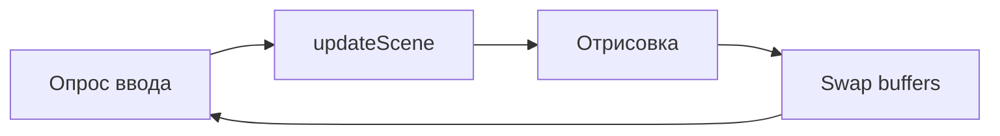

# FastJ — первая игра на Groovy

<div class="article-tags">
  <span class="tag tag-required">ОБЯЗАТЕЛЬНО</span>
  <span class="tag tag-beginner">ДЛЯ НОВИЧКОВ</span>
</div>

<span class="complexity-badge">Разработчику</span>

---

## FastJ — первая игра на Groovy

**FastJ** — открытый кроссплатформенный **игровой движок** на JVM ([fastjengine/FastJ](https://github.com/fastjengine/FastJ)). Он берёт на себя окно, игровой цикл, отрисовку 2D-графики, ввод с клавиатуры и мыши, базовую работу со звуком. Исходники игры вы пишете на **Java**, **Kotlin** или **Groovy** — движок один и тот же.

Для раздела Groovy FastJ важен по двум причинам:

- показывает, что язык годится не только для [Gradle](./23.md) и [Jenkins](./22.md), но и для **интерактивных приложений**;
- шаблон на Groovy использует тот же **Gradle Groovy DSL**, что и JVM-проекты из [первой программы](./2.md).

FastJ **не конкурирует** с Unity или Godot. Это лёгкий движок для учебных и небольших 2D-игр с понятным API. Сравнение игрового подхода на Python — [практикум Pygame](/encyclopedia/9-spinoff/9-04-razrabotka-igr/praktikum-razrabotki-igr/intro). Общая теория игрового цикла — [разработка игр](/encyclopedia/9-spinoff/9-04-razrabotka-igr/intro).

---

### Что получится

После прохождения статьи у вас будет:

- клонированный [FastJ Groovy Template](https://github.com/fastjengine/fastj-groovy-template);
- запуск `./gradlew run` и понимание классов `Game` и `MainScene`;
- представление о **delta time** и почему без него движение "дёргается";
- при желании — JAR или нативный launcher через плагин `org.beryx.runtime`.

```bash
./gradlew run
```

---

## Определения

| Термин | Определение |
|--------|-------------|
| **Игровой движок** | Библиотека, которая управляет окном, временем, вводом и отрисовкой; вы описываете **логику** и **объекты**, а не низкоуровневый OpenGL вручную |
| **Game** | Точка входа JVM: инициализирует FastJ и передаёт первую сцену |
| **Scene (сцена)** | Экран или уровень — контейнер `GameObject` и логики кадра |
| **GameObject** | Сущность на сцене (игрок, враг, кнопка UI) с **transform** (позиция, поворот, масштаб) |
| **Shape / Sprite** | Визуальная часть объекта — прямоугольник, эллипс, текстура |
| **Input** | Снимок состояния клавиш и мыши **на текущий кадр** |
| **Delta time (Δt)** | Время в секундах между двумя кадрами; скорость умножают на Δt, чтобы движение не зависело от FPS |
| **Игровой цикл** | Бесконечная последовательность "ввод → обновление → отрисовка" |

---

## Зачем Groovy, если движок "на Java"

FastJ написан на Java, шаблоны компилируются в **байт-код JVM**. Groovy здесь — **язык прикладного кода**, не замена движка.

| Java-шаблон | Groovy-шаблон |
|-------------|---------------|
| Больше официальных туториалов | Меньше boilerplate в сценах |
| Явные типы в каждом поле | `def`, замыкания, литералы `[key: value]` |
| Привычен для production на FastJ | Быстрее прототипировать механики |

Под капотом всё равно `fastj-library` + JVM. Если участок кода "горячий" (тысячи объектов, физика), его выносят в Java-класс с `@CompileStatic` или чистым Java — см. [Groovy и Java](./20.md) и [особенности — @CompileStatic](./16.md).

**Когда Groovy уместен в игре**

- прототип механики за вечер;
- конфиг уровней как Groovy-map или `ConfigSlurper`;
- скриптовые события ("при входе в зону — dialog").

**Когда лучше Java/Kotlin**

- финальный релиз с жёсткими требованиями к FPS;
- команда без опыта Groovy;
- интеграция с Java-only библиотеками без Groovy-обёрток.

---

## Быстрый старт

### Требования

- **JDK 17+** — как для современного Gradle ([Java — первая программа](/encyclopedia/5-languages/5-03-java/13));
- **Git** — клонирование шаблона;
- опционально **IDE** с поддержкой Groovy (IntelliJ IDEA — см. [2.md](./2.md)).

### Клонирование и структура

```bash
git clone https://github.com/fastjengine/fastj-groovy-template.git my-fastj-game
cd my-fastj-game
```

Типичное дерево проекта:

```
my-fastj-game/
├── build.gradle           # Groovy DSL, зависимости, mainClass
├── settings.gradle
├── gradlew / gradlew.bat  # wrapper — фиксированная версия Gradle
├── src/main/groovy/       # исходники игры (.groovy)
└── project-resources/     # иконки для jpackage (exe, deb, pkg)
```

- `build.gradle` — тот же механизм [делегирования замыканий](./11.md), что в `dependencies { implementation ... }`.
- `src/main/groovy` — Groovy-компилятор Gradle кладёт сюда `.class` рядом с Java-классами.

### Запуск

Linux / macOS:

```bash
./gradlew run
```

Windows:

```bat
gradlew.bat run
```

Откроется окно с демо шаблона. Точка входа задаётся в `build.gradle`:

```groovy
application {
    mainClass = 'tech.fastj.template.Game'
}
```

**Разбор.** Блок `application` — плагин Gradle: задача `run` запускает `main` указанного класса. Строка `mainClass` должна совпадать с `package` и именем класса в `src/main/groovy`.

---

## build.gradle — ключевые блоки

Шаблон собирается через **Groovy DSL** Gradle — подробнее в [23.md](./23.md).

```groovy
plugins {
    id 'groovy'
    id 'application'
    id 'org.beryx.runtime' version '1.12.7'
}

group = 'io.github.yourgithubusername'
version = '0.0.1'

repositories {
    maven { url 'https://jitpack.io/' }
    mavenCentral()
}

dependencies {
    implementation 'io.github.lucasstarsz.fastj:fastj-library:1.7.0-SNAPSHOT-1'
    implementation 'org.slf4j:slf4j-simple:2.0.0-alpha7'
    implementation 'org.apache.groovy:groovy:4.0.4'
}
```

### Разбор build.gradle

| Блок | Назначение |
|------|------------|
| `id 'groovy'` | Компиляция `.groovy` из `src/main/groovy` |
| `id 'application'` | Задачи `run`, `installDist`, `mainClass` |
| `org.beryx.runtime` | Упаковка JRE + приложения в exe / deb / pkg через `jpackage` |
| `repositories` | **JitPack** — артефакты FastJ; **Maven Central** — Groovy, SLF4J |
| `implementation ... fastj-library` | Сам движок |
| `implementation ... groovy` | Рантайм Groovy (нужен, если код не полностью `@CompileStatic`) |

Перед публикацией игры обновите:

- `group` — обратный домен (`io.github.username`);
- `version` — semver для релизов;
- `description` — используется в installer metadata.

---

## Минимальная игра — сцена и квадрат

Упрощённый каркас (API FastJ 1.7; сверяйте с [документацией](https://github.com/fastjengine/FastJ#documentation) и файлами в клонированном шаблоне):

```groovy
package tech.fastj.template

import tech.fastj.engine.Core
import tech.fastj.engine.input.Input
import tech.fastj.graphics.gameobject.GameObject
import tech.fastj.graphics.gameobject.Shape
import tech.fastj.graphics.shape.Rectangle
import tech.fastj.graphics.systems.render.RenderSettings
import tech.fastj.systems.scenes.SimpleScene

class Game {
    static void main(String[] args) {
        Core.init(new MainScene())
        Core.start()
    }
}

class MainScene extends SimpleScene {
    private float playerX = 100f
    private GameObject player

    MainScene() {
        super('main', RenderSettings.DEFAULT)
    }

    @Override
    protected void initScene() {
        player = new GameObject(
            new Shape(new Rectangle(40, 40)),
            this
        )
        player.transform.position.set(playerX, 200f)
        addGameObject(player)
    }

    @Override
    void updateScene() {
        float speed = 200f * Input.getInstance().getLastDelta()
        if (Input.getInstance().isKeyDown('A')) playerX -= speed
        if (Input.getInstance().isKeyDown('D')) playerX += speed
        player.transform.position.setX(playerX)
    }
}
```

### Разбор класса Game

- `static void main` — точка входа JVM; Groovy допускает `main` без `static`, но в шаблоне — Java-стиль для совместимости с `application` plugin.
- `Core.init(new MainScene())` — регистрирует **первую сцену** до старта цикла.
- `Core.start()` — блокирующий вызов: открывает окно и крутит игровой цикл до закрытия.

### Разбор MainScene

- `extends SimpleScene` — базовая сцена с хуками `initScene` и `updateScene`.
- `super('main', RenderSettings.DEFAULT)` — имя сцены и настройки рендера (разрешение, VSync — зависит от версии).
- **`initScene()`** вызывается **один раз** при активации сцены — здесь создают объекты.
- **`updateScene()`** — **каждый кадр** — ввод, физика, AI.
- `GameObject` + `Shape(Rectangle(40, 40))` — белый (или дефолтный) квадрат 40×40 px.
- `player.transform.position` — позиция в мировых координатах; `setX` обновляет только ось X.

### Разбор движения и delta time

```groovy
float speed = 200f * Input.getInstance().getLastDelta()
```

- `200f` — скорость **в пикселях в секунду** (не за кадр).
- `getLastDelta()` — Δt в секундах (например, 0.016 при ~60 FPS).
- Произведение даёт ~3.2 px за кадр при 60 FPS и ~6.4 px при 120 FPS — **визуальная скорость одинакова**.

Без умножения на delta при 144 Hz игрок "летает", при 30 FPS — "ползёт". Тот же принцип — в [игровом практикуме](/encyclopedia/9-spinoff/9-04-razrabotka-igr/praktikum-razrabotki-igr/1).

---

## Игровой цикл



**Живая теория.** Игра — не "линейная программа", а **симуляция во времени**. Каждый проход цикла:

1. **Input** — какие клавиши нажаты *сейчас* (не "событие keydown" в простейшем случае).
2. **Update** — изменить состояние мира (позиции, HP, таймеры).
3. **Render** — нарисовать кадр из текущего состояния.

**Антипаттерны в `updateScene`**

- `Thread.sleep(...)` — замораживает весь поток, ломает delta;
- тяжёлые I/O (чтение файла, HTTP) — вынести в фон или загрузку при старте;
- создание тысяч объектов каждый кадр — давление на GC ([сборка мусора JVM](/encyclopedia/5-languages/5-03-java/intro)).

---

## Groovy-идиомы в игровом коде

| Задача | Идиома Groovy | Связь с разделом |
|--------|---------------|------------------|
| Список врагов | `def enemies = []` + `enemies.each { it.update() }` | [GDK — each](./172.md) |
| Конфиг уровня | `def level = [spawnRate: 2.0, maxEnemies: 10]` | [типы — Map](./12.md) |
| Фильтр пуль вне экрана | `bullets.findAll { it.alive }.each { ... }` | [collect / findAll](./18.md) |
| Hot path | `@CompileStatic` на классе `CollisionGrid` | [16.md](./16.md) |

### Тестируемая логика без OpenGL

Графику FastJ в unit-тестах не поднимают. Вынесите **чистые функции**:

```groovy
class Movement {
    static float clampX(float x, float min, float max) {
        Math.max(min, Math.min(max, x))
    }
}
```

Покройте [Spock](./21.md)-спецификацией с `where:` — таблица граничных значений. Production-класс может остаться на Java, тест — на Groovy: см. [21.md](./21.md).

---

## Сборка дистрибутива

### JAR

```bash
./gradlew build
```

Артеfact — `build/libs/my-fastj-game-0.0.1.jar`. Запуск:

```bash
java -jar build/libs/my-fastj-game-0.0.1.jar
```

Нужна JVM на машине игрока. Для "portable" сборки — `org.beryx.runtime`.

### Нативный launcher

В `build.gradle` шаблона настроен блок `runtime { jpackage { ... } }`:

```bash
./gradlew runtime
```

- Windows — exe в `build/jpackage/`;
- Linux — deb или app-image;
- macOS — pkg / dmg (зависит от настроек).

CI для сборки релиза — отдельный stage в [Jenkins Pipeline](./22.md) или [Shared Library](./26.md) с `./gradlew runtime`.

---

## Частые ошибки

| Симптом | Вероятная причина | Что проверить |
|---------|-------------------|---------------|
| `Could not resolve fastj-library` | Нет JitPack или блокировка сети | `repositories`, VPN, версия artifact |
| Чёрное окно | Сцена не передана в `Core.init` | `MainScene` создаётся и регистрируется |
| Дёрганое движение | Пиксели за кадр вместо px/sec | Умножение на `getLastDelta()` |
| `mainClass not found` | Расхождение package и `build.gradle` | `application.mainClass` |
| `MissingPropertyException` | Забыли `def` в скрипте | [2.md](./2.md) |
| Низкий FPS в debug | Logging, println каждый кадр | SLF4J с уровнем WARN |

---

## Связь с разделом Groovy

| Задача | Куда идти |
|--------|-----------|
| Сборка, зависимости, wrapper | [Gradle Groovy DSL](./23.md) |
| Замыкания, delegate, DSL | [Основы — §11](./11.md) |
| Тесты игровой логики | [Spock](./21.md) |
| CI — test + jpackage | [Jenkins Pipeline](./22.md), [Shared Library](./26.md) |
| 2D на Python | [Практикум игр](/encyclopedia/9-spinoff/9-04-razrabotka-igr/praktikum-razrabotki-igr/intro) |
| Сравнение JVM-языков | [Groovy и Java](./20.md) |

---

## Что попробовать

1. Заменить `Rectangle` на **Ellipse** и ограничить `playerX` через `Movement.clampX`.
2. Добавить вторую сцену "Game Over" и переключение по `Core.getSceneManager()`.
3. Spock-тест на `clampX` с `@Unroll` и таблицей границ.
4. Stage `Build` в Jenkins — `./gradlew test` + `./gradlew build` ([22.md](./22.md)).

---

## Дальше

[Практикум — API-тестер](./27.md) · [Job DSL Playground](./25.md) · [Jenkins Shared Library](./26.md) · [Gradle Groovy DSL](./23.md) · [Spock](./21.md)

---
