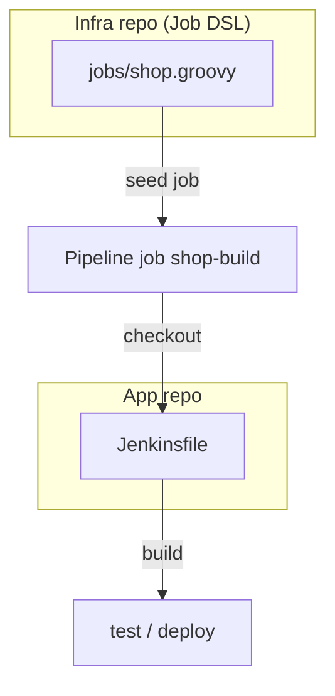
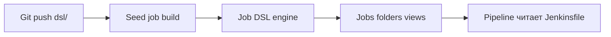

import ExternalCodeEmbed from '@site/src/components/ExternalCodeEmbed';


import ExternalPlayEmbed from '@site/src/components/ExternalPlayEmbed';


# Job DSL Playground — jobs Jenkins как код

<div class="article-tags">
  <span class="tag tag-required">ОБЯЗАТЕЛЬНО</span>
  <span class="tag tag-beginner">ДЛЯ НОВИЧКОВ</span>
</div>

<span class="complexity-badge">Разработчику</span>
<span class="complexity-badge">Архитектору</span>

---

## Job DSL Playground — jobs Jenkins как код

В [Jenkins Pipeline](./22.md) вы описываете **одну сборку** — checkout, test, deploy — в файле `Jenkinsfile`. Но **сам job** (имя, привязка к Git, расписание, тип Pipeline или Freestyle) часто создают вручную в UI Jenkins. Когда jobs десятки и сотни, это ломает воспроизводимость:

- нет pull request на изменение конфигурации;
- staging и production расходятся;
- новый controller поднимают неделями.

**Job DSL Plugin** ([jenkinsci/job-dsl-plugin](https://github.com/jenkinsci/job-dsl-plugin)) решает задачу **Infrastructure as Code для jobs**: Groovy-скрипт описывает jobs, папки и views; **seed job** применяет скрипт к controller.

**Playground** в этой статье — два уровня:

1. интерактив ниже — пресеты DSL и схема seed-потока;
2. **API Viewer** на живом Jenkins — `/plugin/job-dsl/api-viewer/index.html` — справочник всех методов с примерами вложенности.

База Groovy для DSL: [делегирование замыканий](./11.md) (блоки `pipelineJob('x') { ... }` — те же closure, что `dependencies { }` в Gradle). Общий код pipeline — [Shared Library](./26.md). Теория CI — [DevOps CI/CD](/encyclopedia/8-infra-security/8-04-devops-ci-cd/intro), [Jenkins в DevOps](/encyclopedia/8-infra-security/8-04-devops-ci-cd/3114).

<ExternalPlayEmbed example="languages/job-dsl-playground" title="Job DSL Playground" minHeight={480} />

Пройдите пресеты **Pipeline job**, **Freestyle + Gradle** и **Папка и view**, затем читайте разделы ниже — там те же паттерны в контексте Git-репозитория и seed job.

---

### Что получится

- понимание разницы между **Job DSL** (создание jobs) и **Pipeline** (шаги сборки);
- минимальный seed job и структура репозитория `jenkins-jobs/`;
- умение читать `pipelineJob` и `job` в Groovy;
- навык пользоваться **API Viewer** как playground на controller.

---

## Определения

| Термин | Определение |
|--------|-------------|
| **Job** | Настроенная задача Jenkins (Freestyle, Pipeline, Multibranch) |
| **Job DSL** | Groovy-API плагина для **декларативного** описания jobs |
| **Seed job** | Обычный Freestyle job, который **выполняет** DSL-скрипт и создаёт/обновляет другие jobs |
| **DSL script** | Файл `.groovy` с вызовами `job(...)`, `pipelineJob(...)`, `folder(...)` |
| **Controller** | Главный узел Jenkins, хранит конфигурацию jobs |
| **API Viewer** | Встроенный справочник методов Job DSL |
| **Folder** | Папка для группировки jobs (`backend/api`, `backend/web`) |
| **View** | Представление на главной — список jobs по regex или именам |
| **Dynamic DSL** | Обходной путь для плагинов без нативной поддержки в DSL |

---

## Job DSL и Jenkinsfile — разные уровни

| | Job DSL | Pipeline (Jenkinsfile) |
|---|---------|------------------------|
| **Объект описания** | Job на controller | Сценарий **одной** сборки |
| **Файл** | `jobs/*.groovy` в infra-репо | `Jenkinsfile` в app-репо |
| **Когда выполняется** | Seed job / JCasC при изменении infra | Каждый `build` |
| **Синтаксис** | `pipelineJob('x') { definition { ... } }` | `pipeline { stages { ... } }` |
| **Кто правит** | DevOps / platform team | Команда продукта |

**Типичная связка**

1. Job DSL создаёт `Multibranch Pipeline` или `pipelineJob` с `cpsScm`.
2. При сборке Jenkins читает `Jenkinsfile` из Git приложения.
3. В `Jenkinsfile` подключают [@Library](./26.md) для общих шагов.



---

## Установка и API Viewer

1. **Manage Jenkins → Plugins** — установите **Job DSL** (перезапуск controller при необходимости).
2. **Manage Jenkins → Job DSL API Viewer** или URL `/plugin/job-dsl/api-viewer/index.html`.
3. В поиске viewer введите `pipelineJob`, `multibranchPipelineJob`, `folder`, `listView`.
4. Скопируйте каркас блоков `scm`, `triggers`, `definition` в свой `.groovy`.

**Зачем viewer.** DSL огромен — сотни методов под комбинации плагинов. Viewer показывает **обязательные** и **опциональные** closure, как [документация Gradle API](https://docs.gradle.org) для `build.gradle`. Это и есть "playground" на production controller — безопаснее экспериментировать на копии job, чем в UI вслепую.

---

## Seed job — поток от Git до jobs



### Структура репозитория

```
jenkins-jobs/
├── README.md
├── jobs/
│   ├── shop-build.groovy
│   ├── hello-nightly.groovy
│   └── folder-backend.groovy
└── views/
    └── team-dashboard.groovy
```

**Соглашения**

- один файл — одна логическая группа jobs (или один job);
- `views/` — только `listView`, `buildPipelineView` и т.д.;
- изменения через PR + code review — как для application code.

### Настройка seed job в UI

| Шаг | Значение |
|-----|----------|
| Тип | Freestyle project |
| Имя | `seed-jobs` (или `job-dsl-seed`) |
| SCM | Git → URL репозитория `jenkins-jobs` |
| Build step | **Process Job DSLs** |
| DSL source | Look on Filesystem |
| Glob | `jobs/**/*.groovy` и отдельно `views/**/*.groovy` (или один шаг на каталог) |

**Альтернатива** — build step **Execute Groovy DSL** с текстом скрипта inline (удобно для эксперимента, плохо для версионирования).

После **Build Now**:

- jobs **создаются**, если не существуют;
- jobs **обновляются** по имени при повторном запуске;
- jobs **не дублируются** (в отличие от ручного клонирования в UI).

**Webhook.** Настройте push в `jenkins-jobs` → POST на seed job, иначе после merge в main seed нужно запускать вручную.

---

## pipelineJob — Pipeline from SCM

Тот же сценарий, что минимальный [Jenkins Pipeline — первый Jenkinsfile](./22.md), но **определение job** — код:


<ExternalCodeEmbed example="groovy/groovy-512-25-001" title="pipelineJob — Pipeline from SCM" minHeight={372} />


### Разбор pipelineJob

| Строка / блок | Смысл |
|---------------|--------|
| `pipelineJob('shop-build')` | Имя job на controller; строка — идентификатор в DSL |
| `description(...)` | Текст в UI job |
| `definition { cpsScm { ... } }` | Тип Pipeline — скрипт **из SCM**, не inline |
| `scm { git { remote { url(...) } branch(...) } }` | Откуда клонировать (аналог настройки Git в UI) |
| `scriptPath('Jenkinsfile')` | Путь к pipeline-файлу **внутри** репозитория |
| `triggers { scm('H/15 * * * *') }` | Poll SCM каждые ~15 мин (`H` — hash для разнесения нагрузки) |

**cpsScm vs cps &#123; script &#125;.** `cpsScm` — pipeline в Git рядом с кодом приложения; изменения pipeline проходят review в app-репо. Inline `script(''' pipeline { ... } ''')` держит логику в infra-репо — годится для учебных jobs, редко для долгоживущих production pipeline.

---

## job — Freestyle и shell

Для простых nightly-сборок без Declarative Pipeline:


<ExternalCodeEmbed example="groovy/groovy-512-25-002" title="job — Freestyle и shell" minHeight={390} />


### Разбор Freestyle job

- `job('...')` — классический Freestyle (не Pipeline).
- `triggers { cron('H 2 * * *') }` — запуск около 02:00 (`H` — случайная минута).
- `steps { shell(...) }` — эквивалент "Execute shell" в UI; на Windows — `batchFile` или agent с Linux.
- `publishers { junit(...) }` — тот же glob, что в [Jenkins Pipeline — первый Jenkinsfile](./22.md) `post { junit ... }`.

Связь с [Gradle Groovy DSL](./23.md): команда `./gradlew test` идентична stage `Build & Test` в `Jenkinsfile`.

---

## Папки и views


<ExternalCodeEmbed example="groovy/groovy-512-25-003" title="Папки и views" minHeight={534} />


### Разбор folder и view

- `folder('backend')` — создаёт папку; job с именем `backend/api-gateway` попадает **внутрь** неё.
- Слэш `/` в имени job — **не** URL, а иерархия Jenkins Folders (нужен плагин Folders).
- `listView('backend/all')` — dashboard; `regex('backend/.*')` подхватывает все jobs в папке.
- `columns { status(); weather(); ... }` — колонки таблицы на главной.

Для Multibranch (авто-ветки) смотрите в API Viewer `multibranchPipelineJob` — типичный паттерн для GitFlow ([Jenkins Pipeline — первый Jenkinsfile](./22.md) § Multibranch).

---

## Inline Pipeline и SCM — когда что

| Критерий | `cpsScm` + Jenkinsfile | `cps { script('''...''') }` |
|----------|------------------------|------------------------------|
| Владелец pipeline | Команда приложения | Platform / DevOps |
| Review | В app PR | В infra PR |
| Переиспользование | [Shared Library](./26.md) | Copy-paste между DSL-файлами |
| Рекомендация | Production | Прототип, sandbox |

---

## Безопасность и sandbox

Job DSL выполняется на controller с правами **Script Security**:

- неподписанные методы Groovy требуют одобрения admin (In-process Script Approval);
- в seed job включайте **Use Groovy Sandbox**, где доступно;
- **секреты не храните** в DSL — credentials в Jenkins + `withCredentials` в `Jenkinsfile` ([Jenkins Pipeline — первый Jenkinsfile](./22.md));
- Dynamic DSL и `configure { }` могут записать секрет в XML job — избегайте в Git.

Wiki плагина: [Script Security](https://github.com/jenkinsci/job-dsl-plugin/wiki/Script-Security).

---

## Configuration as Code (JCasC)

Seed Freestyle можно заменить фрагментом [JCasC](https://www.jenkins.io/projects/jcasc/) при старте controller:

```yaml
jobs:
  - script: >
      pipelineJob('shop-build') {
        definition {
          cpsScm {
            scm { git { remote { url('https://github.com/example/shop.git') } } }
            scriptPath('Jenkinsfile')
          }
        }
      }
```

**Плюсы** — воспроизводимый Docker-образ Jenkins, jobs на чистом controller без ручного клика. **Минусы** — ошибка в YAML ломает старт; тестируйте на staging.

---

## Job DSL и Shared Library

| | Job DSL | [Shared Library](./26.md) |
|---|---------|---------------------------|
| Уровень | Jobs, folders, views | Функции и классы **внутри** pipeline |
| Пример | `pipelineJob('shop') { ... }` | `standardPipeline(deploy: true)` |
| Запуск | Seed job | `@Library` в Jenkinsfile |

**Вместе** — platform team держит DSL-репо (какие repos вообще собираются), product team — короткий `Jenkinsfile` с `@Library`.

---

## Частые ошибки

| Симптом | Вероятная причина | Действие |
|---------|-------------------|----------|
| Job не появился | Неверный glob в seed | Проверьте `jobs/**/*.groovy`, лог seed build |
| `No such DSL method 'pipelineJob'` | Плагин Job DSL не установлен | Plugins → Job DSL |
| `No such DSL method 'git'` | Нет Git plugin | Установить Git + перезапуск |
| Два одинаковых job | Два seed управляют одним именем | `failOnSeedCollision` / один seed |
| Pipeline пустой / NPE | `scriptPath` не тот | Путь в репо vs `scriptPath('ci/Jenkinsfile')` |
| DSL изменился, jobs старые | Seed не запускался | Webhook на seed после push |
| Sandbox approval loop | Новый метод в DSL | Approve или упростить скрипт |

---

## Что попробовать

1. Docker Jenkins + один `pipelineJob` на свой учебный репозиторий ([первая программа Groovy](./2.md)).
2. В API Viewer собрать `multibranchPipelineJob` для feature-веток.
3. Вынести `listView` в `views/team.groovy`.
4. Добавить [Shared Library](./26.md) — DSL создаёт job, library сокращает `Jenkinsfile`.

---

## Дальше

[Jenkins Shared Library](./26.md) · [Jenkins Pipeline](./22.md) · [Gradle Groovy DSL](./23.md) · [DevOps CI/CD](/encyclopedia/8-infra-security/8-04-devops-ci-cd/intro)

---
