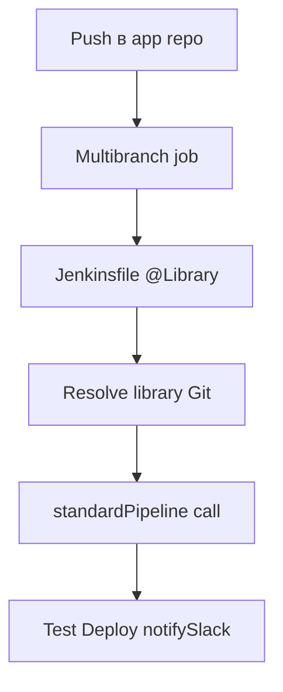

# Jenkins Shared Library — общий Groovy-код CI

<div class="article-tags">
  <span class="tag tag-required">ОБЯЗАТЕЛЬНО</span>
  <span class="tag tag-beginner">ДЛЯ НОВИЧКОВ</span>
</div>

<span class="complexity-badge">Разработчику</span>
<span class="complexity-badge">Архитектору</span>

---

## Jenkins Shared Library — общий Groovy-код CI

Когда в организации **десятки репозиториев** с похожими pipeline, копировать один `Jenkinsfile` в каждый — технический долг:

- исправление deploy-шага = N pull request;
- команды расходятся по версиям "эталонного" pipeline;
- новичок не понимает, какой `Jenkinsfile` актуален.

**Shared Library** — отдельный **Git-репозиторий** с Groovy-кодом для Pipeline: global vars (`vars/`), классы (`src/`), ресурсы (`resources/`). Jenkins подгружает библиотеку по `@Library('имя@версия') _` в `Jenkinsfile`.

Это **тот же Groovy**, что в [основах](./11.md) — замыкания, map-литералы `[key: value]`, GString `"${env.BUILD_NUMBER}"`. Отличие — код выполняется в **CPS** (Continuation-Passing Style) sandbox Pipeline, с ограничениями на сериализацию.

Создание jobs на controller — [Job DSL Playground](./25.md). Минимальный pipeline — [22.md](./22.md). Тесты Groovy-классов — [Spock](./21.md). CI/CD в целом — [DevOps](/encyclopedia/8-infra-security/8-04-devops-ci-cd/intro), [повторное использование в Jenkins](/encyclopedia/8-infra-security/8-04-devops-ci-cd/3114#shared-libraries).

---

### Что получится

- репозиторий `jenkins-shared-library` с каталогами `vars/`, `src/`;
- регистрация библиотеки в **Global Pipeline Libraries**;
- вызов `standardPipeline(...)` из короткого `Jenkinsfile` app-репо;
- понимание **trusted vs untrusted** и версионирования `@v1.2.0`.

---

## Определения

| Термин | Определение |
|--------|-------------|
| **Shared Library** | Версионируемый Git-репозиторий с переиспользуемым кодом Pipeline |
| **Global variable** | Файл `vars/name.groovy` — вызывается как `name(...)` в pipeline |
| **Global var `call`** | Метод `def call(...)` — точка входа global var |
| **`@Library`** | Аннотация импорта библиотеки в Jenkinsfile |
| **CPS** | Модель выполнения Pipeline — шаги могут **приостанавливаться** (checkpoint) |
| **Trusted library** | Библиотека из доверенного Git — расширенные права, вне sandbox |
| **Retriever** | Способ загрузки — Modern SCM (Git) или Legacy |
| **`load`** | Загрузка `.groovy` из workspace **текущей** сборки (не global library) |

---

## Три уровня переиспользования

| Механизм | Что переиспользуем | Где живёт | Масштаб |
|----------|-------------------|-----------|---------|
| [Job DSL](./25.md) | **Jobs**, folders, views | Infra repo | Весь controller |
| **Shared Library** | **Шаги** pipeline, шаблоны | `jenkins-shared-library` | Все app-репо |
| `load 'utils.groovy'` | Утилиты | Тот же репо, что app | Один проект |

**Library** — sweet spot для `standardPipeline`, `deployApp`, `notifySlack`: одна правка в library → все проекты подключают новую версию через bump `@Library`.

---

## Структура репозитория

```
jenkins-shared-library/
├── vars/
│   ├── standardPipeline.groovy
│   └── notifySlack.groovy
├── src/
│   └── com/example/ci/
│       ├── DeployHelper.groovy
│       └── VersionPolicy.groovy
├── resources/
│   └── com/example/ci/
│       └── email.html
├── test/
│   └── com/example/ci/
│       └── VersionPolicySpec.groovy   # Spock — опционально
└── README.md
```

| Каталог | Содержимое | Правило именования |
|---------|------------|-------------------|
| **vars/** | Global vars — вызов **по имени файла** | `notifySlack.groovy` → `notifySlack('msg')` |
| **src/** | Обычные Groovy/Java классы с `package` | `import com.example.ci.DeployHelper` |
| **resources/** | Статика для `libraryResource('com/example/ci/email.html')` | Путь зеркалит package |

**Не кладите** `Jenkinsfile` приложения в library — только **общий** код. App-специфика (имя сервиса, путь к Dockerfile) передаётся **параметрами** `call(Map config)`.

---

## Регистрация в Jenkins

**Manage Jenkins → System → Global Pipeline Libraries → Add**

| Поле | Пример | Зачем |
|------|--------|-------|
| **Name** | `company-pipeline-lib` | Строка в `@Library('company-pipeline-lib')` |
| **Default version** | `main` или `1.2.0` | Если в Jenkinsfile версия не указана |
| **Retrieval method** | Modern SCM → Git | Clone library repo |
| **Project repository** | URL + credentials | Доступ controller к Git |
| **Load implicitly** | Off (рекомендуется) | Явный `@Library` — прозрачнее |
| **Allow override** | On | `@Library('lib@feature-branch')` для теста PR |

**Production.** Фиксируйте **semver-теги** (`1.2.0`), не плавающую `main` — иначе ночной push в library сломает все сборки.

---

## Global var — vars/standardPipeline.groovy

Global var — Groovy-скрипт с методом **`call`**. Jenkins вызывает его как функцию из Declarative или Scripted pipeline.

```groovy
// vars/standardPipeline.groovy

def call(Map config = [:]) {
    pipeline {
        agent any

        options {
            timestamps()
            timeout(time: config.timeoutMinutes ?: 30, unit: 'MINUTES')
        }

        stages {
            stage('Checkout') {
                steps {
                    checkout scm
                }
            }

            stage('Test') {
                steps {
                    sh(config.testCommand ?: './gradlew test --no-daemon')
                }
            }

            stage('Deploy') {
                when {
                    expression {
                        config.deploy == true && env.BRANCH_NAME == 'main'
                    }
                }
                steps {
                    sh(config.deployCommand ?: './deploy.sh staging')
                }
            }
        }

        post {
            always {
                junit(config.junitPattern ?: '**/build/test-results/test/*.xml')
            }
            failure {
                notifySlack("Build failed: ${env.JOB_NAME} #${env.BUILD_NUMBER}")
            }
        }
    }
}
```

### Разбор standardPipeline построчно

| Фрагмент | Смысл |
|----------|--------|
| `def call(Map config = [:])` | Единственная обязательная точка входа; `[:]` — пустой map по умолчанию ([типы Map](./12.md)) |
| `pipeline { ... }` | Полный **Declarative** pipeline внутри var — допустимо и распространено |
| `config.timeoutMinutes ?: 30` | Elvis operator — значение по умолчанию ([операторы § ?:](./13.md)) |
| `checkout scm` | SCM из настройки **Multibranch/Pipeline job**, не из library |
| `when { expression { ... } }` | Deploy только если `config.deploy` и ветка `main` |
| `notifySlack(...)` | Другой global var из `vars/notifySlack.groovy` |
| GString `"${env.JOB_NAME}"` | Переменные окружения Jenkins ([22.md § env](./22.md)) |

**Почему Map, а не 10 параметров.** Map расширяется без ломания сигнатуры — новый ключ `lintCommand` не требует менять все вызовы (старые Jenkinsfile продолжают работать).

---

## Вызов из Jenkinsfile приложения

```groovy
@Library('company-pipeline-lib@1.2.0') _

standardPipeline(
    testCommand: './gradlew test --no-daemon',
    deploy: true,
    deployCommand: './deploy.sh production',
    junitPattern: '**/build/test-results/test/*.xml',
    timeoutMinutes: 45
)
```

### Разбор Jenkinsfile

| Строка | Смысл |
|--------|--------|
| `@Library('company-pipeline-lib@1.2.0') _` | Импорт library версии `1.2.0`; **`_`** обязателен (placeholder, как `import X as _`) |
| `standardPipeline(...)` | Вызов global var; именованные аргументы → ключи `config` map |
| Отсутствие `pipeline { }` | Весь declarative pipeline **внутри** library |

Минимальный app-репо — **одна** строка `@Library` + **один** вызов `standardPipeline`. Логика checkout/test/deploy централизована.

Сборка Gradle внутри — [23.md](./23.md). Тесты Spock перед deploy — [21.md](./21.md).

---

## vars/notifySlack.groovy — маленький step

```groovy
def call(String message) {
    def channel = '#ci-alerts'
    echo "Slack → ${channel}: ${message}"
    // slackSend(
    //     channel: channel,
    //     message: message,
    //     tokenCredentialId: 'slack-token'
    // )
}
```

### Разбор notifySlack

- Сигнатура `call(String message)` — один аргумент, не Map.
- `echo` — встроенный step Pipeline (безопасен в sandbox).
- Закомментированный `slackSend` — реальный вызов после настройки Credentials и Slack plugin.
- В `standardPipeline` вызывается как **`notifySlack("...")`** — имя файла без `.groovy`.

---

## Классы в src/

Сложную логику (ветвления deploy, semver-check) выносят в классы — их проще тестировать [Spock](./21.md) без Jenkins.

```groovy
// src/com/example/ci/DeployHelper.groovy
package com.example.ci

class DeployHelper implements Serializable {
    def steps

    DeployHelper(steps) {
        this.steps = steps
    }

    void deploy(String env) {
        steps.sh "./deploy.sh ${env}"
    }
}
```

Использование в global var:

```groovy
import com.example.ci.DeployHelper

def call(Map config) {
    pipeline {
        agent any
        stages {
            stage('Deploy') {
                steps {
                    script {
                        def helper = new DeployHelper(this)
                        helper.deploy(config.env ?: 'staging')
                    }
                }
            }
        }
    }
}
```

### Зачем Serializable и script { }

- **CPS** сериализует состояние pipeline между шагами; поля класса должны быть **Serializable** (или примитивы/String).
- **`new DeployHelper(this)`** — в `vars` `this` ссылается на **CpsScript** с доступом к `sh`, `echo`.
- Вызов **`steps { script { ... } }`** — Groovy-код внутри declarative stage ([22.md § script block](./22.md)).

**Антипаттерн** — хранить в поле класса `new File('/tmp')` или JDBC connection — не Serializable, сборка упадёт с `NotSerializableException`.

---

## resources/ и libraryResource

HTML-шаблон письма или JSON-schema:

```groovy
def template = libraryResource('com/example/ci/email.html')
echo template.replace('{{BUILD}}', env.BUILD_NUMBER)
```

Файл лежит в `resources/com/example/ci/email.html`. Путь **совпадает** с package в `src/`.

---

## Версионирование library

| Стратегия | Плюсы | Минусы |
|-----------|-------|--------|
| `@Library('lib@main')` | Всегда последний commit | Сломанный main ломает все jobs |
| `@Library('lib@1.2.0')` | Semver, воспроизводимость | Bump в каждом app при мажоре |
| `@Library('lib@abc1234')` | Pin на commit | Неудобно читать |
| Implicit + default `main` | Короткий Jenkinsfile | Скрытая версия |

**Рекомендация platform team**

1. Тег `1.2.0` на каждый релиз library.
2. В app — `@1.2.0` или `@1` (если настроен retriever на refs/tags/*).
3. Мажорный bump — миграционный guide в README library.

---

## Trusted и untrusted

| | Trusted | Untrusted |
|---|---------|-----------|
| Sandbox | Шире — доверенный код org | Script Security, whitelist |
| Когда | Private Git org, admin контролирует merge | PR из fork, публичный contrib |
| Риск | Компромисс repo = риск controller | Ниже для untrusted pipeline |

Библиотеки из **корпоративного GitLab/GitHub** обычно **trusted**. Для `pull request from fork` в Multibranch — pipeline **untrusted**, library может не подгрузиться — тестируйте library на staging controller.

---

## load и @Library

```groovy
def utils = load 'ci/utils.groovy'
utils.runTests()
```

Файл `ci/utils.groovy` в **workspace app-репо** (должен `return this`):

```groovy
def runTests() {
    sh './gradlew test'
}
return this
```

| | `load` | `@Library` |
|---|--------|------------|
| Источник | Workspace текущей сборки | Git library repo |
| Версия | Commit app-репо | Тег library |
| Конвенции | Нет | `vars/`, `src/` |
| Масштаб | Один проект | Организация |

`load` — прототип; стандарт команды — **Shared Library**.

---

## Сквозной поток



[Job DSL](./25.md) может **создать** Multibranch job, который вызывает `@Library` — infra + library + короткий Jenkinsfile.

---

## Тестирование library

- **Unit** — классы из `src/` через Gradle + [Spock](./21.md), без Jenkins (`DeployHelperSpec.groovy`).
- **Integration** — test Jenkins + `@Library('lib@PR-42')` на staging.
- **Lint** — CodeNarc / npm-groovy-lint в CI **library-репо** ([101.md — рекомендации](./101.md)).

Global vars с полным `pipeline { }` на unit-тесты плохо ложатся — smoke-test job на staging.

---

## Кейс раздела — pipeline каталога книг

После [миграций БД](./19.md) и [Spock-тестов](./21.md):

```groovy
@Library('company-pipeline-lib@1') _

standardPipeline(
    testCommand: './gradlew test --no-daemon',
    deploy: params.DEPLOY_CATALOG == 'true',
    deployCommand: './scripts/flyway-migrate.sh && ./deploy-catalog.sh',
    junitPattern: '**/build/test-results/test/*.xml'
)
```

Flyway в нескольких сервисах — вынесите в `vars/flywayMigrate.groovy`. Игра на [FastJ](./24.md) — тот же `standardPipeline` с `testCommand: './gradlew test'` и опциональным `runtime` stage в library.

---

## Частые ошибки

| Симптом | Причина | Решение |
|---------|---------|---------|
| `Library company-pipeline-lib not found` | Name не совпадает с Global Libraries | Проверить регистрацию, credentials Git |
| `Required context class hudson.FilePath` | Step вне `steps` / `script` | Обернуть в `script { }` |
| `NotSerializableException` | Поле класса не Serializable | Примитивы, String, Serializable types |
| Старая версия library после tag | Кэш / неверный ref | `@Library('@1.2.1')`, rebuild |
| `No such property: call` | Нет `def call` в vars | Добавить `call` |
| Двойной `@Library` | Implicit + explicit | Отключить implicit или убрать дубль |
| `notifySlack` not found | Файл не в vars/ или опечатка | Имя файла = имя вызова |

---

## Что попробовать

1. Repo `jenkins-shared-library` + `vars/helloPipeline.groovy` с `call() { echo 'Hello' }`.
2. Test job с `@Library('...') _` и `helloPipeline()`.
3. Расширить до `standardPipeline` с параметрами Map.
4. `DeployHelper` в `src/` + Spock-тест без Jenkins.
5. Связать с [Job DSL](./25.md) — DSL создаёт job, library наполняет pipeline.

---

## Дальше

[Job DSL Playground](./25.md) · [Jenkins Pipeline](./22.md) · [Gradle Groovy DSL](./23.md) · [FastJ — сборка в CI](./24.md)

---
