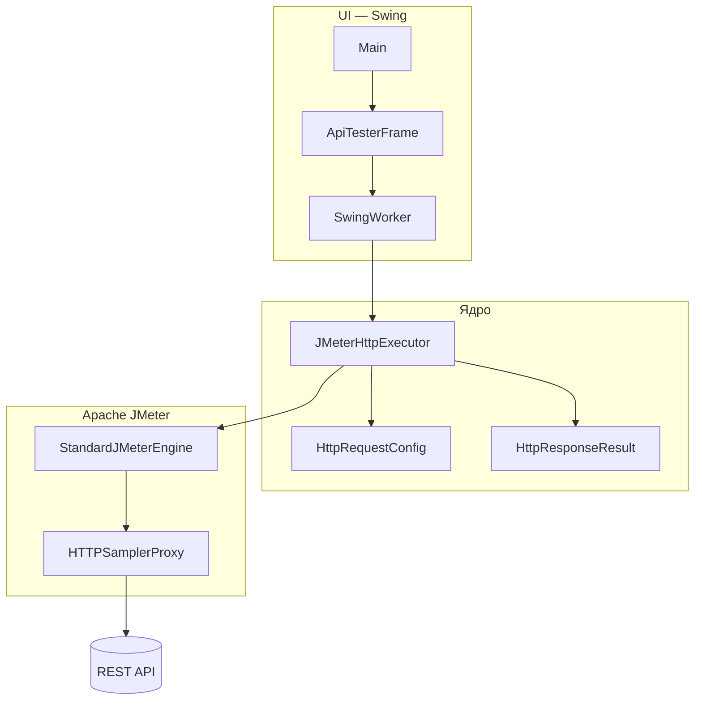

import ExternalCodeEmbed from '@site/src/components/ExternalCodeEmbed';


# Практикум — API-тестер на Groovy и JMeter

<div class="article-tags">
  <span class="tag tag-required">ОБЯЗАТЕЛЬНО</span>
  <span class="tag tag-beginner">ДЛЯ НОВИЧКОВ</span>
</div>

<span class="complexity-badge">Разработчику</span>

---

## Практикум — API-тестер на Groovy и JMeter

**Groovy API Tester** — desktop-приложение для ручной проверки REST API. Вы вводите URL, HTTP-метод, заголовки и тело запроса — получаете статус, время ответа, заголовки и тело ответа. Под капотом **Apache JMeter** работает **программно**, без графического интерфейса JMeter и без `.jmx`-файлов.

Практикум показывает Groovy за пределами `build.gradle` и `Jenkinsfile`:

- **Gradle Groovy DSL** — сборка, зависимости, задача `run` ([Gradle Groovy DSL — первая сборка](./23.md));
- **groovy-swing** — декларативный UI через `SwingBuilder`, тот же приём delegate, что в Gradle ([Основы языка Groovy](./11.md));
- **groovy-json** — автоформатирование JSON в ответе ([Простые приложения на Groovy](./103.md));
- **JMeter API** — HTTP из Java/Groovy-кода ([тестирование API](/encyclopedia/7-project/7-05-testirovanie/2));
- **SwingWorker** — сеть в фоне, окно не "зависает".

Готовый проект можно взять как эталон — каталог `GroovyAPITester` рядом с другими JVM-проектами. Если Groovy-проект ещё не запускали — сначала [первая программа](./2.md) и [Gradle Groovy DSL](./23.md). База по HTTP — [HTTP как основа веб-интеграций](/encyclopedia/2-system-network/2-09-osnovy-integratsionnogo-vzaimodeystviya/118).

<div class="callout callout--tip">
  <div class="callout-title">Кому полезен практикум</div>

  <div class="callout-body">
  Разработчику, который уже читает <code>build.gradle</code>, но хочет <strong>цельное JVM-приложение</strong> на Groovy. Тестировщику — как встроить JMeter в код, а не только в GUI. Архитектору — как отделить UI, модели и транспорт (слои без смешения ответственности).
</div>
  </div>

---

### Что получится

После прохождения практикума у вас будет:

- Gradle-проект с плагинами `groovy` и `application`;
- модели `HttpRequestConfig` и `HttpResponseResult` — DTO без привязки к Swing и JMeter;
- класс `JMeterHttpExecutor` — один HTTP-запрос через `StandardJMeterEngine`;
- окно `ApiTesterFrame` с вкладками "Заголовки", "Тело запроса", "Ответ";
- smoke-тест `gradle smokeTest` для CI ([Jenkins Pipeline](./22.md));
- команда `gradle run` — запуск GUI.

```bash
gradle run
```

Горячая клавиша **Ctrl+Enter** отправляет запрос без клика по кнопке.

---

## Термины

| Термин | Простыми словами |
|--------|------------------|
| **REST API** | HTTP-интерфейс сервера — ресурсы по URL, методы GET/POST/PUT/PATCH/DELETE |
| **HTTP-метод** | Глагол запроса — что хотим сделать с ресурсом (прочитать, создать, изменить, удалить) |
| **Заголовок (header)** | Пара "имя — значение" в HTTP-сообщении — `Content-Type`, `Authorization`, `Accept` |
| **Тело запроса (body)** | Полезная нагрузка POST/PUT/PATCH — часто JSON |
| **Статус-код** | Число в ответе — 200 OK, 404 Not Found, 500 Internal Server Error |
| **DTO** | Data Transfer Object — класс только для передачи данных между слоями |
| **POGO** | Plain Old Groovy Object — класс с полями без лишнего boilerplate |
| **Apache JMeter** | Инструмент нагрузочного и функционального тестирования — HTTP, JDBC, JMS и др. |
| **HTTPSamplerProxy** | JMeter-компонент, описывающий один HTTP-запрос (хост, путь, метод, тело) |
| **SampleResult** | Объект JMeter с результатом одного sampler — код, время, тело, заголовки |
| **TestPlan** | Корень JMeter-сценария — контейнер всего плана |
| **ThreadGroup** | Группа виртуальных пользователей; у нас — один поток, одна итерация |
| **StandardJMeterEngine** | Программный запуск JMeter без `.jmx` и без GUI |
| **ListedHashTree** | Дерево элементов JMeter — иерархия TestPlan → ThreadGroup → Sampler |
| **SwingBuilder** | Groovy-обёртка над Swing — UI описывают вложенными блоками, как mini-DSL |
| **SwingWorker** | Фоновая задача Swing — `doInBackground()` не блокирует EDT |
| **EDT** | Event Dispatch Thread — поток, в котором рисуется и обрабатывается GUI |
| **Smoke-тест** | Быстрая проверка "система жива" — один GET без GUI после сборки |

---

## Зачем JMeter, если есть Postman и curl

| Инструмент | Сильная сторона | Слабое место для нашей задачи |
|------------|-----------------|-------------------------------|
| **Postman** | Удобный GUI, коллекции, окружения | Нужен отдельный продукт; сложнее встроить в свой код |
| **curl** | Мгновенно из терминала | Нет своего GUI; парсинг ответа вручную |
| **HttpURLConnection / HttpClient** | Стандарт Java | Много boilerplate; редиректы, таймауты, логирование — на вас |
| **JMeter (embedded)** | Зрелый HTTP-стек, метрики времени, тот же движок, что в нагрузочных тестах | Тяжёлая зависимость; нужна инициализация `JMETER_HOME` |

**Живая теория.** Мы собираем не замену Postman для команды QA, а **учебный проект на Groovy**, где HTTP-движок совпадает с инструментом [нагрузочного тестирования](/encyclopedia/7-project/7-05-testirovanie/119). Один и тот же `HTTPSamplerProxy` потом можно масштабировать до тысяч потоков в `.jmx`-плане — логика запроса уже знакома.

Альтернатива на чистом Groovy — `HttpURLConnection` или Java 11+ `HttpClient` ([Простые приложения на Groovy](./103.md)). JMeter оправдан, если вы уже работаете с JMeter в CI или хотите единый стек "ручной запрос → нагрузочный сценарий".

---

## Архитектура приложения



| Слой | Класс | Ответственность |
|------|-------|-----------------|
| Точка входа | `Main` | Look-and-feel ОС, запуск окна на EDT |
| UI | `ApiTesterFrame` | Форма, парсинг заголовков, отображение ответа |
| HTTP | `JMeterHttpExecutor` | Инициализация JMeter, сборка TestPlan, выполнение |
| Модели | `HttpRequestConfig`, `HttpResponseResult` | DTO запроса и ответа |

**Живая теория.** Разделение на слои — тот же принцип, что в [ООП](./15.md) и [тестировании](./21.md):

- UI **не знает** про `HTTPSamplerProxy` — только про `HttpRequestConfig` / `HttpResponseResult`;
- `JMeterHttpExecutor` **не знает** про Swing — его можно вызвать из `SmokeTest`, Spock или Jenkins;
- модели **не зависят** ни от Swing, ни от JMeter — удобная точка для unit-тестов.

Поток данных при нажатии "Отправить":

1. `ApiTesterFrame` читает поля формы → собирает `HttpRequestConfig`.
2. `SwingWorker` вызывает `executor.execute(config)` **не в EDT**.
3. `JMeterHttpExecutor` строит дерево JMeter, запускает engine, возвращает `HttpResponseResult`.
4. `done()` на EDT обновляет метки и текстовые области.

---

## Анатомия HTTP-запроса

Перед кодом полезно держать в голове структуру сообщения ([HTTP — основа](/encyclopedia/2-system-network/2-09-osnovy-integratsionnogo-vzaimodeystviya/118)):

```
POST /users HTTP/1.1
Host: api.example.com
Content-Type: application/json
Accept: application/json

{"name": "Alice"}
```

| Часть | Где в нашем приложении |
|-------|------------------------|
| Метод + путь | `methodCombo` + URL (путь и query из `URI`) |
| Заголовки | вкладка "Заголовки" → `HeaderManager` |
| Тело | вкладка "Тело запроса" → `HTTPSamplerProxy.postBodyRaw` |
| Статус и тело ответа | вкладка "Ответ" ← `SampleResult` |

**Живая теория.** URL `https://api.example.com:8443/v1/users?page=2` JMeter разбирает на части:

- `protocol` — `https`;
- `domain` — `api.example.com`;
- `port` — `8443` (или 443/80 по умолчанию);
- `path` — `/v1/users?page=2`.

Если передать только `api.example.com/users` без схемы — `URI.create` не даст валидный запрос; мы явно проверяем `scheme` и `host` в `execute()`.

---

## Требования

- **JDK 17+** — как для современного Gradle ([Java — первая программа](/encyclopedia/5-languages/5-03-java/13));
- **Gradle** или wrapper (`gradlew`) — см. [Gradle Groovy DSL — первая сборка](./23.md);
- **сеть** — для примеров с [httpbin.org](https://httpbin.org);
- опционально **IntelliJ IDEA** с плагином Groovy — [Первая программа на Groovy](./2.md).

---

## Шаг 0 · Структура проекта

Создайте каталог `GroovyAPITester` и дерево файлов:

```
GroovyAPITester/
├── build.gradle
├── settings.gradle
├── gradlew / gradlew.bat          # после gradle wrapper
└── src/main/
    ├── groovy/apitester/
    │   ├── Main.groovy
    │   ├── SmokeTest.groovy
    │   ├── model/
    │   │   ├── HttpRequestConfig.groovy
    │   │   └── HttpResponseResult.groovy
    │   ├── jmeter/
    │   │   └── JMeterHttpExecutor.groovy
    │   └── ui/
    │       └── ApiTesterFrame.groovy
    └── resources/jmeter/bin/
        └── jmeter.properties
```

Файл `settings.gradle`:

```groovy
rootProject.name = 'GroovyAPITester'
```

Разбор:

- `rootProject.name` — имя артефакта в `build/libs/` и в `installDist`;
- каталог `src/main/groovy` — стандарт Gradle для Groovy ([Gradle Groovy DSL — первая сборка](./23.md)), аналог `src/main/java`;
- пакет `apitester.model`, `apitester.ui`, `apitester.jmeter` — **разные причины изменения** (данные / интерфейс / транспорт);
- `resources/jmeter/bin/jmeter.properties` — попадает в classpath; JMeter находит "домашний каталог" без установки JMeter на машину.

---

## Шаг 1 · build.gradle


<ExternalCodeEmbed example="groovy/groovy-512-27-001" title="Шаг 1 · build.gradle" minHeight={720} />


### Разбор build.gradle

| Блок | Назначение |
|------|------------|
| `id 'groovy'` | Компиляция `.groovy` из `src/main/groovy` |
| `id 'application'` | Задачи `run`, `installDist`, `mainClass` |
| `groovy-swing` | `SwingBuilder` для UI |
| `groovy-json` | `JsonSlurper`, `JsonOutput.prettyPrint` |
| `ApacheJMeter_core` | Движок, утилиты, `JMeterUtils` |
| `ApacheJMeter_http` | `HTTPSamplerProxy`, HTTP-протокол |
| `ApacheJMeter_components` | `HeaderManager`, listeners |
| `log4j` + `slf4j` | JMeter пишет через SLF4J; без binding — `No SLF4J providers` |
| `smokeTest` | Отдельная задача для CI — один GET без GUI |
| `-Dfile.encoding=UTF-8` | Кириллица в UI и в JSON без "кракозябр" |

Разбор фрагмента:

- `def groovyVersion = '3.0.20'` — локальная переменная в скрипте Gradle; GString `"${groovyVersion}"` подставляет версию в координаты Maven ([GString](./20.md)).
- Блок `application { mainClass = ... }` — плагин `application` создаёт задачу `run`, которая запускает `static void main` указанного класса.
- `tasks.withType(JavaExec).configureEach` — правило для **всех** JavaExec-задач, включая `run` и `smokeTest`.
- `tasks.register('smokeTest', JavaExec)` — кастомная задача без отдельного `.gradle`-файла; удобно вызывать из [Jenkins](./22.md) или [Shared Library](./26.md).

**Живая теория.** Файл `build.gradle` — Groovy-скрипт с **делегированием замыканий** ([Основы языка Groovy](./11.md)). Когда вы пишете `dependencies { implementation ... }`, Gradle передаёт closure объекту `DependencyHandler`, и вызов `implementation` резолвится у делегата — не в глобальной области. Тот же механизм в `application { }` и `tasks.register(...) { }`.

---

## Шаг 2 · jmeter.properties

Файл `src/main/resources/jmeter/bin/jmeter.properties`:

```properties
# Minimal JMeter configuration for embedded use
jmeter.save.saveservice.output_format=xml
jmeter.save.saveservice.response_data=true
jmeter.save.saveservice.samplerData=true
jmeter.save.saveservice.requestHeaders=true
jmeter.save.saveservice.response_headers=true
```

Разбор:

- `output_format=xml` — формат сохранения результата sampler (для embedded достаточно xml);
- `response_data=true` — в `SampleResult` попадает **тело ответа**; без флага UI покажет пустое поле;
- `samplerData=true` — данные исходящего запроса (удобно для отладки);
- `requestHeaders` / `response_headers` — заголовки в обе стороны.

**Живая теория.** У desktop-JMeter "дом" — каталог `JMETER_HOME` с `bin/jmeter.properties`. В embedded-режиме мы **подменяем** его минимальным деревом в `resources`:

```
classpath:jmeter/bin/jmeter.properties  →  JMETER_HOME = classpath:jmeter
```

Код в `ensureInitialized()` вычисляет путь: `propsFile.parentFile.parentFile` — поднимается от `bin/` к корню `jmeter/`. Поэтому структура каталогов **жёсткая** — не кладите `jmeter.properties` в корень `resources` без `bin/`.

---

## Шаг 3 · Модели запроса и ответа

### HttpRequestConfig

```groovy
package apitester.model

class HttpRequestConfig {

    String url
    String method = 'GET'
    Map<String, String> headers = [:]
    String body = ''
    int connectTimeoutMs = 10_000
    int responseTimeoutMs = 30_000

}
```

Разбор:

- `String url` — полный URL со схемой; парсинг — в `JMeterHttpExecutor`, не в модели;
- `method = 'GET'` — значение по умолчанию для Groovy POGO ([ООП](./15.md));
- `headers = [:]` — пустая map-литерала ([типы — Map](./12.md));
- `10_000` — numeric separator, как в Java 7+;
- таймауты в миллисекундах — `connectTimeout` (TCP) и `responseTimeout` (ожидание ответа) на sampler.

### HttpResponseResult


<ExternalCodeEmbed example="groovy/groovy-512-27-002" title="HttpResponseResult" minHeight={516} />


Разбор:

- `success` — флаг JMeter `sample.successful` (HTTP 4xx/5xx могут быть `successful=false` в зависимости от настроек);
- `statusCode == 0` — договорённость "HTTP-ответа не было" (ошибка URL, JMeter, сеть);
- именованные аргументы конструктора — `new HttpResponseResult(success: false, ...)` без порядка параметров;
- фабрика `error(String)` — единый способ вернуть ошибку из `execute()` без дублирования полей.

**Живая теория.** DTO намеренно **без методов бизнес-логики**. `parseHeaders` живёт в UI, сбор sampler — в `JMeterHttpExecutor`. Так `SmokeTest` и Spock-тесты не тянут Swing. Это тот же приём, что Java-record или Kotlin `data class` для границ слоёв ([Groovy и Java](./20.md)).

---

## Шаг 4 · JMeterHttpExecutor

Создайте `src/main/groovy/apitester/jmeter/JMeterHttpExecutor.groovy`.

### 4.1 Инициализация JMeter


<ExternalCodeEmbed example="groovy/groovy-512-27-003" title="4.1 Инициализация JMeter" minHeight={498} />


Разбор:

- `volatile boolean initialized` — видимость флага между потоками после инициализации;
- `synchronized` на методе — только один поток выполняет инициализацию JMeter;
- `classLoader.getResource(...)` — файл из `src/main/resources`, упакованный в JAR;
- `new File(jmeterHomeUrl.toURI())` — корректный путь и для файловой системы IDE, и для JAR;
- `setJMeterHome` + `loadJMeterProperties` — обязательная пара перед первым `engine.run()`.

### 4.2 Метод execute


<ExternalCodeEmbed example="groovy/groovy-512-27-004" title="4.2 Метод execute" minHeight={720} />


Разбор:

- ранний `return HttpResponseResult.error(...)` — **Railway-oriented** стиль без глубокой вложенности `if/else`;
- `LoopController` с `loops = 1` — ровно одна итерация sampler;
- `numThreads = 1` — один виртуальный пользователь; для ручного тестера достаточно;
- `.tap { addArgument('API_TEST', 'true') }` — Groovy-идиома ([Синтаксические конструкции Groovy](./18.md)) — настроить `Arguments` и вернуть тот же объект;
- `engine.exit()` в `finally` — освободить ресурсы engine после каждого запроса;
- `sample.time` — время ответа в миллисекундах; `bytesAsLong` — размер тела.

**Живая теория — дерево JMeter.** `ListedHashTree` — **контракт** "кто чьим родителем является". Минимальный сценарий одного запроса:

```
TestPlan
└── ThreadGroup
    └── LoopController
        └── HTTPSamplerProxy
            ├── HeaderManager      (опционально)
            └── CaptureResultCollector
```

В GUI JMeter вы кликаете правой кнопкой и "Add" — здесь то же самое вызовами `tree.add(...)`. Для [нагрузочного теста](/encyclopedia/7-project/7-05-testirovanie/119) увеличивают `numThreads` и `loops`; код `buildSampler` остаётся.

### 4.3 HTTPSampler и заголовки


<ExternalCodeEmbed example="groovy/groovy-512-27-005" title="4.3 HTTPSampler и заголовки" minHeight={720} />


Разбор:

- тернарный оператор для порта — явный порт в URL или 443/80 по схеме;
- `rawPath` / `rawQuery` — path и query **без** перекодирования; JMeter сам собирает строку запроса;
- `method.toUpperCase() in ['POST', 'PUT', 'PATCH']` — оператор `in` для списка ([операторы](./13.md));
- `postBodyRaw = true` — тело "как есть", не `application/x-www-form-urlencoded`;
- `addArgument('', config.body)` — JMeter-к convention для raw body;
- `equalsIgnoreCase('Content-Type')` — не дублировать Content-Type, если пользователь задал вручную;
- последняя строка `buildHeaderManager` — Groovy возвращает значение последнего выражения ([особенности](./16.md)).

### 4.4 Перехват результата

```groovy
    private static class CaptureResultCollector extends ResultCollector {

        volatile SampleResult capturedResult

        @Override
        void sampleOccurred(SampleEvent event) {
            capturedResult = event.result
            super.sampleOccurred(event)
        }
    }
}
```

Разбор:

- `ResultCollector` — listener JMeter; по умолчанию пишет в файл или агрегатор;
- переопределение `sampleOccurred` — перехватить `SampleResult` в память для UI;
- `volatile` — другой поток (worker Swing) прочитает результат после `engine.run()`.

Вспомогательные методы `parseStatusCode`, `formatRequestHeaders`, `waitForEngine` — в полном файле эталонного проекта; `waitForEngine` опрашивает `engine.isActive()` с паузой 50 ms до 60 s, чтобы не вернуть пустой результат раньше времени.

---

## Шаг 5 · ApiTesterFrame

Файл `src/main/groovy/apitester/ui/ApiTesterFrame.groovy`.

### 5.1 Каркас окна


<ExternalCodeEmbed example="groovy/groovy-512-27-006" title="5.1 Каркас окна" minHeight={696} />


Разбор:

- `extends JFrame` — главное окно Swing; Groovy генерирует вызовы сеттеров (`title =`, `minimumSize =`);
- поля виджетов объявлены заранее — в `SwingBuilder` им **присваивают** ссылку (`urlField = textField(...)`);
- `setLocationRelativeTo(null)` — центр экрана;
- один экземпляр `JMeterHttpExecutor` на окно — инициализация JMeter переиспользуется.

**Живая теория — SwingBuilder как DSL.** Вложенный блок:

```groovy
panel {
    gridBagLayout()
    label(text: 'URL:', gridx: 0, gridy: 0)
    urlField = textField(text: 'https://httpbin.org/get', gridx: 1, gridy: 0)
}
```

`SwingBuilder` ставит closure.delegate = builder; вызов `label(...)` уходит в builder — тот же **delegate**, что `dependencies { implementation ... }` в Gradle ([Основы языка Groovy](./11.md)). Именованные параметры `gridx`, `fill` — Map-аргументы Groovy.

### 5.2 Компоновка экрана

В `buildContent()`:

- **NORTH** — URL, комбобокс метода (GET … OPTIONS), кнопка "Отправить";
- **CENTER** — `tabbedPane` с вкладками "Заголовки", "Тело запроса", "Ответ";
- **SOUTH** — indeterminate `progressBar` на время запроса.

Заголовки по умолчанию:

```
Accept: application/json
User-Agent: GroovyAPITester/1.0
```

Правила ввода заголовков:

- формат `Имя: значение`, одна пара на строку;
- строки, начинающиеся с `#`, — комментарии;
- пустые строки пропускаются.

### 5.3 Отправка запроса в фоне


<ExternalCodeEmbed example="groovy/groovy-512-27-007" title="5.3 Отправка запроса в фоне" minHeight={720} />


Разбор:

- `urlField.text?.trim()` — safe navigation ([Groovy и Java](./20.md)); `null` если виджет пуст;
- `selectedItem as String` — явное приведение из `Object` комбобокса;
- `bodyArea.text ?: ''` — Elvis-оператор: `null` → пустая строка ([операторы](./13.md));
- `doInBackground()` — **запрещено** трогать Swing; только `executor.execute`;
- `get()` в `done()` — результат worker или исключение;
- `setUiBusy(false)` в `finally` — кнопка снова активна даже при ошибке.

**Живая теория — EDT.** Swing однопоточный для UI: Event Dispatch Thread рисует кнопки и обрабатывает клики. Долгий HTTP на EDT блокирует отрисовку — окно "не отвечает". `SwingWorker` — стандартный паттерн Java/Swing:

| Метод | Поток | Можно трогать UI |
|-------|-------|------------------|
| `doInBackground()` | worker | нет |
| `done()` | EDT | да |

JMeter внутри `execute()` тоже создаёт потоки — поэтому **не вызывайте** `execute()` из EDT напрямую.

### 5.4 Парсинг заголовков и JSON


<ExternalCodeEmbed example="groovy/groovy-512-27-008" title="5.4 Парсинг заголовков и JSON" minHeight={696} />


Разбор:

- `readLines().each` — GDK на `String` ([Встроенные функции и метапрограммирование](./172.md));
- `return` внутри `each` — выход **только из текущей итерации**, не из метода `parseHeaders`;
- `separatorIndex > 0` — строка без `:` или с `:` в начале игнорируется;
- `JsonSlurper.parseText` — разбор JSON в Map/List без Jackson ([Простые приложения на Groovy](./103.md));
- `prettyPrint(toJson(json))` — читаемый отступ в textarea; при ошибке парсинга возвращаем сырое тело.

---

## Шаг 6 · Main.groovy


<ExternalCodeEmbed example="groovy/groovy-512-27-009" title="Шаг 6 · Main.groovy" minHeight={390} />


Разбор:

- `SwingUtilities.invokeLater { }` — постановка задачи на EDT; `main` может быть вызван не из EDT;
- `getSystemLookAndFeelClassName()` — нативный вид Windows/macOS/Linux вместо Metal;
- `new ApiTesterFrame().visible = true` — Groovy-сеттер для `setVisible(true)` ([особенности](./16.md));
- пустой `catch` — если L&F недоступен, остаётся дефолтный; приложение всё равно стартует.

---

## Шаг 7 · SmokeTest


<ExternalCodeEmbed example="groovy/groovy-512-27-010" title="Шаг 7 · SmokeTest" minHeight={534} />


Разбор:

- `args ? args[0] : '...'` — Groovy truthiness: пустой массив аргументов → дефолтный URL;
- GString в `println` — подстановка полей результата;
- `System.exit(1)` — ненулевой код для CI; Jenkins/GitHub Actions помечают stage как failed ([Jenkins Pipeline — первый Jenkinsfile](./22.md)).

Запуск:

```bash
gradle smokeTest
gradle smokeTest --args="https://httpbin.org/post"
```

**Живая теория.** Smoke-тест проверяет **цепочку целиком** — classpath, JMeter init, сеть, парсинг ответа — без поднятия GUI. Его ставят после `gradle build` в pipeline рядом с unit-тестами ([уровни тестирования](/encyclopedia/7-project/7-05-testirovanie/120)).

---

## Запуск и проверка

### Первый запуск

```bash
cd GroovyAPITester
gradle wrapper
gradle run
```

Windows:

```powershell
.\gradlew.bat run
```

### Пример POST-запроса

1. URL — `https://httpbin.org/post`
2. Метод — `POST`
3. Тело:

```json
{"name": "test"}
```

4. Кнопка "Отправить" или **Ctrl+Enter**

Ожидайте статус **200** и JSON, где поле `json` повторяет отправленное тело — httpbin эхо-сервис для отладки клиентов.

### Сборка дистрибутива

```bash
gradle installDist
```

Исполняемые скрипты — `build/install/GroovyAPITester/bin/GroovyAPITester` (`.bat` на Windows). Дистрибутив включает JAR и classpath — JVM на целевой машине обязательна ([JVM и байт-код](/encyclopedia/5-languages/5-03-java/intro)).

---

## Groovy-идиомы в проекте

| Место в коде | Идиома | Раздел |
|--------------|--------|--------|
| `HttpRequestConfig` | POGO, defaults, `[:]` | [Типы данных и объявление переменных](./12.md) |
| `new HttpResponseResult(success: false, ...)` | Named args конструктора | [Объектно-ориентированное программирование в Groovy](./15.md) |
| `.tap { addArgument(...) }` | Настройка объекта in-place | [Синтаксические конструкции Groovy](./18.md) |
| `method in ['POST', 'PUT']` | `in` для коллекций | [Операторы и выражения в Groovy](./13.md) |
| `SwingBuilder` nested blocks | Delegate / DSL | [Основы языка Groovy](./11.md) |
| `JsonSlurper` / `JsonOutput` | JSON без Jackson | [Простые приложения на Groovy](./103.md) |
| `urlField.text?.trim()` | Safe navigation | [Groovy и Java — совместимость и отличия](./20.md) |
| `body ?: ''` | Elvis-оператор | [Операторы и выражения в Groovy](./13.md) |
| последнее выражение метода | Неявный return | [Особенности и расширения языка Groovy](./16.md) |

---

## Частые ошибки

| Симптом | Вероятная причина | Что проверить |
|---------|-------------------|---------------|
| `Не найден jmeter.properties` | Файл не в `src/main/resources/jmeter/bin/` | Путь и задача `processResources` |
| `No SLF4J providers` | Нет `log4j-slf4j2-impl` | Блок logging в `build.gradle` |
| UI "зависает" на запросе | HTTP выполняется в EDT | Обернуть в `SwingWorker` |
| Пустое тело ответа | `saveservice.response_data=false` | `jmeter.properties` |
| SSL / certificate errors | Самоподписанный сертификат | Trust store JMeter или тестовый стенд |
| `MissingPropertyException` в UI | Забыли `urlField = textField(...)` | Присвоение полям в `SwingBuilder` |
| POST без тела на сервере | Нет `Content-Type` | `buildHeaderManager` добавляет JSON |
| `mainClass not found` | Расхождение package и Gradle | `application.mainClass` ([Gradle Groovy DSL — первая сборка](./23.md)) |
| Кракозябры в UI | Неверная кодировка | `-Dfile.encoding=UTF-8` в `JavaExec` |

---

## Расширения по желанию

1. **Spock-тест** на `parseHeaders` с таблицей `where:` — [Spock — первая спецификация](./21.md).
2. **История запросов** — последние URL в `Preferences` или JSON-файле ([работа с файлами](./103.md)).
3. **Экспорт в .jmx** — сохранить sampler как JMeter-план для нагрузочного теста.
4. **Basic Auth** — поля login/password → заголовок `Authorization: Basic ...`.
5. Stage `smokeTest` в CI — [Shared Library](./26.md), [DevOps](/encyclopedia/8-infra-security/8-04-devops-ci-cd/intro).
6. **@CompileStatic** на `parseHeaders` — если профилируете hot path ([Особенности и расширения языка Groovy](./16.md)).

---

## Связь с разделом Groovy

| Задача | Материал |
|--------|----------|
| Gradle, wrapper, `run` | [Gradle Groovy DSL](./23.md) |
| Замыкания, delegate | [Основы — §11](./11.md) |
| JSON в скриптах | [Простые приложения](./103.md) |
| Тесты моделей | [Spock](./21.md) |
| CI со smoke-тестом | [Jenkins Pipeline](./22.md) |
| Игра на Groovy | [FastJ](./24.md) |
| HTTP-теория | [HTTP — основа](/encyclopedia/2-system-network/2-09-osnovy-integratsionnogo-vzaimodeystviya/118) |
| Тестирование API | [API-тестирование](/encyclopedia/7-project/7-05-testirovanie/2) |
| Нагрузка и JMeter | [Виды тестирования](/encyclopedia/7-project/7-05-testirovanie/119) |

---

## Что попробовать

1. Метод **HEAD** — тело ответа пустое, заголовки присутствуют.
2. Spock-тест — `parseHeaders('A: 1\n# comment\nB: 2')` → `[A:'1', B:'2']`.
3. Stage `gradle smokeTest` в Jenkinsfile репозитория.
4. Сравнить время ответа с curl — `curl -w '%{time_total}\n' -o NUL -s URL` (Windows) или `-o /dev/null` (Linux/macOS).
5. Запрос с намеренно неверным URL — убедиться, что UI показывает `HttpResponseResult.error`, а не stack trace.

---

## Дальше

[Spock — первая спецификация](./21.md) · [Jenkins Pipeline](./22.md) · [Gradle Groovy DSL](./23.md) · [Итоги](./998.md)

---
