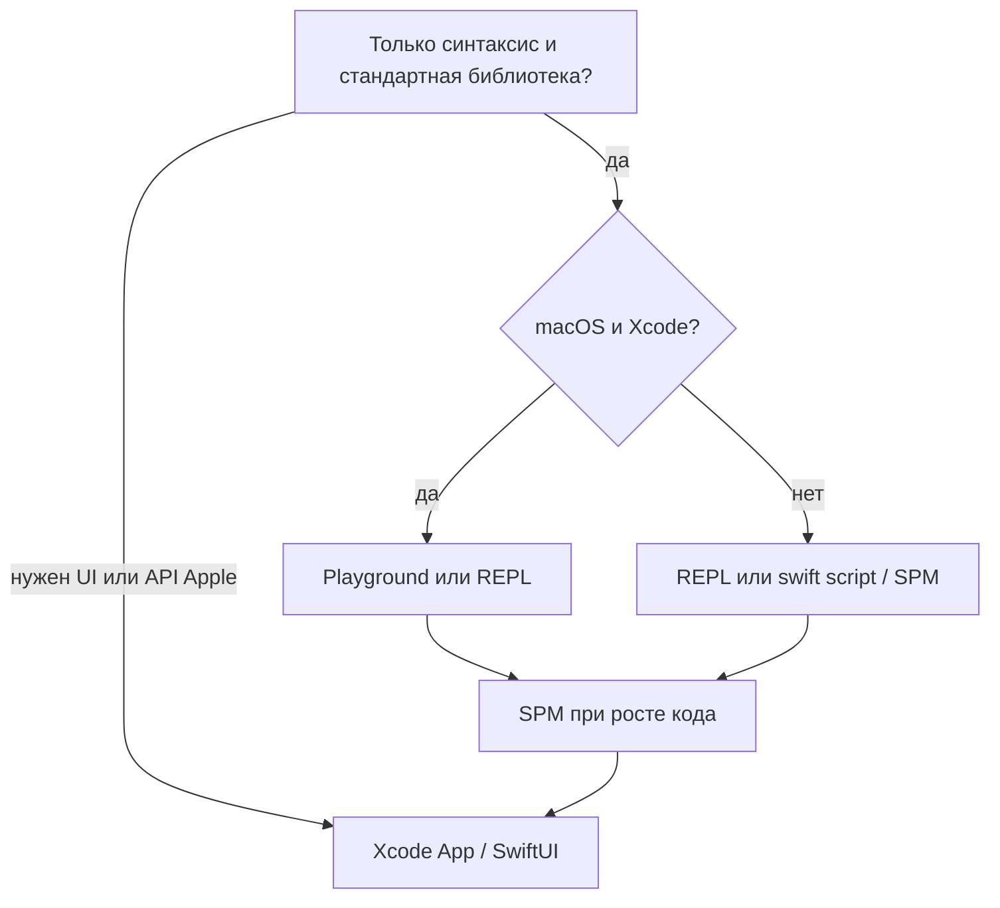

# Интерактивное изучение Swift

<div class="article-tags">
  <span class="tag tag-required">ОБЯЗАТЕЛЬНО</span>
  <span class="tag tag-beginner">ДЛЯ НОВИЧКОВ</span>
</div>

<span class="complexity-badge">Разработчику</span>

---

Синтаксис Swift удобно отрабатывать в средах, где код выполняется **фрагментами** и результат виден сразу — без жизненного цикла UI, подписи приложения и симулятора. Когда цель смещается к [приложению Apple](./21.md), подключают Xcode target; до этого достаточно Playground, REPL или консольного пакета.

<div class="callout callout--tip">
  <div class="callout-title">Маршрут по разделу Swift</div>

  <div class="callout-body">
  [Типы](./13.md) и [управление потоком](./14.md) — в Playground или REPL; [первая программа](./20.md) — установка toolchain; эта статья — выбор среды; [жизненный цикл приложения](./21.md) — когда нужен UI и системные API.
  </div>
</div>

Установка `swift` / Xcode — в [первой программе](/encyclopedia/5-languages/5-14-swift/20).

---

## Три среды для экспериментов

| Среда | Где | Сильная сторона | Слабое место |
|-------|-----|-----------------|--------------|
| **Playground** (Xcode) | macOS | Подсветка, автодополнение, результат справа от строки | Другая модель выполнения, не заменяет релизную сборку app |
| **REPL** (`swift`) | macOS, Linux, Windows (ограниченно) | Мгновенные проверки в терминале | Неудобен для больших файлов и многофайловых модулей |
| **Скрипт / SPM** (`swift run`, `swiftc`) | Те же платформы | Те же диагностики компилятора, что в проде; git, тесты, зависимости | Нужны редактор и терминал (или Xcode с package) |



---

## Playground в Xcode

**Playground** — файл в Xcode: фрагменты Swift выполняются без полного цикла «собрать → запустить приложение». Значение выражения может отображаться в **результате** (справа) или в консоли внизу.

### Создание и первый запуск

1. Xcode → **File → New → Playground**.
2. Платформа **macOS** — чистый язык без UIKit; **iOS** — если эксперимент с UIKit/SwiftUI (тяжелее, дольше старт).
3. Включите **Automatically Run** (Product → Playground Settings), если нужна пересборка при каждом изменении.

```swift
let names = ["Аня", "Борис", "Вера"]
let lengths = names.map { $0.count }
lengths  // результат в timeline: [3, 5, 4]
```

Разбор:
- `names` — литерал массива строк; `map` создаёт новый массив той же длины.
- `$0.count` для каждой строки считает количество символов (Character), не байт UTF-8.
- Выражение `lengths` в последней строке Playground показывает результат в timeline без `print`.
- Так быстро проверяют цепочки коллекций перед переносом в `main.swift` или SPM.

Последняя строка без `print` часто достаточна: Playground показывает значение выражения. `print` нужен, когда важен именно текст в консоли или несколько промежуточных шагов.

### Когда Playground уместен

- проверка цепочек опционалов (`?.`, `??`, `guard let`);
- коллекции и замыкания (`map`, `filter`, `reduce`) на маленьких данных;
- черновик алгоритма перед переносом в SPM;
- изолированный фрагмент `async/await` (не все сценарии UI и фона воспроизводятся).

### Полезные приёмы

**Условная компиляция по платформе** — один Playground можно открыть с разными target OS:

```swift
#if os(macOS)
import AppKit
#elseif os(iOS)
import UIKit
#endif
```

Разбор:
- `#if os(...)` — условная компиляция: в бинарник попадёт только ветка целевой ОС.
- На macOS подключается `AppKit`, на iOS — `UIKit`; в Playground target OS задаётся при создании.
- Позволяет экспериментировать с платформенным API в одном файле без дублирования проектов.

**Цепочка опционалов** — удобно проверять в Playground перед переносом в проект:

```swift
struct User { let nickname: String? }
let users: [User] = [User(nickname: "tim"), User(nickname: nil)]
let labels = users.compactMap { $0.nickname?.uppercased() }
labels  // ["TIM"]
```

Разбор:
- `nickname?` — optional chaining: если `nil`, цепочка обрывается без краша.
- `compactMap` отбрасывает `nil` и собирает только успешные строки.
- `uppercased()` вызывается только для существующих ников.

**Несколько страниц** — в навигаторе Playground: **+** у нижней панели; удобно разделять темы (типы / коллекции / async), не смешивая всё в одном файле.

**Импорт своего кода** — в Playground можно подключить модуль из соседнего Swift Package (File → Add Package Dependencies…), но отладка зависимостей чаще проще в **executable target** SPM.

### Ограничения

- Playground не версионируется как отдельный продукт: для курса и команды лучше репозиторий с `Package.swift`.
- Сеть, Keychain, push, фоновые задачи и часть системных API в Playground упрощены или недоступны — их отлаживают в **Command Line Tool** или app target.
- На Linux и Windows классический Playground Xcode **нет** — REPL и SPM.

### Swift Playgrounds на iPad

Отдельное приложение с уроками. Это **другой продукт**: хорош для первого знакомства с синтаксисом без Mac, но публикация в App Store по-прежнему требует **macOS и Xcode**.

---

## REPL — интерактивная оболочка

Команда `swift` без аргументов запускает **Read-Eval-Print Loop**: вводите выражение — получаете результат.

```bash
swift
```

Разбор:
- Запускает интерактивную оболочку Swift без создания файла.
- Каждая строка компилируется и выполняется сразу — удобно для проверки выражений.

```swift
1> let x = 21
2> x * 2
$R0: Int = 42
```

Разбор:
- `let x = 21` объявляет константу в сессии REPL.
- `x * 2` — выражение; результат сохраняется как `$R0` типа `Int`.
- Префиксы `1>`, `2>` — приглашение оболочки, в код проекта их не копируют.

Префиксы `1>`, `2>` — приглашение оболочки, в код проекта их не копируют. Выход: `:quit` или **Ctrl+D**.

### Однострочник из shell

```bash
swift -e 'print([1, 2, 3].reduce(0, +))'
```

Разбор:
- `-e` передаёт однострочный Swift-код в интерпретатор.
- `reduce(0, +)` суммирует элементы массива, начиная с нуля.
- Вывод `6` попадает в stdout — формат удобен для скриптов и CI.

Флаг `-e` выполняет код из аргумента — удобно для CI и коротких проверок, не для программ из сотен строк.

### Когда REPL удобнее Playground

- вы уже в терминале на Linux без GUI;
- нужно быстро проверить тип выражения или сигнатуру;
- скрипт автоматизации вызывает `swift -e` из makefile или Git hook.

<div class="callout callout--info">
  <div class="callout-title">REPL и релизная сборка</div>

  <div class="callout-body">
  REPL допускает интерактивные сценарии, которые при `swift build -c release` ведут себя иначе (оптимизация, целочисленное переполнение в debug). Финальную проверку делайте через `swift build` или `swiftc -O`.
  </div>
</div>

---

## Скрипт, бинарник и Swift Package Manager

### Запуск файла как скрипта

```bash
swift main.swift
```

Разбор:
- Запускает файл как скрипт: компиляция и выполнение в одном шаге.
- Сообщения компилятора совпадают с полноценным target — полезно при обучении читать diagnostic.

Компилятор и сообщения об ошибках те же, что в приложении — привычка читать diagnostic с первого дня полезна и в Playground.

### Сборка исполняемого файла

```bash
swiftc main.swift -o demo
./demo
```

Разбор:
- `swiftc` собирает исполняемый файл `demo` из исходника.
- `./demo` запускает бинарник напрямую, без вызова `swift` при каждом старте.
- Подходит, когда скрипт запускают десятки раз подряд при отладке.

Повторные запуски быстрее, чем `swift main.swift` на каждый раз — ближе к поставке CLI-утилиты.

### Минимальный пакет SPM

Когда появляется второй файл, тесты или зависимость — переходите на пакет:

```bash
mkdir PriceTool && cd PriceTool
swift package init --type executable
swift run
```

Разбор:
- Создаётся каталог пакета и шаблон executable-target.
- `swift run` собирает и запускает точку входа из `Sources/<имя>/main.swift`.
- Это минимальный «настоящий» проект с git, тестами и зависимостями.

Логику кладут в `Sources/PriceTool/main.swift`. Зависимости — в `Package.swift`; тесты — `swift package init` с target **test** или `Tests/`. Подробнее про экосистему — [раздел 10](/encyclopedia/5-languages/5-14-swift/10), про фреймворки Apple — [15](/encyclopedia/5-languages/5-14-swift/15).

Пример `Package.swift` с фиксацией версии Swift (чтобы «у меня собирается» было воспроизводимо):

```swift
// swift-tools-version: 5.9
import PackageDescription

let package = Package(
    name: "PriceTool",
    platforms: [.macOS(.v13)],
    targets: [
        .executableTarget(name: "PriceTool")
    ]
)
```

Разбор:
- Строка `// swift-tools-version: 5.9` фиксирует минимальную версию toolchain для сборки.
- `platforms` ограничивает, где пакет официально поддерживается.
- `executableTarget` объявляет CLI-модуль с `main.swift` как точкой входа.

**Вынесенная функция для теста (день 3):**

```swift
func discount10(_ price: Int) -> Int {
    price * 9 / 10
}
```

Разбор:
- Чистая функция без побочных эффектов — её легко покрыть XCTest.
- Целочисленное деление: для нечётных цен результат округляется вниз.
- Playground остаётся для черновика; формула живёт в пакете как источник истины.

---

## Практикум — три дня от Playground к SPM

Один сквозной пример: скидка 10 % на список цен.

**День 1 — Playground.** Проверить логику и типы:

```swift
let prices = [120, 89, 210]
let discounted = prices.map { $0 * 9 / 10 }  // Int: целочисленное деление
discounted
```

Разбор:
- Тот же алгоритм, что и `discount10`, но inline через `map` по массиву цен.
- Комментарий про Int напоминает: `89 * 9 / 10` даст `80`, не `80.1`.
- Результат `discounted` виден в timeline Playground как `[108, 80, 189]`.

**День 2 — скрипт.** Тот же код в `main.swift`, запуск `swift main.swift` — привыкание к выводу компилятора вне timeline Playground.

**День 3 — SPM.** Перенос в `Sources/PriceTool/main.swift`, `swift run`, один тест в `Tests/PriceToolTests` на функцию расчёта (вынесите формулу в `func discount10(_ price: Int) -> Int`).

Playground остаётся для быстрых проверок; **источник истины** — пакет в git.

---

## Типичные ошибки и как их избежать

| Ситуация | Чем грозит | Что делать |
|----------|------------|------------|
| Весь курс только в Playground | нет привычки к `swift build`, тестам, зависимостям | через 1–2 недели — SPM или Command Line Tool |
| Копировать из REPL в прод без сборки | расхождение с release | финальная проверка `swift build` / Xcode |
| Сразу большой SwiftUI-проект | перегруз lifecycle и превью | сначала [типы](./13.md), [поток](./14.md), эта статья |
| Игнорировать diagnostic компилятора | привычка к `!` и `as!` | чинить тип по сообщению, не глушить |
| Не указать версию Swift / Xcode | «у меня работает» | `swift-tools-version` в `Package.swift`, `.xcode-version` или README |

<div class="callout callout--warning">
  <div class="callout-title">Когда пора открывать app-проект</div>

  <div class="callout-body">
  Вы уверенно пишете функции с типами и `throws`, свободно работаете с `Array`/`Dictionary` и опционалами — можно переходить к [жизненному циклу приложения](./21.md) и [параметрам API](./23.md).
  </div>
</div>

---

## Связанные материалы

- [Первая программа на Swift](/encyclopedia/5-languages/5-14-swift/20)
- [Основы языка Swift](/encyclopedia/5-languages/5-14-swift/11)
- [Параметры функций и читаемость API](./23.md)
- [Сопоставление с образцом](./24.md)
- [Рекомендации по разработке](/encyclopedia/5-languages/5-14-swift/101)

---
