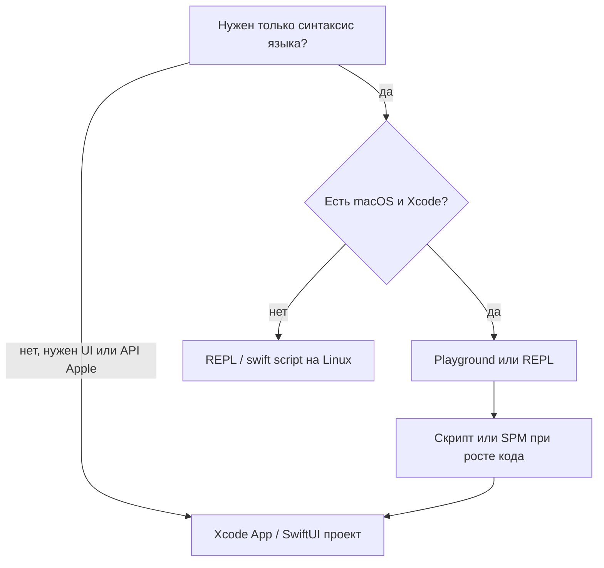

# Интерактивное изучение Swift

<div class="article-tags">
  <span class="tag tag-required">ОБЯЗАТЕЛЬНО</span>
  <span class="tag tag-beginner">ДЛЯ НОВИЧКОВ</span>
</div>

<span class="complexity-badge">Разработчику</span>

## Swift - Playground, REPL и скрипты

Изучать Swift не обязательно сразу через шаблон iOS-приложения. Для экспериментов с типами, опционалами и замыканиями удобнее среды, где код выполняется **построчно или блоками** и результат виден сразу. Это снижает порог входа: не нужно разбираться с жизненным циклом UI, подписью приложения и симулятором, пока вы ещё осваиваете синтаксис.

Три рабочих варианта:

| Среда | Где доступна | Сильная сторона | Ограничение |
|-------|--------------|-----------------|-------------|
| **Playground** (Xcode) | macOS | Подсветка, автодополнение, визуализация | Не заменяет сборку целого приложения |
| **REPL** (`swift`) | macOS, Linux, Windows (эксп.) | Быстрые проверки в терминале | Нет UI, слабее для больших файлов |
| **Скрипт** (`swift file.swift`) | Те же платформы | Ближе к «настоящей» программе | Нужен редактор и терминал |

Подробнее про установку инструментов — в [первой программе](/encyclopedia/5-languages/5-14-swift/20).

---

## Playground в Xcode

**Playground** — файл внутри Xcode, в котором фрагменты Swift выполняются без полного цикла «собрать → запустить приложение». Результат выражения может отображаться справа от строки (timeline / результат).

### Когда использовать

- проверка идеи за минуту: «как ведёт себя `Optional` при цепочке `?.`»;
- разбор коллекций: `map`, `filter`, `reduce` на маленьких данных;
- первые шаги с `async/await` в изолированном фрагменте (с осторожностью: не все сценарии UI воспроизводятся в Playground).

### Как начать (macOS)

1. Xcode → **File → New → Playground**.
2. Выберите платформу: **macOS** для чистого языка без UIKit; **iOS** — если экспериментируете с UIKit/SwiftUI (тяжелее).
3. Вставьте код, нажмите **Run** (или автозапуск при изменении, если включён).

Минимальный пример:

```swift
let names = ["Аня", "Борис", "Вера"]
let lengths = names.map { $0.count }
print(lengths)
```

### Ограничения

- Playground **не подходит** как основа продакшен-проекта: другая модель выполнения, возможны расхождения с релизной сборкой.
- Тяжёлые зависимости (сеть, Keychain, фоновые задачи) часто проще отлаживать в **Command Line Tool** или обычном app target.
- На Linux/Windows классический Playground Xcode **недоступен** — там REPL и скрипты.

### Swift Playgrounds (iPad)

Отдельное приложение для обучения на iPad: уроки и интерактивные задания. Это **другой продукт**, не замена Xcode на Mac, но хорош для первого знакомства с синтаксисом без Mac (создание App Store-приложений всё равно требует macOS и Xcode).

---

## REPL — интерактивная оболочка

Команда `swift` без аргументов запускает **Read-Eval-Print Loop**: вводите выражение — получаете результат.

```bash
swift
```

```swift
1> let x = 21
2> x * 2
42
```

### Когда REPL удобнее Playground

- вы уже в терминале на Linux при изучении языка без GUI;
- нужно проверить тип выражения или сигнатуру метода;
- быстрый импорт модуля в сессии (ограниченно).

Выход: `:quit` или Ctrl+D.

### Однострочный запуск

```bash
swift -e 'print([1, 2, 3].reduce(0, +))'
```

Подходит для автоматизации и CI-скриптов, не для больших программ.

---

## Консольный скрипт и исполняемый файл

Файл `main.swift` (или любой `.swift`) можно выполнить напрямую:

```bash
swift main.swift
```

Компиляция в бинарник (быстрее при многократном запуске):

```bash
swiftc main.swift -o demo
./demo
```

Это **ближе к реальной разработке**, чем Playground: те же сообщения компилятора, те же правила модулей. Рекомендуется перейти на скрипт или **Swift Package Manager**, когда эксперимент вырос в утилиту из нескольких файлов.

Минимальный пакет из терминала:

```bash
mkdir MyTool && cd MyTool
swift package init --type executable
swift run
```

См. также [экосистему](/encyclopedia/5-languages/5-14-swift/10) и [фреймворки](/encyclopedia/5-languages/5-14-swift/15).

---

## Как выбрать среду на этапе обучения



Практический маршрут внутри раздела:

1. [Синтаксис](/encyclopedia/5-languages/5-14-swift/12) и [типы](/encyclopedia/5-languages/5-14-swift/13) — в Playground или REPL.
2. [Управляющие конструкции](/encyclopedia/5-languages/5-14-swift/14) — там же.
3. [Первая программа](/encyclopedia/5-languages/5-14-swift/20) — Command Line Tool или `swift main.swift`.
4. [Жизненный цикл приложения](/encyclopedia/5-languages/5-14-swift/21) — когда цель — iOS/macOS app.

---

## Типичные ошибки новичков

1. **Держать весь проект только в Playground** — сложно версионировать, подключать зависимости, писать тесты.
2. **Путать REPL и релизную сборку** — в REPL допустимы интерактивные сценарии, которые в `swiftc -O` ведут себя иначе.
3. **Ждать от Playground полной симуляции iOS** — push, фон, часть системных API недоступны или упрощены.
4. **Игнорировать сообщения компилятора** — в скрипте и SPM те же ошибки типов, что и в приложении; их стоит читать с первого дня.

---

## Связанные материалы

- [Первая программа на Swift](/encyclopedia/5-languages/5-14-swift/20)
- [Основы языка Swift](/encyclopedia/5-languages/5-14-swift/11)
- [Рекомендации по разработке](/encyclopedia/5-languages/5-14-swift/101)

---
